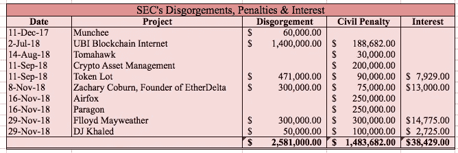
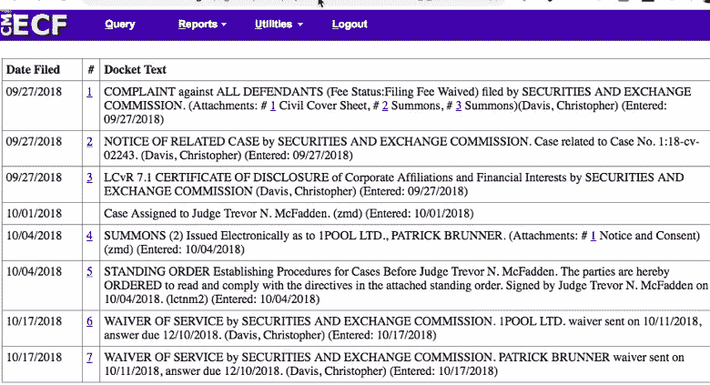
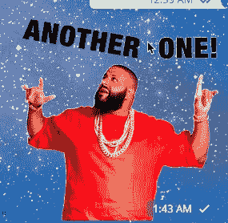
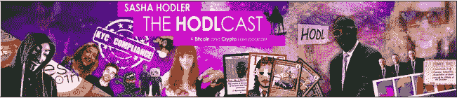

# SEC 已经从区块链项目中收取了 4103111 美元

> 原文：<https://medium.com/hackernoon/sec-has-collected-4-103-111-from-blockchain-projects-14baff14e623>

有没有想过，美国证交会从 2017 年道区块链事件后的歇斯底里中赚了多少钱？在我看来，他们已经上缴了 2，581，000 美元，民事罚款 1，483，682 美元，税款 38，429 美元。

以下是联邦行动的摘要:

**Munchee，Inc . 2017 年 12 月 11 日**:创始人同意向 40 名社区成员返还**6 万美元**。Munchee 在他们的白皮书中声明，他们不是一种证券，并积极宣传他们的 ICO，声称 MUN 令牌可以实现 199%的收益。【https://www.sec.gov/news/press-release/2017-227】见。

**Centra Tech，Inc . 2018 年 4 月 2 日**:SEC 对创始人萨姆·夏尔马、罗伯特·法卡什和雷蒙德·特拉帕尼提起诉讼，但该案件被搁置，直到刑事审判结束。据称，Centra Tech 向投资者谎称他们的产品与 Visa、Mastercard 和 Bancorp 有关，称他们拥有 38 张汇款许可证，并编造了一个虚假的咨询委员会。*见*[https://www.sec.gov/news/press-release/2018-53](https://www.sec.gov/news/press-release/2018-53)。

**Titanium block chain infra structure Services，Inc . 2018 年 5 月 29 日**:洛杉矶联邦地区法院正在等待结果。Titanium 谎报了与美联储、Paypal、威瑞森、波音和其他公司的业务关系。他们把投资他们的 ICO 比作投资谷歌。*见*[https://www.sec.gov/news/press-release/2018-94](https://www.sec.gov/news/press-release/2018-94)。

**UBI 区块链互联网有限公司 2018 年 7 月 2 日:**美国证交会在纽约州立案。一名律师和他的律师事务所的业务经理以 21-48 美元的价格出售限制性股票，获得了 140 万美元，当时这些股票的价格被限制在 3.70 美元。在名字中加上“区块链”之后，价格猛涨。被告同意归还他们 140 万美元的非法所得，并支付 188，682 美元的罚金，这需要法庭批准。*见*见[https://www.sec.gov/news/press-release/2018-126](https://www.sec.gov/news/press-release/2018-126)。

**战斧，2018 年 8 月 14 日**:创始人被勒令支付**3 万美元**的民事罚款。他谎称自己有石油钻探许可证，代币所有者可以将空投代币转换成股票，从拟议的石油生产和交易中获利。营销材料称，这位创始人拥有“完美的记录”，并且没有披露他之前因欺诈性证券发行而被定罪的情况。【https://www.sec.gov/litigation/admin/2018/33-10530.pdf】见。

**Crypto Asset Management，LLC，2018 年 9 月 11 日:**这家对冲基金虚假表示他们是美国第一家受监管的加密资产基金。他们同意了 SEC 的停止令，并支付了 20 万美元的罚金。 *见*[https://www.sec.gov/news/press-release/2018-186](https://www.sec.gov/news/press-release/2018-186)。

**Token Lot，2018 年 9 月 11 日**:这家未注册的经纪交易商为 ico 处理了数千笔投资者订单。他们同意支付 471，000 美元的罚金和 7，929 美元的判决前利息。该网站的创始人库格尔和路易特每人被处以 45000 美元的民事罚款。*见***[https://www.sec.gov/litigation/admin/2018/33-10543.pdf](https://www.sec.gov/litigation/admin/2018/33-10543.pdf)。**

****1 broker 首席执行官 2018 年 9 月 27 日:** 1Broker 是一家在马绍尔群岛共和国注册的公司，其首席执行官帕特里克·布鲁纳(Patrick Brunner)来自奥地利，涉嫌向美国和世界各地的投资者招揽买卖基于证券的互换。据称，布鲁纳未能注册一家全国性证券交易所来出售基于证券的掉期。关于步行者的最新消息是，他已经放弃了服务的要求。对 SEC 投诉的答复将于 2018 年 12 月 10 日到期。**

****

****Blockvest，LLC，2018 年 10 月 11 日:** Blockvest 谎称获得了 SEC 的批准，并创建了一个与 SEC 称之为“区块链交易委员会”的标志相似的假机构。证交会寻求民事处罚和没收非法所得。Blockvest 进行了反击，并在加利福尼亚州南部地区取得了进展。【https://www.sec.gov/news/press-release/2018-232】见。Marco Santori 律师对 2018 年 11 月 27 日拒绝 SEC 初步禁令动议的命令发表了一些有趣的评论。*见*[https://twitter.com/msantoriesq/status/1068246911533092866?s=12](https://twitter.com/msantoriesq/status/1068246911533092866?s=12) 。**

****EtherDelta，2016 年 11 月 8 日:**在没有承认或否认调查结果的情况下，EtherDelta 的创始人扎卡里·科伯恩(Zachary Coburn)同意了该命令，并同意支付**30 万美元**的归还款，外加**13，000 美元**的判决前利息和**75，000 美元**的罚金。*见*见[https://www.sec.gov/news/press-release/2018-258](https://www.sec.gov/news/press-release/2018-258)。**

****Airfox 和 Paragon，2018 年 11 月 16 日:** SEC 责令每家 ICO 支付**25 万美元**罚金&承诺赔偿在非法发行中购买代币的受害投资者。这些公司必须根据 1934 年证券交易法将它们的代币登记为证券，并向委员会提交至少一年的定期报告。*见*见[https://www.sec.gov/news/press-release/2018-264](https://www.sec.gov/news/press-release/2018-264)**

****Flloyd Mayweather&DJ Khaled，2018 年 11 月 29 日:**关于 Centra Tech 推广，may weather 同意支付**300，000 美元**作为退赔，**300，000 美元**罚金，**14，775 美元**作为判决前利息。DJ Khaled 同意支付 50，000 美元的罚金、100，000 美元的罚金以及 2725 美元的判决前利息。*见*https://www.sec.gov/news/press-release/2018-268T42**

***接下来是什么？***

****

**Checkout the DJ Khaled sticker pack on telegram.**

****