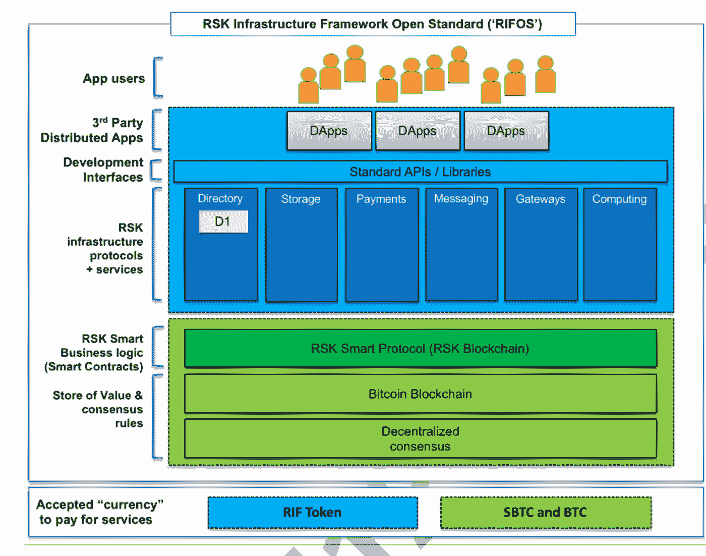

# 在比特币的基础上构建经济:根茎(RSK)解释

> 原文：<https://medium.com/hackernoon/second-layer-on-top-of-bitcoin-rootstock-rsk-explained-88ab724222b2>

Art by João Fazenda

比特币社区，尤其是那些在 2014 年之前的人，对[根茎](https://www.rsk.co)和他们正在做的事情略知一二。对于那些不知道的人来说，根茎(简称 RSK)正在比特币的基础上实现智能合同开发和执行。你可以在最安全的[区块链](https://hackernoon.com/tagged/blockchain)、[比特币](https://hackernoon.com/tagged/bitcoin)上拥有以太坊(和 rest)平台的所有美好。

## 比特币智能合约

RSK 是一个图灵完全的智能合约平台(就像以太坊一样)，通过侧链技术连接到比特币区块链。它提供了更快的交易和更好的可伸缩性，我们相信这也将支持新的使用场景。

然而，这篇文章的目的不是解释智能比特币(RSK 币)到底是如何工作的，而是介绍一些少数人知道的东西。

# 区块链的自动气象站基础设施

RSK 的团队正在研究比智能合同更大的东西。**他们正在开发一个基于 RSK 智能合约的基础架构框架，支持开发社区使用 RIF 令牌**(根茎基础架构框架)构建和使用类似 AWS **的服务。网络本身被称为 RIFOS。**

## 为什么这很重要？

因为没有一个开发人员想在每次考虑开发应用程序时构建(或弄清楚用于什么)自己的计算引擎、存储层、命名服务。这是 Dapp 开发社区目前的现实，也是我们没有看到任何 Dapp 兑现承诺的关键原因之一。使用 RIFOS，开发人员专注于开发应用程序，而不是弄清楚在集中式世界中几十年前已经解决的事情。

问问任何一个开发者，AWS 或谷歌云对他们的业务有什么影响。我们每天在智能手机和网络浏览器上使用的 90%的应用程序都运行在这些服务上。有一个很好的理由:他们从开发者那里接受部署和维护应用程序将使用的每个小组件的麻烦，并允许他们专注于他们正在构建的产品。

**这是 RIFOS 为区块链开发者社区提供的服务。**

RIFOS 正在改变整个区块链生态系统的游戏规则，原因有很多。开发者将能够在 BTC 的基础上部署应用程序，使用现成的数据存储、名称解析、预言和支付服务(使用他们自建的照明网络 Lumino Payments Protocol)。

## RIFOS 的主要特征

*   这些分散的基础设施服务中的大部分将利用单个令牌(RIF)来消费。
*   开发栈将对任何想成为这些服务提供者的人开放。
*   所有这些组件可能会顺利运行，并集成在 RSK 智能协议之上，同时受到比特币网络安全的保护。
*   智能合约引擎将兼容以太坊(即，您可以通过最少的迁移工作将您的应用程序带到 RIFOS)。

简单地说，RIFOS 使开发者能够构建服务(如 EC2 或 DB 或 DNS 系统),然后将它们提供给 DApp 开发者，他们可以使用这些服务来加速开发时间并降低成本。

## 一个令牌处理一切

服务的消费将使用 RIF 令牌支付。这是一个巨大的进步，因为开发者不需要持有 10 个不同的令牌，并为他们使用的每个服务做后勤工作。

例如，一个典型的人工智能 Dapp 将使用一个人工智能计算引擎(假设为[强子.云](https://medium.com/u/4cea20af5c?source=post_page-----88ab724222b2--------------------------------))、一个分散的数据库(假设为[布鲁泽尔](https://medium.com/u/1ebc95e9d994?source=post_page-----88ab724222b2--------------------------------))、一个分散的索引([图](/graphprotocol/introducing-the-graph-4a281b28203e))和一个存储层( [IPFS](https://medium.com/u/30a067dbeb93?source=post_page-----88ab724222b2--------------------------------) )。开发者需要持有这些服务的每一个令牌，并支付相应的费用。

在 RIFOS 上，他们仍然可以使用它们，只需用 RIF 支付即可。所有这些都将运行在 BTC 区块链之上，确保与最大的电力矿工社区比特币矿工的网络安全。

## 与比特币矿工合并采矿

RSK 不铸造，也没有预先开采的硬币。相反，如果现有的或新的比特币矿工加入 RSK 网络，它会通过合并采矿来奖励他们。这样网络就可以达到和比特币一样的安全性(防双花和结算终结)。

RIF 令牌用于消费构建在 RSK 智能协议(离线)之上的所有 RIFOS 服务(在下图中，这些服务在代表服务协议的深蓝色框中以灰色文本表示)。

## 下面是整个基础架构的布局:

用他们自己的话说(摘自 RIFOS 的白皮书，该白皮书只分发给少数人):

“总之，我们的目标是创建一个开放的标准基础设施框架，它由一组协议和相应的 API 文档组成，使第三方开发者能够利用这样的接口并将新的组件引入 RIFOS 生态系统。这个开放标准框架将包含一个初始工作基础设施服务(即上面提到的命名服务/目录服务)，它将代表协议如何工作的概念验证。”

请注意，本文中的所有观点都是我个人的观点，仅提及我们尽职调查的简要情况。这篇文章无意作为投资建议。

*披露:周一资本是 RSK 的早期投资者。*

更多更新，你可以在推特上关注我 [@katerinastro](https://twitter.com/katerinastro)