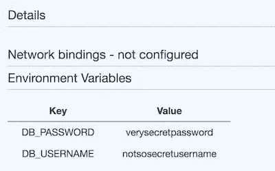

# AWS ECS 中的机密管理

> 原文：<https://medium.com/hackernoon/secrets-management-within-aws-ecs-1b6975819ccd>

by [Guillaume Bolduc](https://unsplash.com/@guibolduc?utm_source=medium&utm_medium=referral) on [Unsplash](https://unsplash.com?utm_source=medium&utm_medium=referral)

*更新:ECS 中的 Secrets 最近有了一些变化，关于最新的方法，请点击下面这篇文章的第二部分。为了弄清楚我们是如何到达那里的，请继续阅读。*

 [## ECS 的秘密做对了

### 去年，我写了一篇关于 ECS 中秘密管理的痛苦的文章，但是现在世界变得更加光明，因为…

medium.com](/@cbeardsmore/ecs-secrets-done-right-9e094cfa6200) 

ECS 上的容器很棒…但是当涉及到秘密和配置管理时，ECS 仍然很粗糙。应用程序需要秘密，关键问题是我们如何以一种既安全又兼容 ECS 的方式将秘密放入 Docker 容器。

对于本地开发，我们可以运行 Docker 图像，并简单地传入一个 [*env-file*](https://docs.docker.com/compose/env-file/) ，其中包含我们希望我们的容器化应用程序使用的变量。这使得改变我们的秘密和配置更加灵活。您只需更改文件中的值并重启容器。无需重新构建！但是，当我们开始进入试运行或生产环境时，就变得有点困难了。我们需要管理秘密和凭证，出于显而易见的原因，我们希望*只有我们的应用程序*能够访问它们。让我们来讨论一些既方便又安全地将这些值放入 ECS 的选项。

## 烘焙成 Docker

我们可以在构建时将配置和秘密保存到 Docker 映像中。优点是您可以启动容器，而根本不用担心配置问题，但这是有代价的。现在，如果不重建您的映像，就不可能更改配置。管理开发、试运行和生产环境之间的配置变得非常困难。由于需要重建，您现在在试运行中测试的映像将与您部署到生产环境中的映像不同。老实说，对于大多数用例来说，这并不是一个可行的选择。

## ECS 环境变量

这种方法有点类似于我们在当地的工作方式。我们在运行容器中设置环境变量时传递我们的配置。与本地开发不同，ECS 不支持 env 文件。ECS 允许的是，当您在任务定义中指定容器时，或者当您实际运行任务定义的实例时，定义环境变量。

关键的缺点是 AWS 不支持这些变量中的任何类型的安全参数。如果您以这种方式传递机密，那么任何有访问权限的人都可以通过 AWS 控制台读取它们。我们的应用凭证现在可供任何具有控制台访问权限的人查看和使用。我们的安全系统完蛋了。

## Docker 从 SSM 参数存储中获取

这是 AWS 似乎正在推广的技术，也是迄今为止最干净、最安全的选项(鉴于缺乏其他可行的选项)。 [SSM 参数存储](https://docs.aws.amazon.com/systems-manager/latest/userguide/systems-manager-paramstore.html)允许安全存储配置数据和机密。由于它的层次结构，我们还可以设置粒度规则，规定哪些应用程序可以访问哪些机密。假设我们按照上面的示例，用以下名称创建了两个参数:

`/application/secrets/DB_USERNAME/
/application/secrets/DB_PASSWORD/`

通过给我们的容器一个具有 SSM 权限的[任务角色](https://docs.aws.amazon.com/AmazonECS/latest/developerguide/task-iam-roles.html)，它们可以在启动时使用 CLI 调用 SSM 来获取它们所需的配置。如果我们在 Roles 资源中指定一个特定的路径，比如`/application/secret/`，那么容器只能访问该路径中的参数。

要在 Docker 映像中实现这一点，首先需要安装 awscli(通过 python)和 [JQ](https://stedolan.github.io/jq/) 。然后，修改容器入口点，首先调用一个脚本，该脚本将在运行其主要任务之前获取其配置。下面的脚本就是一个例子，它用一个特定的路径调用`get-parameters-by-path`，然后将容器中检索到的参数设置为环境变量。

由于 SSM 通过其 SecureString 参数类型和细粒度权限提供了安全性，因此这种方法非常有效。这是我们目前最好的方法，但我不能说我对此感到满意。首先，我们用我们的应用程序并不真正需要的依赖项来膨胀我们纤细干净的 Docker 映像。从某种意义上说，我们正在破坏 docker 的纯粹性，因为我们必须在启动时从外部获取资源，而不是像容器那样只运行一个任务。这是一个痛苦的妥协，直到 AWS 在这一领域为我们提供更多支持。

## 未来:

随着越来越多的人转向 AWS 上的容器化应用程序，希望围绕秘密管理会出现更多的灵活性。有一些特性要求在任务定义中给 SSM 参数存储提供一级支持，以防止 Docker 在启动时调用。其他人使用 S3 来存储本质上是 env 文件的加密版本，尽管这仍然需要调用 KMS 来解密。目前，安全性胜过易用性，但没有理由 ECS 不能在未来继续改进，以允许开发人员两者兼顾。

## **更新:**

截至 2018 年 11 月，亚马逊现已[正式发布对通过 SSM 在 ECS 容器中注入敏感数据的支持](https://docs.aws.amazon.com/AmazonECS/latest/developerguide/specifying-sensitive-data.html)！根据链接中显示的用户对特性请求的反馈，这是非常棒的第一步。目前还不支持 Fargate 启动类型，也不支持在给定一条路径的情况下获取多个参数，但希望我们能在未来几个月内看到这些进步。

## 链接:

 [## 指定敏感数据——亚马逊弹性容器服务

### Amazon ECS 通过将敏感数据存储在 AWS 系统中，使您能够将敏感数据注入到容器中…

docs.aws.amazon.com](https://docs.aws.amazon.com/AmazonECS/latest/developerguide/specifying-sensitive-data.html)  [## 使用任务的参数存储和 IAM 角色管理 Amazon ECS 应用程序的机密| Amazon…

### 感谢我的同事 Stas Vonholsky 关于使用 Amazon ECS 应用程序管理秘密的精彩博客。-作为…

aws.amazon.com](https://aws.amazon.com/blogs/compute/managing-secrets-for-amazon-ecs-applications-using-parameter-store-and-iam-roles-for-tasks/)  [## 功能请求:一流的支持 SSM 参数存储作为一个秘密存储问题#1209 …

### 摘要使用 SSM 参数存储作为一个类似于 Kubernetes 秘密风格的秘密存储。描述 SSM 参数…

github.com](https://github.com/aws/amazon-ecs-agent/issues/1209)