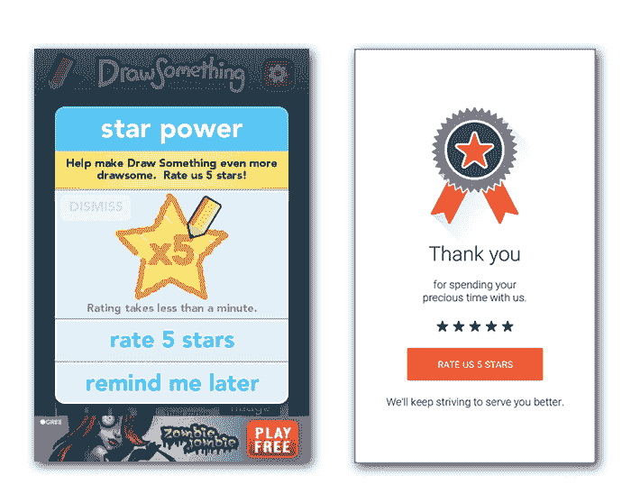
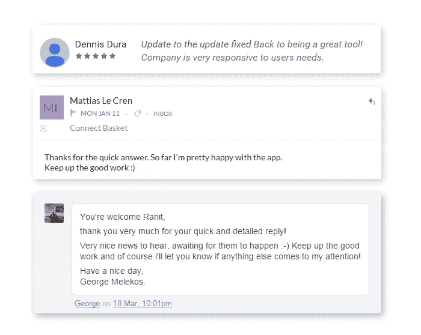

# 让你的应用获得出色的客户评价的秘诀

> 原文：<https://medium.com/hackernoon/secrets-to-get-awesome-customer-reviews-for-your-app-62bda6f8adaa>

优秀的推荐告诉人们你的产品或服务很棒，现有用户或客户从中受益匪浅。

在与企业家和增长型黑客交谈时，我遇到的最多的问题是，*如何从客户那里获得令人敬畏的真实证明？*在移动应用的最初阶段，首先是朋友提供评论，然后用户也加入进来，评分开始变化，这开始影响你的下载量。所以如何获得好的评论，如何获得更多的评论来决定你的产品路径，是我们今天在 RedElegant 要讨论的。

## 为什么评论如此重要？

顾客大多相信其他顾客。因此，从客户那里获得评价是很重要的，而且越积极越好。

在 [Zendesk 调查](http://www.zendesk.com/resources/customer-service-and-lifetime-customer-value)中，90%的参与者声称正面的在线评论影响了他们的购买决定，86%的参与者受到负面评论的影响。

当无数的评论者在网上分享他们的观点时，口碑奇迹发生了，这增加了潜在的商业曝光率，增加了流量和销售额。所以评论，尤其是正面的评论，对企业来说非常重要。

## 如何获得评论

这是企业，尤其是初创企业最想问的问题之一。

> 获得评论的最好方法是询问，而询问的最佳时机是在顾客满意之后。

**时机问题**

不幸的是，我看到许多应用程序似乎在打开后就立即提示进行审查，而基本上有 **100%的机会**我脑海中有一些我想在应用程序中做的事情，并且在课程之外审查应用程序不是其中之一(因为我还不知道应用程序如何)。

让我们看看不同的企业是如何评价的-

1.  如果你注意到一些好的游戏应用程序，你就会明白。当你在一场比赛中获得 5*分或赢得一场战争后，他们会让你评价应用程序，当用户高兴时，他们很可能会提供评价，而且可能是一个好的评价。
2.  大多数应用程序在用户采取一些行动后会使用智能弹出窗口。在应用程序用户第 n 次做一些动作后，比如阅读 30 篇新闻文章或创建 25 个帖子，或者在首次注册后简单地打开应用程序 50 次，弹出窗口就会显示出来。
3.  一旦发货，电子商务平台就会要求审查，顾客可以看到并试用刚刚购买的商品。

## 快速客户服务

即使你的产品有问题，大多数用户都明白，重要的是快速和良好的客户服务。如果你能尽快回复客户的邮件或评论，我们将不胜感激。

快速解决客户问题会带来更多的满意度。无论他们遇到什么问题，他们都会知道问题会很快得到解决，并且相信这对于品牌建设至关重要。

在为[篮子](https://www.basketapp.net/)称呼用户时，我实际上注意到了这一点。及时的回复总是令人感激的，并向客户保证我们对他们是认真的。

## 解决差评

更多的人分享不好的经历，更少的人与他人分享好的经历。所以记得尽快解决不好的反馈。

> *差评是宝石。他们帮助你建立一个伟大的系统。听他们说。*

一旦你得到差评，感谢顾客提供的信息，检查问题并解决它。大多数情况下，如果你行动迅速，你可以将负面评价转化为正面评价。当人们高兴地告诉自己，他们会向他人推荐我们的产品或服务时，感觉是不是很棒？

## 评论的数量很重要

即使你提供的是最好的产品或服务，也会有人抱怨。有些人甚至在你解决了这个问题后也不会费心去改变之前的差评。因此，你的目标应该是大量的评论，如果你提供良好的服务，更多的人会给你评分，这将有助于你保持良好的地位。

在支持电子邮件中插入反馈按钮或 App store 链接，以便客户可以立即留下评论。

## 让留下评论变得容易

当每个人都有时间限制时，你必须让顾客很容易留下评论。当你想做一个小调查时，用弹出窗口询问评论，尽量保持简洁，这样用户可以点击一些数字，然后点击“发送”按钮，如果客户想给你留言作为反馈，他们也可以提供，但越简单越好。

我们都喜欢简单的东西！对吗？

**结论**

获得评价的艺术是在适当的时候提问，并使过程变得简单。使用好的 UX，你可以很容易到达那里，但是你必须不断鞭策自己。我想听听你的经历，你做了哪些独特或不同的事情来获得一些很棒的用户评论。我们都可以从彼此的经历中学到一两件事。

*我们帮助人们进行移动应用 UX 评估。让我们来个* **15 分钟** *快速通话。* [*调度调用*](https://calendly.com/ranit/redelegant15) *。*