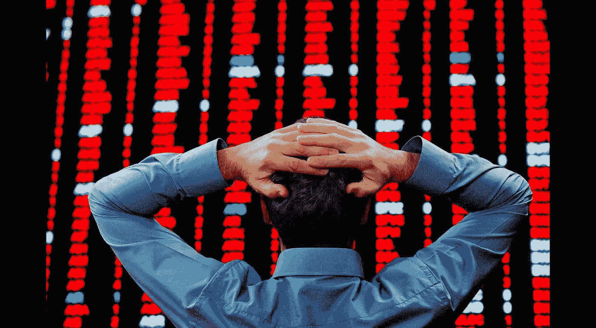
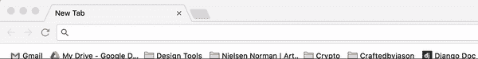
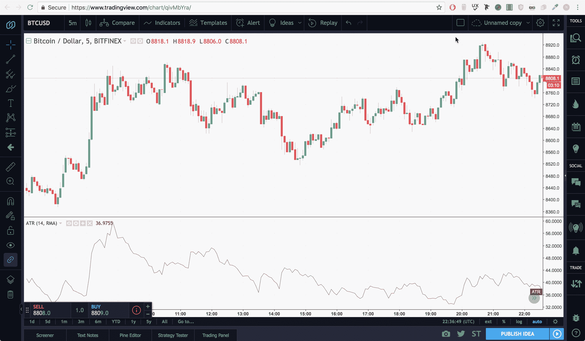

# 生存的秘密:19 位专业人士分享他们对加密交易的建议

> 原文：<https://medium.com/hackernoon/secrets-to-survival-19-pros-share-their-advice-on-crypto-trading-ec4b9d1dbb8b>

我从来没有像今天这样害怕加密。市场状况糟透了。坦白地说，这影响了我的睡眠模式，破坏了我的工作效率。我被撕裂了。我是卖出还是持有？你也是这样，我知道。

你不能离开图表。每隔 5 分钟，你脑海中就会有一个小小的声音。

> “检查图表，也许现在一切都好了”那个声音说。

你知道现在情况不妙。你也知道查看那些价格图表不会让你感觉更好。但你还是做了。有很多钱，很多钱。

你今天已经不是第一次这么做了。也许是 secon..不，不，至少是第三次了。相信我，我知道这很痛苦。

我将要告诉你的将会永远改变你的交易技术。你将要学到的东西对任何市场的交易都很有帮助，但是在熊市——就像我们现在面临的市场——这是绝对必要的。我正要告诉你当火警响起时如何保持冷静。

我要告诉你的是，coin and crypto 在采访了 19 位专业加密交易者一周后学到了什么。

# **交易者俱乐部的第一条规则是…**

*actual scene from fight club

现在我知道你在想什么了。该死的太酷了，你是怎么做到的？”—长话短说，我们正在为一个完全不同的项目做一些市场调查，我们看到了一个我们自己进行一些调查的机会。卑鄙，我知道。但这是有原因的。

我们开始吧。

# **1 —总是有一个游戏计划**

对我来说，这是显而易见的。

但是我搞砸了很多次。说你有计划太容易了，我们大多数人在交易或购买硬币之前都有一个粗略的计划。但是有一个计划和坚持计划是有天壤之别的。

我知道你以前可能也犯过同样的错误。你在最后一刻决定改变计划，结果你卖得太早或太晚。

你需要设定一个标准。当市场以这样或那样的方式运行时，你将遵守的明确定义的规则。每个专业人士都有一个交易计划——他们虔诚地遵守它。

所以是时候让我们像专业人士一样思考了。是时候制定一个游戏计划了。为了帮助你开始，我附上了我们团队进行交易时使用的模板。它击中了专业交易者教给我的所有要点。

[【下载我们的免费模板】](https://drive.google.com/file/d/17tbKL_vfT9AfnvRES45QrFemJo_p46vV/view?usp=sharing)

你填好之后，我要你打印出来，贴在你交易最多的地方。它需要在众目睽睽之下，当市场达到任何一个门槛时，你需要做的就是执行。

把你的策略写下来放在你面前会让你更难忽视它。

> 旁注:偶尔进行一次消防演习也是有帮助的。经常问自己“如果市场现在崩盘，我就什么都没了。我会没事吗？”—如果答案是“是”，继续你正在做的事情。然而，如果答案是否定的，考虑重新考虑你的方法。

# **2 —整合您的投资组合**

检查你的投资组合，把有长期潜力的硬币和没有长期潜力的硬币分开。

这是熊市。这艘船可能还没有沉没，但它肯定会经历一段艰难时期。**任何不必要的体重只会拖累你。**

亨利，一个有着 7 年股票交易经验的交易员，现在是一名加密员，告诉了我他在市场大幅下跌时的所有程序。

> “减少负重。在牛市中，疯狂吧。在牛市中，你选择投资什么真的无关紧要——市场上涨，每个人都赢，有些人比其他人赢得多。”

因为在这样的市场中，一切都在变化。你有真正的钱。如果你动作不快，你会真的失去它。不见了。

亨利强调当市场下跌时果断行动是多么重要。想想你有什么投资，想想那些狗屎硬币——并且要节俭。

**甚至看看那些你真心认为具有长期潜力的硬币。**问问自己，值得冒这个险吗？因为如果不拔出来。把你的钱投入到有更好的交易群体的投资中，或者投入到你真正相信能够经受住这次危机的投资中。

亨利知道他的东西。

动作:将它添加到你的游戏计划文档中，列出你所有的硬币。按优先顺序列出它们。当市场崩溃时，你会在什么时候开始裁员？

# **3 —减少噪音**

你需要远离所有的胡言乱语。

我采访过的 19 个职业交易者，他们都强调了这一点。

长期盈利意味着将自己定位在人群的前方或后方。**从不在人群中。远离聊天室和讨论区。这些群体中的每个人都别有用心。**

太多的人把时间花在了 Slack、Reddit、Telegram、脸书、Discord 等大型讨论订阅上……不胜枚举。你需要远离这些群体，有太多的错误信息正在传播，这将导致你做出轻率的决定，过早出售。

作为交易者，你唯一的工作就是观察图表，做出预测。要做出准确的预测，并不是收集尽可能多的数据。这只是为了获得高质量的信息，不必太多，只要正确就行。

对于那些仍然想要一些知情数据的人，一些交易者建议加入 VIP 群。这些是紧密结合的社区，希望彼此分享见解，并作为一个集体进行更好的交易。

行动:质疑你关注的消息来源。问问你自己——这有必要吗？我是否在跟踪真正有助于我交易预测的信息来源？如果没有，就把它们剪了。

# 4 — **找到你的梦之队**

这项技术来自 Sparky——一位来自瑞典的交易员。Sparky 今年 43 岁，有妻子和两个孩子。他的时间被限制在家庭和交易之间。所以他想出了一个巧妙的解决方案。

Sparky 有一个 5 人的小团队。他们每个人都订阅了 2-3 个主要信息源。每天，研究这些资源并将最好的数据反馈给团队是每个人的使命。

只有最好的信息才能被分享。 **Sparky 因此做出了 5 倍的更好的交易决策**。效率。

开始也没那么难！

行动:出去找几个交易的人，找你信任的人。在脸书 messenger 或您喜欢的任何平台上开始群聊。你们每个人都应该研究 2-3 个可信的来源，然后平均分配这些来源。每天，你的团队应该研究他们各自的信息来源，只向团队传达必要的信息，只关注对建议交易决策至关重要的信息。

# 5 — **泰坦们的工具**

> “给一个人一条鱼，你喂他一天。教一个人钓鱼，你就喂了他一辈子。” *-* 但是如果你不给他鱼竿，钓鱼就不是很有效。

现在你已经掌握了窍门，让我们来帮你设置一下。以下是我从与专业交易者的交谈中发现的一些最好的交易工具。

*   **交易视图(专业版)**

TradingView 是一个非常棒的平台，你可以用它来做几乎所有与加密和股票相关的事情。我是认真的。这东西更适合用来交易密码，而不是蝙蝠侠用来打击犯罪。

这东西会让你更上一层楼。它最好的功能之一是分屏功能。

该软件在任何一个窗口中支持多达 4 个独立的和完全交互式的图形。令人震惊。你真的可以单独控制每个屏幕，每个指示器，每个时间段。

**TradingView 类似于 mission control，但针对你拥有的每一枚硬币。**

*   **signalgroups.com**

我们都经历过。现在是凌晨 4 点，你的闹钟响了。你认为市场会看涨，所以你设置了止盈，但是整个晚上价格都在下跌。向下，靠近你的止损点。你的闹钟响了，但是…你没有醒来。到了早上，价格已经深陷赤字，而你却完全没有受到保护。如果这还没有发生在你身上，它会…

这就是 signalgroups.com 制造的信号的用武之地。你可以同时止盈止损。因此，您不必选择，您可以高枕无忧，因为您不需要 24/7 都粘在计算机上来保持事情正常进行。

如果你真的想交易，你必须得到信号。

*   Hacked.com

**我采访的 19 个交易者中有 6 个把 Hacked.com 作为他们的主要信息来源之一。他们每人每年支付 400 美元，可以接触到所有的内部知识。**

**这个工具并不是绝对重要的。实际上，这是一个美化了的加密知识的集合——对信息有敏锐眼光的人不需要这个。**

**但是，如果你像我一样，你只是想精简你的知识来源——本质上你想减少废话。那就报名参加这样的事情，然后就完事了。有时候，额外的 10%会让一切变得不同。**

# ****总之……****

**交易是有压力的——我相信你不需要我告诉你。但是当你用游戏中最好的技巧正确地武装自己时，你将会占优势。**

**我希望我的一些见解对你有用。总结一下——这里是我从 19 个交易者的知识中提炼出来的一些要点:**

1.  **制定一个游戏计划:为每一个可能发生的事情做准备，并始终有一个退出策略。**
2.  **明智地选择你的硬币:只投资那些会带来利润的硬币，砍掉那些不会带来利润的。**
3.  **减少噪音:对大众持怀疑态度，他们会影响你的想法，会让你更容易做出不理智的决定。**
4.  **建立一个梦之队:找一些你信任的人来让你保持消息灵通。**
5.  **使用专业人士的工具:这些，加上你的细心，将会是你交易生涯中最大的进步。**

****

## **喜欢这篇文章吗？我们现在有电报信号组了！**

**我们发布**简单有效的交易信号**。所以你可以花更少的时间做技术分析，花更多的时间**得到结果。**👉[https://t.me/coinandcrypto](http://telegram.coinandcrypto.com/medium)**

****