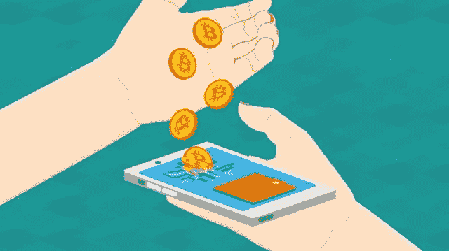
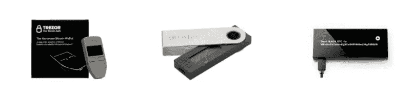
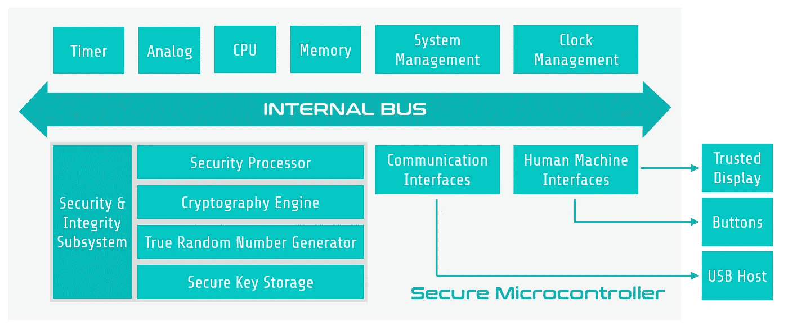
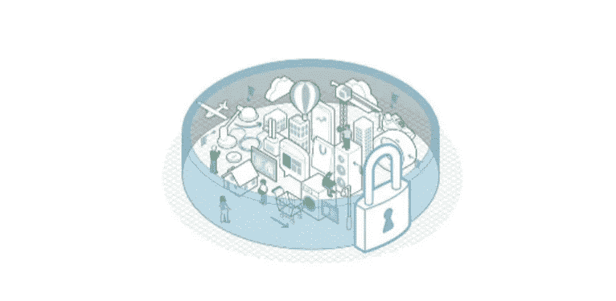
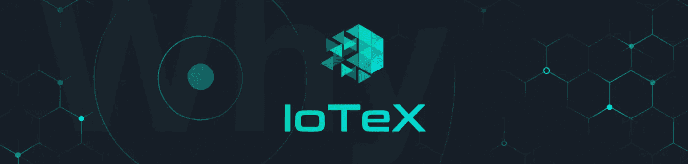

# 安全加密货币硬件钱包

> 原文：<https://medium.com/hackernoon/secure-cryptocurrency-hardware-wallets-71a6c65247be>

如果你积极参与加密货币，你应该保守一些，使用各种加密货币钱包来保护你的数字资产。加密货币钱包本质上是一个软件程序，它存储密钥并与区块链交互，供用户发送和接收加密货币以及检查其余额。与口袋中的传统钱包不同，加密货币钱包不存储货币，而是存储与生成的钱包地址相关联的所有私钥。这些私钥用于解锁您钱包中的资金，并签署加密货币的所有权。加密货币钱包可以分为两类，分别是*热钱包*和*冷钱包*。虽然热钱包是为了日常使用，通常连接到互联网以快速访问区块链，但冷钱包主要是为了减少曝光率而离线，并用于加密货币的长期存储。实际上，热钱包可以实现为桌面、在线或移动应用程序，而冷钱包包括纸质和硬件钱包。这篇博客文章主要关注硬件钱包，这是加密货币钱包中最安全的一种。

Source: [https://cryptoshortlist.blogspot.com/2017/10/what-are-different-types-of.html](https://cryptoshortlist.blogspot.com/2017/10/what-are-different-types-of.html)

# **加密货币硬件钱包**

硬件钱包，也称为冷钱包，是一种专用的硬件，为长期存储私钥和离线签署交易提供增强的安全功能。通常，硬件钱包通过 USB 端口连接到计算机，或者通过蓝牙或 NFC 连接到移动设备，以检查区块链。此外，硬件钱包能够与各种网络接口配合工作，并支持多种加密货币。特别是，私钥存储在硬件钱夹的受保护区域中，绝不会以明文形式被传送出设备。硬件钱包在促进区块链交易和让您的数字资产离线并远离危险之间实现了良好的平衡。

# **硬件钱包的安全风险**

虽然硬件钱包为设备中处理和存储的数据提供了更高的安全性和可信度，但它们也需要受到保护，免受各种攻击，包括但不限于:

*   **远程攻击**:攻击者可能通过你的 PC 或移动设备上的恶意软件窃取你的私钥或交换加密货币的接收地址。
*   **弱随机数生成器**:硬件钱包一般依靠板载物理随机数生成器为你的钱包生成私钥。攻击者可能会发现随机数生成过程的漏洞，并预测您的私钥。
*   **系统漏洞**:攻击者可能会利用软件、固件和硬件层面的系统漏洞，对存储在硬件钱包中的秘密信息进行未经授权的访问。
*   **供应链攻击**:攻击者可能会修改硬件钱包(例如，在固件中插入恶意代码，更换硬件组件等。)然后再将它们运送给客户。
*   **旁门左道攻击**:攻击者可能获得你的硬件钱包的物理访问权，并进行各种旁门左道攻击(例如，定时、电源、故障等。)提取您的私钥并破坏设备。

**高度安全硬件钱包的属性**

设计一个高度安全的硬件钱包是一项具有挑战性的任务。通过考虑针对硬件钱包的各种攻击，分析市面上流行的硬件钱包如 Ledger Nano S、Trezor、KeepKey 等的安全设计。，我们总结了以下我们认为高度安全的硬件钱包应该具备的特性:

Ledger Nano S, Trezor, KeepKey

*   **基于硬件的信任根**:硬件钱包应具有基于硬件的信任根(例如，安全微控制器、安全元件、硬件安全模块等)。)来安全地存储私钥和处理事务。这些安全组件专门用于保护敏感信息免受各种物理攻击。
*   **分层安全和深度防御**:在攻击者窃取您的硬件钱包、用恶意固件刷新设备或损害您的 PC 或移动设备的情况下，应部署多种安全对策来应对各种潜在的攻击。
*   **交易显示和确认**:硬件钱包应配备可信显示器，用于验证交易信息，以及设备上的按钮，用于确认或拒绝交易。
*   **加密货币的分区**:对于支持多种加密货币的硬件钱包，每个加密货币应用都应该在自己的分区中运行，由硬件强制边界保护，有效隔离不同的应用，防止一个应用中发现的缺陷影响系统的其余部分。
*   **基于证书的认证**:系统中应使用数字证书，用于硬件钱包安全更新其固件，并使设备制造商能够进行远程认证。

满足上述特性的安全硬件钱包的高级系统架构如下所示:

Figure. System Architecture of a Secure Hardware Wallet

# **基于下一代 TrustZone 的安全硬件钱包——展望**

可信执行环境(TEE)是一种允许安全执行应用程序的环境。TEE 旨在实现以下五个安全属性:

*   **隔离执行** : TEE 应该允许应用程序以隔离的方式运行，这样可以确保恶意应用程序无法访问或修改其他应用程序的代码和数据。
*   **安全存储** : TEE 应提供安全存储，以保护敏感应用数据以及应用二进制文件的保密性和完整性。
*   **远程证明** : TEE 应允许各方与安全执行环境通信，以检查实现 TEE 的软件和/或硬件的真实性。
*   **安全供应**:当将数据发送到在特定设备的执行环境中运行的特定软件模块时，TEE 应确保数据的保密性和完整性。
*   **可信路径** : TEE 应能与外界通信，同时确保通信数据的真实性和可选的保密性和可用性。

不难发现高安全性硬件钱包所要求的安全属性与 TEE 所提供的安全属性之间的相似之处。因此，TEE 为进一步增强硬件钱包的安全性提供了一个理想的解决方案。虽然有多种方法可以实现 TEE，但 ARM TrustZone 被认为是在基于 ARM 的移动设备和嵌入式平台上实现 TEE 的最有前途的技术。

ARM TrustZone 是一种面向基于 ARM Cortex 的处理器的系统级安全方法。与具有预定义功能的专用加密引擎不同，ARM TrustZone 通过利用 CPU 作为可编程的可信环境，代表了一种更加灵活的安全解决方案。它还在处理数据时提供保护，而不仅仅是提供加密功能。TrustZone 的基本概念是让一个物理处理器内核以时间片的方式运行两个虚拟世界，即*安全世界*和*普通世界*。*安全世界*负责访问敏感硬件、处理关键数据和执行可信软件，而*正常世界*是操作系统和其他应用程序的公共执行环境。这两个虚拟世界是通过分离软件和硬件资源来实现的。此外，TrustZone 技术采用多种硬件功能来促进两个虚拟世界之间的切换。关于 ARM TrustZone 的更多细节，有兴趣的读者可以参考[https://www.arm.com/products/security-on-arm/trustzone](https://www.arm.com/products/security-on-arm/trustzone)。

Source: [https://www.cnx-software.com/2016/06/14/upcoming-arm-trustzone-webinars-explaining-embedded-systems-iot-security-to-non-security-experts/](https://www.cnx-software.com/2016/06/14/upcoming-arm-trustzone-webinars-explaining-embedded-systems-iot-security-to-non-security-experts/)

硬件钱包实现通常由三组主要功能组成:钱包存储功能、钱包管理功能和加密操作功能。为了使用 ARM TrustZone 技术实现硬件钱包，需要全面分析所有功能及其相关数据，以确定应该分别在*安全世界*和*正常世界*中执行的功能。例如，处理密钥的功能应该只在*安全世界*内部执行。此外，必须仔细调查两个虚拟世界之间的切换，以确保在此过程中不会泄露任何敏感信息。 **IoTeX 正在积极进行这方面的研究，以进一步提高区块链硬件客户的安全性**

# 关于 IoTeX

IoTeX 致力于创建一个面向物联网和以隐私为中心的区块链的分散化平台，通过其“区块链-区块链”架构的核心创新，解决物联网 DApps 和生态系统增长的可扩展性、隐私性、隔离性和开发能力问题。IoTeX 的目标是成为一个将物理世界逐块连接起来的公司，并推动区块链 3.0 的发展。

*电报组:*[*https://t.me/IoTeXGroup*](https://t.me/IoTeXGroup) *电报公告频道:*[*https://t.me/iotexchannel*](https://t.me/iotexchannel) *推特:*[*https://twitter.com/iotex_io*](https://twitter.com/iotex_io) *加入我们:*[*https://iotex.io/careers*](https://iotex.io/careers)