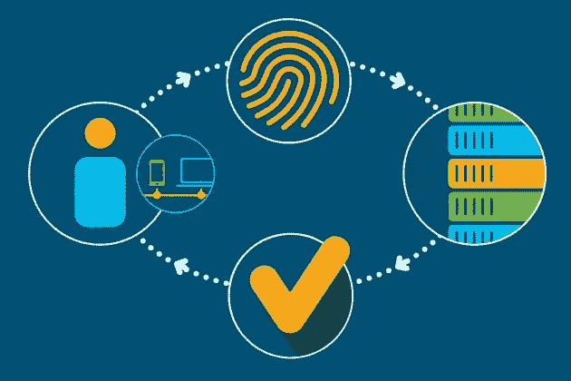
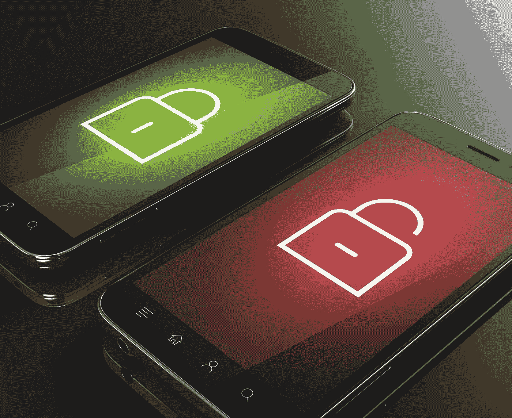

# 针对网络安全漏洞保护移动应用

> 原文：<https://medium.com/hackernoon/secure-mobile-applications-against-cyber-security-vulnerabilities-a6d2f6f09063>

我们正处于这样一个时代，移动应用程序让我们几乎可以在网上做任何事情。根据我们的可用性，市场上有许多应用程序可以让我们随时随地探索事物。在这种情况下，保护应用程序和数据免受利用是应用程序开发人员的主要职责。“这些应用程序提供的服务包括银行、购物，甚至监控我们的业务、家庭和商店。”

传统的网络安全策略无法为移动应用提供必要的保护。因此，在消费者应用程序开发过程中，每个企业都应该关注安全性和客户便利性。

移动应用程序有连接到世界各地的 API 和服务器的软件。目的是向用户交付数据、服务以及最后但并非最不重要的价值和易用性。因此，在这种情况下，IT 策略基于保护应用程序的网络边界。除此之外，他们还通过集成反病毒和 web 应用程序防火墙等技术来防范攻击和干扰。

**手机 App 安全**

当我们谈论移动应用安全性时，应用开发人员需要为移动应用提供关键的终端安全性。使用提供更好用户体验或简化操作的[移动应用](http://www.quytech.com)的在线用户更容易受到一系列威胁。

因此，企业需要保护他们的移动应用程序用户免受与企业生产力相关的风险。随着技术不断升级，同时也有许多活动酝酿着暴露与用户相关的重要信息。

因此，一个问题出现了，如何面对安全挑战，保护我们的移动应用？

# **网络安全漏洞的因素**

**代码屏蔽**

企业让开发人员用编码屏蔽为应用程序提供安全性。一款应用在上市前要经过一系列内部安全测试和应用渗透测试。但是这些必备的能力是传统安全层完全缺失的。

我们知道，对一个应用程序来说，最有效的安全措施是分层构建安全。因此，重点是在应用程序部署到应用程序世界之前保护实际的应用程序代码。

**未来准备**

值得注意的是，企业已经使用应用程序保护解决方案来保护移动应用程序，同时牢记当前的场景。

大多数情况下，应用程序保护的是部署时已知的内容。因此，这些应用程序安全解决方案不具备了解如何应对即将到来的安全挑战的能力。

因此，应用程序保护应该支持实时了解新威胁的层。安全应该及时遇到这种威胁，在它们变得不利并影响用户之前阻止它们。

**反逆向工程**

客户参与应用在客户互动方面很有价值，但可能会被威胁利用。通过逆向工程，有可能窃取个人身份信息(PII)和知识产权(IP)。

因此，对未受保护的应用程序进行反向工程，并帮助了解应用程序的代码逻辑，这些代码逻辑带有允许后台攻击的通信密钥。因此，被恶意软件劫持的应用程序可能会在错误的人手中捕获用户 id 和登录凭据。

**用户认证:**

谈授权，就包含了对用户隐私的一个重要考虑。身份管理、会话管理和设备安全功能被认为是移动应用安全的重要组成部分。这些天来，应用程序通过实施双因素身份验证来提供高级用户身份验证。

此外，通过多因素身份认证，用户将获得帮助，以利用 Auth 2.0 授权框架等成熟的安全技术。

**App 数据:**

存储在设备上的数据是可恢复的，这可能会引发潜在的风险。因此，开发人员必须了解这种威胁。记住这一点，有必要考虑成熟的加密方法。

这些方法有助于在设备上以文件、数据库和其他数据源(256 位高级加密标准对称密钥算法标准)的形式存储数据。

**检查弱点:**

如果移动应用部署在传统平台和操作系统上，安全攻击有可能增加。为了避免这样的结果，最好使用最新的平台。

先进的平台将有助于降低安全风险。这些先进的平台经常更新，以修复安全领域。这些更新与应用程序集成在一起，这有助于应用程序增加价值以及高级数据保护功能。

**数据加密:**

Image source [privatesky.me](https://www.privatesky.me/category/data-encryption/)

通过创建网关(加密)来限制未经授权的用户对应用程序数据的访问是一项非常重要的任务。通过这样做，黑客和数据攻击者将更难获得应用程序数据。

通过信息加密来阻止他们进一步利用信息。如今，大多数消费者应用程序都启用了所有用户的密码，这是保护应用程序的最佳方式。该应用程序的这些功能有助于用户感到安全和过度保护。

**底线**

安全性必须是应用程序开发者的首要任务之一。开发任何移动应用程序时，从用户的角度来看，其设计和安全性是必不可少的。因此，开始阶段的安全清单将有助于在应用程序的开发和部署过程中绘制可能的场景。

因此，通过实施安全最佳实践，开发人员可以在开发时纠正应用程序的任何主要性能问题。这可以帮助[移动应用开发者](http://www.quytech.com/hire-dedicated-developers.php)及时清除数据威胁和攻击的影响，这无疑将帮助组织解决成本问题。

***阅读我们的*** [***最新科技故事***](http://www.quytech.com/blog/) ***和趋势科技故事。***