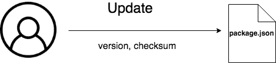
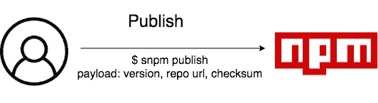
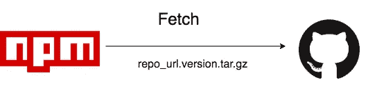
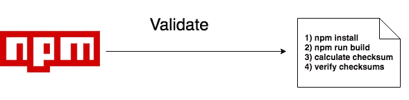
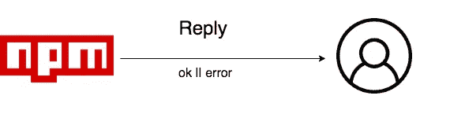
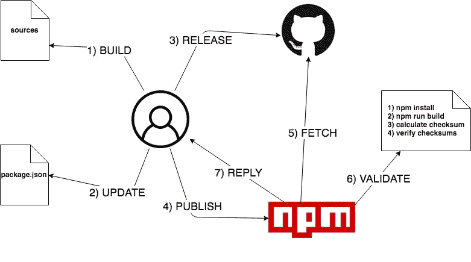

# 保卫 NPM

> 原文：<https://medium.com/hackernoon/secure-npm-ca2fe0e9aeff>

## 概念验证，以确保 NPM 软件包及其源代码之间的一致性

## TL；DR；

[*SNPM*](https://github.com/wilk/snpm) *是一个概念验证，旨在确保 NPM 注册中心和公共存储库(如 Github)上的开源版本之间的一致性。*

[Unsplash](https://unsplash.com/photos/IV--3UEiHlI)

4 月底， [**Node.js 10 发布**](/the-node-js-collection/the-node-js-project-introduces-latest-release-line-node-js-10-x-bf07abfa9076) 于是 NPM [**宣布 npm@6**](/npm-inc/announcing-npm-6-5d0b1799a905) 。
版本 6 引入的主要特性之一是关于[安全性](https://hackernoon.com/tagged/security):我说的是 [**npm 审计**](https://docs.npmjs.com/getting-started/running-a-security-audit) 。
这个新命令允许用户执行*“安全漏洞的包依赖性评估，帮助用户保护其包的用户免受已知漏洞的影响，这些漏洞可能导致数据丢失、服务中断、对敏感信息的未授权访问等等”。这是 NPM 团队为整个社区做出的巨大改进。*

但是，我认为**他们没有抓住真正的问题**。

# 重大安全漏洞

2018 年初，[**@ David . gilbertson**](https://hackernoon.com/@david.gilbertson)发表了一篇关于 NPM 生态系统安全脆弱性的惊人文章 。
大卫当时做的是**曝光 NPM 车型的一个** **重大安全漏洞**。

> 简而言之:NPM 注册表上发布的内容可能与你在 Github 上看到的不同。

通常，一个 NPM 包的源代码发布在 Github 上(或托管在另一个公共存储库上)，让用户能够验证项目并做出贡献。然而，当有人在 NPM 上发布一个新的包时，没有人能说上传的就是已经在 Github 上发布的。
这意味着你可以在 NPM 上上传一段恶意代码，然后在 Github 上发布一段不同的无害代码，用户不会意识到。至少不是马上。

> 这削弱了开源的基础

我们怎么能信任一个允许用户共享封闭源代码而没有任何方法验证其真实性的系统呢？

有趣的事实:最近，[在一个名为 ssh-decorator](https://amp.reddit.com/r/Python/comments/8hvzja/backdoor_in_sshdecorator_package/?st=jgynd5qc&sh=81855e72&__twitter_impression=true) 的 Python 包中发现了一个后门。
有人在源代码中发现了它，并提醒了用户，因此受损的软件包最终被移除。
这证明了访问源代码可以让社区预防和治疗不良情况。

# SNPM 救援

所以，在大卫的文章之后，我开始创建一个 [**概念验证**](https://github.com/wilk/snpm) 来避免 NPM 的这些情况。它叫做**安全 NPM (SNPM)** ，我将尝试用几个简单的步骤来解释它是如何工作的。

***免责声明*** *: SNPM 针对编译(二进制)和传输包进行校准，但也适用于普通包。*

首先，当作者想要发布他们包的新版本时，他们**构建源代码**并且**计算编译输出的校验和**。

Build sources

然后，他们需要**用新版本和校验和更新 package.json** 。
[CommonJS 提供了一个名为**校验和**的字段](http://wiki.commonjs.org/wiki/Packages/1.1#Catalog_Properties)，作者可以在其中存储其代码的校验和。

Update package.json

现在他们可以用一个新标签在 Github(或另一个公共回购)上发布它。

Release on a public repository

此时，他们可以**通过 SNPM 在 NPM 上发布**它:它将只发送少量数据，如包版本、公共存储库 url 和校验和。
这不同于" *npm publish"* 命令，因为它不会发送完整的源代码，也不会发送编译后的文件，而只是上面的三个信息。

Publish on NPM, using SNPM

NPM 现在负责**从公开回购中获取发布版本**。

Fetch released version tar.gz

NPM 现在可以通过执行一系列操作来验证校验和:

1.  通过 **npm 安装**安装所有依赖项
2.  通过 **npm 运行构建**构建源代码
3.  **计算编译文件的校验和**
4.  **验证校验和**

Reproduce and verify the checksum

在这一点上，NPM 有所有的信息给**回复**一个成功的答案或者一个错误。

Reply to the publish request

就是这样。
遵循总结算法:

SNPM algorithm

NPM 和 SNPM 之间的主要区别在于,(编译的)源代码不再从(不可信的)作者处上传，而是直接从公共回购(可信的)处下载，在公共回购处，每个人都可以再现相同的过程并验证校验和。

# 结论

不幸的是， *npm 审计*并没有解决这个主要的漏洞，这个问题仍然是开放的，特别是对于二进制和缩小的 [Javascript](https://hackernoon.com/tagged/javascript) 。
我们(作为一个社区)必须获得经过验证和确认的包。

无论如何，我要感谢 NPM 团队的出色工作，我希望这篇文章将推动他们提高有史以来最好的软件包管理器之一的安全性。

## ***更新***

我已经在 NPM 的知识库上创建了一个新的问题 ，请求一个功能请求。
之后，我添加了 [**另一个提议**](https://github.com/npm/npm/issues/20640#issuecomment-389762201) 总是在同一个线程上，叫做 **npm verify** :作为一个 npm 命令，它应该重现下载-构建-校验和验证过程，所以用户可以动态地验证包。

## ***更新—7 月***

我已经为 NPM 和 T21[提交了一份](https://github.com/yarnpkg/rfcs/pull/94) [**新 RFC，为纱线**](https://github.com/npm/rfcs/pull/16) 提交了一份 RFC。