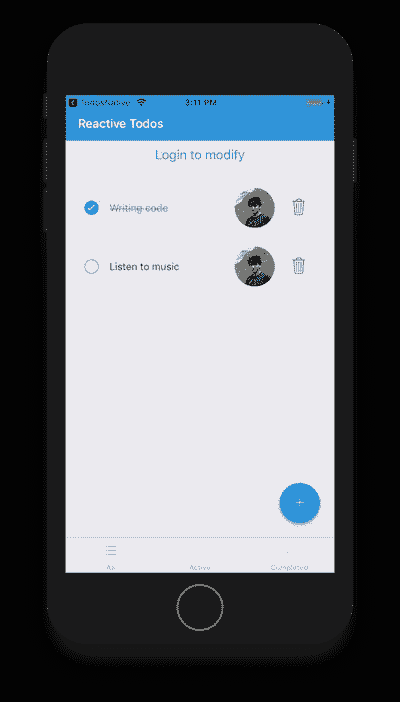
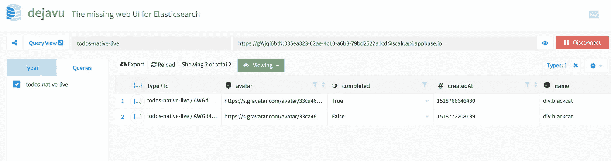
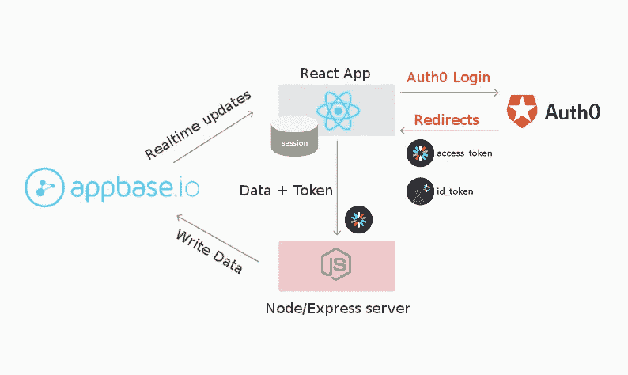
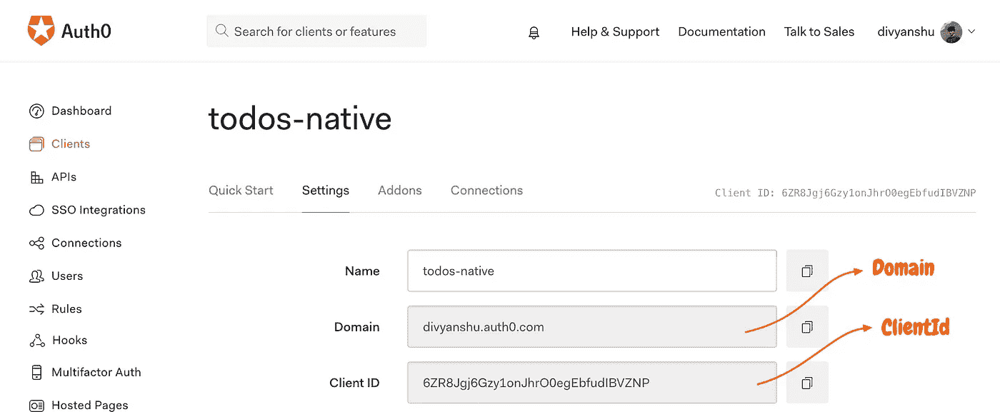
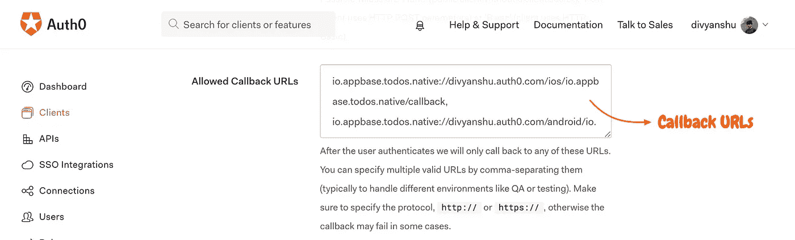
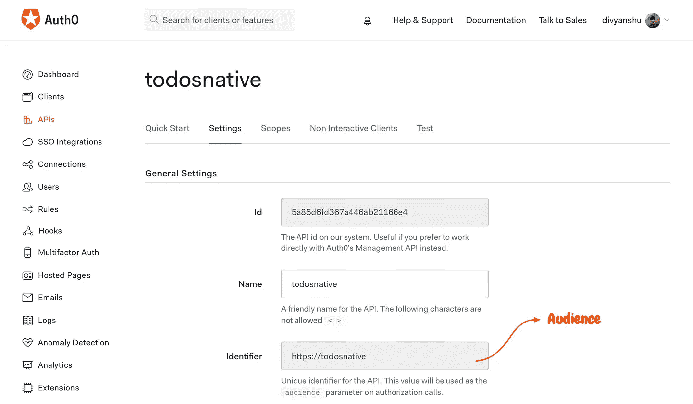
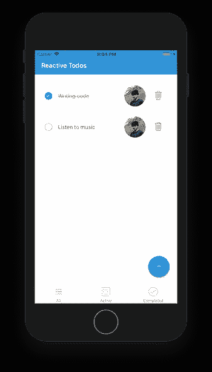
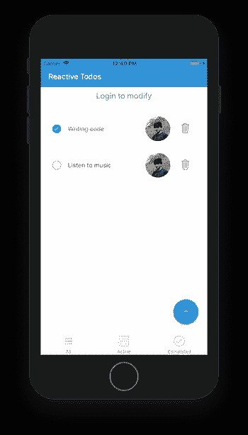
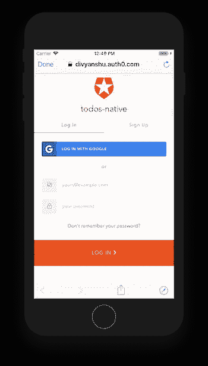

# 通过服务器端身份验证保护 React 本机应用

> 原文：<https://medium.com/hackernoon/securing-a-react-native-app-with-server-side-authentication-d5e8dbbc08e3>


The key components in this story: NodeJS, ReactiveSearch, React Native and Auth0

构建应用程序时，身份验证是一个重要的考虑因素。我们在构建应用时遇到的一个常见用例是**保护我们的** [**API**](https://hackernoon.com/tagged/api) ，以便只接受经过身份验证的请求，从而防止误用。

在这个故事中，我将使用一个用 React Native 构建的 [Todos 应用程序，并解释如何创建一个安全的 Node/Express API 来处理应用程序的**C**create、 **U** pdate 和**D**delete 操作。这将使应用程序只允许经过身份验证的用户编辑数据。对于这篇文章，我们假设:](https://medium.freecodecamp.org/how-to-build-a-real-time-todo-app-with-react-native-19a1ce15b0b3)

1.  所有用户对 todos 都有**读**权限。
2.  只有通过验证的用户才有写权限**创建**、**更新**和**删除**待办事项。为简洁起见，我们将考虑所有经过身份验证的用户都具有写访问权限。

我将在应用程序中使用的关键组件是:

1.  [**React search Native**](https://github.com/appbaseio/reactivesearch)**，**React Native 的数据驱动 UI 组件库，
2.  **NodeJS/Express，**作为中间件服务器，对请求进行认证，对数据库进行写操作，
3.  [**Auth0**](https://auth0.com/) ，作为托管认证服务，
4.  [**Appbase.io**](https://appbase.io/) ，作为托管数据库服务。

> 你可以点击查看应用[的截图。](https://www.youtube.com/watch?v=Ykwdfxl7IOo&feature=youtu.be)



Final app preview

# 反应搜索

[React search](https://hackernoon.com/tagged/reactivesearch)是一个开源的 React 和 React 原生 UI 组件库，用于 Elasticsearch，是我和[一些了不起的人](https://github.com/appbaseio/reactivesearch/graphs/contributors)共同编写的。它提供了各种 React 本地组件，可以[连接到任何 Elasticsearch](https://opensource.appbase.io/reactive-manual/native/getting-started/reactivebase.html#connect-to-elasticsearch) 集群。

在这个故事中，我将扩展我在[上写的另一个故事，如何用 React Native](https://medium.freecodecamp.org/how-to-build-a-real-time-todo-app-with-react-native-19a1ce15b0b3) 构建一个实时 todo 应用程序，如果你对构建我将在这里使用的 starter 项目感兴趣，你可以查看一下。

# 入门指南

我们将使用由 appbase.io 和 ReactiveSearch Native 构建的 [Todos 应用作为基线来构建我们的认证 Todos 应用。我已经设置了启动项目，我们将在客户端和服务器端使用。然而，在我们深入研究代码之前，我将讨论几个概念。](https://medium.freecodecamp.org/how-to-build-a-real-time-todo-app-with-react-native-19a1ce15b0b3)

*   每个 Appbase 应用程序都允许不同组的凭证(**读取**和**写入**)用于[读取和写入访问控制](http://docs.appbase.io/concepts/intro.html#http-basic-authentication)。
*   在本文中，我们将确保客户端应用程序只能持有我们的 appbase 应用程序的**读取凭证**，并且我们将提取节点/Express 服务器的**写入**操作(用于创建、删除和编辑 todos)的逻辑。这将允许我们将写访问权限仅限于经过身份验证的用户，同时保持**写凭证**的安全。
*   所有 todos 将具有以下结构:

```
{
 "title": "Writing code",
 "completed": true,
 "createdAt": 1518766646430,
 "name": "divyanshu",
 "avatar": "https://s.gravatar.com/avatar/33ca46e56260bc7d54b2d7246f9a7052?s=480&r=pg&d=https%3A%2F%2Fcdn.auth0.com%2Favatars%2Fdi.png"
}
```

在我们开始构建 UI 之前，我们需要一个地方来存储我们的待办事项。简而言之，你可以使用托管在 [appbase.io](https://appbase.io) 上的[我的应用](https://opensource.appbase.io/dejavu/live/#?input_state=XQAAAAL1AAAAAAAAAAA9iIqnY-B2BnTZGEQz6wkFsvSiNDYsjvhmh6bR2aMQ_b8tfAYV5i8SWTc_IE_DnS6BceaXTW2gpbXukBeX2O1FPfldvf_iKvL58obaZr3r1kiYuxUWyYGFx95VU3wsDNhT-rQ-dTKe93wqnEskMMPDhF9HexjeqTmAn__P7WMUiN_V_oE1L0wcoZ-gyOMV4QAXG0t_80hyKz3VGcgSfnwfmAd_NYgrrO0mK5VolnUO5L-lr_niJOTXMbvy_-H8KAA&editable=false)或者通过点击[此链接](https://opensource.appbase.io/dejavu/live/#?input_state=XQAAAAL1AAAAAAAAAAA9iIqnY-B2BnTZGEQz6wkFsvSiNDYsjvhmh6bR2aMQ_b8tfAYV5i8SWTc_IE_DnS6BceaXTW2gpbXukBeX2O1FPfldvf_iKvL58obaZr3r1kiYuxUWyYGFx95VU3wsDNhT-rQ-dTKe93wqnEskMMPDhF9HexjeqTmAn__P7WMUiN_V_oE1L0wcoZ-gyOMV4QAXG0t_80hyKz3VGcgSfnwfmAd_NYgrrO0mK5VolnUO5L-lr_niJOTXMbvy_-H8KAA&editable=false)并点击*克隆此应用*按钮来克隆它。这将允许您制作数据集的副本作为自己的应用程序。



View my app dataset [here](https://opensource.appbase.io/dejavu/live/#?input_state=XQAAAAL1AAAAAAAAAAA9iIqnY-B2BnTZGEQz6wkFsvSiNDYsjvhmh6bR2aMQ_b8tfAYV5i8SWTc_IE_DnS6BceaXTW2gpbXukBeX2O1FPfldvf_iKvL58obaZr3r1kiYuxUWyYGFx95VU3wsDNhT-rQ-dTKe93wqnEskMMPDhF9HexjeqTmAn__P7WMUiN_V_oE1L0wcoZ-gyOMV4QAXG0t_80hyKz3VGcgSfnwfmAd_NYgrrO0mK5VolnUO5L-lr_niJOTXMbvy_-H8KAA&editable=false). You can also clone this to your own app

# 认证概念

我们使用 Auth0 来处理认证，它使用[](https://jwt.io/introduction/)**(JSON Web 令牌)作为访问令牌。它由三部分组成**报头**、**有效载荷**和**签名**，由**点(。)**。JWT 看起来像:**

```
xxx.yyy.zzz
```

**报头(xxx)定义了令牌的类型和用于散列的算法。有效负载(yyy)包含关于用户和附加元数据的信息。签名(zzz)用于验证令牌的发送者，并确保消息在传输过程中没有被篡改。你可以在 [JWT 介绍指南](https://jwt.io/introduction/)中找到更详细的解释。**

> **使用 JWT 令牌的另一个流行的替代方法是管理会话。然而，这引入了国家性——JWT 是无国籍的，是一个更好的方法。**

**访问令牌一旦被验证，就告诉我们用户被授权访问 API，并形成我们的基于[令牌的认证](https://scotch.io/tutorials/the-ins-and-outs-of-token-based-authentication#toc-how-token-based-works)系统的基础。身份验证流程如下所示:**

*   **从 React 应用程序到服务器的每个请求都将包含一个 **access_token** ，它将在服务器上使用 Express 中间件进行验证。当我们通过 Auth0 注册或登录时，我们将收到一个 [**id_token**](https://auth0.com/docs/tokens/id-token) (包含用户的个人资料信息)和一个 [**access_token**](https://auth0.com/docs/tokens/access-token) (客户端可以使用的访问 API 的凭证)。**

****

**App design**

*   **我们将使用 [Auth0](https://auth0.com/) ，并为我们的教程应用程序创建一个新的**本地**客户端。我们需要**客户端 ID** 和**域**，以便在我们的应用程序中配置 auth0。您可以从您的 Auth0 [仪表板](https://manage.auth0.com/#/)获取这些信息。**

****

**Getting Domain and Client Id for the app**

*   **我们还需要在**允许的回调 URL**部分添加一个回调 URL，因为在认证之后，客户端会被重定向回带有**令牌**信息的回调 URL，我们稍后将解析该信息以供使用。我们稍后会谈到这一部分。**

****

**Adding callback URLs for the app**

*   **接下来，我们需要为**受众**标识符(用于在应用程序中配置 auth0 实例的唯一字符串值)创建一个新的 API，稍后我们将使用它来验证访问令牌。**

****

**Getting the audience identifier**

# **钻研代码**

**最终的目录结构如下所示:**

```
android                      // android related configs
ios                          // ios related configs
components
├── RootComponent.js         // Root component for our app
├── MainTabNavigator.js      // Tab navigation component      
├── TodosScreen.js           // Renders the TodosContainer          
├── Header.js                // Header component         
├── AddTodo.js               // Add todo input        
├── AddTodoButton.js         // Add todo floating button        
├── TodoItem.js              // The todo item         
├── TodosContainer.js        // Todos main container
api                          
├── todos.js                 // APIs for performing writes
constants                    // Some constants used in the app
types                        // Todo type to be used with prop-types
utils                        // Streaming logic goes here
```

**以下是最终的存储库，因此您可以随时参考它们:**

**(i) [Todos 认证客户端](https://github.com/appbaseio-apps/todos-native-auth-client) (React Native App)**

**(二) [Todos 认证服务器](https://github.com/appbaseio-apps/todos-native-auth-server)(节点/快速服务器)**

## **1.准备好项目**

**我们从这篇[上一篇](https://medium.freecodecamp.org/how-to-build-a-real-time-todo-app-with-react-native-19a1ce15b0b3)文章中的 Todos 应用代码开始，并向其中添加一个认证流程。您可以使用以下存储库作为起始项目文件:**

**(一) [Todos 原生认证客户端启动项目](https://github.com/appbaseio-apps/todos-native-auth-client-starter)**

**(二)[Todos Native Auth Server starter 项目](https://github.com/appbaseio-apps/todos-native-auth-server-starter)**

**克隆项目后，您可以切换到客户端项目目录并进行测试:**

```
npm install
npm start
react-native run-ios (or)
react-native run-android
```

**这将启动 Todos 应用程序(在客户端有完整的逻辑)。既然一切都已启动并运行，我们可以开始编写身份验证流代码了。**

> ****注****
> 
> **我们正在使用一个弹出的 create-react-native-app 模板，因此使用`react-native`来运行应用程序。这是我在这里使用的用于认证目的的`react-native-auth0`包所需要的。**

## **2.配置 Auth0 回调**

**Auth0 需要对`ios`或`android`的回调，您可以用以下方式定义:**

```
{PRODUCT_BUNDLE_IDENTIFIER}://divyanshu.auth0.com/ios/{PRODUCT_BUNDLE_IDENTIFIER}/callback
```

**和**

```
{YOUR_APP_PACKAGE_NAME}://divyanshu.auth0.com/android/{YOUR_APP_PACKAGE_NAME}/callback
```

**您可以通过 Auth0 [仪表板](http://manage.auth0.com/)将这些添加到您的应用程序的回调 URL 中。**

**在我们的例子中，包名是`com.todosnative`，但是你可以使用你自己的包名，并在 android manifest 和 ios plist 文件中更新相同的包名。在启动文件中，我已经添加了这些内容，但是如果你要自己做，你可以这样做*(这里你可以跳到下一步)*:**

*   **你可以在`/android/app/src/main/AndroidManifest.xml`找到`AndroidManifest.xml`文件**

```
package="com.auth0sample"
```

*   **对于 ios，可以在`/ios/todosnative/Info.plist`更新`Info.plist`文件**

```
<key>CFBundleIdentifier</key>
<string>com.todosnative</string>
```

**起始项目中已经存在对`react-native-auth0`的依赖。您可以运行下面的命令来`link`所有的本机依赖项:**

```
react-native link
```

**接下来，我们可以更新`AndroidManifest.xml`文件，使其具有一个`singleTask`的`launchMode`，并添加另一个`intent-filter`。该文件应该类似于:**

```
<activity
    android:name=".MainActivity"
    android:label="@string/app_name"
    android:launchMode="singleTask"      android:configChanges="keyboard|keyboardHidden|orientation|screenSize"
    android:windowSoftInputMode="adjustResize">
<intent-filter>
    <action android:name="android.intent.action.MAIN" />
    <category android:name="android.intent.category.LAUNCHER" />
</intent-filter>
<intent-filter>
    <action android:name="android.intent.action.VIEW" />
    <category android:name="android.intent.category.DEFAULT" />
    <category android:name="android.intent.category.BROWSABLE" />
    <data
        android:host="YOUR_AUTH0_DOMAIN"
        android:pathPrefix="/android/YOUR_APPLICATION_ID/callback"
        android:scheme="YOUR_APPLICATION_ID" />
</intent-filter>
</activity>
```

**您可以用自己的 auth0 域和应用程序 id 替换存根值。**

**接下来，更新`/ios/todosnative/AppDelegate.m`文件并添加以下内容:**

```
#import <React/RCTLinkingManager.h>/* Add the following after @implementation AppDelegate */- (BOOL)application:(UIApplication *)application openURL:(NSURL *)url
  sourceApplication:(NSString *)sourceApplication annotation:(id)annotation
{
  return [RCTLinkingManager application:application openURL:url
                      sourceApplication:sourceApplication annotation:annotation];
}
```

**接下来，我们将在`Info.plist`文件中添加一个`CFBundleURLSchemes`:**

```
<key>CFBundleURLTypes</key>
<array>
    <dict>
        <key>CFBundleTypeRole</key>
        <string>None</string>
        <key>CFBundleURLName</key>
        <string>auth0</string>
        <key>CFBundleURLSchemes</key>
        <array>
            <string>org.reactjs.native.example.$(PRODUCT_NAME:rfc1034identifier)</string>
        </array>
    </dict>
</array>
```

## **3.处理认证**

**当您从 starter 项目启动该应用程序时，它看起来将如下所示:**

****

**Initial version of the app**

**请注意，最初您将无法添加、删除或更新待办事项。我们将很快添加处理这些操作的方法。**

**首先让我们在`/components/TodosContainer.js`中添加登录`Button`。您可以在`TodosContainer`的`render`功能中添加以下内容:**

```
<ScrollView>
  <Button
    title="Login Button"
    style={{
      marginTop: 10,
      marginBottom: 10
    }}
  />
  ...
```

**接下来，我们将在`/components/RootComponent.js`中为登录和注销创建处理程序，并将它们传递给子组件使用。我已经在 starter 项目中添加了注释，以确定我们需要在哪里添加代码。**

**Adding handlers in RootComponent**

**对于认证，我使用的是 [react-native-auth0](https://github.com/auth0/react-native-auth0) 。这里可以使用自己的 Auth0 `domain`和`clientId`。在`handleLogin`方法中，我们保存了`accessToken`以及用户`avatar`和`name`的状态。`handleLogout`方法会将这些从状态中移除。所有的处理程序和状态都通过`screenProps`传递给由`MainTabNavigator`组件呈现的子组件，该组件使用来自`react-navigation`的`[TabNavigator](https://reactnavigation.org/docs/tab-navigator.html)`。它获取这些道具，并使它们在`screenProps`下可用。**

**我们将在`/components/TodosContainer.js`中使用这些:**

**Handling authentication in TodosContainer**

**现在，我们将能够通过单击登录按钮进行登录，并保存访问令牌以供使用。**

****

**After adding authentication**

****

**Login screen after clicking on Login button**

## **4.传递 screenProps 以更新和删除 TodoItem 中的呼叫**

**认证发生后，我将`accessToken`、`avatar`和`name`保存在`/components/RootComponent`状态。这些由`/components/MainTabNavigator.js`中的`TabNavigator`通过`screenProps`提供给子组件。在前面的步骤中，我们已经将`screenProps`传递给了`TodoItem`组件。接下来，我们将更新组件，使它们传递给 API 调用。**

**Passing screenProps in TodoItem for Update and Delete calls**

## **5.处理写入**

**到目前为止，我们只记录了调用`add`、`update`或`delete`调用时的控制台日志。接下来，我将使用三个端点来处理数据写入:**

*   ****POST /** 创建 todos**
*   ****PUT /** 更新 todos**
*   ****删除/** 删除待办事项**

**下面是我们如何在客户端应用程序上处理这些呼叫。我们将这些添加到`/api/todos.js`:**

**API calls from the client side**

**你会注意到我在`fetch`调用中传递了一些`headers`。我正在使用我们之前收到的访问令牌，并在所有调用中传递它。我们将用它来验证服务器端的请求。`body`包括创建、更新或删除待办事项的必要数据。此外，如果访问令牌不存在，呼叫也不会接通。**

**现在，对于最后缺失的部分，下面是我在服务器上处理请求的方式:**

**Routes for handling write operations on the server**

**这里，`checkJwt`中间件使用我们在客户端指定的相同的`audience`和这里指定为`issuer`的`domain`来验证每个请求上的访问令牌。如果令牌不存在或无效，请求将被视为未授权而被拒绝。现在你可以在不同的终端启动服务器，你将能够安全地处理你的应用程序的写操作。🙂**

# **有用的链接**

1.  **用于[客户端](https://github.com/appbaseio-apps/todos-native-auth-client-starter)和[服务器端](https://github.com/appbaseio-apps/todos-native-auth-server-starter)的 Todos app starter 项目**
2.  **Todos app 最终回购[客户端](https://github.com/appbaseio-apps/todos-native-auth-client)和[服务端](https://github.com/appbaseio-apps/todos-native-auth-server)**
3.  **[反应搜索 GitHub 报告](https://github.com/appbaseio/reactivesearch) ⭐️**
4.  **反应搜索[文档](https://opensource.appbase.io/reactive-manual/native)**

# **进一步阅读**

**希望你喜欢这个故事。你可能也会喜欢我写的一些相关故事:**

**[](https://medium.freecodecamp.org/how-to-build-a-real-time-todo-app-with-react-native-19a1ce15b0b3) [## 如何使用 React Native 构建实时待办事项应用

### todo 应用涉及构建任何数据驱动应用的所有重要部分，包括创建、读取、更新和…

medium.freecodecamp.org](https://medium.freecodecamp.org/how-to-build-a-real-time-todo-app-with-react-native-19a1ce15b0b3) [](https://medium.freecodecamp.org/building-a-github-repo-explorer-with-react-and-elasticsearch-8e1190e59c13) [## 用 React 和 Elasticsearch 构建 GitHub Repo Explorer

### Elasticsearch 是最受欢迎的全文搜索引擎之一，它允许你搜索大量的数据…

medium.freecodecamp.org](https://medium.freecodecamp.org/building-a-github-repo-explorer-with-react-and-elasticsearch-8e1190e59c13)**