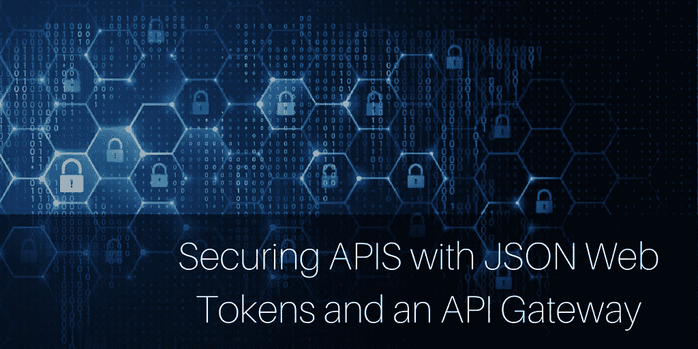
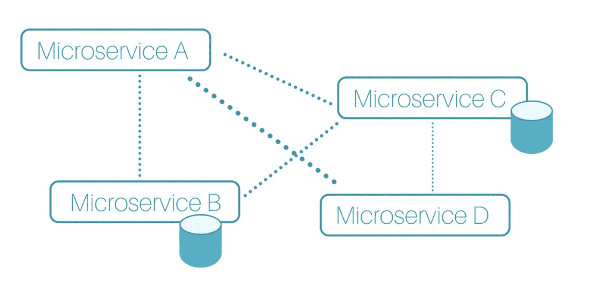
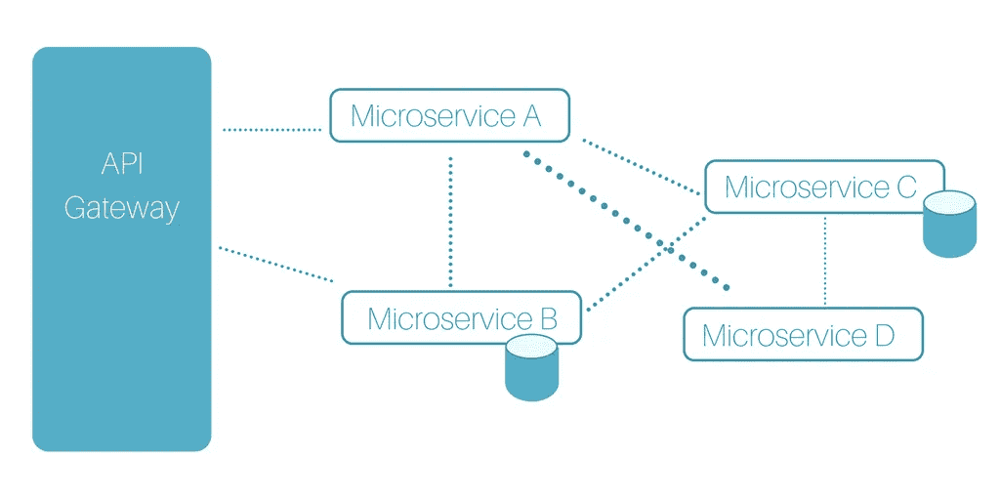

# 用 JSON Web 令牌和 API 网关保护 API

> 原文：<https://medium.com/hackernoon/securing-apis-with-json-web-tokens-and-an-api-gateway-b9b589149616>

什么是 JSON Web 令牌？为什么它们在微服务架构风格的上下文中很重要？

很高兴你问了。谈到 JSON Web 令牌，有很多东西需要讨论，但是让我们从 API 网关的概述开始，然后我们将深入研究 JSON Web 令牌以及如何开始(包括一个很棒的新视频教程)。

# 简介:API 网关是微服务的核心

您可能想知道什么是 API 网关，为什么它很重要。

TLDR:这是件大事。

这里有一个小秘密:它跨越了你的业务的业务方面和技术方面。根据定义，API 网关被认为是“中间件”，因为它位于后端服务、web 和其他外部客户端之间。API 网关通过一组协议和一组 RESTful APIs 来执行这个任务。

因此，它将几乎所有必需的逻辑从客户端移至网关，这使得开发、保护、管理和扩展终端变得更加简单。

如果你像网飞或谷歌一样，转向微服务可能并不容易，但你可以认识到将整体架构分解为更小、更易管理的部分的好处。您的架构看起来有点像这样:

正如您可能已经注意到的那样，它已经很乱了，而且(至少在纸面上)看起来更不安全，而且考虑到如此多不同的接触点和复杂的信息路由，连接到外部资源也更加困难。

*此外，当* ***迁移到微服务的主要好处是让生活更轻松*** *更灵活，同时又更安全时，谁还想处理所有这些呢？*

这个问题触及了企业规模增长战略的一个非常重要的问题。在每个接触点连接大量微服务不符合以安全方式构建的典型企业标准。更多接触点，更多监控。需要监控的内容越多，就有越多的资源花费在本应简单明了的重复性工作上。那现在怎么办？

通过添加 API 网关，您可以重新组织与外部接触点、应用和 API 的关系。本质上，保护您的微服务，使您能够在构建业务逻辑的同时，让工程师的工作更轻松。

这种新的关系通过单一接触点得到强调，您可以保护、监控和扩展这种接触点。作为一个基本的行业标准，API 网关处理来自外部 API 的认证和授权。

*可扩展、高效——JSON Web Tokens(JWT)和 OAuth 有什么不让人喜欢的呢？*

然而；有不止一种方法来协调这一点。

JSON Web 令牌(JWT)的另一个重要方面是您计划如何初始化它们。一方面是支持由其他身份服务器发起的 JSON Web 令牌，比如 Auth0。另一方面是通过我们的身份服务器实际启动和管理 jwt。这不仅与您的技术方法有关，也与您的安全策略有关。

虽然没有灵丹妙药，但是集成方法有一些优势。使用 Auth0 设置身份并接入 Express Gateway 有一个很好的[入门故事。](https://auth0.com/blog/apigateway-microservices-superglue/)

# 为什么管理自己的身份服务器会失败

这就是为什么我们从一开始就在 Express Gateway 中加入了一个。因此，有更多的机会立即开始，而不必注册额外的服务。此外，Express Gateway 还可以与您现有的 JWT 提供商连接。

让我们面对一些冷酷的事实吧。首先，没有业务需求文档会说“建立一个支持 JWT 的身份服务器”我们从开发人员社区得到的反馈是，大多数时候，我们都只是想象它已经存在。所以，如果你正在做一个项目，却没有一个…开发者不得不争先恐后地创造一些奇迹。

此外，值得注意的是阅读 OAuth2 规范是…困难的。这也意味着获得所有正确的细节是一个惊人的壮举，这不是不可克服的，但需要时间。当速度和敏捷很重要时，放慢速度会让它看起来更糟。

这就是为什么有一个完整的产品部分围绕这一点。

不，说真的。有一整套产品和公司会让你大吃一惊，比如[平身份](https://www.pingidentity.com/)、 [Okta](https://www.okta.com/) 和(我们最喜欢的) [Auth0](https://auth0.com/) 。[了解有关 Auth0 和 Express Gateway 的更多信息。](https://auth0.com/blog/apigateway-microservices-superglue/)

*还没感觉吗？*

我们有过这样的中间时刻，你只需要完成它。这就是 JSON Web 令牌(JWT)的内部支持派上用场的地方。为了帮助您入门，我们制作了一个视频教程，介绍如何设置由其他身份服务器(如 Auth0)启动的 JSON Web 令牌，以及何时通过身份服务器启动和管理 jwt。

观看此简单易懂的操作视频，开始了解 Express Gateway 中的 JSON Web Token 支持:

或者:您也可以在详细介绍最新更新的发布帖子中查看更多的[技术入门指南](https://www.express-gateway.io/express-gateway-release-1-5-0-with-jwt-support/)。

*最初发表于*[*www . express-gateway . io*](https://www.express-gateway.io/getting-started-with-json-web-tokens-and-express-gateway/)*，但在这里分享了额外的注释、图表和特殊媒体编辑评论。*