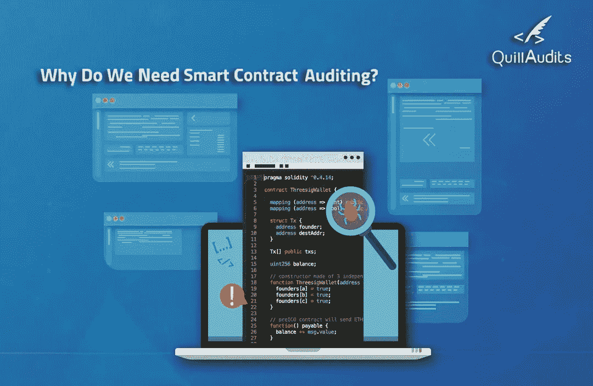
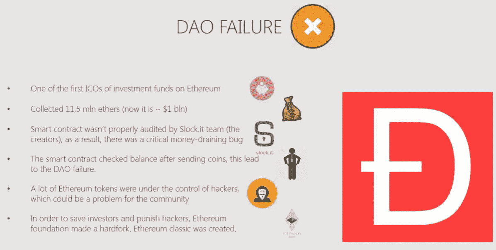

# 安全审计，重要却被忽视！

> 原文：<https://medium.com/hackernoon/security-audits-essential-yet-neglected-130e9af974fe>

Image Ref. — [Quill Audits](https://audits.quillhash.com/?utm_source=medium&utm_medium=blog&utm_campaign=Parth-blog)

“[区块链](https://hackernoon.com/tagged/blockchain) [技术](https://hackernoon.com/tagged/technology)不再是新生事物”，相反，它的巨大潜力正在被全球各地的政府和企业所认识。医疗保健、农业、金融和运输等领域的传统企业已经将区块链集成到其供应链中，并使业务记录安全且不可更改。俄亥俄州和佛罗里达州政府采用加密货币进一步强化了我的观点。

当我们接受生活中的新事物时，批评家们也会找机会溜进来。媒体报道没有给出区块链用例如何改变业务流程的事实，而是强调了区块链生态系统中数百万美元被盗的案例

1.  道黑——1.5 亿美元被盗
2.  平价——损失了 3 亿美元
3.  POWH — 2000 乙醚被盗
4.  spank chain——4 万美元被盗

DAO failure was caused due to “Recursive Call bug” which also happened with Spankchain ICO, (Image Ref. — [Samuel Falkon](/swlh/the-story-of-the-dao-its-history-and-consequences-71e6a8a551ee))

这些只是区块链生态系统中发生巨额经济损失的几个例子，并已在主流媒体上得到强调。区块链正被宣传为“网络安全的下一件大事”，为了实现这一愿景，区块链社区需要防篡改并采取零容忍政策。让我们来看看问题的根源，为什么会发生这些黑客攻击？

*区块链平台使用的智能合约越多，危险就越大。*

“虫子”

智能合约是构成区块链网络的区块。这些集团负责在区块链网络中转移数百万美元(有时是价值数百万美元的资产，作为安全令牌)。智能合同是由开发人员编写的，他们是人，有时会在开发过程中不知不觉地遗漏一些在最终测试中没有发现的错误。

黑客利用这些 bug 攻击网络，侵吞网络中流动的资金。

“审计流程”

为了审计智能合同，审计员遵循 4 步流程-

1.  **收集规范—** 为了使审计过程彻底，不仅需要识别存在的缺陷，还需要识别智能合同中缺少的功能。这是至关重要的一步——高效的审计团队可以确保智能合约能够发挥白皮书中提到的功能。
2.  **手动测试** **—** 对每一行代码进行详细检查。这里的想法是将代码呈现在尽可能多的人面前，这样就不会有未被发现的错误。
3.  **单元测试—** 在这里，审计员通过为智能合约中的每个功能实现单元测试用例，来获得代码中的最小单元。
4.  **自动分析—** 该步骤利用了区块链社区已经开发的工具。根据智能合约的性质，审计师可以使用各种工具，一些常见的工具有 Mythril、Smart Check、Remix、Solhint。

也建议使用坚固性覆盖工具。该工具运行一个过程，并检查单元测试用例已经覆盖了多少功能。这个过程识别出没有被测试或者可能需要更多测试的代码部分。

在审计过程中，审计师还应该发现智能合同是否“真正去中心化”。一些智能合约在不知不觉中赋予所有者太多权力——焚烧代币、延长锁定期、冻结投资者资金。

“回到批评家身上”

任何导致金钱损失的黑客行为都会扭曲整个区块链生态系统的形象，导致公众(渴望参与这场革命)后退一步，认为这项革命性的技术仍然不成熟。为了设想区块链主导生态系统的未来，需要对整个区块链进行结构化审计。

*每当我参加考试时，我总是相信我已经以优异的成绩通过了，但是对我的试卷的外部审核却给出了相反的结果！*

"摘要"

智能合同审计不是一件容易的事情，很明显，一个开发团队不可能在开发过程中发现所有的错误。我建议由不同的审计师进行审计——你不仅可以让项目变得安全，确保投资者的资金有一个避风港，还可以让区块链生态系统立于不败之地。

一些顶尖的智能合同审计师，基于对他们各自博客上发布的审计报告的分析-

1.  [齐柏林飞船解决方案](https://zeppelin.solutions/)
2.  [细野](https://hosho.io/)
3.  [羽毛笔审计](http://audits.quillhash.com)
4.  [偏心](https://decenter.com/audits/)
5.  [Quantstamp](https://quantstamp.com)

参考文献—

1.  [https://blog . zeppelin . solutions/on-the-parity-wallet-multisig-hack-405 A8 c12 E8 f 7](https://blog.zeppelin.solutions/on-the-parity-wallet-multisig-hack-405a8c12e8f7)
2.  [https://medium . com/quill hash/quill audits-smart-contracts-audit-check-list-d65a 305 EC 1a 3](/quillhash/quillaudits-smart-contracts-audit-check-list-d65a305ec1a3)
3.  [https://medium . com/swlh/the-story-of-the-the-story-of-the-Dao-history-and-results-71e 6a 8 a 551 ee](/swlh/the-story-of-the-dao-its-history-and-consequences-71e6a8a551ee)
4.  [https://Callisto . network/blog/post/why-do-we-need-smart-contract-auditing/](https://callisto.network/blog/post/why-do-we-need-smart-contract-auditing/)

 [## 安全-黑客正午

### 阅读黑客午间关于安全的文章。黑客如何开始他们的下午？

hackernoon.com](https://hackernoon.com/tagged/security) 

*让我们更多地讨论区块链安全，在我的电报手柄上 ping 我——@ parth _ Agarwal！*