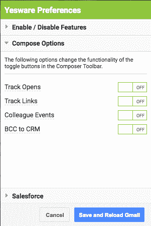

# 安全检查:Chrome 电子邮件跟踪扩展可以存储你的私人邮件吗？

> 原文：<https://medium.com/hackernoon/security-check-can-chrome-email-tracking-extensions-store-your-private-emails-d032d705f730>

我叫 Vadym，来自 MacKeeper 反恶意软件实验室(前 Kromtech 安全中心)。我们的研究项目侧重于监控数字风险和隐私侵犯。这是我们最近的研究发现。如果您有任何问题、顾虑或想法需要更新，请在此评论或联系我。

# TL；速度三角形定位法(dead reckoning)

**如果你想知道 Chrome 中的隐私邮件跟踪器是否可靠，简单的回答是:不太可靠。**在我们分析的三种最流行的电子邮件跟踪扩展中，有两种会从您的电子邮件正文中接收内容，即使这是不必要的。

# 详细的回答

在延伸商店你必须小心你的背后。这一点在 Chrome 上尤为明显，该浏览器拥有近 60%的市场份额，是网络犯罪分子的一块好馅饼。谷歌[称](https://betanews.com/2018/10/01/google-chrome-web-store-extension-security/)70%的恶意扩展被屏蔽，但是最近一系列的研究发现显示这个问题还远未解决。

我想强调的是，扩展不应该是恶意的。收集不必要的(用于扩展工作的)用户数据可能会导致与恶意软件案例相当的问题。

基于一些用户的反馈，我们决定分析三个流行的免费邮件跟踪器——yes ware、Mailtrack 和 Docsify。它们都允许跟踪电子邮件打开和回复率、链接点击、附件打开和演示页面浏览量，并允许重要电子邮件的副本直接自动发送到您的 CRM。

我们查看了每个扩展请求的权限、从您的电子邮件发送到扩展主机的实际数据，以及这些如何显示在隐私政策中。这是我们发现的细目分类。

# 您给予的权限

安装 **Yesware** 附带了它所需的标准权限。看起来最邪恶的请求是“读取并更改你访问的所有网站上的所有数据。”

通常，此类扩展只要求在特定网站上具有此级别的权限。例如，官方的谷歌邮件检查器(Gmail 的电子邮件跟踪)要求“读取并更改你在所有 google.com 网站上的数据”

据我所知，扩展开发者决定要求“无限制”的许可，而不是用他们的扩展将要交互的网站的扩展列表来打扰你。然而，你需要明白，接受这一点，你就给了 Yesware 比它实际工作所需要的更多的可访问性。

有趣的是，我们注意到，在确认了扩展的权限之后，您还必须确认应用程序的其他权限。

重要的是要知道，像上面的截图一样呈现的权限是与应用程序相关的，而不是扩展。

这是什么意思？从本质上讲，如果你决定删除扩展，应用程序仍然可以访问你的数据。

同样， **Docsify** 请求允许读取和更改您访问的网站上的所有数据。应用程序也需要权限。

**Mailtrack，**与第一个例子相反，它不要求用户访问所有网站，只访问与电子邮件相关的网站。

这些权限是这种类型的扩展的标准—阅读、发送、删除和管理电子邮件。

# 他们得到的电子邮件数据

我们调查中最有趣的部分来自于对每个分机收集和处理的电子邮件内容的分析。在这个阶段，我们使用了 [Burp](https://portswigger.net/burp) ，一个测试 Web 应用安全性的工具。它的代理服务器工具允许我们检查双向传递的原始数据——在我们的例子中，从发送者到扩展数据存储。

## Yesware 电子邮件数据收集

Yesware [隐私政策](https://www.yesware.com/privacy/)和[使用条款](https://www.yesware.com/terms/)不包括关于存储您的电子邮件数据的信息。然而，我们的研究表明，该应用程序确实可以管理电子邮件数据存储。

需要明确的是，我们测试了没有 CRM 集成的免费版 Yesware。撰写并发送电子邮件后，我们在 Burp 中检查主机 app.yesware.com，以从发送到那里的电子邮件中找到数据。

*Our sample email with tracking features turned on in Yesware.*

很容易注意到我们的电子邮件正文被发送到了 Yesware 主机。**换句话说，扩展收集并处理了这封个人邮件的全部内容。**

很容易注意到我们的邮件正文被发送到了 Yesware 主机。**换句话说，扩展收集并处理了这封个人邮件的全部内容。**

*The data we found with Burp.*

令人惊讶且重要的是，当我们**取消选择 Track 和 CRM 复选框**以停止跟踪任何与您的电子邮件相关的活动时，情况依然如此。

*The content of the second email with tracking features off.*

即使在这种情况下，Yesware 也会发送电子邮件的正文。

*The Burp analysis of the second case.*

我们认为只有关闭扩展首选项中的所有功能才有帮助。在这种情况下，没有数据发送到主机。

为了得到对这一切的解释，我们发了一封电子邮件给 Yesware 支持。给[support@yesware.zendesk.com](mailto:support@yesware.zendesk.com)的第一封邮件。(2018 年 10 月 12 日)您可以在下面找到。

> 亲爱的 Yesware 安全团队
> 
> 我叫 Vadym，是 Krom tech Alliance corp .(【https://kromtech.com/】T2)的安全研究员。我们是一家产品开发公司，恶意软件分析是我们的活动之一。在最近的研究中，我们的团队发现，即使用户关闭了跟踪功能,“Yesware 电子邮件跟踪”Chrome 扩展也会向 app.yesware.com 的域名[发送电子邮件正文。](http://app.yesware.com/)
> 
> 由于电子邮件被视为个人信息，您应该告知您的客户收集和处理此类数据的事实，并征得他们的同意。您还应该在隐私政策中对此进行描述，并提供以下信息:
> 
> 1.收集个人信息的目的是什么？
> 
> 2.您在哪里使用这些信息？
> 
> 3.这些信息存储在哪里？
> 
> 4.用户如何阻止自己进行数据收集？
> 
> 我们希望你能为你的浏览器扩展的这种恶意行为提供合理的解释，因为我们将出版关于这个案例的出版物，并希望包括你的评论。
> 
> 你可以用我的商务邮箱进行交流:adik@kromtech.com
> 
> 最诚挚的问候。
> 
> 瓦迪姆·李森科
> 
> Kromtech 的安全研究员

最后，我们发了三封邮件。第二个导致发送方暂停。

然而，从另一个帐户发送的第三封邮件得到了回复。以下是回应:

> 你好，瓦迪姆，
> 
> 感谢您伸出援手！我的同事 Simone 回复了您之前的邮件，内容如下:
> 
> Yesware 是一个分析平台，允许用户深入了解他们的电子邮件活动。在 OAuth 过程中，我们会要求用户提供访问其收件箱和电子邮件的权限，以允许 Yesware 收集元数据，这样我们的客户就可以知道他们的电子邮件与客户的互动情况。
> 
> 您的问题的答案可以在我们的安全概述页面([https://www.yesware.com/security/](https://www.yesware.com/security/))上找到，特别是在“我们收集的数据”下，以获得有关这方面的更多信息，因为这不仅显示了我们收集的数据，还显示了 Yesware 如何为我们的客户利用这些数据。在同一个页面上，您还可以看到我们当前的安全认证以及我们制定的安全和合规性标准和程序。
> 
> 如果还有什么我们可以帮忙的，请告诉我们，谢谢！
> 
> 如果您有任何其他问题，请告诉我们。祝你今天开心！玩的开心！
> 
> 真诚地
> 
> Zaria R .客户体验专员

[安全页面](https://www.yesware.com/security/)说 yes ware****不*** *存储你的电子邮件正文的任何永久副本。但是，对于某些 CRM 集成功能，我们会存储一份邮件正文的临时副本，直到这些数据被正确地传递到您的 CRM 系统；一旦您的 CRM 安全记录了这些数据，我们会将其从系统中删除。该临时数据以加密形式存储；我们绝不存储明文消息正文数据”。**

*正如我之前所说，我们测试的是免费版的 Yesware，没有任何与 CRM 的集成。这就是为什么还有几个问题没有解决:*

1.  *如果跟踪功能被关闭并且没有设置与 CRM 的集成，为什么 Yesware 会收到电子邮件正文的内容？*
2.  *为什么收集和处理用户数据的信息位于网站底部的某个页面上，而不是包含在隐私政策中？*

*我认为在安装过程中包含有关个人数据政策的信息以帮助用户做出是否安装扩展的明智决定是至关重要的。*

## *邮件跟踪电子邮件数据收集*

*Mailtrack [隐私政策](https://mailtrack.io/en/privacy-policy)保证你的邮件正文在任何情况下都不会存储在公司的服务器上。*

**

*我们无法证明或反驳存储的事实，但我们检查了这些数据是否被发送到服务器。和 Yesware 一样，我们分析了 Mailtrack 免费版，没有任何额外的集成。此外，我们离开了所有的免费跟踪功能。*

**

***分析表明，此扩展不会收集您的电子邮件正文。**你可以通过对比原始邮件和下面 Burp 的代码来确定。*

**

**Our email with Mailtrack tracking features on.**

**

**The analysis from Burp.**

## *Docsify*

*Docsify 隐私政策声称他们确实会收集你的电子邮件内容。文件上写着:*

*作为我们服务的一部分，我们收集并处理客户通过我们的服务发送的信息。这些信息可能包括文档、链接、联系人列表、收件人的电子邮件地址、邮件主题以及客户通过我们的服务发送的其他信息。*

**我们对 Docsify 做了同样的操作，它不收集邮件正文。”**

*与其他案例类似，我们通过发送带有基本跟踪功能的电子邮件来测试该应用程序，而没有集成 CRM。正如隐私政策中提到的，扩展将邮件正文发送到它的服务器。*

**

*我们发送了包含下一个内容的电子邮件。*

*“请确认，你收到了这条信息。绝密”*

*如您所见，邮件正文被发送到 Docsify 服务器。*

**

**The Burp analysis of our email with trackers features on.**

*有趣的是——如果你检查 Docsify 应用程序，你不会发现邮件正文的内容(正如隐私政策中所承诺的)。同时我们知道 Docsify 确实收集了它。*

**

**Email analytics shown in the Docsify app.**

# *如何将扩展安全性差带来的风险降至最低*

*开发者有可能使用不存储私人邮件的替代方法吗？不幸的是，不缺乏通用的想法，但它取决于不同的技术因素。*

*但是，对于最终用户来说，至少有两个基本步骤可以降低存储的电子邮件副本带来的风险。*

***1。当你安装一个浏览器扩展时，注意你授予了多少访问你的个人数据的权限。**例如，通过批准“读取和更改您访问的所有网站上的数据的能力”，您基本上让一个扩展捕获了您的密码和信用卡号码或其他个人信息。是的，有时应用程序没有其他方式可以工作并与开放的网页交互，但你永远不知道它是否会使用其权限做好事或坏事，或者应用程序服务器的安全性是否会保持完整。*

***2。用常识作为你最好的安全卫士。**如果您清楚地了解您想要通过扩展解决的问题或任务，您就可以了解哪些权限实际上是帮助您所必需的。明智地选择应用程序，尽可能给它们最少的数据量。*

***3。请记住，有些扩展不会将有关数据使用的信息放入隐私政策中。根据国际法，他们有义务通知您。如果您在隐私政策或使用条款中看不到此信息，请查看网站页脚的“安全性”或“数据使用”等页面***

***4。查看并移除您未使用的应用。**我们生活在一个数据泄露的时代。每个应用都有潜在的问题。*

***5。请确保您完全删除了该应用。与 Yesware 和 Docsify 一样，如果你授予应用程序权限，即使在它们的扩展被删除后，它们也不会失去对你的数据的访问权。要检查和管理您授予所有应用程序的权限，请按照下列步骤操作:***

*   *登录您的[谷歌账户](https://myaccount.google.com/)。*
*   *点击左侧的**安全标签**。*
*   *选择“连接的应用程序和站点”下的**管理访问权限***
*   *对于要删除数据权限的服务，单击**撤销按钮**。*

*虽然我们没有时间找到并检查每一个承诺保护您电子邮件数据隐私的扩展，但我们有理由相信，他们中的大多数人对简单的工作方式比对您的真实隐私更感兴趣。*

*不管一个扩展多么合法或可信，它对你的了解越少，你就越安全。*