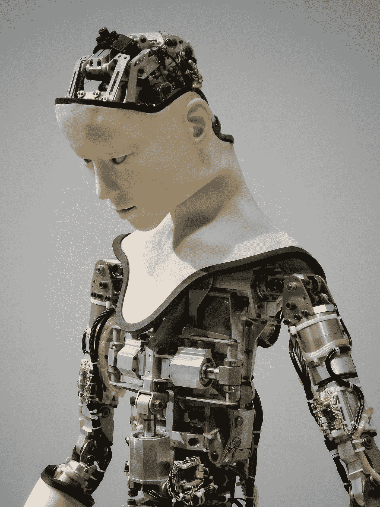
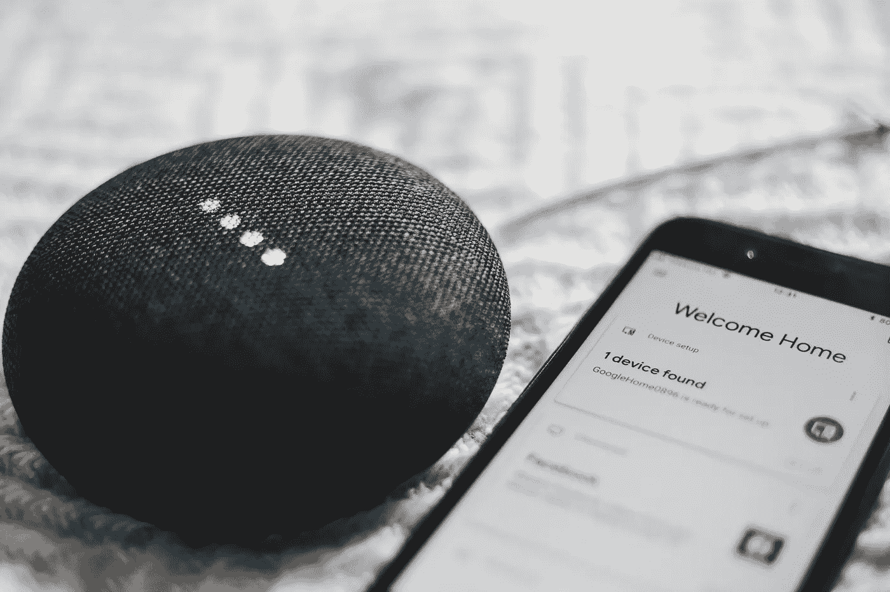

# 当今时代的安全性

> 原文：<https://medium.com/hackernoon/security-in-this-day-age-1ce83adb1b4b>

## 新技术如何重新定义它的边界

Photo by [Rahul Chakraborty](https://unsplash.com/photos/xsGxhtAsfSA?utm_source=unsplash&utm_medium=referral&utm_content=creditCopyText) on [Unsplash](https://unsplash.com/search/photos/mobile-phone?utm_source=unsplash&utm_medium=referral&utm_content=creditCopyText)

自从人类开始快速进化和扩张以来，我们作为个体和物种的安全一直是我们里程碑式发明的主要驱动力。火的*发现及其控制*是为了保护我们免受野兽和生食细菌的侵害。车轮的*发明是为了保护我们的旅程，这样我们就可以带着更少的恐惧和更多的冒险精神走更长的距离。对于庇护所的需求来自于一种对安全的原始需求，这种安全来自于地点的持久性。我们可以举出更多的例子，但很明显，自我和/或社区的安全感是我们取得进步的动力。*

然而，在当今时代，安全对我们所有人来说都有了更微妙的含义。当然，我们仍然在家里安装昂贵的安全措施来保护我们的贵重物品和财产(当然，除非你是《孤独的家》系列中的凯文·麦卡利斯特)。

但是，如今，安全包括情感和心理层面，以及法律和道德标准。像 M.K .甘地和马丁·路德·金这样的杰出人士为他们各自被压迫阶级的自由和安全而斗争。即使是现在，我们也有很多游行来捍卫和平等世界各地的 LGBTQ 群体。

有鉴于此，我们也见证了新技术的出现，这些技术具有快速扩张的空间，如人工智能、机器学习、区块链等。此外，我们正在目睹技术侵入我们生活的破坏性影响，如脸书数据泄露或剑桥分析公司丑闻。

在这种情况下，我们必须看看这些技术如何帮助或损害我们的安全概念，它们如何可能拓宽我们对安全的定义，以及我的一些个人想法，它们如何在长期(甚至短期)对我们有巨大的好处。

> 不过，公平的警告是，我不是这些技术的专家。我只是一个普通人，像你一样，试图理解一个快速变化的世界，用自己有限的知识在这个迷宫中导航。

# 人工智能与安全

Photo by [Franck V.](https://unsplash.com/photos/YKW0JjP7rlU?utm_source=unsplash&utm_medium=referral&utm_content=creditCopyText) on [Unsplash](https://unsplash.com/search/photos/artificial-intelligence?utm_source=unsplash&utm_medium=referral&utm_content=creditCopyText)

## 它将如何重新定义安全

如今，人工智能正在快速发展，无论是基于过去的经验增加与用户的互动(认知智能)，基于刺激线索理解用户感受的能力(情绪智能)，还是把握外部环境以进一步定制其给出的响应(社交智能)。

然而，这能走多远？

随着人工智能系统在复杂性方面继续达到人类标准，它将开始开发一种新的安全形式，即程序安全。我甚至没有谈论防火墙和防病毒软件，它很快也会涉及机器人的安全指南。一个基本的例子是著名科幻作家艾萨克·阿西莫夫发明的机器人基本三定律，它因《我，机器人》中的反面乌托邦式的表现而变得流行。

然而，已经有许多关于“机器人伦理”的论文和调查。例如，的学习算法和系统实验室([【LASA】](http://lasa.epfl.ch/))的 Pawel Lichocki 先生和他的团队在 2011 年进行的一项[调查](http://lasa.epfl.ch/publications/uploadedFiles/lichocki2011ethical.pdf)谈到了伦理方面的主要问题(当机器人造成伤害时)是找出当这样的事件发生时谁应该负责，是操作它的人类还是机器人本身。最近，有一个关于机器人伦理和标准(ICRES) 2018 的国际会议，主题演讲是关于在人工智能系统中创建一个现代标准，关于自主武器和战争的未来等。

因此，我们可以看到，人工智能可能会扩展安全的定义，以包括人与机器人和机器人与机器人的交互，这必须作为一种防范反乌托邦未来和反社会第三方不利利用的措施。

## 它目前如何帮助实现更好的安全性

人工智能在个人安全和检测潜在威胁方面有着广泛的应用。

人工智能在这一领域的主要应用是识别可能的威胁(已经上传到数据库中)，然后扫描外部环境(如商场、公园和其他公共场所)，以识别、分析和确定嫌疑人，从而在可疑活动的情况下采取先发制人的打击或反击措施。为此，已经开发了一些技术来实现这一点。

第一项技术是 **Evolv Edge** ，由 **Evolv Technologies** 开发，它使用人工智能扫描和描述所有通过特定安检点的人，使用精确的视觉传感器和面部识别技术。一旦完成，对于每一个人，人工智能程序会将其与嫌疑人和罪犯的数据库进行交叉验证，目前，它可以以每秒 1-2 人的速度识别潜在的威胁(这是一个相当快速的过程！)

第二项突出的技术是 **Deep Sentinel** 提供一个完整的家庭安全包，它可以实时扫描可疑活动，识别可疑活动并报警，此外还可以通过定制的移动应用程序提醒房主。你可以在这里查看这个安全系统[。](https://www.deepsentinel.com/)

即使在军事用途上，配备人工智能的无人机也能够扫描环境以发现威胁，并能够穿越人类难以到达的地形，从而扩大军队监视、侦察和反恐的范围。一个主要的例子是 **Hivemind Nova** ，这是由 **Shield AI** 开发的四轴飞行器类型的无人机，它由 Hivemind 提供动力，Hivemind 是一个机器学习应用程序，我将在机器学习部分详细讨论。

## 我如何相信它可以帮助安全

Photo by [Owen Beard](https://unsplash.com/photos/K21Dn4OVxNw?utm_source=unsplash&utm_medium=referral&utm_content=creditCopyText) on [Unsplash](https://unsplash.com/search/photos/machine-learning?utm_source=unsplash&utm_medium=referral&utm_content=creditCopyText)

人工智能面临的一个关键挑战是定义上限和下限，即人工智能应该能够完成的基本功能是什么(这取决于它将被使用的应用程序)，以及人工智能应该在多大程度上吸收和解释数据(这取决于用户希望对其施加的控制力)。在我看来，这应该是第一个需要回答的问题，因为针对具体应用的有效答案将有助于减少软件或操作方法带来的风险和错误。

另一个可以解决的关键问题是可以定义的隐私级别。换句话说，我们应该知道人工智能可以在多大程度上预测或观察信息，特别是在处理涉及人的敏感问题时。例如，即使在家庭安全系统中，我们也应该确保安全系统在识别“朋友”或“亲戚”时接收的数据不应该存储在任何外部服务器中，以防止任何人滥用。

# 机器学习与安全

Photo by [Franck V.](https://unsplash.com/photos/U3sOwViXhkY?utm_source=unsplash&utm_medium=referral&utm_content=creditCopyText) on [Unsplash](https://unsplash.com/search/photos/machine-learning?utm_source=unsplash&utm_medium=referral&utm_content=creditCopyText)

## 它将如何重新定义安全

如今，当涉及到现实生活操作或关于安全的讨论时，机器学习与人工智能同步进行。这是正确的，因为人工智能算法需要庞大的数据集来有效地在该领域做出反应，这是由机器学习和大数据推动的。

然而，随着数据泄露和剑桥分析丑闻的出现，机器学习已经改变了我们对安全概念的看法。这种情况的发生部分是因为它利用了我们对安全的直觉理解和诠释。简而言之，它让我们意识到，当一些随机程序比我们更了解我们时，我们不会感到舒服，当这些程序使用这些数据以特定方式有效地改变战略决策时，我们会感到不安全。

当创建用于医疗目的的算法时，这种理解的扩展也是至关重要的，因为一个人的医疗记录应该是病人和医生之间的机密。这涉及到对程序中的内容进行彻底的分析，以及为了更准确的目的，对侵犯患者医疗数据安全的程度进行限定。

从更广泛的意义上来说，机器学习现在已经让我们明白，即使在互联网领域也存在“个人空间”的概念，我们应该注意我们在那个领域的活动。就我个人而言，我担心我的数据如何被一些第三方程序使用，但从中立的角度来看，看看这如何重新定义我们如何将机器学习视为一个概念，以及我们如何能够/将调整程序以适应我们的目的，这将是有趣的(至少可以这么说)。

## 它目前如何帮助实现更好的安全性

Photo by [Luca Bravo](https://unsplash.com/photos/XJXWbfSo2f0?utm_source=unsplash&utm_medium=referral&utm_content=creditCopyText) on [Unsplash](https://unsplash.com/search/photos/machine-learning?utm_source=unsplash&utm_medium=referral&utm_content=creditCopyText)

在安全性方面，大多数机器学习应用程序都是与人工智能同步完成的，以获得更好的算法性能。人工智能算法是通过监督学习(分类)和非监督学习(聚类)的组合来收集和解释其数据集。然而，当在人工智能算法的初始阶段开始时，分类集更占优势。谈到分类，即监督部分，有 4 个关键阶段:-

1.  *训练*阶段，其中通过将分类器应用于一组训练数据来构建模型
2.  一个*验证*阶段，在这个阶段，分析师将经过验证的数据应用到模型中，以评估准确性
3.  一个*测试*阶段，该模型现在使用新的数据进行测试，而不是前两个阶段的一部分，最后
4.  一个*部署*阶段，在这个阶段，经过充分测试的模型现在被用在新的未改变的数据上。

在这些阶段，机器学习在训练和部署阶段对收集数据的明确目的有很大帮助，因此提高了所创建的模型的准确性，从而缩短了验证和测试阶段的持续时间，从而缩短了整体执行周期。

此外，正如我之前提到的，机器学习也正在用于军事无人机应用，我举的例子是 **Hivemind** 。

在这种情况下，Hivemind 使用视觉传感器来准确地绘制环境地图，并将其作为虚拟数据馈送给算法，该算法进而存储数据并使用它来了解不同的环境，以便下次它被发送到未知地形时，它会根据之前收集和学习的信息进行扫描和分析。

## 我如何相信它可以帮助安全

虽然机器学习已经被广泛使用，并与人工智能结合使用，但我认为它可以走得更远。这种可能性已经存在，但我们可以使用大数据和机器学习来预测下一次恐怖袭击或下一次全球健康流行病。

然而，我认为机器学习可以帮助我们的最好方式是在法医侧写中。执法是少数几个可以获得完整数据而不用担心受到迫害的领域之一，因此我们可以将数十万份关于法医证据数据的档案浓缩到一个单一的算法中，该算法可以跟踪并提供线索，帮助我们领先犯罪行为人两步甚至三步。

到目前为止，最重要的部分是解决医疗和公共安全等其他领域的个人数据隐私问题，因为这是一个需要解决的关键问题。此外，一旦这样做了，就必须制定法律，对公众和公司实施严格的隐私规定。

# 物联网与安全

Photo by [Bence ▲ Boros](https://unsplash.com/photos/anapPhJFRhM?utm_source=unsplash&utm_medium=referral&utm_content=creditCopyText) on [Unsplash](https://unsplash.com/search/photos/internet-of-things?utm_source=unsplash&utm_medium=referral&utm_content=creditCopyText)

## 它将如何重新定义安全

物联网也有自己的安全问题，最近的一些泄露事件让消费者对物联网设备在保持安全方面的功效产生了严重怀疑。虽然已经有**未指明的报道**来自亚马逊 Echo 的 Alexa 随机大笑(？)，最近*就发生了一次这样的基于物联网的攻击，当时地理定位数据公司****location smart****的一个不安全的产品演示，* ***允许用户在不提供任何安全凭证的情况下查找任何手机的位置*** *。这一点尤其危险，因为美国所有主要的移动运营商* *(如威瑞森、AT & T、Sprint、T-Mobile 等。)也受到了这次黑客攻击的影响，包括几家加拿大运营商*。

因此，如果物联网落入坏人之手，它可能会破坏安全性，这一点值得注意。但是，预防和安全就足够了吗？我们需要研究允许烤面包机和真空吸尘器内置微芯片的基本概念，这种微芯片可以连接到互联网，并且可以通过触摸按钮来控制。

虽然我同意我们的生活会变得更容易，一触即发，但我们应该关心的是，我们的按钮是否是唯一可以控制我们设备的按钮，因为技术失控也可能导致家庭事故，这甚至更令人担忧*考虑到家庭事故每年导致超过 18，000 人死亡**，仅在美国就有超过 18，000 人死亡 ***。****

*当然，我们不需要这么悲观，但想想你自己的家用电器被用来做秘密监视，这可能被用来勒索或更糟。因此，我们需要非常小心，因为物联网如果被滥用，有可能造成巨大的(但隐藏的)安全漏洞，其损害可能是不可挽回的。*

## *它目前如何帮助实现更好的安全性*

**

*Photo by [Andres Urena](https://unsplash.com/photos/tsBropDpnwE?utm_source=unsplash&utm_medium=referral&utm_content=creditCopyText) on [Unsplash](https://unsplash.com/search/photos/internet-of-things?utm_source=unsplash&utm_medium=referral&utm_content=creditCopyText)*

*虽然我已经提到了 **Deep Sentinel** 以及它是如何被吹捧为一种有效的家庭安全系统，但作为一种安全手段，物联网仍处于萌芽阶段，情况是物联网需要自己的安全，而不是 it 提供同样的安全。*

*物联网设备的安全有多种方法，最简单的是通过简单的密码或两步验证或生物识别等方式进行物联网身份认证。此外，像物联网加密和物联网网络安全这样的方法正在实施，但话说回来，*我们正在为物联网创造安全，而不是它保护我们*。物联网要成为一种可行的独立安全措施还需要很长时间。*

## *我如何相信它可以帮助安全*

*老实说，我认为 **Deep Sentinel** 在这方面的方向是正确的，但我的想法是，如果我们可以使用人工智能来监控和防御物联网设备的网络威胁，这将是比简单的密码或杀毒软件更好的对策。此外，我们可以为每个家庭建立一个本地内部网，而不是将所有设备连接到云，其中必要的设备连接到这个内部网，然后连接到手机，并且只能通过单独的认证系统访问，这也是 AI 最受欢迎的安全选项。当这种情况发生时，物联网可以安全有效地用于高效提供家庭安全。*

*第二个想法是，军事武器的物联网可以实现(或者可能已经实现了)，但再次强调，必须非常小心地使用人工智能来防范外部网络威胁，以便战争不会突然开始。*

*我的第三个更古怪的想法是**使用物联网以物理形式存储恶意软件，然后以物理方式处理它**，例如使用人工智能来隔离特定的恶意软件或病毒，并将其重新路由到特定的设备(这里我指的设备是像烤面包机这样的家用电器)，然后处理烤面包机。我肯定这不像我说的那么容易，但如果我们能够找到任何网络攻击的源节点，除了将该节点隔离并存储在甚至一个物联网牙刷中，然后将牙刷扔掉，这样它就不会有任何重新进入的点，这将非常有帮助。(*不要在这上面引用我的话，其纯属猜测！*)*

# *结论*

**

*A peek into the future. Photo by [Samuel Zeller](https://unsplash.com/photos/VK284NKoAVU?utm_source=unsplash&utm_medium=referral&utm_content=creditCopyText) on [Unsplash](https://unsplash.com/search/photos/virtual-reality?utm_source=unsplash&utm_medium=referral&utm_content=creditCopyText)*

*这些新技术将会一直存在，甚至就在我们说话的时候，它们正越来越多地被用于我们的日常生活中，让我们更加舒适，或者至少更加安全。我们还有很长的路要走，随着时代的变化，我们对“安全”的定义肯定会发生一些重大的变化。然而，我们希望随着正确的发展方向，随着正确的法律的通过和研究的完成，我们可以踏上一个更安全、更有保障、更自由的世界。 ***那是一个我渴望经历的未来*** 。*

**你喜欢这篇文章吗？如果是，请做*👏*(如果你真的喜欢，你可以不止一次这样做)来展示你的*💓如果你想分享你的想法，也可以考虑在下面的评论区回复这篇文章！！感谢阅读！:)*

**还有，确实可以考虑在这里* *阅读我最近的其他文章* [*。并且，你可以在*](/@tarotblogger25_33385)**上随时联系我，在*[*LinkedIn*](https://www.linkedin.com/in/kaushik-anand-713ba395/)*上了解我的职业生活。***

**祝你今天过得愉快！！:)**