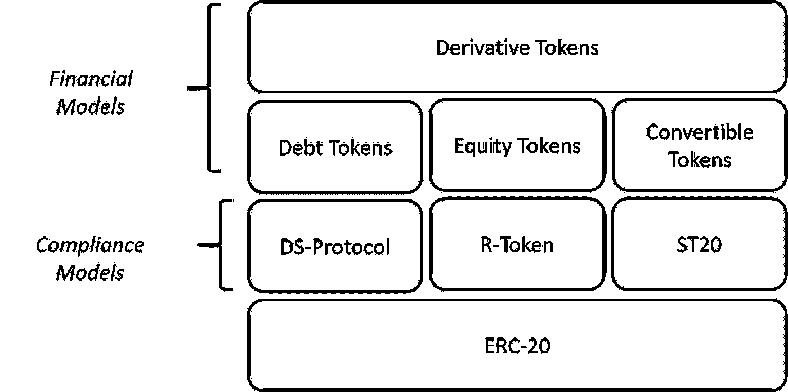
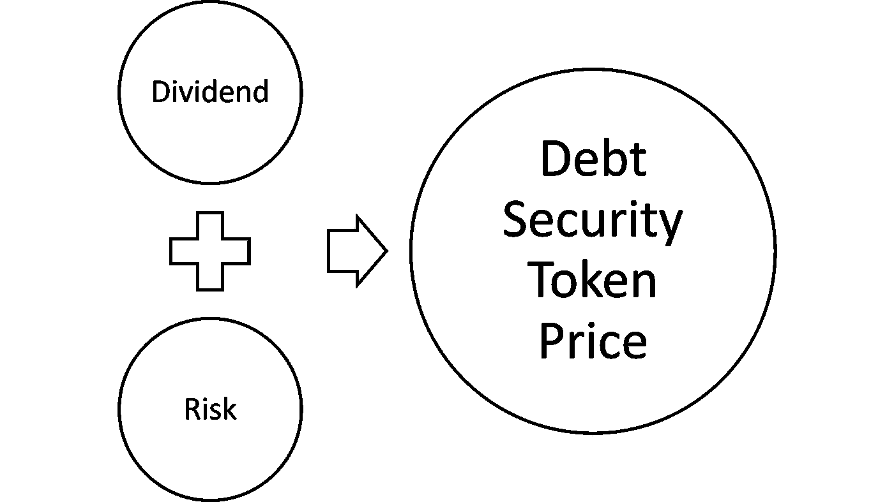
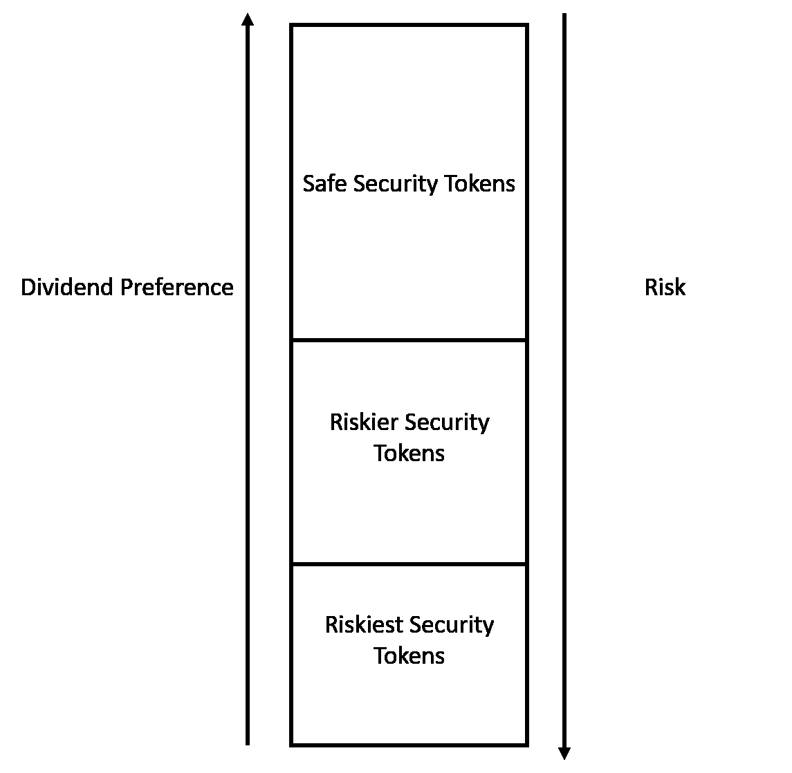
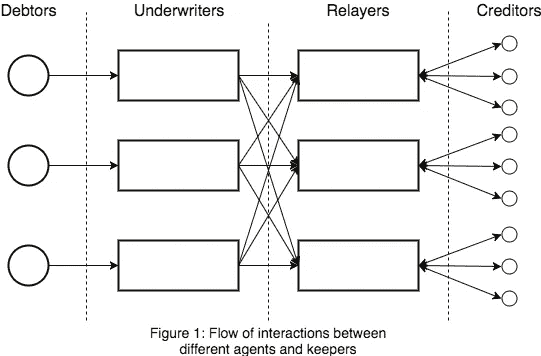

# 安全令牌 2.0 协议:债务令牌

> 原文：<https://medium.com/hackernoon/security-token-2-0-protocols-debt-tokens-af17d5c91a25>

安全令牌可能会成为第一种类型的加密资产，以弥合现有机构投资者和加密世界之间的差距。安全代币的部分魅力在于，至少在概念上，它们可以被视为现有金融产品的可编程、可全球交易的代表。随着安全令牌空间的发展，我们很可能会看到更多的加密证券，它们是以债券、衍生品或股票等成熟的金融工具为模型的。然而，要做到这一点，现有一代安全令牌协议需要结合一些基本金融资产的底层机制。

并非所有安全令牌都是平等的。代表一批房地产抵押/租赁的代币在建筑上不同于代表伦勃朗作品百分比的代币，两者都不同于代表私人公司股票未来价值的代币。这种差异化水平在当前一代安全令牌平台中尚不存在，但它应该是该领域下一波平台的基础构建模块之一([参见我的安全令牌 2.0 论文](https://hackernoon.com/the-security-token-2-0-stack-206b305f5dcd))。

# 安全令牌的类型

在我看来，不同类别的安全令牌的出现将是该领域成熟的一个重要标志。这一步在效用令牌中并不重要，因为它们的行为不受金融资产的支配。另一方面，安全令牌是金融工具的可编程表示，因此，它们应该模仿基础资产的经济行为。

如果我们同意我们将有不同类型的安全令牌，下一个相关的问题是确定哪些类型。鉴于当前一代的安全令牌协议已经做了坚实的工作，支持加密证券的监管行为，下一波应该抽象令牌化证券的主要金融动态。在最基本的层面上，我相信下一波安全令牌协议将支持四种主要的金融模式:

**债务代币:**代表债务或现金产生工具的代币。

**权益代币:**代表标的资产权益头寸的代币。

**混合/可转换代币:**基于其行为在债务和权益之间转换的代币。

**衍生代币:**从基础代币衍生其值的代币。

虽然 Securitize 的 DS 协议或 Harbor 的 R-Token 等模型代表了安全令牌的合规层，但这些新型安全令牌将决定其财务基础。

在本文接下来的几节中，我将深入研究支持不同类型安全令牌的协议。今天，我想集中讨论债务工具。

# 债务证券代币

债务证券令牌是令牌化的资产，代表债务工具，如房地产抵押贷款或公司债券。通常，债务证券代币的行为由两个关键特征决定:

**股息:**债务证券代币的典型结构是根据基础债务工具的支付产生定期股息。

**风险:**债务证券代币面临债务人违约或债务估值剧烈变动的风险。

风险和红利如此重要的原因是它们决定了证券的定价。一个中等违约风险的房地产抵押贷款不能像一个上市前公司的债券一样定价。风险和股息是在证券定价时应该考虑的关键因素。按照区块链的说法，代表债务证券令牌的智能合约应该包括诸如还款条款等操作，这些条款规定了股息模型，但也包含了基础债务的不同风险因素。

# 对冲风险:安全令牌 CDO

如果风险在债务证券代币中是如此重要的因素，那么我们应该考虑如何减轻它或对冲它。债务抵押债券(CDO)是 2008 年金融危机的典型代表之一，但它是一个适用于证券代币的有趣模型。从概念上讲，CDO 将抵押贷款或债券等产生现金流的资产汇集在一起，并将这些资产重新打包成可以出售给投资者的分散部分。CDO 中的每个部分都有不同的风险状况，高级部分通常更安全，并获得第一优先的流动性。CDO 的概念是高风险债务可以通过与更安全的债务打包在一起进行对冲。

将 CDO 的概念应用于债务证券代币，我们可以设想一种代币，它是具有不同风险状况的证券代币的集合。这些令牌化证券可以将风险较高的债务令牌的高股息/高风险模型与较安全的债务工具的中等股息/低风险模型结合起来。

# 债务安全令牌协议

实现债务安全令牌协议并不是一件容易的事情，但幸运的是，有一些技术已经为解决这个问题铺平了道路。 [Dharma](https://dharma.io/) 是一个区块链协议，支持创建和管理令牌化债务资产。达摩提供了一个相对简单的模型，它基于四个基本组件:

1.  **债务人**:债务交易中的一方，借入一项资产，并欠债权人一些约定的价值。
2.  债权人:在债务交易中，借出资产的一方被债务人欠下一些约定的价值。
3.  **承销商**:收取管理债务公开发行费用并将借款人违约风险计入资产的实体
4.  **中继者**:汇集已签署的债务指令信息并将其保存在集中指令簿中的实体，通过填写已签署的债务指令为散户投资者提供投资所请求债务指令的能力。

达摩的债务协议由定期合同表示，其中包括诸如还款条款或风险模型等要素。从技术上讲，定期合同公开了一个标准的方法接口，用于登记债务人的还款，并以编程方式查询贷款期限期间和之后债务资产的还款状态。

在最基本的层面上，采用 Dharma 的安全令牌平台将扮演中继器的角色，并与保险商节点网络集成。债务证券代币将被建模为定期合同。Dharma 协议在偿还、收集或默认条件方面的许多动态特性都可以适用于安全令牌模型。

鉴于其现金生产的性质，债务证券代币很可能在不久的将来成为最受欢迎的代币化证券类型之一。显然，必须创建新的协议来支持这一努力，但是像达摩这样的技术无疑提供了一个很好的起点。