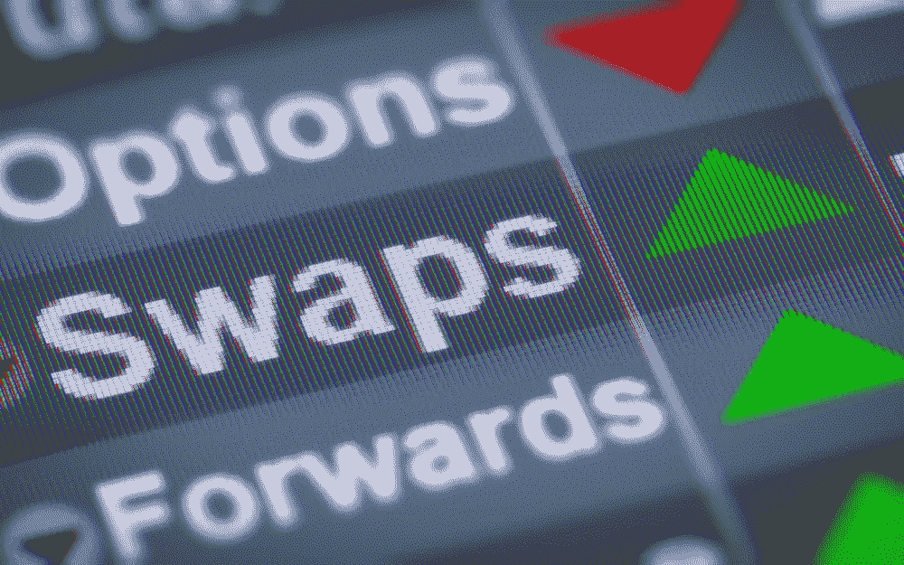
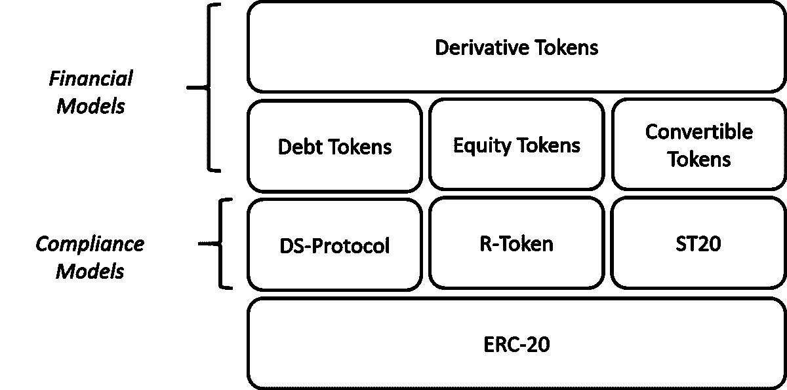
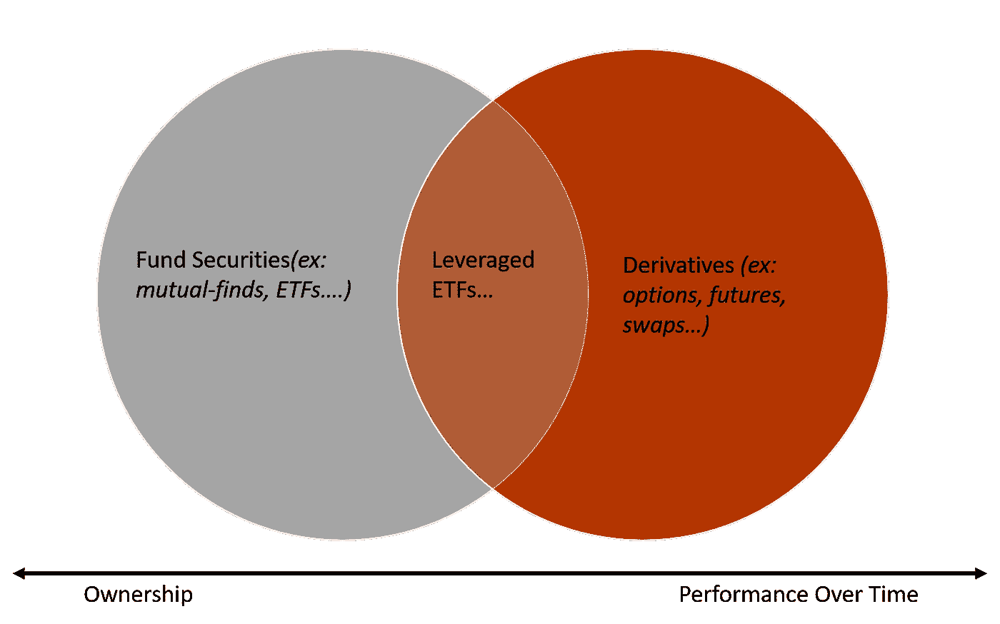
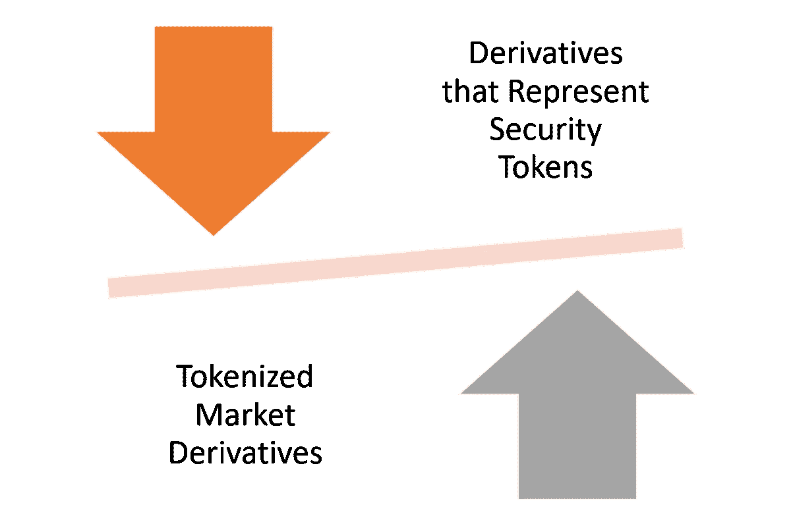

# 安全令牌 2.0 协议第三部分:资金和衍生令牌

> 原文：<https://medium.com/hackernoon/security-token-2-0-protocols-part-iii-fund-and-derivative-tokens-68f594cbb438>

这是一篇文章的第三部分，也是最后一部分，探讨了在下一波记号化平台中不同类型的记号。本系列的前两部分分别讨论了债务和混合/可转换令牌协议。今天，我想重点介绍两种类型的安全令牌，它们可能会成为对成熟投资者最具吸引力的令牌化产品之一:衍生品和基金令牌。

**加密金融原语**

当前一代的安全令牌协议主要集中于解决合规性挑战合并功能，例如 KYC/反洗钱。以这些协议为基础，第二波安全令牌平台应该更侧重于实现模仿真实世界证券化产品的金融模型。

**债务代币:**代表债务或现金产生工具的代币。

**权益代币:**代表标的资产权益头寸的代币。

**混合/可转换代币:**基于其行为在债务和权益之间转换的代币。

**衍生代币:**从基础代币衍生其值的代币。

在当前的生态系统中，我们倾向于将安全令牌视为原子单位，其价值来自基础资产。从这个意义上说，如果我们将三个商业房地产的股票进行代币化，我们应该会看到三种不同类型的代币。随着空间的发展，我们将看到新一代的安全令牌，它们从一组底层令牌中获得价值。在我们的示例中，我们可以有一个安全令牌，其性能基于我们三个底层不动产令牌的价值。使用来自证券市场的类比，这些类型的安全代币可以被分类为两个主要组:基金代币和衍生代币。

# 基金与衍生证券:时间与所有权

在一般意义上，金融衍生产品被认为是从基础资产中获取价值的任何产品。然而，如果我们再深挖一点，我们可以发现两组主要的衍生模型。期权或期货等结构可以在未来某个时候从基础资产的表现中获得其表现，而衍生品的所有者不一定拥有基础资产的头寸。这类产品就是我们俗称的衍生品。

纯衍生品的一种变体是共同基金或交易所交易基金(ETF)等产品，其中证券的价格基于基础资产集合的当前价格。这些结构被称为基金，投资基金证券的股东实际上拥有基础证券的头寸。这就是为什么大多数 ETF 不被视为衍生品，尽管它们的价值来自基础资产。有一些 ETF 模型，如杠杆 ETF，集合了衍生品，它们本身也被视为衍生品。下图说明了基金和衍生证券之间的区别。

基金和衍生证券的原理非常适用于安全令牌协议。事实上，我认为这些类型的衍生证券是使加密证券吸引大型机构投资者的关键因素之一。

# 衍生代币

将衍生产品的概念引入安全令牌领域，我们可以考虑与下一代安全令牌相关的不同模型:

**a)远期期货模型:**根据金融市场中的远期或期货衍生品模型，我们可以设想智能合同，该合同规定了在指定的未来时间以事先商定的价格买卖证券的标准。如果在集中交易所交易，这种证券令牌衍生工具可以遵循期货模型，如果在分散交易所交易，则遵循远期模型。

**b)期权模型:**期权为证券代币衍生品提供了另一个强大的灵感。在这种模式下，证券权标的期权的所有者有权利但没有义务在特定的日期以特定的价格购买或出售基础证券权标的。

**c)互换模型:**像金融市场中的互换模型一样，我们可以设想证券代币衍生产品，它们交换由两种不同的证券代币产生的股息或现金流，以作为针对未来市场条件的对冲或保险。

让我们以一个代表私人公司股票的安全令牌为例。以该代币为基础，我们可以构建一个衍生证券代币，其价值将基于一年后的代币价格。衍生令牌的购买者不一定需要拥有基础安全令牌。事实上，衍生证券可以用来对冲基础证券的表现。

# 基金代币

基金代币可以被视为具有某些套利机制的安全代币的集合，这些套利机制使基金代币的价格接近基础代币的净资产值。基金代币的发行者将不得不拥有基础证券代币的头寸，并且这些头寸将被转移给基金代币的投资者。有两种主要类型的模型可以应用于基金代币:

**a)ETF 模型:**我们可以设想类似 ETF 的证券代币，代表一组基础资产的价值，如房地产租赁、贷款或不同公司的私人股份。

**b)** **共同基金模式:**共同基金模式更适合那些希望发行自己的证券代币的企业，比如金融机构。就像 ETF 一样，共同基金代币将汇集一批证券代币，但与 ETF 不同，它们不会被积极交易，只会定期定价。

# 衍生令牌与令牌化衍生工具

衍生品和基金代币最吸引人的一点是，它们可以沿着两条根本不同的道路出现。

1) **证券代币基金或衍生工具:**最明显的情况是将证券代币组合成新的基金或衍生代币。这种模式为新兴证券提供了新的交易工具、风险管理和价格对冲工具。

2) **令牌化金融衍生品:**上一点的替代方案是创建代表现有市场衍生品(如期货、期权或 ETF)的安全令牌。这种模式可以提供一些优势，如部分投资/所有权，并向这些金融工具展示新的加密投资者群体。

# 基金和衍生令牌协议

实施基金或衍生证券代币远非易事，但它不需要你从头开始。证券化或 Polymath 等平台可以通过整合专注于衍生品模型的现有区块链协议，扩展到基金衍生品领域。具体来说，我认为有两种协议非常适合安全令牌:

## 使用 dYdX 的衍生令牌

[dYdX](https://dydx.exchange/) 是市场上最完整的衍生协议之一。其核心是，dYdY 引入了模拟金融市场类似行为的保证金交易协议的概念。在传统的保证金交易中，交易者借入一种资产，然后立即用它交易另一种资产。该资产必须在日后偿还给贷方，通常是连同利息一起。保证金交易包括卖空和杠杆多头。

dYdX 保证金交易协议使用一个主要的以太坊智能合约来促进 ERC20 代币的分散保证金交易。贷方可以通过签署包含贷款信息(如金额、涉及的令牌和利率)的消息来为保证金交易提供贷款。这些贷款可以在区块链以外的平台上传播和上市。

最近，dYdX 团队发布了一系列第二层合同，这些合同使用基本保证金交易协议来实现更复杂的金融结构，如价格 Oracle 或贷款机构。

## 使用{Set}协议的基金代币

[{Set}协议](https://setprotocol.com/)是一个基于以太坊的协议，用于抵押 ERC20 令牌。实际上，{Set}令牌是一个具有两个附加功能的 ERC20 令牌:issue 和 redempt，用于在{Set}令牌及其组成令牌之间进行转换。

虽然{Set}协议团队着眼于支持指数基金等高阶衍生品，但他们最近推出了[令牌集](https://www.tokensets.com/)来说明该协议的可能性。

市场上还有其他衍生协议，但 dYdX 和{Set}似乎非常适合在安全令牌领域发挥作用。不管我们采取何种方式来实现第一代基金衍生安全令牌，似乎很明显，这两种加密安全模型都被要求在下一代安全令牌平台中扮演相关角色。更重要的是，衍生基金证券代币可能是我们让证券代币吸引大型机构投资者的桥梁之一。