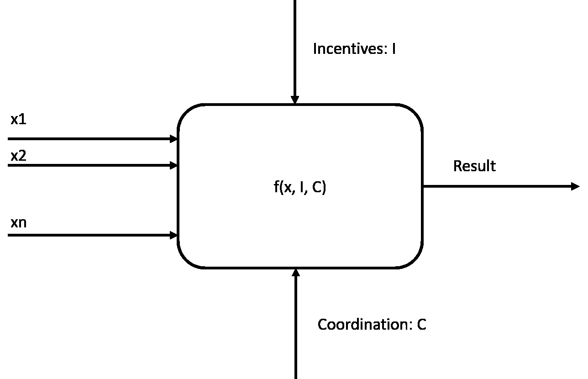
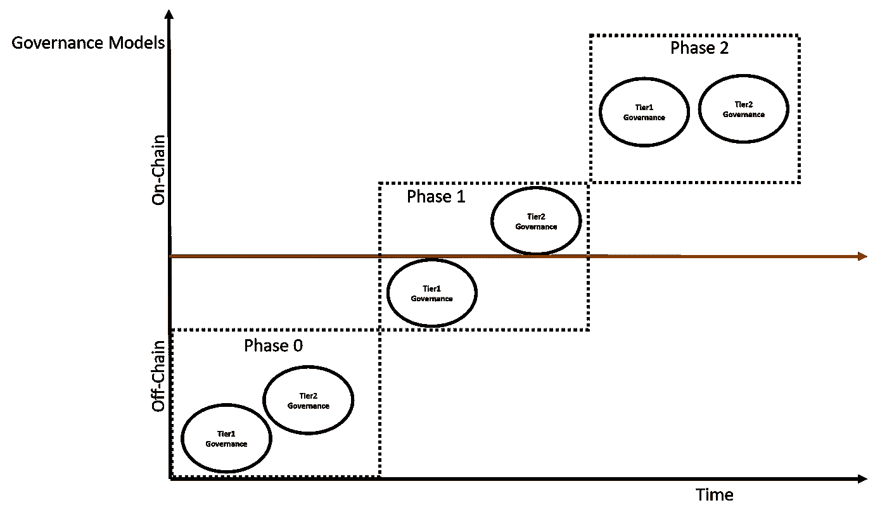
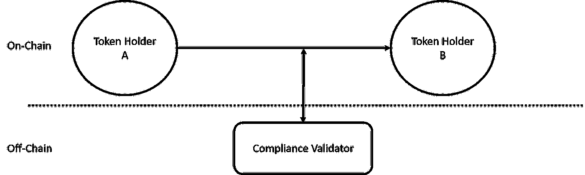
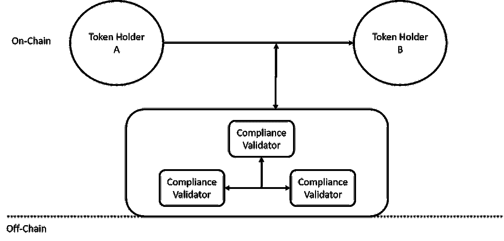
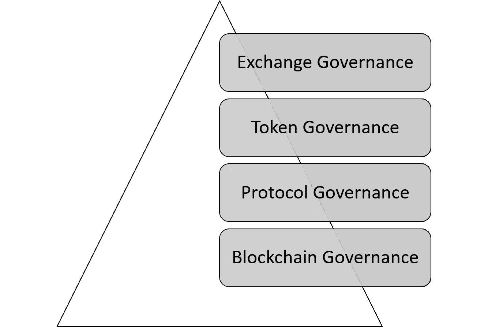

# 安全令牌 2.0:链外与链上治理的一些想法

> 原文：<https://medium.com/hackernoon/security-token-2-0-some-thoughts-off-chain-vs-on-chain-governance-2cba087389ab>

上周，在纽约举行的安全令牌学院发布会上，我与安全令牌领域的一些顶级思想领袖一起主持了一个小组讨论会。激烈辩论的主题之一是治理安全令牌架构的不同模型。大多数小组成员认为，安全令牌监管仅仅是使用当前的安全令牌转移监管机制的问题，而一些人认为，安全令牌监管将部分转移到链上。争论的核心围绕着下一代安全令牌平台的一个基本方面:链外治理与链上治理。

如今，除了基本的了解客户(KYC)和反洗钱(AML)检查点之外，与安全令牌相关的监管很少。与安全令牌相关的大多数更复杂的监管方面都是使用基于人的链外机制来解决的。为了实现真正的变革，我认为下一波安全令牌平台应该开始整合更多的链上治理模型。然而，通向安全令牌中的链上治理的途径远非微不足道，其价值主张也是可疑的。

# 定义安全令牌治理

在数学上，治理可以表示为函数 *f({x1，x2，x3…xn}，I，C) → D* ，其中输入分别代表特定令牌持有者的投票、投票的激励和协调机制。

如上图所示，任何区块链治理功能都可以用三种主要结构来表达:

**投票:**该元素代表相关令牌持有者对特定交易的意愿。

**激励机制:**每个治理职能都应考虑到基础网络的激励模式，因为它会影响特定令牌持有者的投票。

**协调机制:**在治理模型中，协调机制将投票中所有参与者的决策组合在一个协调的行动中。

这个数学模型与安全令牌有什么关系？好吧，如果我们看看当前一代的安全令牌平台，我们可以清楚地看到，我们缺少实现任何复杂治理功能的激励和协调模型。在这些基础机制以某种方式到位之前，讨论链上治理将仍然是一个理论练习。

安全令牌治理的另一个重要方面是，它位于传统区块链治理的不同级别。从这个意义上说，安全令牌治理与治理问题(如分叉或共识机制的变化)是正交的。从概念上讲，我们可以从两个不同的层面来考虑安全令牌治理:

**第 1 层治理:**负责与网络拓扑相关的治理决策。向网络中添加一个新的合规节点(例如:律师事务所、经纪交易商)或引入一种新的合规类型都是第 1 层治理的例子。

**第 2 层治理:**负责与安全令牌转移相关的投票决策。KYC/反洗钱验证、资本控制检查是第 2 层治理模式的例子。

两级模型有助于思考安全令牌中的治理决策。今天，确实没有与安全令牌相关的治理模型。在不久的将来，我们应该会看到第 1 层和第 2 层治理模型在链外实现，并在链上产生影响。在此基础上，我们可以发展出一种模型，在这种模型中，第二层决策在链上实施，而第一层决策在链外实施。在我看来，真正实现链上第一层治理的唯一方法是为安全令牌设置一个特定的区块链，这将会是一篇很长的帖子😉。无论如何，对于下一代安全令牌平台来说，链外治理和链上治理的主题可能是最重要的决策之一。

# 安全令牌中的链外治理

在安全令牌的上下文中，链外治理是指在没有可编程表示的情况下管理网络或安全令牌交换的过程。链外治理利用区块链之外的现有监管和合规机制，并将其结果纳入链内行动。考虑两方之间的安全令牌交换，其中一方需要遵守某些资本控制。此场景的链外治理模型将有一个经纪人-交易商代理，该代理将手动验证转移的要求，并发布将被链上协议考虑在内的投票。

## 链外治理挑战

当谈到安全令牌时，链外治理的主要挑战是它根本不是一个很好的治理模型。大多数决策是由单一实体发布的，而在链外协调投票动态简直就是一场噩梦。此外，链外治理模型难以扩展，并且会对安全令牌的发展造成限制。

# 安全令牌中的链上治理

链外治理模型的替代方法是将许多投票/治理决策转移到区块链上的可编程接口。虽然第 1 层治理模型很难在链上移动，但是第 2 层治理机制是链上治理的一个很好的候选。安全令牌传输中的大多数法规遵从性机制相对容易使用智能合约来建模。回到上一节中的场景，链上治理模型将使用来自区块链中一组验证器节点的投票来自动化资本需求验证。

可编程的链上治理可以在安全令牌架构中的不同级别上表达。如今，大多数合规性检查点都是在令牌级别进行的，但在许多情况下，这种模式的效果并不理想。安全令牌的链上治理应该在网络的不同级别实施治理机制。

我计划在以后的文章中深入探讨这个主题。

## 链上治理挑战

原则上，链上治理听起来很棒，但是它也面临挑战。首先，治理过程中的少量参与者使得许多模型容易受到博弈论攻击和操纵。此外，有一个天然的摩擦点来重建已经存在了几十年的链上动态的治理模型。

# 面向安全令牌的混合治理模型

安全令牌架构中的治理主题极其敏感和复杂。从我的角度来看，认为整个安全令牌生态系统将基于链外治理模型运行似乎有着难以置信的局限性。只考虑链上治理模型似乎有些激进，可能会引发破坏空间发展的战斗。在我看来，安全令牌治理将演变为链外和链内模型的混合组合。有一点很清楚，安全令牌应该有一个更好的治理基础。