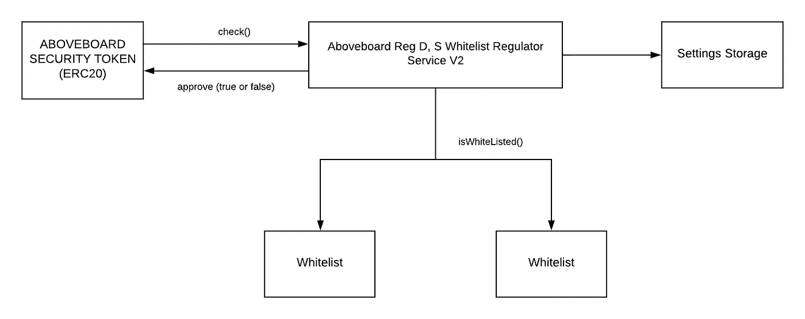

# 安全令牌码和 R-令牌的未来

> 原文：<https://medium.com/hackernoon/security-token-code-and-the-future-of-r-token-a7c70b50421a>

如果你想发行一个令牌化或“可编程”的证券，你需要一些代码来编程。处理证券的 ERC20 令牌格式越来越多，包括 Polymath 的 ST20，Harbor 的 R-token，Securitize.io 的 DS，我听说 Tokensoft 和 New Alchemy 都在准备自己的令牌格式。我怀疑他们增加了噪音，因为很难找到真正开源的代码，对想要设计令牌化证券的顾问和发行者有用。每个供应商都试图建立自己的围墙花园，而不是全球统一的安全市场。是时候开始整合形式，开放参与了。在本文中，我们将介绍安全令牌的基本要求。我们还将描述我们自己改进 R-token 的工作，将其开放，与 ST20 合并，并将其连接到 DS。

Harbor 在去年 1 月推出了一个简单且可升级的白名单令牌，名为“R-token”。我们采用了它，并把它建成了一台复杂的机器。然而，Harbor 似乎已经放弃了它。他们最后一次更新代码是在 4 月 5 日，在过去的几个月里，他们没有回复电话或电子邮件。

我们已经填写了 R-token，提出了一些简化和改进，并将这些功能添加到 ST20 中。下一步是将这项工作与其他格式合并，以建立一个更标准、更开放的基础。

# 安全令牌有独特的要求

安全令牌的基本要求不同于加密货币的要求。

## 合格投资者白名单

我在这里描述的所有令牌都可以加入白名单，这意味着它们保留了一个代表有资格接收证券的投资者的区块链地址列表。然后，他们防止令牌转移给不在列表上的任何人。

最基本的投资者资格职能是 KYC/反洗钱。在受监管的世界里，几乎每个投资者都需要在你向他们发送证券之前获得 KYC/反洗钱资格。“了解你的客户”意味着你知道投资者是谁，不是坏人、逃税者或受到政治制裁的人。“反洗钱”意味着你大概知道他们从哪里得到钱来购买证券，而且不是来自非法活动。完成这些检查后，您可以将人员列入白名单。

在美国和许多其他司法管辖区，投资者在向他们出售私人证券之前，需要具备额外的资格。私人证券是任何没有公开市场报告的证券，价格昂贵。政府允许你在没有昂贵的公开市场报告和披露的情况下向投资者销售，但他们通常只允许你向足够“老练”或“专业”的投资者销售，这些投资者能够自己进行分析并弥补自己的损失。在美国，他们可以满足认证资格(他们有 100 万美元投资)、合格资格(500 万美元)或 QIB 资格(1 亿美元)。

许多证券不需要“复杂的”投资者资格，但它们几乎都需要 KYC/反洗钱资格。美国政府一直是 KYC/反洗钱规则的积极推动者，通过控制基于美元的资金转移系统，他们能够在几乎每个司法管辖区推行 KYC/反洗钱规则。

如果你只通过检查买家资格的集中交易所销售，就有可能确保你的买家是合格的。这就是当前公共交换系统的工作方式。然而，这实际上并没有涵盖令牌化证券的用例，令牌化证券也是由发行者直接在门户网站上销售，进行点对点或“OTC”交易，并在交易所之间移动。要实现这种流动性，你需要一份白名单，而且当你将证券转出交易所时，你需要能够将合格的交易所客户加入白名单。因此，白名单令牌格式甚至对于拥有良好内部传输代理的交换也很重要。

## 转移规则

如果你出售的是私人证券，你将需要执行转让规则，以便根据不同司法管辖区的不同规则，只向合格投资者发送。你可能还想强制执行禁售期，比如在美国出售的私人证券的一年禁售期。股东签署的“认购协议”中可能还有其他规则。令牌化证券的好处之一是，我们不必传递纸张和签署认购协议。相反，我们把规则直接编入安全系统。然后我们可以交换。

转让规则几乎总是需要的，因为大多数安全令牌是私人证券，或者它们在世界上有投资者的某个地方是私人的。在马耳他或英国被视为公共证券的证券在美国通常需要作为私人证券处理。跟踪这些规则可以防止你接到不想打交道的监管机构的电话。

本文提到的令牌都是编程运行在以太坊上的。然而，我们可以对更快或更简单的其他链和分类帐使用相同的规则和白名单。例如，Stellar 不允许令牌携带自己的代码。但是，他们增加了一个功能，可以要求发行人使用一种集中式 oracle 签核每笔转让。我们可以使用相同的白名单和规则来做到这一点。

## 安全替换和其他治理

对于加密货币，如果你丢失了密钥，你就失去了资产。证券不是这样的。如果奶奶买了一份证券，去世时没有留下钥匙，你仍然欠她的遗产。作为发行者，您需要一种方法，通过获取旧的代币并将其转移到新的持有者，来从本质上替换股票证书。还有其他一些情况，你可能需要强制转让，比如 90%的投资者已经接受了要约收购，你有权强制另外 10%的投资者进入交易。

要做到这一点，您需要一个治理流程，例如我们已经编程到注册中心的多签名治理。你可能需要一个工作流程来发行更多的证券，这是公司在董事会批准后一直在做的事情，以及分配证券或付款。

## 实名注册

如果你正在出售股票，那么你需要保留一份股东名单。你需要能够追踪到他们，以验证法规遵从性，并且你需要能够联系他们，以便你可以向他们提供他们的股东权利。本质上，你需要能够回到合格投资者的一方，把他们放在白名单上，并为你的注册获得更多信息。我们的令牌实现包括[一个白名单系统和注册表](http://www.aboveboard.ai/shareholder-registry)来完成这项工作。

## 升级

在一只证券的多年有效期内，规则会发生变化。合格投资者的类别会发生变化。您可能希望提供新的功能来与新兴的交易所兼容。您可能需要修复您的实现。能够将更新的代码附加到现有令牌非常重要。

我们看到的许多令牌代码都不符合可升级性的要求。

# R-Token 升级

最初的 R-token 概念非常简单。R-Token 是以太坊区块链上的许可令牌，当且仅当它们被链上监管服务(脚本)批准时，才允许进行令牌传输。ServiceRegistry 是一种在规则随时间变化时升级监管器的机制。我们喜欢升级功能。

Original R-Token format with Service Registry

我们进行了大量修改，以使升级规则、设置和白名单变得更加容易:

Revised R-Token with reusable whitelists

*   服务注册是不必要的组件，需要额外的费用。指向电流调节器的指针可以在令牌本身中更新。
*   设置存储保存用于管理令牌转移的值，如转移锁定、允许新股东、首次发行结束日期或管理白名单。它也是可替换的。您可以独立于更新代码来更新这些设置。
*   我们填写了美国注册 D 和全球注册 S 发行的规则，以及各种其他私人市场规则。
*   我们添加了可重用的白名单，可以用于其他令牌格式。

# 其他令牌格式

您可以通过替换“传输管理器”将这些脚本添加到 ST20 令牌中。这将升级 Polymath 当前正在生成的 ST20 令牌，以包括升级的白名单和规则。与最初发布时非常粗糙的白名单相比，这是一个很大的改进。它还将添加注册表功能。

我认为，Polymath 在提供 ST20 格式方面做得非常好，它是一种标准，发行商和交易所可以以此为基础。这就是我们在这里所做的。然而，他们的大部分努力都在 Polymath“平台”上，这是一个门户和一组更复杂的代码，用于管理首次销售的过程，并鼓励你使用他们的 POLY token。接触这个平台很难，大多数人会跳过它。大多数顾问都有自己的销售渠道。聚代币很烦人。Polymath 不返回消息，也没有为代码贡献或插件贡献建立路径。我发现这是真的，即使我与他们有合作协议。我期待着在一个更加开放的插件过程中与他们合作。

Securitize.io 目前正在推出带有新 DS 格式、白名单和注册表的令牌。不幸的是，目前这是一个封闭的系统，要求你从证券化购买所有的代币编程，并通过他们的门户网站获得投资者资格。DS 架构与我们的实现非常相似。我向他们提供了我的代码，但他们决定推出自己的代码。我们可以通过为注册中心制作一个代码兼容的 API 来统一这些交换工作。

我已经给 Tokensoft 和 New Alchemy 发了消息，没有收到回复。

# 发展全球市场

[让我们知道](https://t.me/aboveboard)我们如何共享代码或接受贡献。请告诉我们如何将您的白名单和客户名单包括在内。我们都可以参与帮助发行者和交易所建立一个真正的全球证券市场。