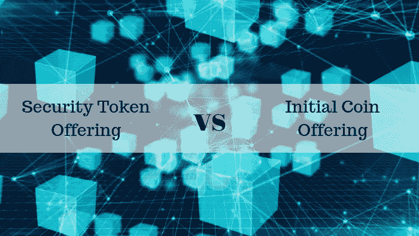

# 安全令牌产品(sto)是所有 ICO 问题的实际解决方案吗？

> 原文：<https://medium.com/hackernoon/security-token-offering-sto-is-it-the-real-solution-to-all-ico-problems-f32e87ac53a4>

投资流行趋势通常是许多投资者的选择，因为他们会睁大眼睛寻找各种机会。虽然这些选择中的一些可能被证明是有风险且利润较低的，但如果押注正确，其他选择也可能带来丰厚的回报。

如果你是那种经常在密码领域寻找趋势投资机会的人，你很可能会考虑投资 sto。如果不是这样，我希望你进一步阅读并理解这个密码世界中的新术语。走下一步纯粹是你的选择。

# STO 到底是什么？

STO(安全令牌提供)是最近吸引眼球的密码世界的新趋势。有些人甚至说它们是 ico 的更好替代品。也有人说，安全令牌将在未来几年占领市场。

> 在最简单的形式中，安全令牌是区块链和传统资产的交集。它们是在现实世界中拥有某些真实价值的令牌。

例如，考虑你想购买的公司股票。当你在网上购买股票时，你支付一定的金额，作为回报，你拥有股票，并可以在交易所自由交易。在购买股票时，将向您提供该交易的收据。

购买安全令牌与此类似，只是将份额替换为安全令牌。也就是说，一家公司的股票可以用代币的形式来表示，你可以从这家公司购买代币，而不是购买股票。每个令牌都有一个特定的值，类似于一个份额。

证券代币发行可被视为证券。证券可以是你投资的任何东西，目的是赚取回报。证券的例子有股票、房地产、债券等。通过提供 sto，公司确保这些代币代表股票。

sto 现在越来越受欢迎，很大程度上是因为它们正从政府那里获得关注和认可。此外，与传统的纸质合同相比，这些代币在获得所有权和进行交易方面还提供了更好的灵活性，同时在这一过程中无需任何中间人。

# 为什么是 STOs？

ICOs(首次发行硬币)在过去的一年里获得了足够多的关注。原因是可以在没有法规、指导方针或任何法律的情况下轻松筹集资金。这并不是说 ico 是一件坏事。事实上，他们恰恰相反。通过 ICOs，以太坊和 NEO 等许多令人惊叹的项目迅速走向成功。

然而，由于许多剥削者进入市场，ico 的价值迅速下降。与新项目相关的骗局出现得更快，因为许多人在准备诱人的白皮书方面做得很好，并在没有任何回报投资者保证的情况下筹集了数百万美元。尽管对庞氏骗局和诈骗采取了预防措施，许多人还是把钱投资到了从未启动的项目中。

在这种趋势下，ico 现在在世界某些地区被禁止，sto 正在赢得投资者的信任，因为全球监管机构也对它们越来越感兴趣。在 ICO 饱和的加密世界中，sto 被认为是更好的选择。

# sto 提供的好处

与传统系统相比，使用安全令牌有很多好处。四大优势如下:

Advantages of Security Token Offering

1.  **更好的流动性选择-** 在不久的将来，通过证券代币进行的交易将在获得许可的交易平台上进行。许多高端产品可以以证券代币的形式上市，供人们买卖。这些平台将拥有大量的买家和卖家，因为它们是获得许可的交易所。由于获得许可的交易平台可以为任何产品的交易提供更简单的流程，投资者将能够清算任何产品的证券代币，从而为任何资产提供更好的流动性。
2.  **降低首次公开募股的成本-** 在世界上所有的公司中，只有极小比例的公司是上市公司，因为上市首先需要大量的资金。因此，人们只能投资于极少数公司的股票。随着 sto 以正确的方式投入使用，公司上市的成本可以在很大程度上降低，因为中间人完全从过程中消除，从而使其更快，更实惠。当企业决定在未来用股票替代首次公开募股时，普通人可以很容易地投资不同上市公司的股票。
3.  **分割所有权-** 高价资产或高价值公司的股份不是普通人可以购买的。这主要是因为它们的价格要高得多。在这种情况下，安全令牌产品或 sto 可以带来巨大的好处，因为它们可以简单地通过针对任何昂贵的产品提供令牌来解决这些问题。任何此类产品的成本都可以以代币的形式进行划分，像你我这样的普通人可以为该产品购买一些代币，而不必购买整个产品。

# 前方的未来

虽然 ico 是一个很好的选择，可以帮助惊人的商业创意快速融资；他们仍然需要比一份白皮书更多的东西来说服今天的投资者。在这种情况下，最好的解决方案是实施 sto，因为与 ico 不同，它们具有更好的防欺诈性、受监管性，并且可以期待更好的未来。此外，从投资者的角度来看，STO 可以提供更高的安全性，消除骗局，同时将他们从庞氏骗局中拯救出来，并允许他们将资金投资于安全令牌。