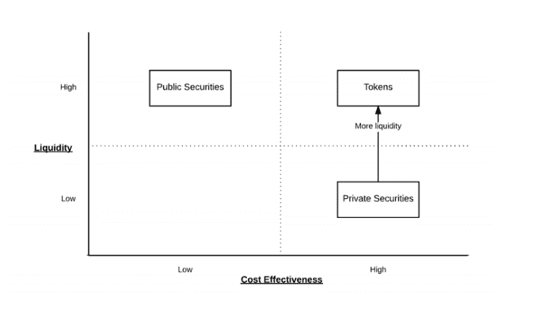
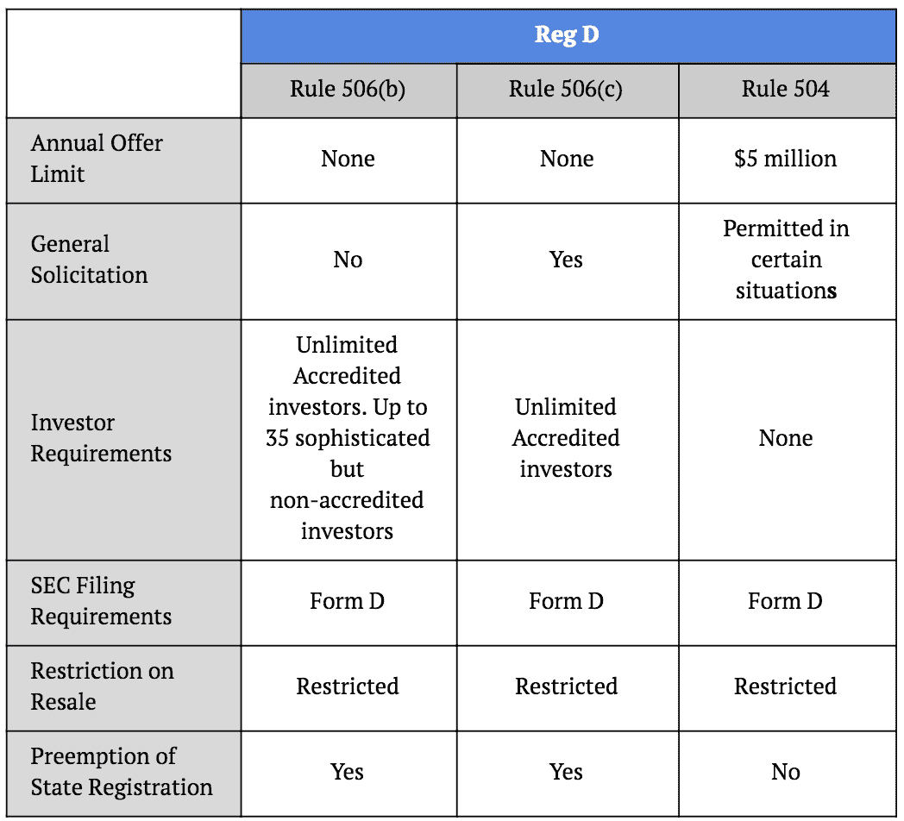
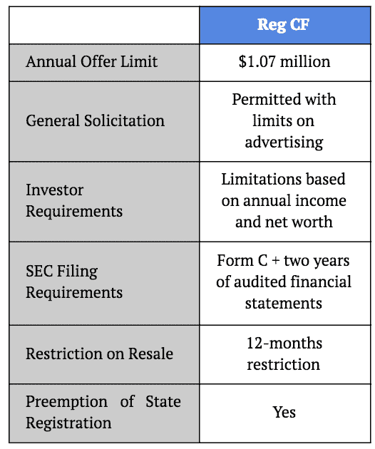

# 安全令牌产品(STOs 您需要了解的内容

> 原文：<https://medium.com/hackernoon/security-token-offerings-stos-what-you-need-to-know-8628574d11e2>

安全令牌在加密中找到了自己的位置，世界各地的顾问已经开始提供安全令牌提供咨询服务。STO 可以被认为是新的 ICO 或 IPO。

与 ICO 中提供的代币相反，ICO 中提供的代币不赋予任何权利或义务，而是提供对特定网络、平台或服务的访问， [STO](http://hackernoon.com/tagged/sto) 中提供的代币是由公司的资产、利润或收入等有形资产支持的实际金融证券，并提供投票或收入分配等合法权利。

安全令牌执行与传统安全相同的功能，除了它通过[区块链](https://hackernoon.com/tagged/blockchain)交易确认所有权，并使部分所有权成为可能。证券代币受制于管理证券的联邦法律，在某种程度上保护了投资者。安全令牌是可编程的。由于这些证券在区块链上被令牌化，“智能合约”可以让它们以某种方式运作，而无需借助第三方。例如，在区块链上“令牌化”的贷款可以自动支付，而不需要像银行这样的传统中间人。

> “区块链技术可以通过为投资者提供通过流动性、可交易的数字令牌投资基金的机会，帮助民主化传统上只有精英机构投资者才能获得的资产类别。”

# 哪些法规会影响安全令牌产品

CFTC(商品期货交易委员会是美国政府的独立机构)将比特币视为商品，IRS(美国国税局)将加密货币定义为财产，SEC(证券交易委员会)表示许多 ico 都是证券。

提供现货市场或货币的商品交易所不需要作为受监管实体获得许可，而提供证券的平台需要注册为国家交易所或替代交易系统(ATS)或申请成为经纪交易商。

涉及金融资产(例如股票、债券、银行存款等)的公司都是金融资产的例子，需要遵守消费者保护法、银行保密法和美国爱国者法。

> “巨大的机会在于将私人和公共股票数字化。”

# 安全令牌优势

根据条例 A+发行证券。监管 D、监管 S 和监管众筹也往往比进行首次公开募股更便宜、更快捷。

归类为证券的代币倾向于为投资者提供另一种产生股息、利润和投票权的选择，就像拥有上市公司的股票一样。

## 成本效率

与其他投资金融模式不同，安全代币的买卖没有管理成本。降低成本本质上让人们能够产生可观的投资回报。

## 快的

由于“了解你的客户”和反洗钱检查的自动化，向合格投资者购买和出售安全令牌的过程也往往会稍微快一点。流动性。

## 全球贸易能力

证券代币倾向于享有高水平的流动性，因为它们有资格在全球范围内交易，允许世界各地的任何人访问它们。作为金融工具的接受度以及采用率的提高也有助于提高流动性水平。

## 全天候交易

随时随地交易安全令牌的能力也使得它们比其他受时间限制的传统模型更受欢迎。

# 安全令牌的缺点

过多的法规，以及对谁可以投资安全令牌的限制，是可能抑制安全令牌大规模采用的因素之一。影响可以参与证券代币发行的人的法规也在很大程度上影响了这种证券的流动性。

> *“私募证券的二级交易往往需要各种中间商(如经纪人、交易所)。此外，跟踪交易活动的过程是手动的，成本很高，而且发行者防范潜在监管风险的负担很重。这些低效率往往会导致发行者施加交易限制，使得私人证券缺乏流动性。由于缺乏流动性，私人证券的价值被贴现(即“非流动性贴现”)，阻止发行人获得基础资产的全部价值。”*

# 如何提供安全令牌

如果你想发行证券，你需要在证券交易委员会注册。对于已建立的企业来说，这是一个复杂而昂贵的过程。

为了避免这个耗时的过程，项目可以利用 2012 年的就业法案。《就业法案》并不是专门为 s to 制定的，但它似乎符合安全令牌发行者的需求。美国的发行人可以申请三种不同的豁免:注册 S、注册 D、注册 A+和注册 CF。

## 安全令牌提供注册

Reg S 是“安全港”豁免，仅适用于美国以外的公司，因此不受 1993 年法案第 5 节的注册要求的限制。创建者仍然需要遵守他们应该被处决的国家的安全条例。

美国证券交易委员会(SEC)采用了法规 S，以阐明美国及其领地以外的证券法注册要求(美国注册要求)的应用。3 法规 S 由五条规则组成:

1.  规则 901，规定了美国注册要求仅适用于在美国及其领土内发生的证券“要约和销售”的一般声明；
2.  第 902 条规定了条例 S 的定义；
3.  规则 903，其为涉及符合特定指导方针的证券发行的交易提供安全港(主要要约安全港)；

以虚拟货币或代币表示的加密货币是“可以进行数字交易的价值的数字表示，并作为交换媒介、记账单位或价值储存手段。”SEC 投资者公告:首次硬币发行(2017 年 7 月 25 日)。

如果要约和销售在美国进行，合规也可能

4.规则 904，其为符合指定指导方针的离岸转售提供安全港(二级市场安全港)；和

5.第 905 条规则规定，根据《证券法》第 144 条规则的定义，按照主要要约安全港的要求出售的美国国内发行人的股权证券被视为“受限证券”，并受持有期(和相关要求)的限制，然后才能在美国无限制地转售。

## 安全令牌提供注册 D

发行人必须遵循以下三条规则:规则 506 (b)、规则 506 和规则 504。规则 506(b)和规则 506(c)对筹资没有限制，但只允许美国的合格投资者。规则 504 对投资者身份没有限制。第 503 条规定，发行人的资本筹集上限为 500 万美元，并要求向州监管机构注册证券。《条例 D》还允许一般性征集，允许公司为其筹款和项目做广告。

## 安全令牌产品注册 A

Reg A+似乎适用于寻求融资 5000 万美元以下并寻求非授权投资者的企业。考虑到提供两年财务报表的限制，我们可以假设 Reg A+更适合已成立的初创公司。与 Reg D 相反，根据 Reg A+发行的证券没有转售限制，这将导致更具流动性的市场。

## 安全令牌产品注册 CF

通过 Reg CF 筹集资金时，初创企业最多可筹集 107 万美元。这意味着快速资助小项目以促进创新。我们认为，如果做得好，很多项目可以用 100 万美元启动。不利的一面是二级市场 12 个月的锁定。

来源:商业电讯报，TechCrunch，ICOAlert，Harbor，IRS，SEC

# 给它时间！

对于一个需要改进的产品，它需要实验和实用性。在世界开始使用技术之前，CoinMarketCap 的价格不会变动。当可用性增加时，大规模采用也会增加。当大规模采用增加，我们可以期待大量的机会。这里的主要问题是当其他人都在担心其他事情的时候开始工作。

我希望你喜欢这篇文章！请在下面留下任何反馈。让我们祝愿 2019 年更加美好。:)

# 关于我:

**伊利亚·扎基是美国一家名为** [**STO 咨询**](https://moonwhale.io/sto-ico/) **的公司的业务开发主管兼营销官，该公司名为**[**moonwale Ventures**](https://moonwhale.io/)**。**

 [## 安全令牌产品—您应该聘请 STO 顾问吗？

### 在确保合规性方面，安全令牌产品可能比 ICO 更复杂。那你应该雇用一个 STO 人…

hackernoon.com](https://hackernoon.com/security-token-offering-should-you-engage-an-sto-advisory-25daa1fcda9b) 

在我们的各种社交媒体平台上关注我们—

[推特](https://twitter.com/MoonwhaleBV) | [LinkedIn](https://www.linkedin.com/company/moonwhalebv) | [脸书](https://www.facebook.com/MoonwhaleBV/) | [电报](https://t.me/moonwhaler)

