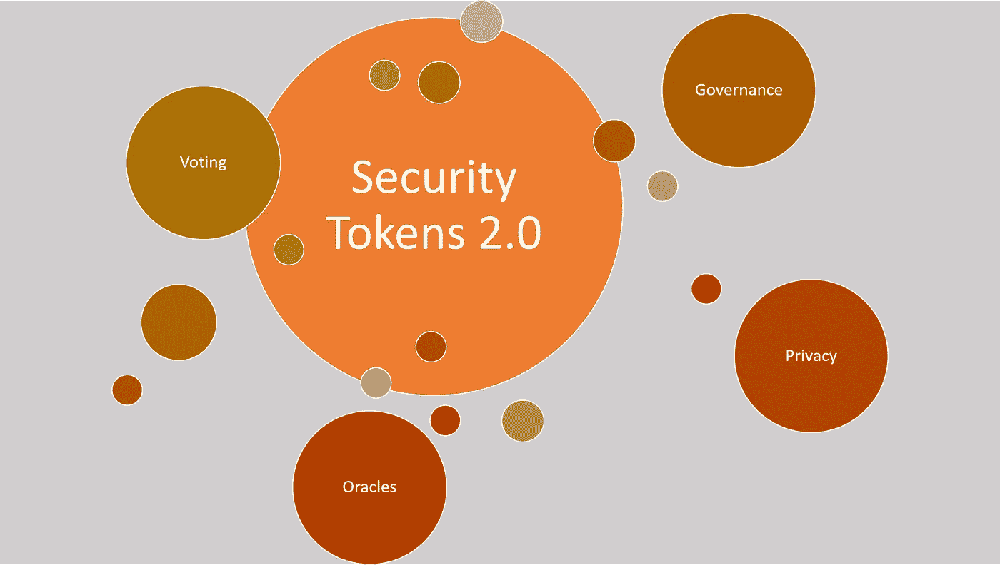
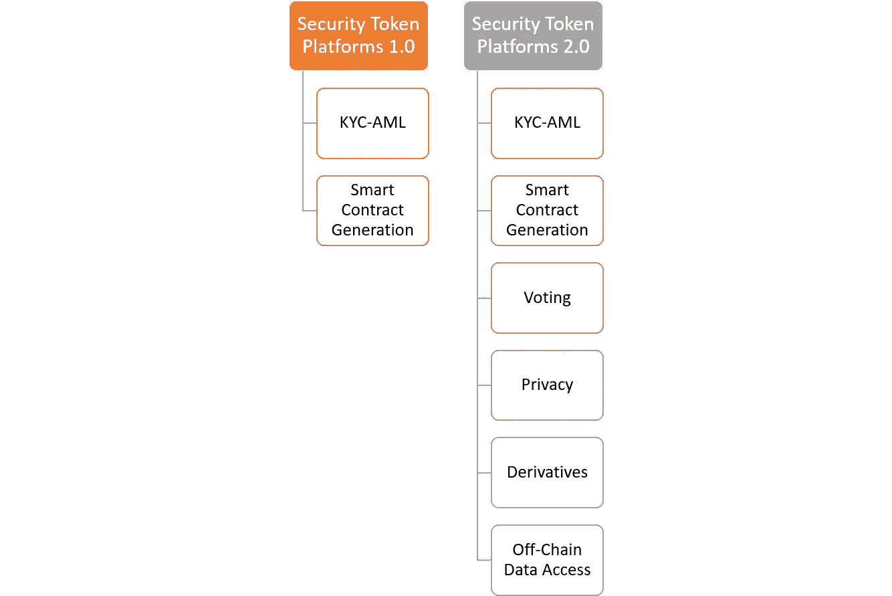
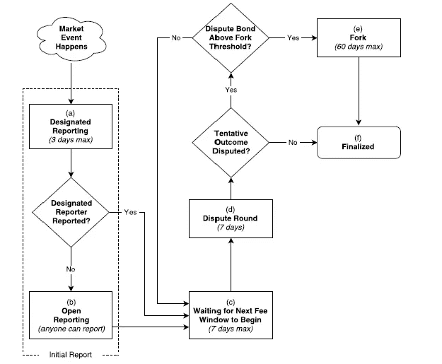
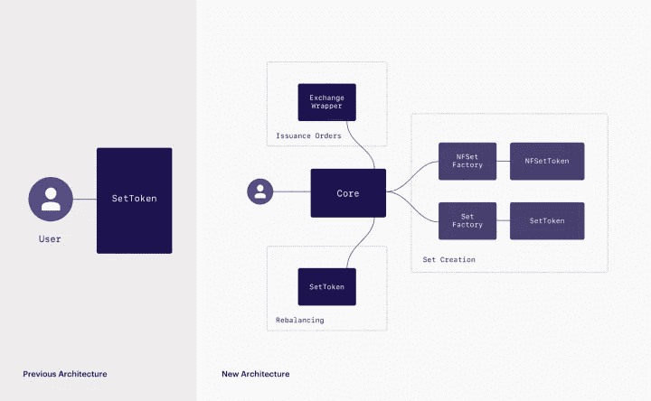

# 安全令牌 2.0:能够推动下一波令牌化证券的四个协议

> 原文：<https://medium.com/hackernoon/security-tokens-2-0-four-protocols-that-can-power-the-next-wave-of-tokenized-securities-92e9eda8887f>

安全令牌平台的当前阶段主要关注于实现资产的令牌化。更具体地说，安全令牌解决方案的第一次迭代集中在两个主要领域:生成与一组底层文档相关联的智能合同，并以了解客户(KYC)和反洗钱(AML)法规的形式强制执行合规性。查看这些协议的一个简单方法是创建一个股份的智能合同表示，无论该股份表示一个房地产租赁单位还是一家公司的普通股，最终过程都是相对一致的。

即使在其当前的新生状态中，安全令牌平台已经运行到需要新的能力/协议的行业场景中，以便实现可行的加密安全解决方案。投票、治理、隐私和许多其他领域将成为下一代安全令牌解决方案的基础构件。今天，这些功能中的许多都是通过离线流程实现的，但是，在不久的将来，它们应该会有一个区块链表示。我一直在积极探索这些领域，我相信，将安全令牌带来的金融创新与过去几年出现的二级区块链协议的复杂性相结合是一个很好的机会。客观地看，向第二代安全令牌平台的过渡如下所示:

# 令牌化 2.0

如果我们都同意安全令牌平台的下一次迭代需要在这些领域进行创新，那么下一个合乎逻辑的步骤就是找出如何创新？好消息是，最近区块链第二层协议的创新浪潮中有许多值得借鉴的想法。下面的列表包含了我最喜欢的下一波安全令牌平台的一些协议想法。对于每个特性，我都描述了它在安全令牌环境中的重要性，以及一个协议，它可能会启发在下一波安全令牌平台中启用该功能。

# 投票

投票动态在安全令牌场景中无处不在。无论我们谈论的是令牌持有者批准与私人公司相关的决议，还是审计师试图就资产价格达成一致，投票协议都应该是下一代安全令牌平台的关键元素。

## **令牌化 2.0 投票模型:DFINITY**

DFINITY 的区块链神经系统(BNS)提供了一个最有趣的投票模型，将智能合约和人类结合到一个一致的协议中。在 BNS 模式中，提交建议书需要付费。然后，BNS 使用由人类控制的“神经元”进行的投票对提案做出决定，这些神经元会自动跟随彼此，就像在液体民主系统中一样。随着神经元对刺激和反馈做出反应，BNS 会适应并学习做出更好的决定。由于时间的原因，神经元遵循级联关系以不确定的方式做出决定。每个神经元都由网络边缘的所有者使用特殊的客户端软件来操作。BNS 的链常驻部分可以访问 EVM 的特权操作码，用于执行其通过的提案。

# 隐私

目前，所有安全令牌交易都可以在令牌的基础区块链中公开获得。鉴于大多数安全令牌使用以太坊，我们可以有效地挖掘以太坊区块链来访问与安全令牌交易相关的所有信息。虽然透明性很好，但在很多安全令牌场景中，参与者需要实施不同级别的隐私以保持合规性。强大的隐私保护机制应该是未来安全令牌平台的另一个重要组成部分。

## **令牌化 2.0 隐私模型:英格玛秘密契约**

从市场上的隐私协议来看，Enigma 似乎是最适合安全令牌空间的协议之一。Enigma 支持创建保护隐私的智能合同，称为秘密合同。秘密合同背后的魔力是通过利用一种被称为安全多方计算(sMPC 或 MPC)的新技术实现的。在这个计算模型中，数据查询是以分布式方式计算的，没有可信的第三方。数据在不同的节点之间分割，它们一起计算功能，而不会将信息泄露给其他节点。具体来说，没有哪一方能够访问全部数据；相反，每个政党都有一个随机的片段。

# 离线数据访问

安全令牌的整个生命周期都基于对外部文档的处理。从智能合约的创建到可能影响令牌估值的市场数据集的处理，链外数据访问是支持主流采用安全令牌协议的关键。

## 令牌化 2.0 Oracle 模型:占卜

Augur 是市场上采用得最好的 Oracle 协议之一，其原理可以应用于安全令牌模型。奥格的分散式甲骨文负责决定链外市场事件的结果。从技术上来说，奥格的预言由追逐利润的记者组成，他们只是报道事件的真实结果。任何拥有 REP 的人都可以参与结果的报告和争论。报道与共识一致的记者给予经济奖励，报道与共识不一致的记者给予经济处罚。

# 派生物

如果你读了这篇博客，你就会知道我对证券衍生品这个主题有多么热情。说真的，谁想买卖 1000 个与 1000 个不同商业房地产相关的代币呢？房地产投资信托基金模式不是更有意义吗？我坚信，衍生品是弥合证券代币和大型机构投资者之间差距的缺失环节之一。

## 令牌化 2.0 衍生模型:{Set}协议

{Set}协议是市场上最完整的衍生协议之一，并且作为安全令牌的一部分使用起来非常简单。{Set}协议是一个基于以太坊的协议，用于抵押 ERC20 令牌。实际上，{Set}令牌是一个具有两个附加功能的 ERC20 令牌:issue 和 redempt，用于在{Set}令牌及其组成令牌之间进行转换。{Set}协议的体系结构如下图所示:

安全令牌空间发展的疯狂步伐可能意味着许多令牌化 2.0 的想法需要在不久的将来实现。像[security ize](https://www.securitize.io/)这样的平台已经通过提供一个非常开放和灵活的架构来实现这一愿景，该架构支持添加新的第 2 层协议。利用现有的区块链协议来实现投票、治理、衍生品或隐私等功能，这可能会成为安全令牌主流采用的催化剂。