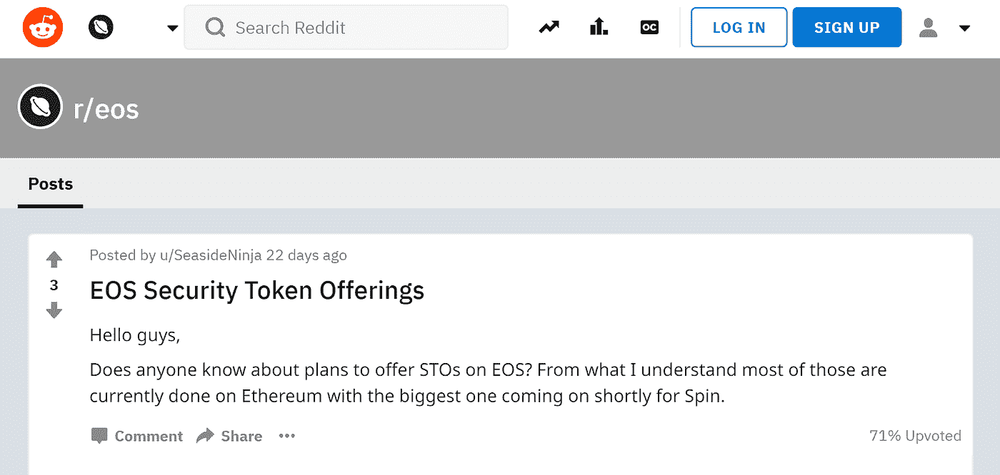

# 安全令牌——以太坊和恒星的胜利？

> 原文：<https://medium.com/hackernoon/security-tokens-a-win-for-ethereum-and-stellar-b5a9f4f75b11>

*加州三藩市
2018 年 8 月 6 日*

我最近偶然看到上面的 Reddit 帖子，询问 EOS 安全令牌产品。

当[科学区块链](http://science-inc.com) (SCI)和 [SPIN (PIN)](https://www.spin.pm/) 等知名公司决定进行 ERC-20 安全令牌发行时，我们不禁要问一个问题——为什么其他生态系统忽视了在其公共区块链向 s to 营销安全令牌发行？现在也看好安全令牌领域的其他公开区块链包括 Stellar，该公司上周与 Sharespost GLASS 合作——更多信息请点击[这里](https://www.chipin.com/sharespost-partners-with-lightyear-io-to-implement-stellar-decentralized-exchange/)。

我的假设是，更保守的人群，安全代币发行的市场将可能更喜欢最受欢迎的 ERC-20 标准，当第一次“涉足”并决定他们的第一对投资。第一次购买安全令牌的人可能没有风险偏好去测试声称更快更便宜但缺乏 ERC-20 的跟踪记录和现有社区的新区块链。毕竟，没有人会因为选择 IBM 而被解雇。

你有什么想法？你听说过任何崭露头角的 STO 计划通过 TRC-20 (TRON)或 QRC-20 (QTUM)或 XLM 标准筹集资金吗？他们为什么选择和这些区块链人在一起？哪些公共区块链有潜力成为安全令牌产品的事实标准？请在下面的评论中告诉我。

___

免责声明:这些观点仅代表我个人的观点，并不代表 Sharespost 或我可能建议或投资的任何公司的观点。

如果您想联系，请在 [Twitter](https://twitter.com/John1wu) 、 [Medium](/@John1wu) 和 [LinkedIn](https://www.linkedin.com/in/johnwu87/) 上关注我。

感谢好心的读者花时间阅读我的博客！如果我们还没见过面，很荣幸认识你。我叫吴炯，目前是 Sharespost 数字资产集团的首席执行官。我的主要目标是在专业的“机构级”资产管理和加密货币/区块链投资之间架起一座桥梁。

作为一名科技投资者和企业家，我一直努力在颠覆性趋势被充分发现和理解之前识别它们。在过去的三年里，我专注于数字资产和区块链技术。我投资了加密货币和代币，以及使用区块链和分布式账本建立未来金融系统的初创公司的风险投资股权。我在老虎管理公司开始了我的投资生涯。后来，在 Kingdon Capital，我投资了科技、媒体、电信、金融科技和服务等领域的公司。2010 年，我在黑石的战略投资下成立了 Sureview Capital，并在 AUM 融资约 4 亿美元。如果你想联系，请在 LinkedIn [这里](https://www.linkedin.com/in/johnwu87/)给我留言。