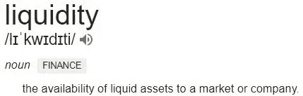

# 证券代币与公司法的漏洞

> 原文：<https://medium.com/hackernoon/security-tokens-and-the-loophole-in-corporate-law-d34b951ee48f>

## 在荷兰，99%提供安全令牌的公司都将探索这种法律结构——因此，这很重要。

Jordan Belfort throwing out money made from “penny stocks” in the movie ‘Wolf of Wall Street’

在全球范围内，我们目前正在探索即将到来的安全[令牌](https://hackernoon.com/tagged/token)行业的巨大影响。[证券](https://hackernoon.com/tagged/security)代币预计会扰乱金融和获得资本的渠道，因为公司和初创企业将被授权[向大众融资](https://www.forbes.com/sites/howardmarks/2018/10/07/why-entrepreneurs-will-turn-to-the-crowd-for-funding/#6fbb2b144331)。

在与荷兰的其他公司一起建立生态系统时，我偶然发现了荷兰法律中的一个特殊例外。许多发行者可能会在不久的将来利用这一例外，有些人认为这是非常好的，而另一些人则认为是非常不好的。

在这篇文章中，我将从两个角度进行阐述，但是在我们深入之前，你需要一点公司和法律的背景。

## 创建可自由交换的安全令牌

与“普通证券”相比，证券代币提供的两个最重要的增值是所谓的**流动性**和**市场深度**。

Definition by [Investopedia](http://Investopedia.com)

> *自然，作为发行者，你会希望利用安全代币的这些方面，因为它为你的投资者提供了很多价值，从而使你更容易筹集资金。*

假设你拥有一家在荷兰注册成立的有限责任公司(LLC)，你想出售一些股权以扩大你的 LLC(在荷兰称为 B.V .)。你可以向公众发行 B.V .的股份，但这些股份只能通过 [**公证书**](https://www.tinekegrootnotaris.nl/bv-en-stichting/aandelenoverdracht-bv/voorwaarden-aandelenoverdracht) 自由转让。这意味着直接将一家 B.V .的股份进行代币化**并不能**提供流动性和市场深度，而这正是证券代币如此有价值的原因。你可以提供和出售你的代币，但是在你提供代币后，这些代币不能在交易所自由交易。

正如公司法中经常出现的那样，你可以利用其他法律结构来授予你实现目标的权利:****发行一种超级流动证券代币。****

**“sticht ing administra tive Kan toor”[**【STAK】**](https://startflex.com/bv-oprichten/stichting-administratiekantoor-stak-en-besloten-vennootschap-bv)是一种法律形式(基金会)，它首先对企业家没有吸引力，因为它附带了许多法律要求。STAK 是一个合法的结构，T4 分割了股份的经济和治理权。因此，如果你将 B.V .的所有股份转让给 STAK，STAK 可以创建两种类型的证书:一种具有治理权，另一种具有经济权——见下图:**

****

**使用 STAK 将您的股份转换为两个不同的证书是有价值的，原因有三:**

*   **代表经济所有权的证书无需公证书即可自由交易。**
*   **经济所有权证书也可以包括获利的权利。**
*   **这些证书有效地将经济权利与治理权利分开，允许发行者保持对公司方向的控制，同时与大众分享经济权利。**

**下一步是令牌化经济所有权证书:**

****

**你把你的 B.V .的股份转让给 STAK，把你的股份转换成证书，然后你把它们令牌化。这将为你的投资者提供一个可自由交易的代币，代表你公司的真实价值。**

**到目前为止，一切顺利吧？这个过程没什么特别的。**

**在你开始向公众提供这些代币之前，你必须确定代币由**“合法所有者”**所有。这就是 KYC 和反洗钱程序存在的原因。**

## **安全令牌以及 KYC 和反洗钱合规**

**了解你的客户(KYC)和反洗钱程序是为了防止不良行为者，如罪犯和恐怖分子，使其非法获得的诉讼看起来合法或资助其恶意行为。**

****因此，证券发行人必须始终了解证券的所有者以及他们的资金来源—** 这适用于全球几乎所有司法管辖区。**

**类似地，**安全令牌发放者**必须有一份“符合 KYC 和 AML”的人员和实体的白名单，允许他们拥有自己的安全令牌。**

**这就是它的来源…**

****

**Photo by @usinglight**

> **由 STAK 颁发的证书的所有者不必被识别…**

**换句话说，KYC 和反洗钱程序不适用于购买、拥有或交易代表我们之前讨论过的经济所有权证书的证券代币的人。**

**从法律上讲，当股份从 B.V .转移到 STAK 时，KYC 和反洗钱程序**已经开始**:在这个过程中，B.V .必须知道 STAK 的所有者是谁，以及他们的资金来自哪里。**

> **当购买资产时，如私人有限公司的股份，你必须在荷兰商会注册。相反，你可以匿名从一个 STAK 购买证书，无需在荷兰商会注册。**

**STAK 的所有者可以决定**对于他们的证书的所有者来说，什么才是足够的 KYC 和 AML** 程序。这可能类似于“常规的”KYC 和反洗钱程序，但所有者也可以决定只需一个**姓名和电子邮件地址就足够了**，从而使发行者能够尽可能方便地获取安全令牌。有人可能会说这是好事，因为它促进了安全令牌行业的采用。然而，人们也可以说这导致了**黑幕**和**骗局**，就像我们在 ICOs 早期看到的那样。**

## **一个漏洞——两种观点**

**为了发表这篇文章，我特别受到了荷兰埃因霍温安全令牌活动中的一个简短讨论的启发。两个都参与提供 STO 会议前后服务的人分享了他们对这个问题的不同看法。**

****简而言之:****

**Byelex 的首席执行官/创始人 Herman Vissia 赞成 STAK 所有者能够决定他们自己的 KYC 和反洗钱规则。他认为，发行者不应该受到法律的困扰，这些法律会不必要地强化获取证券令牌的过程。他认为首先采用对于安全令牌行业是至关重要的。最后，他认为，许多 KYC 和反洗钱程序都是基于媒体及其报道恐怖分子和罪犯新闻的方式造成的大量偏执。他估计恶意参与者购买安全令牌的几率(T21)可以忽略不计。Herman 说，这适用于低于€15.000 的投资**。如果发行人接受的金额超过这个数目，他应该执行彻底的 KYC 和反洗钱程序。****

**KRG 首席执行官兼联合创始人、 [tokenise.eu](http://tokenise.eu/) 项目负责人莫汉·饶(Mohan Rao)认为，参与 sto 的公司应该专注于让**成为最好的**，而不是让**成为第一个**。他认为现在急于收养，会在将来产生不好的结果。即使恶意行为者投资安全令牌的机会微乎其微，我们也不应该允许。我们目前正处于获得监管机构对这一新行业的认可的边缘。如果我们现在匆忙行事，利用法律中粗略的漏洞，我们就有可能把所有未来的发行人都搞砸了。我们不想重演我们在 ICO 时代看到的诈骗和垃圾项目的传奇。**

## **结论**

**就你而言，我同意后一种观点，即我们不应该在忽视坚实的法律基础的情况下急于通过。**

**我确实相信，对于我们这些“安全令牌狂热者”来说，还有很多问题需要解决。我想有更多的国家司法管辖区为这个新行业提供了独特的条件。**

**事实是:**

> **这些漏洞中有许多从来都不突出，因为从来没有一种方法可以像现在这样，通过安全代币和区块链技术让资产变得具有流动性。**

**我很想知道这种情况和世界范围内的许多其他情况将如何发展，我很乐意一起讨论和探索可能的情况。随时联系我在 [Linkedin](https://www.linkedin.com/in/adriaan-jacob-brouwer-vmc-9a369984/) 或者电报:@adriaan_vmc。**