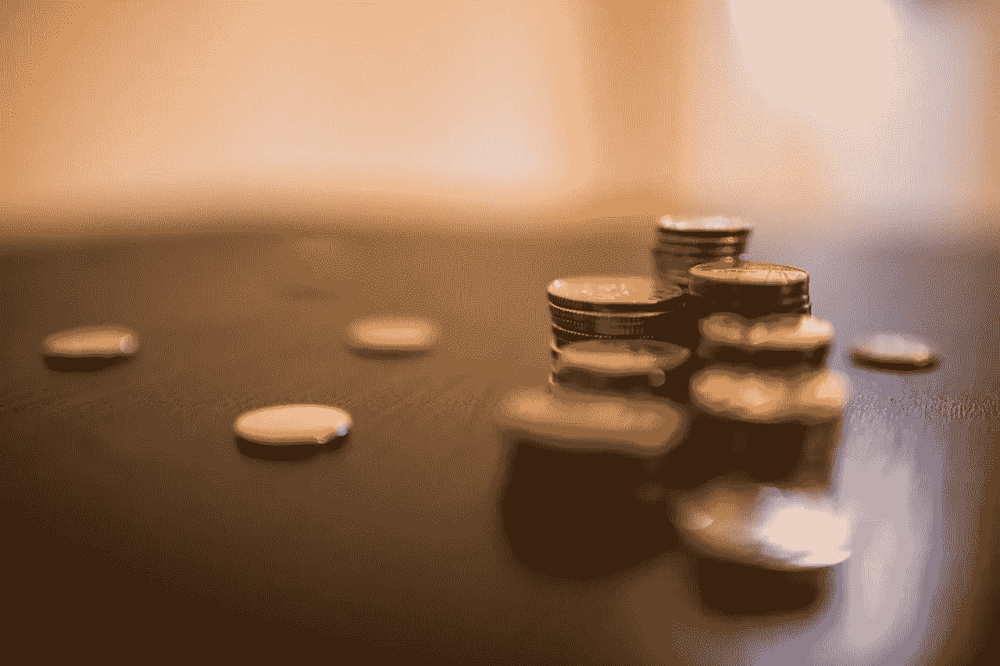

# 安全令牌—我有什么权利？

> 原文：<https://medium.com/hackernoon/security-tokens-what-are-my-rights-b93216f61a80>

*加州三藩市
2018 年 8 月 20 日*

作为一家公司的股东，一个关键的原则是，股票给你投票权。访问公司中的令牌也赋予了人们权利，这是“去中心化治理”结构的一部分。与股权不同，这些权利与公司是否会接受收购要约或公司是否会选择推翻首席执行官等问题无关。公用事业令牌持有者传统上被赋予对更具战术性的决策进行投票的权利，例如哪家公司将通过社区投票将其令牌在交易所上市，如币安。

我职业生涯的大部分时间都在对冲基金中度过，经常看到激进分子收购。基金收购公司的少数或多数股权，有时会将公司私有化，以便从内部改善运营和财务状况。

也就是说，一旦一家公司发行了安全令牌产品，是什么阻止了外部方彻底收购任何给定公司的所有安全令牌？如果发生这种情况，这将给获得这些安全令牌的公司或个人带来什么权利？

另外，那些希望发行证券代币的初创公司，会因为害怕敌对的激进分子收购他们所有的代币而不愿意发行低硬上限的证券吗？

您对应该与安全令牌相关联的权限有什么看法？如果一家公司发行可以被外部机构在二级市场上自动购买的安全令牌，你认为会发生什么？。请在下面的评论中告诉我你的想法。

___

免责声明:这些观点仅代表我个人的观点，并不代表 Sharespost 或我可能建议或投资的任何公司的观点。

如果你想联系，请在 [Twitter](https://twitter.com/John1wu) 、 [Medium](/@John1wu) 和 [LinkedIn](https://www.linkedin.com/in/johnwu87/) 上关注我。