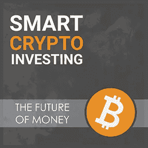
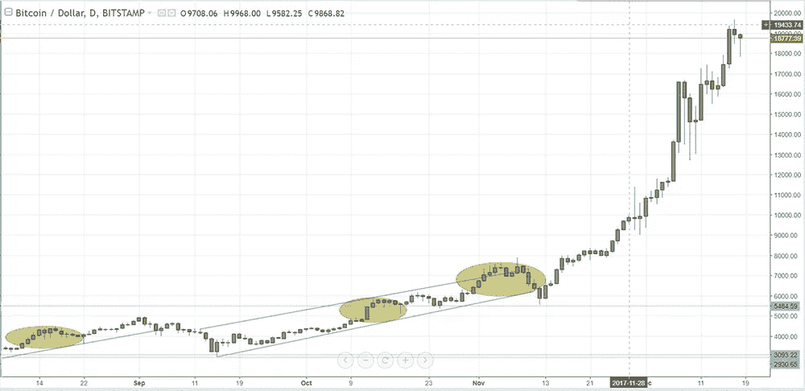

# 沉积物达到了加密的历史最低点——对你来说是个好消息

> 原文：<https://medium.com/hackernoon/sediment-hits-an-all-time-low-for-crypto-good-news-for-you-c2104a4d16c6>

在这些低迷时期，在熊市时期，在 rock 'em，sock 'em 机器人时期，当加密货币世界中的男人和女人试图决定战斗或逃跑时，很难找到鼓励，因为这个游戏中的许多人似乎对任何事情都有膝跳反应，大多数猜测都进入了负面堆。如果你上 YouTube，你会发现一个又一个负面的视频，死亡人数，以及旨在让投资者采取这种或那种行动的恐吓策略。

但聪明的投资者知道，在选择行动方案之前，必须考虑他们的决定的长期影响，并努力超越当前发生的事情，展望未来。这是积极因素可以发挥作用的时候，也是那些消极猜测消失的时候，因为区块链的光明未来可以被看到，它真正是什么，它将成为什么。

[Trading Cryptocurrency for Profit](https://cryptoinvestinginsider.com/)

聪明的投资者记得，加密货币现在才出现几年，他们所扎根的平台正以只能称之为非凡的速度发展。有眼光、有远见、有信心相信加密货币有一天会成为唯一的货币的开发人员正在实现飞跃。我们甚至还没有接近看到加密货币的最终形式，这是每个人都需要记住的事情。

目前，我们只是处于这项技术的实验阶段，所有代币都植根于这项技术，如果你能暂时忘记价格波动，并看到加密货币就像电子邮件一样，它们(在本质上)是不可控的。现在，加密货币已经开箱即用，它们也将(在本质上)不受控制，这对任何愿意押注于这些资产的人来说都是一个好消息，因为这意味着他们的投资不仅仅是加密货币市场的上涨或下跌，而是对我们这个世界未来的投资，这个世界是一个分散的世界组织，没有任何政府或公司可以控制。

这项技术将改变人类交易价值的方式，其影响深远，深入到我们社会的方方面面，并以迄今为止做梦都没有想到的方式让事情变得更好。这是否意味着在区块链投资的每个项目都会成功？不会。这是否意味着区块链不会出现或大或小的失败？不。那么，这意味着什么？

这意味着最好的还在后面。我们在构建区块链和基于它们构建的应用程序方面的专业知识还很幼稚，就像 Pong 和 Atari 是游戏的初级阶段一样，看看我们已经走了多远。虽然那些在当时是有趣的平台，但现在回过头来看，我们可以看到游戏还有多远。游戏技术仍在发展中，区块链和加密货币也在经历类似的演变。

因此，对于那些聪明的投资者来说，他们可以想象区块链和加密货币有时间发展并成为必然发生的变化的催化剂的未来，因为一些人认为我们的生存将取决于它，市场的这些起伏变得不那么重要了。对于聪明的投资者来说，最重要的是结局，而不是市场的现状。

# 过去是未来最好的参考

就在一年前，比特币触及近 2 万美元的价格，所有人都在排队投资，因为沉淀物处于历史最高水平。由于需求太大，而没有足够的基础设施来支持，交易所正在限制注册。多疯狂啊。然而，这与明智投资的运作方式恰恰相反。这是该离开的第一个信号。

人们总是想在市场处于顶部时投资任何东西，在市场处于底部时卖出，这让我感到惊讶，但这是最糟糕的投资策略！

聪明的投资者在沉淀少的时候介入，这适用于任何市场。今天，感觉我们再次接近加密货币领域的一个令人讨厌的低点，这意味着它正在接近购买的时间。

想想十年前震撼全国的房地产危机，由于没有买家，市场在 2009 年底跌至谷底。少数确实购买的人能够以很低的价格获得房地产，却只能看到他们的投资在接下来的几年里飙升。

这感觉很像加密货币领域目前的状况，没有买家，但创新仍在继续。对于那些聪明的投资者来说，利用这个我们一生中只有几次机会的难得机会，未来是光明的。

这很不幸，但大多数投资者不会利用这些低加密货币价格，他们只会等待，看着市场在 2019 年出现转机，让难得的赚钱机会从他们身边溜走。等待市场恢复交易，直到价格和沉淀再次高涨，然后他们才会采取行动，投资他们辛苦赚来的美元，但为时已晚。

从长远来看，在 2019 年实施正确的[加密货币交易策略](https://cryptoinvestinginsider.com/)将会获得巨大回报。将正确的愿景与高能力的团队相结合的项目将处于最有利的位置，以获得回报并充分利用这种新形式的技术。问题是，哪些投资者希望成为其中的一部分，哪些投资者宁愿在一旁观看。[点击这里](https://cryptoinvestinginsider.com/)获取加密方向的免费课程。