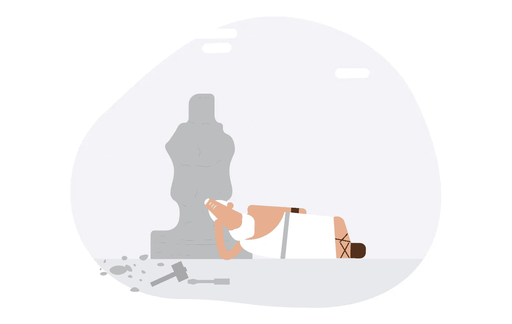
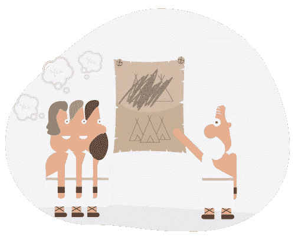
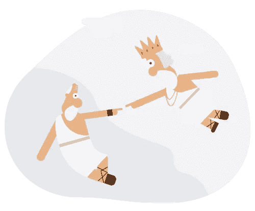

# 看到周围都是平庸？这些可能是原因。

> 原文：<https://medium.com/hackernoon/seeing-mediocrity-all-around-these-could-be-the-reasons-9a2a0dec0dd3>

**超越平庸**是 [Quovantis 的](http://www.quovantis.com)核心价值观之一。

我知道你在想什么- *咄！不应该很明显吗？谁不想每天都做到最好呢？否则，为什么我们会选择在早上盛装打扮，冒着漫长的通勤来上班，只做平庸的工作？*

可惜平庸是存在的。

它不仅存在，而且在我们周围蓬勃发展。我们甚至在工作场所做着平庸的工作，这些工作场所是为了在宇宙中留下众所周知的凹痕而建造的。

我明白每一天都不是平等的。有时候，我们不得不承受生活中的情感负担，我们最终会把这些情感的碎片带到工作场所，因为有时它们太珍贵了，不能留在工作场所的门口。我完全理解它以及它对我们工作质量的影响。

但我说的是另外一些被认为正常的日子，那时天空湛蓝，鸟儿啁啾着它们最喜爱的歌曲，我们的姻亲爱着我们，有一种做重要事情的感觉。

你知道吗，可悲的是，即使在那些日子里，平庸还是会发生。这种事情发生得太多了，以至于有时候我们看不清伟大的作品是什么样子。如果任其发展，它会像白蚁一样吞噬我们的热情，让我们内心空虚。

那么为什么会这样呢？为什么人们在可以像星星一样发光的时候，却心甘情愿的选择平庸的黑暗斗篷？是什么驱使人们在它的重压下继续劳动，而不想挣脱？

在我寻找这些答案的过程中，我发现了以下普遍适用的导致平庸的原因

# 无用感

这个人觉得他们创造的任何东西都无关紧要，不会被注意到。可能是因为他们从来没有听到过同龄人或者领导的一句赞赏的话。因此，它是艺术作品还是毫无价值的平庸之作有什么区别，对吗？

这种思维过程一般要么是自己造成的痛苦，要么是周围人作为病毒传递的文化制约。

# 太努力了

当一些平庸或“刚刚好”的作品可以被视为作品时，究竟有谁有时间在那些漫长的日子里创造一部杰作呢？这个人觉得他们已经做到了，到目前为止还没有人反对！如果有人需要一个更好的版本，周围会有足够多的人来推进这项工作，使它变得“完美”。

# 人们不知道伟大的作品是什么样的

有人没有经历过最高口径的工艺，甚至不知道它长什么样。当我们不知道我们不知道的东西时就是这样——[未知的未知](http://blogs.quovantis.com/peter-principle-when-promotions-lead-to-failures/)。

这个人对他们遇到的任何事情都很满意，因为从来没有人质疑过他们的方法，他们对自己的最低标准太满意了。

# 与原因无关

“为什么我们需要投入这么多的努力？”“对别人有什么好处？”“为什么别人不能这么做？”正如西蒙·西内克所说，当这些事情与工作的目的——工作的“为什么”——不一致时，人们通常会感到奇怪。底线是，这个人在情感上并没有把工作做得很好。

你知道在所有上述情况中最好的部分是我们有一个选择。选择是拥有自我。

**是的，自我！**不，不是像一个自私的疯子，而是

> 自我从一个角度来看，我不在乎我是否被欣赏，但我的工作必须是伟大的，因为我的名字写在上面。
> 
> 从一个角度来看，我会挑战自己的极限，多做一点努力，让我的工作看起来像一件艺术品。
> 
> 自我承诺，即使我不得不一头扎进未知的领域去发现新事物，我也会毫不犹豫地去做。
> 
> 自我努力在我所做的工作中寻找意义。

这是建立任何值得谈论的事物的态度，也是留下遗产的唯一方式。

*这是我们关于职业成长的周五时事通讯的一部分。如果你想阅读以前的时事通讯，这里有* [*档案*](http://blogs.quovantis.com/newsletter/) *。*