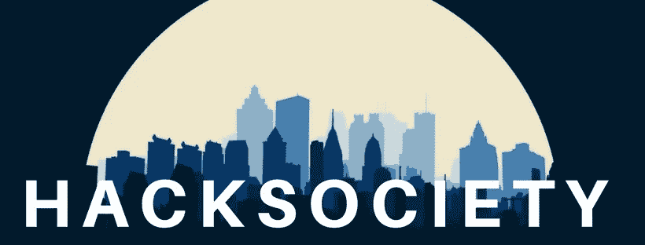

# 求黑客马拉松？也许参考一下名单？

> 原文：<https://medium.com/hackernoon/seeking-hackathons-refer-to-the-list-maybe-90b4f1b8efab>

嘿，黑客伙伴们

这是 Team [HackSociety](https://hacksociety.tech/) 联系你，讨论一些可能引起你兴趣的事情。如前所述，全印度的技术活动数量正以指数速度增长。这些包括黑客马拉松，编码竞赛(在线和离线)，会议，黑客马拉松(是的，我们再次提到了)，以及更新的概念，如设计马拉松和开发者聚会。

目前，HackSociety 主要专注于黑客马拉松——组织、参加和指导。简而言之，管理相同的每个方面，并将其建设成一个真正的技术嘉年华。

我们也有一些合作伙伴，他们支持我们的事业，并乐意成为我们大部分努力的一部分。其中包括我们的云合作伙伴(Digital Ocean 和 AWS)、域合作伙伴(DotTech Domains)、VC 合作伙伴(AdvantEdge)、商品合作伙伴(Inkmonk)等等。我们的网站上有相同的列表。如果您想成为旅程的一部分并为这一壮举做出贡献，请随时访问(或通过 partner@hacksociety.tech 与我们联系)。

虽然，当仅仅为这些技术盛会找到赞助商还不够时，我们决定建立一个集中的[注册门户](https://hacksociety.tech/attend/)，以便简化注册过程，这不仅有助于开发者找到他们想要的黑客马拉松，也有助于组织者有效地管理活动。对每个人都是“双赢”的局面。

在即将发布的一系列帖子中，我们将分享一些对用户可用功能的见解，以及如何利用这些功能为他们带来最佳利益。现在，我们决定从展示清单开始。这是全国最顶尖的黑客马拉松名单，他们决定与我们合作，并在这个过程中获益匪浅。

来，看一看:

Listing Page - HackSociety

想参加这些活动吗？只需导航到 https://hacksociety.tech/attend 的[并申请你认为最有吸引力的职位。然而，你可能需要填写一些关于你自己的细节，并建立一个档案(只有第一次)，但我们让你用一键申请，真棒开发者档案等。在以后的帖子中会有更多关于这些话题的内容。敬请关注。](https://hacksociety.tech/attend/)

在那之前，请继续关注我们在 Medium 上的报道以及我们在[脸书](https://www.facebook.com/thehacksociety)、 [Instagram](https://www.instagram.com/thehacksociety/) 、 [Twitter](https://twitter.com/thehacksociety) 和 [LinkedIn](https://www.linkedin.com/company/13297630/) 上的社交媒体账户。我们也想借此机会邀请您加入我们的[脸书小组](https://www.facebook.com/groups/1840988019285518/)，如果您想与其他组织者、与会者和导师讨论一些事情。

# 那都是乡亲们！

老尼克，黑客协会