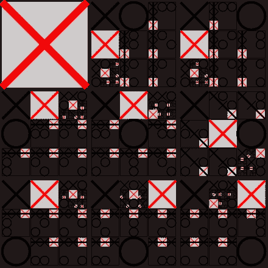
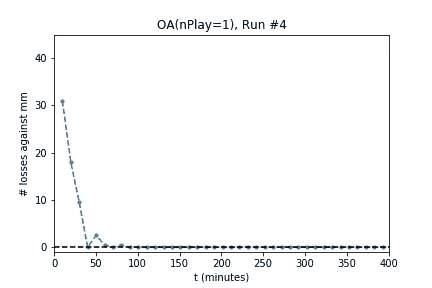

# 自娱自乐

> 原文：<https://medium.com/hackernoon/self-play-1f69ceb06a4d>

如果你对人工智能感兴趣，你可能已经读过关于 AlphaZero、T2、西尔弗等人的文章。艾尔。】。这个算法学会了在超人类水平“白板”下围棋、国际象棋和日本象棋。换句话说，AlphaZero 的游戏代理没有查看玩得好的游戏或好棋的例子。它也不知道可以帮助它评估头寸的试探法(例如，“车比卒值钱”)。它只是和自己玩了几百万次游戏。

这对我来说很神秘。如果只是和自己玩，新的信息从哪里来？它怎么知道自己做得好不好？如果我和自己下一盘棋，如果我赢了自己，我应该说我做得很好吗？但我战胜自己的同时，也输给了自己。我怎么知道和别人比赛我会不会做得很好？

据我所知，自我表演并没有被完全理解。例如，没有关于性能的保证，也没有公认的方法。但是人们已经多次成功了。

下面我将讨论一些著名的自我游戏的例子，研究人员在构建以这种方式学习的代理时遇到的问题，以及使其工作所需的条件。

**自弹自唱的例子**

自玩在游戏代理的培训中有着悠久的历史。代理人已经被构造来玩跳棋，西洋双陆棋，国际象棋，围棋。

1959 年，亚瑟·塞缪尔编写了一个学习玩跳棋的程序。该系统从“棋盘配置、游戏结果”等样本中学习。样本是从人类游戏和自我游戏中收集的。为了决定下一步行动，该系统使用了多种方法来评估棋盘:(I)有限深度的修剪(alpha-beta [ [Wikipedia](https://en.wikipedia.org/wiki/Alpha–beta_pruning) ])搜索树，(ii)查找表(由原始样本组成)，以及(iii)由人工设计的特征组成的评估函数。从样本中学习(iii)的参数。

1992 年，Gerald Tesauro [ [Tesauro](http://papers.nips.cc/paper/465-practical-issues-in-temporal-difference-learning.pdf) ]创造了 TD-Gammon，这是一个训练有素的神经网络，可以玩世界冠军级别的双陆棋。这个 NN 学会了完全通过自己玩来评估一个双陆棋棋盘配置*。它的搜索树更像是一个搜索树桩——根据版本的不同，只由一层或两层组成(一层*层*是单个玩家的移动)。西洋双陆棋和西洋跳棋(或国际象棋或围棋，就此而言)之间的一个重要区别是，西洋双陆棋使用骰子，这在游戏中引入了随机性。*

Deepmind 的 AlphaZero [ [Silver 等。艾尔。通过学习比跳棋复杂得多的国际象棋和比国际象棋复杂得多的围棋，将这一研究路线推向了极致。更准确地说，跳棋有 10 个⁴棋盘状态，象棋有 10⁵  [卡斯帕](https://www.quora.com/How-many-possible-configurations-of-pieces-on-a-chessboard-are-there-How-much-memory-would-be-required-to-store-the-entire-catalogue-of-games-played-from-all-possible-moves)]，围棋有 10 个⁷⁰ [ [特罗姆普](https://tromp.github.io/go/legal.html)]。(实际上，checkers 是如此的“小”，以至于它被精确地解决了[ [Hirshon](http://sciencenetlinks.com/science-news/science-updates/checkers-solved/) ]！)

AlphaZero 的博弈代理包括(I)蒙特卡罗树搜索[ [维基百科](https://en.wikipedia.org/wiki/Monte_Carlo_tree_search) ](比 alpha-beta 剪枝更高效)，以及(ii)由深度神经网络组成的评估函数。AlphaZero 完全靠自己玩来学习。没有人类玩耍的样本。没有手动设计的功能。AlphaZero (AlphaGo)的前身，在 2016 年击败了排名第一的职业围棋选手 Lee Sedol[[deep mind](https://deepmind.com/research/alphago/)]。

OpenAI 目前正在开发一个深度神经网络代理——实际上是一个五代理团队——它玩 Dota 2 [ [OpenAI](https://openai.com/five/) 。最终目标是打败世界顶级职业球队。Dota 2 的状态空间是巨大的、连续的，而且只是部分可观测的。Dota 2 的游戏状态由 20000 个维度组成。相比之下，国际象棋的 8×8 正方形棋盘有 12 个不同的棋子(768 位)，围棋的 19×19 正方形棋盘有 2 个棋子(722 位)。在国际象棋和围棋中，双方都可以看到整个棋盘。在 Dota 2 中，整个游戏状态只有一小部分是可见的。将所有这些与大约 1000 个动作结合起来——五个玩家中的每一个*——你就有了一个极其复杂的游戏。OpenAI 正在通过自我游戏[ [罗德里格兹](https://towardsdatascience.com/the-science-behind-openai-five-that-just-produced-one-of-the-greatest-breakthrough-in-the-history-b045bcdc2b69) ]解决这个游戏。*

Optimal Tic-tac-toe for player X

**通过构建学习**

为了试图真正理解自我游戏，我提出了以下问题:训练一个神经网络通过自我游戏完美地玩井字游戏*，并用进化策略做到这一点。井字游戏是一个简单的小游戏(9 x 9 棋盘，2 个棋子)，可以使用 minimax*算法快速准确地解决。这种简单性使我能够在便宜的硬件上快速运行实验。*

*所谓“完美”，我的意思是我希望它连续 100 次击败 minimax 代理(因此，也许“真的，*真的*好”会比“完美”更好)。此外，我希望随着训练的进行，代理人能够继续赢得 100 场比赛——让我相信，无论它从自我游戏中学到了什么，都会可靠地引导它走向完美的游戏。为了评估训练过程，我周期性地暂停训练，玩了 100 次 NN 代理对 minimax(来自 Dwayne Crooks 的 [Python](https://hackernoon.com/tagged/python) 包 **xo** )游戏，记录了 NN 的损失次数。*

*我选择用进化策略(特别是 CMA-ES [ [Hansen](https://arxiv.org/abs/1604.00772) )而不是反向传播来训练神经网络(NN)，部分原因是我最近阅读了 OpenAI 的进化策略，作为强化学习的可扩展替代方案[ [Salimans 等人。艾尔。](https://arxiv.org/abs/1703.03864) ]和优步·艾关于深度神经进化的论文[ [斯坦利&克鲁恩](https://eng.uber.com/deep-neuroevolution/) ]，部分原因是我有一台多 CPU 的电脑，没有 GPU，部分原因是它会迫使算法与上面讨论的算法有足够的不同，以至于我真的必须钻研自我游戏的想法才能去任何地方。*

***Minimax[*[*Wikipedia*](https://en.wikipedia.org/wiki/Minimax)*]从给定的棋盘配置开始计算每一种可能的游戏实现，然后确定哪一步棋具有最好的预期结果。上面讨论的其他方法(阿尔法-贝塔剪枝，蒙特卡罗树搜索)是对极大极小的近似。它们被用在跳棋、国际象棋和围棋中，因为这些游戏有太多的实现，无法在实际的时间内计算出来。**

***自玩健身***

*要用 CMA-ES 优化神经网络的参数，需要指定一个适应度函数。它是你赋予一组神经网络参数的值或质量。作为一个例子，如果你不关心自己的发挥，你可以只对一个极小(完美)的球员发挥 NN，比如说，100 次，并计算失败的次数作为适应度(嗯，*负*适应度)。然后要求 CMA-ES 找出使损失数最小的 NN 参数。我试过了。它工作了。它产生了一个 NN 玩家，总是跟 minimax 打平。然而，要通过“自我游戏”来学习，在不知道极大极小解或任何其他策略提示的情况下，神经网络应该与什么游戏来确定其适应性呢？*

*经过大量实验，我发现这很有效:为 NN 玩家构建一个“全知代理”来与之竞争。全知代理(OA)之所以全知，是因为它嵌入了上一代“x favorite”NN 的副本，并且知道它会对任何棋盘配置做出什么举动。在下一步棋之前，OA 模拟游戏对抗 xfavorite，看看哪一步棋最适合对抗它。*

*通过了解 xfavorite 的移动，OA 可以在实际上不知道如何玩井字游戏或不做任何树搜索的情况下玩得比 xfavorite 更好。这很简单。*

*为了测试 OA 的能力，我把它放在一边，嵌入了 minimax 播放器(而不是 xfavorite NN)，并让它与 minimax 播放器进行了 100 场比赛。OA 每次都能抽到 minimax 玩家。知道了这些，我们可以说，“如果 NN 收敛到 minimax play，OA 就会画出来”。换句话说，优化不会因为 OA 不够擅长井字游戏而卡壳。不过，它可能会因为其他原因而停滞不前。*

*请注意，开放存取本身对于实际的竞技游戏并没有什么用处，因为你永远无法在开放存取中嵌入一个对手，并称之为公平或有意义的游戏。但这并不意味着你不能训练一个对抗 OA 的特工。这就是我尝试过的——而且奏效了。为了跟踪它的进度，我每 10 分钟暂停一次训练，把当前的 xfavorite 对着 **xo** 的 minimax 播放器玩 100 次，记录下输的次数:*

**

*(是的，第四轮是最好的。不过，你可能会看到所有的。)请注意，随着优化的继续，它是如何达到零损耗并且*保持在那里*。对抗 OA 的训练迫使代理人走向完美的、极小的游戏。*

*然而，更有启发性的是，所有的事情都没有成功。*

***问题***

*在这种情况下，训练一个神经网络对抗它自己——字面上的自我游戏——是没有意义的。适应度函数是什么？这在 AlphaZero 中是有意义的，因为该算法记录游戏，并通过监督学习来学习移动的质量。但是如果 NN 自己玩，它同时赢和输。你怎么得分？*

*通过对抗上一代的 best can 结果来训练一个 NN，就是罗尚博问题:NN 学习一个策略 B 来击败策略 A，成为“冠军”。然后一个新的 NN 学习了一个策略 C 打败了 B，然后另一个学习了 A 打败了 C，把 A，B，C 想成石头，布，剪刀，就有道理了。这种策略循环被证明存在于西洋双陆棋中。艾尔。 ]并由 OpenAI 在术语“策略崩溃” [OpenAI](https://blog.openai.com/openai-five/) 下讨论(afaict)。*

*使用几个前冠军国家队的“名人堂”可能会缓解罗沙莫问题。OpenAI 在 OpenAI Five 中使用了它，但我在这个问题上尝试的几个版本都没有任何运气。*

*用大量 numSims 卡对抗 OA 的训练不起作用。OA 非常好，以至于适应度函数很少有梯度。它只是失去了，失去了，失去了。没有那么多的信息。最好的 num sim 实际上是 num sim = 1——稍微偏向“更好”,有很多探索的噪音。*

***解决方案***

*看起来，如果你想通过自我游戏来训练一个代理，你需要创建一个算法来很好地探索状态空间(棋盘配置)，并且可能有一些机制来鼓励单调的改进。*

*AlphaGo 的代理人在探索过程中使用了随机性，并雇佣 MCTS 总是寻找更好的走法。OpenAI Five 玩的游戏有天然的随机性，并使用名人堂来防止回溯。TD-Gammon 将掷骰子作为探索的来源。目前还不清楚 TD-Gammon 是如何保持进步的，但是。艾尔。 ]研究了一个假设，即双陆棋的动态自然有助于此。*

***结论***

*自我发挥是一个令人兴奋的想法，因为它有望让工程师不仅不必指定问题的*解决方案*(正如参数优化所做的那样)，甚至还可以指定*目标*。这是一个比我们通常在研究强化学习时考虑的更高层次的自主性。*

*虽然自我游戏似乎没有被完全理解，但它肯定是有效的。这应该是一个可以看很多年的有趣话题。*

*感谢您的阅读。如果你想了解更多关于自我游戏的内容，请查看整篇文章中的参考链接。如果你对训练井字游戏代理感兴趣，可以使用 [Python 源代码](https://github.com/dspub99/betazero)，以及关于其工作方式的更详细的文章[。](https://dspub99.github.io/betazero/betazero.html)*