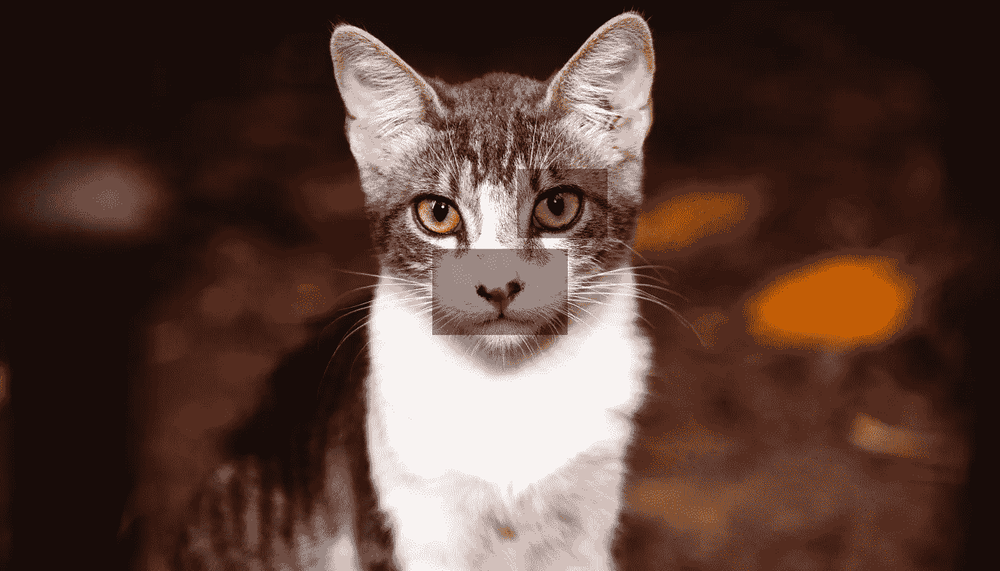

# 自我监督学习让我们更接近自主学习

> 原文：<https://medium.com/hackernoon/self-supervised-learning-gets-us-closer-to-autonomous-learning-be77e6c86b5a>

自监督学习正受到关注，因为它有可能解决监督机器学习的一个重大限制，即。需要大量由输入和相应输出组成的外部训练样本或监督数据。Yann LeCun 最近在《科学与未来》杂志的采访中提出，自我监督学习是人工智能在未来十年的重大挑战。

例如，当单词“orange”出现在“t 恤衫”、“冰箱”、“县城”或“移动电话”附近时，人类可以从上下文中确定其语义。同样，在机器学习中， [Word2Vec](https://code.google.com/archive/p/word2vec/) [算法](https://www.tensorflow.org/tutorials/representation/word2vec)根据周围的单词预测一个单词的语义上下文。自我监督学习背后的研究遵循自动识别、提取和使用监督信号的相同原则。

# 什么是自我监督学习？

自监督学习是自主监督学习。这是一种表示学习方法，消除了人类标记数据的先决条件。自我监督学习系统提取并使用自然可用的相关上下文和嵌入的元数据作为监督信号。

猫继续在机器学习的所有重要事物中扮演重要角色。自我监督研究[通过上下文预测的无监督视觉表示学习](https://arxiv.org/abs/1505.05192)“通过使用空间上下文作为训练丰富视觉表示的监督信号，预测图像的一个矩形部分相对于另一个矩形部分的位置。例如，相对于猫的眼睛，猫的右耳会在右上的位置。这种方法允许在没有事先明确语义标记的情况下学习关于猫、狗或公共汽车的知识。

Self-supervised learning in images (Photo by [Quino Al](https://unsplash.com/photos/O6GFYfJ1kHY))

幸运的是，自我监督学习并不局限于从猫图像或视频中的视觉线索或相关元数据中进行学习，它还具有超越计算机视觉的用例。

## 自我监督与监督学习

自监督学习是监督学习，因为它的目标是从成对的输入和标记输出中学习一个函数。在自我监督学习中，不需要明确使用标记的输入-输出对。相反，输入中可用的相关性、嵌入的元数据或领域知识被隐含地和自主地从数据中提取出来，并被用作监控信号。像监督学习一样，自我监督学习在回归和分类中也有用例。

## 自我监督与非监督学习

自监督学习类似于非监督学习，因为系统学习不使用明确提供的标签。它不同于无监督学习，因为我们不是在学习数据的内在结构。与无监督学习不同，自我监督学习不是以聚类和分组、降维、推荐引擎、密度估计或异常检测为中心的。

## 自我监督与半监督学习

标记和未标记数据的组合用于训练半监督学习算法，其中少量的标记数据结合大量的未标记数据可以加速学习任务。自我监督学习是不同的，因为系统学习完全不使用明确提供的标签。

# 为什么自我监督学习是相关的？

由于许多原因，自监督学习是必不可少的，但主要是因为监督学习的方法和可扩展性方面的缺点。

监督学习是一个艰巨的过程，需要收集大量数据，清理数据，手动标记数据，训练和完善专为你正在解决的分类或回归用例构建的模型，然后用它来预测未知数据的标签。例如，对于图像，我们收集大型图像数据集，手动标记图像中的对象，学习网络，然后将其用于一个特定的用例。这种方式与人类学习的方式非常不同。

人类的学习是基于试验的、永久的、多源的、同时进行多项任务的。我们大多是在无人监督的情况下学习，利用实验和好奇心。我们也以监督的方式学习，但我们可以从更少的样本中学习，并且我们归纳得非常好。

对于监督学习，我们已经花费了数年时间来收集和专业注释数千万个带标签的边界框或多边形以及图像级注释，但这些数据集[打开图像](https://storage.googleapis.com/openimages/web/index.html)、[帕斯卡视觉对象类](http://host.robots.ox.ac.uk/pascal/VOC/index.html)、[图像网](http://www.image-net.org/)和微软 [COCO](http://cocodataset.org/) 与社交媒体上每天生成的数十亿张图像或自动驾驶中需要物体检测或深度感知的数百万个视频相比，都显得苍白无力。类似的可伸缩性论点也存在于常识中。

# 自我监督强化学习

训狗师可以奖励积极的行为，惩罚消极的行为。随着时间的推移，狗会想出并学会获得奖励的动作。类似地，在强化学习中，导航机器人学习如何在保持航向时获得奖励，在与环境中的东西发生碰撞时受到惩罚。在这两种情况下，这种奖励和惩罚反馈强化了哪些行为应该执行，哪些行为应该避免。强化学习在有奖励反馈系统的情况下效果很好。它还需要一组全面的训练数据，并且考虑到成本、时间和成功之前所需的迭代次数，这可能是不切实际的。

在缺乏基于奖励的反馈系统的情况下，狗或导航机器人可能会通过好奇的探索环境来自行学习。来自 BAIR 的研究人员创建了一个“内在好奇心模型”，这是一个自我监督的强化学习系统，即使在没有明确反馈的情况下也能工作。它将好奇心作为一种自然的奖励信号，使智能体能够探索它的环境并学习技能，以便在以后的生活中使用。参见研究:[通过自我监督预测进行的好奇心驱动的探索](https://arxiv.org/abs/1705.05363)和[相关报道](https://pathak22.github.io/noreward-rl/)。

使用自我监督的学习机器可以通过自然进化和其行为的后果进行预测，类似于新生儿如何在生命的第一周/第一个月通过观察和好奇学习难以置信的大量信息。自我监督学习有可能将学习扩展到新用例所需的水平，包括但不限于医学、自动驾驶、机器人、语言理解和图像识别中的用例。

> 自我监督学习使我们更接近类似人类的自主学习。

自我监督学习已经在[在没有人类监督的情况下估计相对场景深度](https://arxiv.org/abs/1712.04850)方面取得了成功，通过使用运动分割技术，根据场景的运动场和摄像机运动之间的几何约束来确定相对深度。

在医学领域，它已经发现了机器人手术和单眼内窥镜密集深度估计的应用案例。

在自动驾驶中，自我监督学习对于[估计越野时的地形粗糙度](https://arxiv.org/abs/1206.6872)很有用。它在使用激光雷达和单目摄像机的[深度完成中有一个用例](https://arxiv.org/abs/1807.00275)。

要探索最新的自我监督学习用例，请查看此搜索[链接](https://arxiv.org/search/?searchtype=title&query=Self-Supervised&size=200&order=-submitted_date)。

yann le Cun——NYU 教授，脸书人工智能研究所(FAIR)首席人工智能科学家，脸书人工智能研究所主任。2018 年 7 月:[https://www . science setavenir . fr/videos/yann-le Cun-ex lique-lintelligence-artificielle-et-ses-defis-a-venir _ kzrzpf](https://www.sciencesetavenir.fr/videos/yann-lecun-explique-lintelligence-artificielle-et-ses-defis-a-venir_kzrzpf)

http://bair.berkeley.edu BAIR-柏克莱人工智能研究中心: