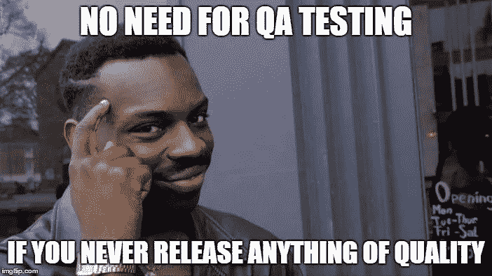

# Solo 开发人员的自我测试

> 原文：<https://medium.com/hackernoon/self-testing-for-solo-devs-d3f9e7ae03b4>

没有什么可以取代一个伟大的团队。但是一个真正的战士必须能够在需要的时候依靠自己。

如今，一些人在一个团队中工作。

他们是主题专家，是各自领域的佼佼者(而我是地球上最不可能给他们任何专业建议的人)。

刚刚创立自己公司的人(或者他们公司的合伙人不是技术人员)。

或者是那些总是远程工作的人，他们与总部位于完全不同的时区，很难从其他同事那里获得帮助。

# 测试你的工作，日常软件工程的花椰菜。

我能想到的第一个技能，我们都需要注意的，是更有效地测试我们自己的开发工作。QA 人员很棒，但是你们在这个案子上一起工作，你不能把你的垃圾扔到栅栏的另一边。

就像西兰花一样，很难做(或吃)，但对你的职业生活(或健康)非常有益。

随着时间的推移，我已经收集了一些技巧，我希望这些技巧的数量越来越多。我们开始吧。



Sad!!!

# 做一个坏爸爸，打破他们

作为一名开发人员，最重要的是通过你开发的特性来提供价值。作为一名测试人员，就是要通过消除软件中存在的错误来给出价值。

如果你不弄清楚如何变得更加冷血来对抗你心爱的生物，你永远无法在这段旅程中成功。我相信我在这里还有很多工作要做，所以任何建议都很感谢。


# 事先计划好案例

你最终会测试什么？书面规范是这里唯一的事实来源。做一些浏览，直到你能尽可能多地在脑海中想象出最终的产品/特征。

不要犹豫地强调您认为重要的要点，并继续向产品/功能所有者提问。

所以，现在你有了大图，你可以使用类似下面的伪算法来制定一个测试计划。

```
Break the functionality into testable partsFor each one of the above part: Write down the “happy paths” that derive from the specs Write down the boundary values that derive from the specs Write down any crazy paths you might think off, as they might be not that crazy when released to the public Think the various parts can be triggered and how this can affect the system and keep regression in mind
```

# 尽早测试

你完成了一项功能？现在测试一下。你上完课了吗？现在测试它，我希望你已经单独测试了单独的功能。有些人做得更极端，每 N 行代码测试一次。

如果由于任何原因测试是不可能的，添加断点/断言来确保每个函数的[前置条件](https://en.wikipedia.org/wiki/Precondition)和[后置条件](https://en.wikipedia.org/wiki/Postcondition)都得到满足，现在应该可以了。

如果有机会，不要听别人说这很费时间。你对你的成果和你的职业负责，而不是他们；所以确保你忽略了低质量的[警报声](https://en.wikipedia.org/wiki/Siren_(mythology))(这可能相当引人注目)。除非这是管理层的指示，所以在忽视他们之前，也许先和他们讨论一下会更好。:)

这是因为，你越早发现问题，就越容易(因此成本更低)有效地解决它。

在这个阶段，我说的是手工测试。但是对于 TDD 爱好者来说，这是没有商量余地的。甚至在创建源代码文件之前，就已经开始编写测试了。

# 经常自动测试

尽管您可以通过手动测试来执行这一部分，但是自动化测试是完全可行的。我在以前的[文章](/@periklisgkolias/a-comprehensive-introduction-to-unit-testing-and-mocking-with-python3-3d962670c726)中写过关于单元测试的文章，如果克服了最初的努力，获得了很大的覆盖率，你将会得到很大的补偿。

今天，有无处不在的工具(即持续集成解决方案，其中测试可以在每次提交时运行)让您只需点击一下鼠标就可以对整个平台进行回归测试，所以在我看来，自动化测试是一项高回报的投资。

# 使用“随机发生器”

在上面的“预先计划案例”中，我们提到了识别疯狂路径的需要。正如在第一点“做一个坏爸爸并打破它们”中提到的，我们不擅长在代码中寻找缺陷。那么，让“其他人”来决定被测系统的输入如何呢？这就是随机化者来拯救的地方。

随机数发生器可以简单到一个几百次迭代的循环，将 ASCII 字符、数字和……mongo 对象的每种组合(好吧，我有点夸张)作为输入输入到一个表示……年龄的字段，然后计算错误、非正常处理和成功的次数。或者复杂的[库](https://github.com/topics/random-testing)。

# 确保你的测试与架构一致。

这很简单，例如，如果你不关心性能，就不要做负载测试。准确地说，如果没有非功能性需求。

# 静态和动态分析

静态和动态分析器是我们的武器库中不可缺少的工具，可以及时防止一定比例的问题被发布。

你可以在这里阅读这篇伟大的文章[，以及](https://www.testingexcellence.com/static-analysis-vs-dynamic-analysis-software-testing/)[这个](https://github.com/mre/awesome-static-analysis)关于静态分析工具的令人敬畏的列表。

如果你需要一个动态分析工具的列表，请搜索你最喜欢的语言，看起来我找不到任何大规模的列表，语言不可知的(就像静态分析一样)。

# 确保所有行都执行一次。

有时，由于依赖关系的限制，100%覆盖自动化测试是困难的。因此，至少要通过给函数输入必要的信息，尝试手工执行所有的行。

如果很难，不一定要使用应用程序的 UI 来完成。例如，在 Javascript 应用程序中，您可以调用 browser/NodeJS 控制台并单独测试每个功能。

# 最后但同样重要的是，你永远不会像 QA 一样优秀。

不要屈服，不要气馁，不要将就，要知道自己的弱点。这个世界上只有上帝和巧克力是完美的。

# 结尾…

感谢你阅读这篇文章，我希望你喜欢它。我真的很想听听伟大工程师在这方面的做法，所以非常欢迎你的评论。但是请记住，我们谈论的是“一个开发团队”。

*最初发布于* [perigk.github.io](https://perigk.github.io/)