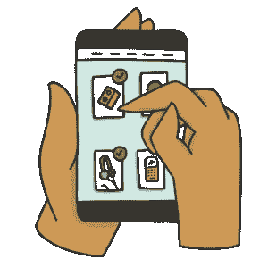
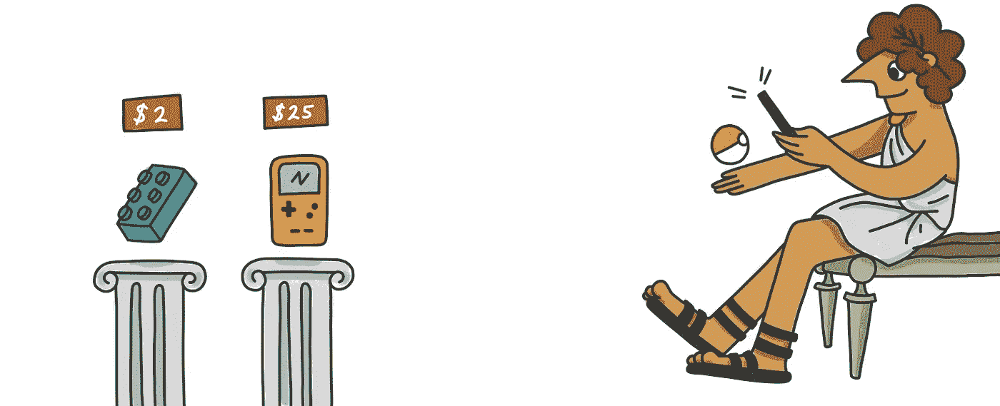

# 以简单的方式销售加密货币产品

> 原文：<https://medium.com/hackernoon/selling-a-product-for-cryptocurrency-the-easy-way-14693d0aa437>

接受加密货币作为你的业务的一种支付形式，或者销售 crypto 的产品是赚取更多加密货币的一个好方法。对加密货币感兴趣的企业主经常想知道他们如何开始接受比特币、以太坊、莱特币，甚至比特币现金。幸运的是，有一些现成的解决方案可以让你开始销售一个项目的加密。

你可以在这里注册[Forra](https://market.forra.io/signup)

开始销售 crypto 产品的最佳和最简单的方式是在 Forra 上销售。Forra 是一个类似于亚马逊或易贝的市场。Forra 是开始销售比特币、以太坊、莱特币或比特币现金产品的最简单方式，全部免费。要开始销售加密货币产品，你需要做的只是填写一张简单的[表格](https://market.forra.io/signup)。

# 如何销售加密货币产品

销售加密货币产品比你想象的要容易得多。对于企业来说，开始接受比特币和其他加密货币作为支付形式有几个很好的解决方案。这些是出售加密货币的几种最佳方式。

1.  [Forra](https://forra.io)——一个类似于易贝和亚马逊的市场。Forra 是销售任何 crypto 产品的好方法。在 Forra 上销售是免费的。
2.  pay bear——woo commerce 和 shopify 应用程序。如果你有自己的网站，并想出售加密的东西，你应该看看 paybear。Paybear 确实收取很少的费用来使用他们的服务，而且需要你在网站上添加一些代码。
3.  coin payments——当你拥有自己的电子商务网站时，它非常有用。Coinpayments 允许您接受 900 多种不同的加密货币。他们收取少量费用来使用他们的服务，并为最流行的电子商务平台提供各种插件，如 Shopify 和 Woocommerce。

如果您需要帮助安装或想要讨论如何销售加密货币，请加入我们的 [discord](https://discord.gg/xUjJ9A6) 社区。

# 出售加密货币后，我会立即获得报酬吗

一旦交易完成，买家发送加密货币购买你的商品，通常会发生两种情况。密码被转发到托管钱包或直接钱包。托管钱包是 Forra 为确保安全而开发的功能(safu！)资金的处理。

作为买家，如果你确信某项服务或产品是合法的，你可以直接向卖家付款。请记住，加密交易是不可逆的，所以在购买没有托管的商品时要小心。

# 为什么你应该出售你的加密货币产品

加密货币整体上有点草根运动的味道。人们声称比特币是黄金的数字版本，只是因为其他人赋予了它某种价值。增加任何加密货币价值的最佳方式之一是将其作为传统货币使用。销售数量将导致区块链上更多的交易，可能会导致价格上涨，并向更多人介绍加密货币的好处。

我们总结了一些你应该出售加密货币产品的理由

1.  **这将有助于推广加密货币的应用** —让新人、企业和产品接触加密货币有利于整个行业的发展
2.  **用加密货币做生意更便宜** —当你通过信用卡处理器接受支付时，通常会有一大笔与支付相关的费用；通常在 3%左右..加密货币交易通常比信用卡处理器便宜许多倍。
3.  **没有退款。**一旦资金归你所有，买家就不能取消付款。
4.  你的产品将会被全新的观众看到。——有很多人希望消费他们的加密货币。如果您正在寻找销售产品的替代方式，接受加密货币作为一种支付形式可能会成为您企业的宝贵收入来源。
5.  **在你还能收集加密货币的时候收集加密货币**——许多供应商专门为了赚取加密货币而开展业务。出售加密货币产品是增加你个人财富的一个好方法。有很多东西都是出售加密货币的完美产品。Forra 的目标之一是成为人们购买和消费产品和商品的中心。

# 赚取额外的加密货币

当你销售 crypto 产品时，如果你使用 Forra 这样的产品，你会受益匪浅。Forra 的托管利用 stablecoins 来确保您的收入不受加密市场波动的影响。你可以在这里了解更多关于我们如何使用 stablecoins 使 crypto 成为支付商品的有效方式[。](https://forra.io/our-use-case-for-the-gemini-dollar/)

销售比特币等加密货币产品的一个主要好处是，它允许你在不直接购买的情况下获得密码。销售 crypto 产品是获得加密货币的一种更顺畅、更简单的方式。您可以使用我们的[市场销售任何 crypto 产品。](https://market.forra.io)

销售 crypto 产品一点也不难，有几种方法可以在你的网站上接受加密货币作为一种支付形式。然而，大多数在线销售的人都在某种市场环境中销售，比如亚马逊或易贝。

# 使用加密货币市场销售商品和产品

绝大多数在线卖家使用市场。当你为 crypto 销售产品时，为什么会有什么不同呢？Forra 是为卖家而存在的。我们重视您的业务，并非常自豪地说，我们是网上做生意最便宜的地方。卖家受益于出售他们的商品加密由于其低费用。最重要的是，我们不收取任何额外的市场费用。我们的目标是帮助你出售你的物品！

我们希望人们认为我们是易贝的加密版。一个地方，任何人都可以出售他们的项目，产品，加密货物。在我们看来，一个密码市场不仅仅是一种以任何价格处理掉你的物品的方式。它需要一个社区的努力来分享，并向新人们介绍加密货币的世界。

当有人试图出售一个项目的密码，我们认为这是很重要的卖方做一些推广自己，以确保销售。

总结一下，我们认为如果你想增加更多的密码，出售 crypto 产品是一个好主意。

*最初发表于* [*forra.io*](https://forra.io/selling-products-for-crypto/) *。*