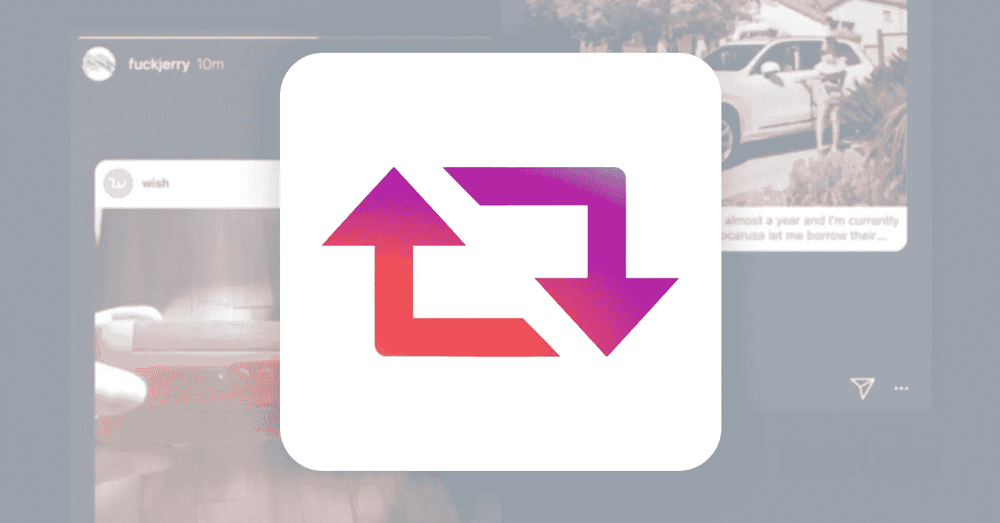
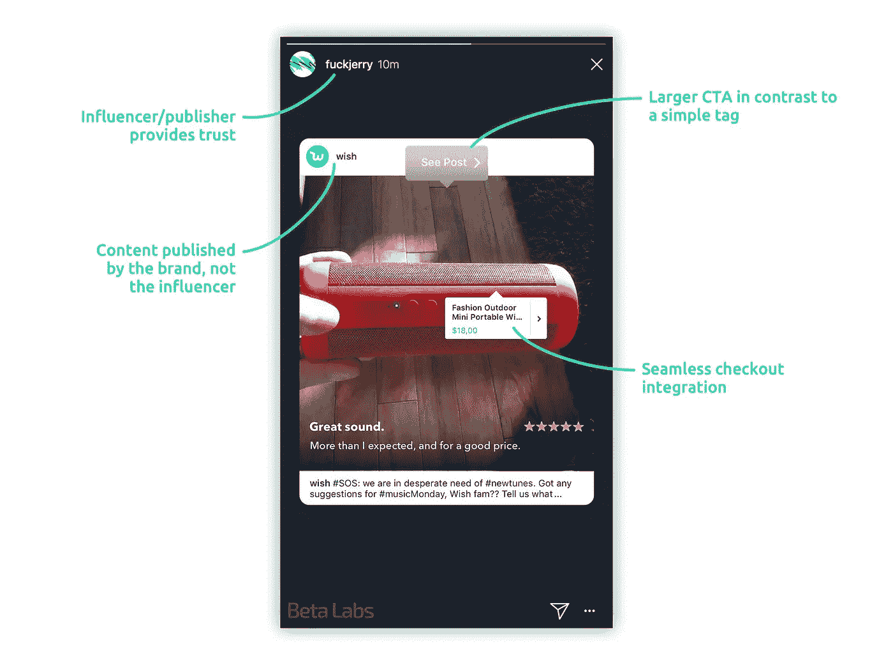
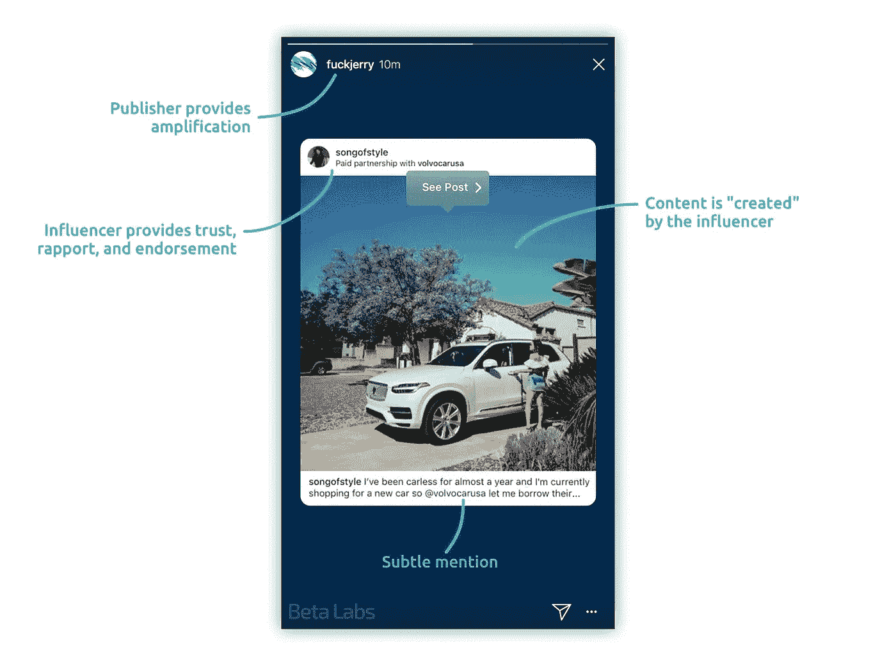
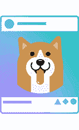

# 2018 年在 Instagram 上销售:Regrams 和产品标签

> 原文：<https://medium.com/hackernoon/selling-on-instagram-in-2018-regrams-and-product-tags-60cb0ae994a0>

## 对于 Shopify 商店来说，在 Instagram 上与有影响力的人和出版商合作将会发生变化。

它来了。分享某人关于你的故事的帖子是 Instagram 即将为所有人推出的新功能。我相信这将彻底颠覆影响者营销目前在 Instagram 上的运作方式，因此做好准备将有助于提高你的广告支出回报(ROAS)。

我认为许多营销人员完全低估了将要发生的事情，所以这篇文章可能有助于激发他们的合作机会和使用正确工具预测变化的方法。如果你错过了新闻，这是 TechCrunch 的文章:

 [## Instagram 测试将别人的帖子分享到你的故事中

### Instagram 故意没有一个“Regram”按钮来促进原创分享，但当……

techcrunch.com](https://techcrunch.com/2018/02/07/instagram-reshare/) 

您可以在这里看到该功能的实际应用:

Regrams 打开了许多以前不可能的机会，新的赠品机制、explore 选项卡上的曝光和更简单的影响者推销机制只是其中的一部分。

# 赠品

还记得像病毒一样传播并以彻底混乱告终的 Sunny Co .服装广告吗？他们为每个分享帖子的人做了一个“免费产品+付费运输”的宣传。

 [## 为什么本周你的 Instagram 上全是红色泳衣

### 你见过这件泳衣吗？它是红色的。它后面很低，上面装饰着一只小小的白色海马。它和…

nymag.com](http://nymag.com/selectall/2017/05/the-red-swimsuit-instagram-plague-was-sunny-clothings-fault.html) 

准备好迎接更多的挑战吧！这一次，它将是“分享你的故事”。

# 浏览选项卡上的曝光

我喜欢 [Maja](https://medium.com/u/9dbee07a4188?source=post_page-----60cb0ae994a0--------------------------------) 的说法:“Instagram explore 算法是一种非常复杂的生物”。然而，众所周知，你的订阅源包含许多你所关注的人喜欢或参与的账户的帖子。这就是客户使用合约窗格的原因。

参与窗格有助于客户与具有相似受众的其他客户协作。我认为最可靠的平台是由[格蕾塔·罗斯·范·瑞尔](https://medium.com/u/2aa210ed74e4?source=post_page-----60cb0ae994a0--------------------------------)运营的[嘿影响者](https://thisishey.com/engage/)。此外，除了将有影响力的人与相似的受众联系起来，他们还将他们与品牌联系起来。

**使用 regrams 与其他帐户合作，带来更多的浏览量、流量和参与度，这将有助于您在 explore feed 上获得一席之地。**

# 为有影响力的人提供更简单的机制

[https://techcrunch.com/2017/06/14/instagram-sponsored-posts/](https://techcrunch.com/2017/06/14/instagram-sponsored-posts/)

影响者营销占据了任何品牌战略的很大一部分。目前，推销者只通过标记账户来工作(加上“付费合作关系”的披露，以符合 FTC 的规定)。

这意味着唯一可点击的操作调用是 handle 标签，这是一个非常弱的标签。此外，有影响力的人和品牌需要在分享内容时真正具有创造性和个性化。大声喊出来的内容是影响者发布的东西，而不是品牌。

Regrams 改变了游戏，因为有影响力的人和出版商将能够使用品牌的内容，并且只需要在他们的故事上签署品牌的帖子。Regrams 有一个引人入胜的突出的 CTA(“看这篇文章”)，而不是简单地提到手柄。就像下图一样:

# 影响者向出版商和广告推销+放大

影响者帮助品牌获得消费者的信任。他们也帮助他们被发现，这取决于他们的影响力。秘诀是与影响力较小的人合作，放大他们的声音。影响者获得曝光，品牌获得信任。这是双赢。

## **如果你的目标是小众市场**

与有影响力的人建立联系，并通过有针对性的广告扩大他们的声音，这将有助于你被发现并获得信任。当受众被清楚地定义在那个利基市场上时，锁定目标就容易 10 倍。你应该把目标放在参与帖子的人的朋友身上，因为他们会从他们的朋友那里看到评论或喜欢。

我非常同意[尼克·夏尔马](https://medium.com/u/b436bbcc6fa5?source=post_page-----60cb0ae994a0--------------------------------)的推文:“糟糕的数据和不精确的瞄准的日子已经一去不复返了。”推荐线程:

## **如果你的受众没有明确界定和缩小**

你可能会发现与出版商合作真的有利可图。澄清一下，重要的是要注意影响者、名人和出版商之间的区别。

**名人**

赞助帖子的价值是高度无形的，不会带来立竿见影的效果。只有大品牌才有机会参与这类交易。

**利基影响者**

虽然他们没有大量的追随者，但与利基影响者合作有助于品牌从利基中获得信任。如果产品非常合适，这个账户可以带来很高的转化率。

**出版商**

这些账户发布与某种主题或恶搞相关的内容。非定向流量，但是便宜。这是因为大部分内容不是由帐户所有者创建或拥有的，他们只是明确提到了作者。

这篇文章不是关于重要性影响者或绩效营销。你已经知道了。这是关于它将如何随着正则表达式而改变。

在 Twitter 上，放大有影响力的人的声音的一种非常廉价的方式是与发布者账户合作。合作基本上是为他们的转发付费。这是接触大量观众的一种非常廉价的方式。如果你让许多发布者转发同一条推文，很容易让它像病毒一样传播开来。如果你也用有计划的、有针对性的广告来放大同一条推文，并以参与这条推文的人的朋友为目标，你就能获得很高的点击率。Regrams 在 Instagram 上启用了这个策略。

regrams 的平均定价还没有由出版商决定，但我确信它仍然会有很高的利润。看看 Instagram 将如何对抗这种类型的合作(如果它会的话)也将是有趣的，就像 Twitter 几周前所做的那样，暂停数百个账户，并禁止使用 Tweetdecks 批量发布推文。

# 用产品标签在 Instagram 上销售

可购物标签使 Shopify 商店能够在 Instagram 帖子上标记链接。就像这样(只在 Instagram 手机 app 上有效):

本月，[它被推广到所有的 Shopify 商店](https://help.shopify.com/manual/sell-online/instagram)，尽管 Instagram 账户需要通过一个批准过程。Instagram 正在增加新的方式来添加 Instagram 帖子的链接，这意味着你很快就可以直接链接到 C [点击漏斗](https://clickfunnels.com/?cf_affiliate_id=1033039&affiliate_id=1033039)结账。

这篇文章的全部目的是帮助你理解结合所有这些 Instagram 新功能的力量。他们一定会在 2018 年改变 Instagram 营销，所以你越准备越好。

# 你如何为此做好准备

虽然 regrams 还没有推广到所有的企业客户，但是有三种方法可以让你做好准备。

*   **扩大你的影响者和出版商网络**

与有影响力的人、出版商安排活动，并将其与程序化广告购买相结合，以创造病毒循环，并不那么容易。你可能已经有了影响者和/或出版商的网络，但他们不一定是合适的。

我们与许多有影响力的人和出版商合作，得出的结论是，估计一篇赞助帖子的转化率的唯一方法是试错法。有时候一个账号的受众太饱和了，或者全是 bot。有时，拥有真正参与的受众的小账户可能会转化得更好。如果你在寻找利基影响者，你可能会发现[鸽子](https://medium.com/u/b811939aafc4?source=post_page-----60cb0ae994a0--------------------------------)非常有用。如果您不知道该平台，请在此处查看:

 [## 合作得更好

### Dovetale 是一个以数据为中心的营销平台，帮助各种规模的公司在社交媒体上成长-从小型…

dovetale.com](https://dovetale.com/) 

*   **开始使用新工具**

你将如何跟踪按影响者细分的转化？你将如何与你的影响者网络沟通？你将如何通过程序化广告购买来放大帖子？值得一提的工具还有很多，我留到下一个帖子再讲！

*   **与我们连线**

我们让 Shopify 商店增加至少 20%的销售额。此外，我们正在为您的 Shopify 商店开发新工具。请随时联系 kevin@beta.uy。

你也可以订阅[我们的邮件列表](https://upscri.be/2013fe)来获得我们下一篇文章的通知！

感谢您的阅读！希望你觉得有用。