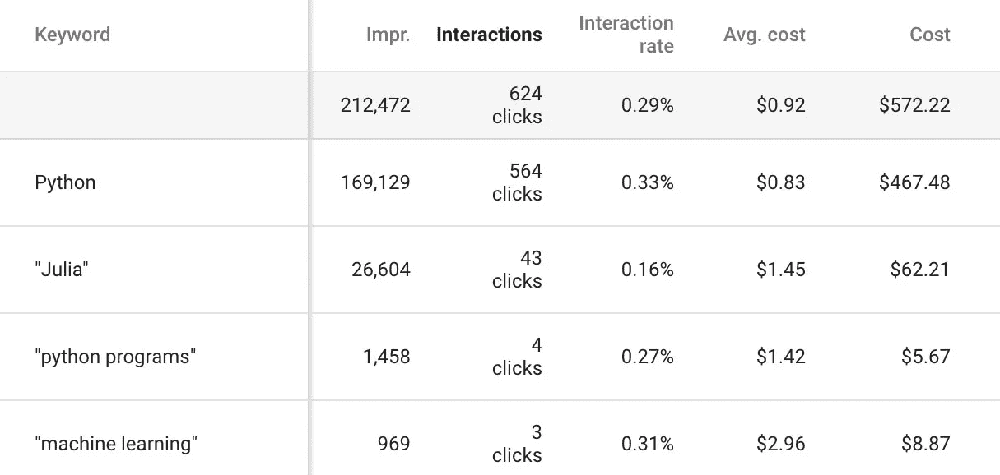
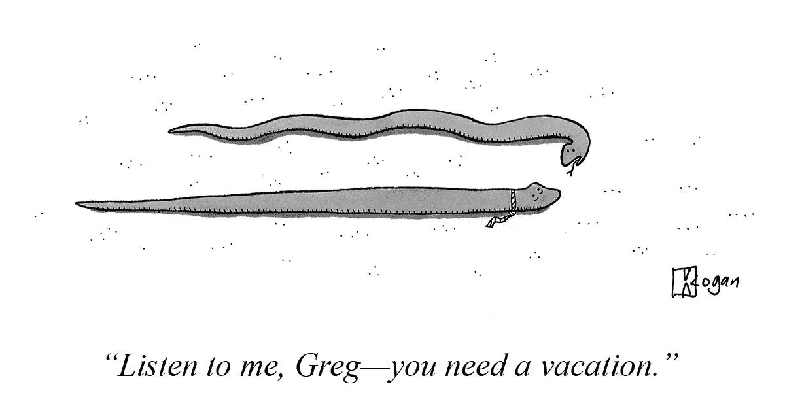

# 向玩蛇者出售软件，以及其他错误

> 原文：<https://medium.com/hackernoon/selling-software-to-snake-charmers-and-other-mistakes-8be304d7b48d>

这里有三个软件初创公司的故事，它们无意中向与预期非常不同的受众做了广告，接下来是检查你是否正在犯类似的代价高昂的错误的简单步骤，以及在未来避免这种错误的提示。

# 向耍蛇人出售数据科学平台

2015 年， [Domino Data Lab](https://www.dominodatalab.com/) 还是一家年轻的数据科学平台初创公司，团队大约 10 人。在市场上获得一些牵引力后，是时候花时间在[营销](https://hackernoon.com/tagged/marketing) …

所以，像许多公司(包括他们的竞争对手)一样，他们开始在 Google AdWords 上发布与数据科学相关的关键词广告:python、julia、机器学习等等…

AdWords 仪表盘上的东西看起来不错。对于一家年轻的初创公司来说，每月 572 美元并不算什么，但对于 624 名访客来说似乎是值得的。

当我被请来帮助他们时，我做的第一件事就是花 10 分钟浏览他们的 AdWords 活动。我总是对新客户这样做，因为 AdWords 经常因为一些[明知故犯的错误](https://www.gkogan.co/blog/how-ad-campaigns-fail/)而亏损，如果没有一个可靠的转化跟踪解决方案，这种情况就不会被发现(例如，他们不知道他们的销售来自哪里)。

无论如何，在我的“让我们确保我们不是在烧钱”检查开始几分钟后，我查看了人们在点击广告前使用的*实际*搜索词，突然我想起 python 不仅仅是一种编程语言，还是……一条蛇。

暂停活动。打开松弛部分。“你每月花 500 美元向蛇爱好者做广告。我关机了。”

毫无疑问，这些广告也获得了学习编程的人的点击，他们购买企业软件的可能性只比 snake 研究人员高一点点。

尽管很早就涉足蛇纹石市场，但达美乐坚持做它最擅长的事情，并且已经发展到 100 多名员工，而且[做得非常好](https://www.gkogan.co/case-studies/domino-data-lab/)。

人们不会阅读搜索结果，他们只会点击。所以你可能认为写得好的广告会屏蔽无关的流量，但事实并非如此。

在 snake 事件后不久，我被请来帮助另一家软件公司，该公司向应用程序开发公司销售产品(比如手机游戏工作室、社交媒体应用程序等)。他们有 50 多人，A 轮融资，以及大得多的营销支出。

尽管如此，我还是做了 10 分钟的 AdWords 健全性检查(具体步骤如下)。我看到有像`app downloads`和`app installs`这样的目标关键词来吸引用户获取经理，他们希望跟踪应用安装并将其归因于活动。但是…

你知道会发生什么…

暂停活动。打开松弛部分。“嘿，有一个活动，每月花费 X，000 美元在搜索*免费应用下载*的人身上。我暂停了它，并将彻底检查它。”

# 最贵的 404 页

当我在帮助[Netlify](https://www.netlify.com/)——一个现代网络项目的平台——时，我发现了另一个有趣的 AdWords 错误，那就是浪费金钱，但方式不同。

我正在分析不同的登录页面如何影响试用注册率，这时我注意到来自 AdWords 的大量访问者登录了 404 错误页面。

快速进入 AdWords 和几封电子邮件询问后，我们了解到 a)该网站的 URL 结构已经改变，b)并非所有旧的 URL 都被重定向，c)AdWords 中仍有广告向这些旧的 URL 发送(不便宜的)流量，因此到 404 错误页面。

暂停活动，打开松弛…实际上，这是一个快速修复，所以没有必要中断活动。

*令人惊讶的是，登陆 404 错误页面的访问者的注册率仍然略低于整个网站的平均水平，所以这并不是完全的浪费。感谢 Netlify 设计师创造了我所见过的最高转化率的 404 页面，但我仍然不建议这样做。

# 发现并避免这个代价高昂的错误

只需不到 10 分钟的时间，就能检查出你是否在明显不相关的流量上赔钱。如果你发现你是，这可能是你一整年付出 10 分钟努力的最高回报。另外，你可以告诉你的团队，“嘿，我刚刚阻止了我们花费 X 美元向[完全不相关的人群]销售软件。”

按照以下步骤检查你是否在无关的 AdWords 流量上花钱:

打开 AdWords，进入**关键词>搜索词**。

在**搜索词**报告中，您将看到您的广告显示的实际搜索词列表。

按**交互**或**成本**排序，看看哪些搜索词的成本最高。从这些开始，但不要忽略长尾搜索项，它们会消耗掉大量预算。扫描报告中的错误(不相关)关键字。

以下是修复或避免这种错误的方法:

# 1.缩小目标关键字的范围

默认情况下，AdWords 不仅显示与目标关键词匹配的搜索词的广告，还显示*包含*这些关键词的搜索词的广告(以任何顺序)，以及*模糊相似的*搜索词的广告。(谷歌称之为“广泛匹配”。)

例如，有一个目标关键字`data science`将匹配搜索项，如`using data in science`(包含关键字)、`scientific data`(类似于关键字)、`what is data science`，等等，从而显示广告。

知道了这一点，以下是如何缩小你的目标关键词，让你的广告展示给目标受众:

*   在每个关键字前添加一个加号(+)，AdWords 将只匹配包含该精确单词或非常接近的变体(如单词的复数形式)的搜索词。例如，`+data +science`。这在 AdWords 中被称为“广泛匹配修饰符”。
*   如果词序很重要——就像`data science`和`science data`一样——将关键词放在引号中:`"data science"`、`"data science platform"`等等。这将匹配包含此短语的搜索词。这个过滤器在 AdWords 中被称为“短语匹配”。
*   如果您仍然显示(或担心)不相关的搜索词，您可以将关键字放入方括号中，以匹配与*精确*短语(以及非常接近的变体，如复数形式)匹配的搜索查询，仅此而已。例如，目标关键字`[data science]`将向`data science`的搜索者显示广告，但不会向`data science platform`的搜索者显示广告。
*   使用两个或三个单词的关键字来避免歧义，尤其是当其中一个单词有多个含义时。

我通常使用较长的目标关键字(2-3 个单词)和宽泛的匹配修饰符(+)，以及一系列负面关键字的组合。

比如有歧义的`python`关键词可以用`+python +data +science`、`+python +machine +learning`、`+python +deep +learning`等代替。

# 2.使用负面关键词

这是一个会阻止你的广告出现的关键词列表。当您在搜索词中找到关键词时，您可以快速将它们添加到负面列表:

然而，注意不要在否定列表中添加过于宽泛的关键词，这可能会阻止广告显示好的关键词。取而代之的是，在不良搜索词中找出常用词，并将其添加为广义修正(`+foo +bar`)或短语匹配(`"foo bar"`)负面关键词。

在 python 的例子中，添加负面关键词如`snake`、`eggs`、`giant`、`burmese`、`buy`、`facts`和`colt`将避免大多数耍蛇人看到广告。

(说到正题，如果你是一家软件公司，那么添加负面关键词如`jobs`、`free`、`careers`、`why`和`how`也将有助于减少浪费的广告支出。)

我希望这是关于关键词定位和避免在 AdWords 中浪费广告支出的一堂有益且有趣的课。如果你发现你无意中向错误的观众做了有趣的(或令人沮丧的，取决于成本)广告，分享你的故事吧！

*原载于*[*www.gkogan.co*](https://www.gkogan.co/blog/selling-software-snake-charmers/)*。*