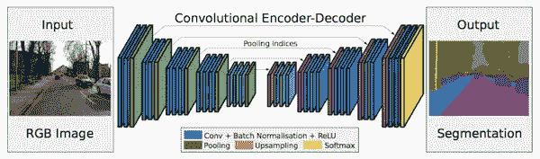

# 语义分割和转置卷积。

> 原文：<https://medium.com/hackernoon/semantic-segmentation-and-transposed-convolution-4b1dd964a14b>

Identifying motorable areas using FCN8

分割对于图像分析任务是必不可少的。*语义分割*描述的是将一幅图像的每个像素点与一个类别标签关联起来的过程，(比如*花*、*人*、*路*、*天*、*洋*，或者*车*)。

image source: [Mathworks](https://www.mathworks.com/help/vision/ug/semantic-segmentation-basics.html)

在语义分割方法中，有许多领域有很大的潜力。其中显然包括自动驾驶、锅炉的工业检查、热图表等。卫星图像中可见地形的分类、医学成像分析。出于个人兴趣，我还研究了通过植物的叶子来检测植物中的疾病。这也包括从实际疾病标记中分离出静脉或叶片的分割。这也使得疾病的处理和检测更容易和更准确。

**但是什么是语义分割呢？**

语义分割是在像素级别理解图像，也就是说，我们希望给图像中的每个像素分配一个对象类。例如，看看下面的图片。

Input Image [Source](http://host.robots.ox.ac.uk/pascal/VOC/voc2012/segexamples/index.html)

semantic segmentation. [Source](http://host.robots.ox.ac.uk/pascal/VOC/voc2012/segexamples/index.html)

在上面的图片中，只有三个类，人类，自行车和其他东西。FCN 可以被训练来探测道路、植物和天空。 [VOC2012](http://host.robots.ox.ac.uk/pascal/VOC/voc2012/) 和 [MSCOCO](http://mscoco.org/explore/) 是语义分割最重要的数据集。

2014 年，来自 Berkeley 的 Long 等人的[全卷积网络(FCN)](http://blog.qure.ai/notes/semantic-segmentation-deep-learning-review#fcn) 推广了用于无任何全连接层的密集预测的 CNN 架构。这允许为任何大小的图像生成分割图，并且与先前使用的补丁分类方法相比也快得多。几乎所有后来的语义分割方法都采用了这种模式。

除了完全连接的层，使用 CNN 进行分割的一个主要问题是*汇集层*。池层扩大了视野，能够在丢弃“在哪里”信息的同时聚合上下文。然而，语义分割需要类别图的精确对齐，因此需要保留空间信息。为了解决这个问题，文献中发展了两种不同的体系结构。

第一个是编码器-解码器架构。编码器通过合并层逐渐降低空间维度，解码器逐渐恢复对象细节和空间维度。 ***从编码器到解码器通常有捷径连接，帮助解码器更好地还原物体细节。***

这里不讨论第二种方法。

在经历转置卷积中的填充差异时，我学到了一些关于相同和有效填充的真正有趣的东西。这里要理解的最重要的事情是，滤波器核不会超出有效填充中的输入图像尺寸，这对于卷积和转置卷积都是如此。同样在同样的填充内核中可以走出图像的维度。

再谈**有效填充。**随着内核步幅的增加，输入图像会在像素之间填充。如果跨距为 2，则在每个现有的行和列之间将填充一个行和列。如果步幅为 1，则不会有任何填充。

Stride:1, kernel:3x3, [source](https://distill.pub/2016/deconv-checkerboard/)

Stride:2, kernel:3x3, [source](https://distill.pub/2016/deconv-checkerboard/)

保持 k 不变并增加步幅会减少重叠。这种重叠指的是由相邻内核操作计算的公共区域。让我们也想象一下相反的效果。

Stride:2, kernel:4x4, [source](https://distill.pub/2016/deconv-checkerboard/)

因此，填充的输入图像取决于步幅

> Ip_d= (I-1)*s
> 
> 其中，s =步幅，I=输入尺寸，Ip_d 为填充输入尺寸。

并且输出图像尺寸取决于填充的输入图像尺寸和内核尺寸，如下所示:

> o _ d = Ip _ d+k；
> 
> o _ d =(I-1)* s+k；其中 k 是内核大小。

无论内核大小是大于还是小于步幅，这个等式都成立，并且可以在这里得到验证。然而，我的同事 [Keshav Aggarwal](https://medium.com/u/efb9f9c5c826?source=post_page-----4b1dd964a14b--------------------------------) 在 tensorflow 上玩一些代码时推导出了一个[更好的等式](https://towardsdatascience.com/transpose-convolution-77818e55a123)，它说。

> O_d *= I * s+ max(k — s，0)；其中所有变量同上。*

我建议稍微修改一下代码。

**同样的填充**更简单但相当神秘。相同的填充总是填充图像外部的空行和空列。在正常卷积中，即使填充是相同的，并且内核可以用所提到的步幅适当地扫描整个图像，实际上在输入图像上没有进行填充。然而，如果由于内核大小和步幅值而留下一些行或列，则添加一些额外的列和行来覆盖整个图像。

在转置卷积中情况并非如此。输出图像尺寸不依赖于滤波器的核心尺寸，而是增加所述步幅的次数。

> o _ d = I _ d * s；
> 
> 其中 s =步幅，I_d=输入尺寸，O_d 为填充输入尺寸。

在这种情况下，输出尺寸由系统预先计算，然后在应用滤波器以保持输出尺寸之前，在外部对图像进行相应的填充，与去卷积后计算的尺寸相同。优先添加列，在图像的两侧相等。然而，如果它们不能相等地相加，则剩余的额外列被添加到右侧。

那么，我如何使用这两种滤镜对图像进行上采样呢？

很简单，因为现在我们有了方程。假设我们想将一幅图像放大到原来的两倍。

对于**相同的填充**你可以设置内核为任何合适的值，步幅为 2。

对于**有效填充**，您可以将内核和步幅值都设置为 2。

然而，这些过滤器的性能是一个实验领域。我发现相同的填充比这里的有效填充效果更好。将内核大小设置为偶数并不是一个好的做法，但是如果您想使用有效的填充将内核大小提高 2 倍，似乎没有其他方法。

你可以访问我的 [Github](https://github.com/UjjwalSaxena) 个人资料中的一些项目，更多文章请访问我的媒体账户或 [Wordpress](https://erujjwalsaxena.wordpress.com/) 。