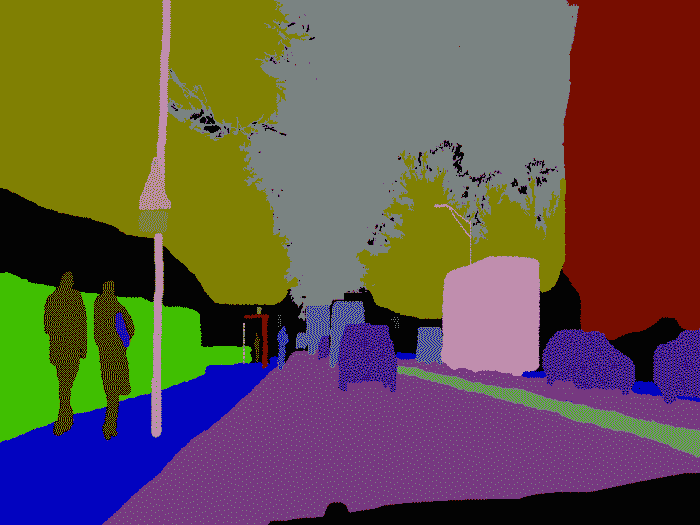
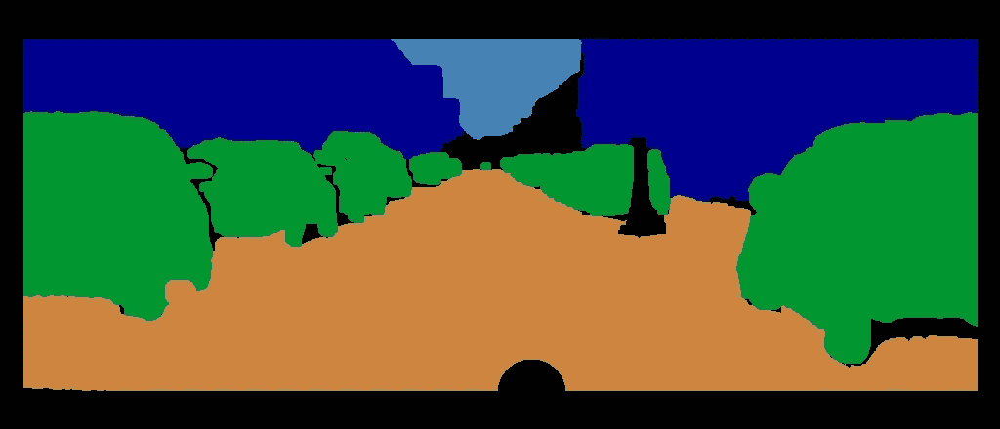
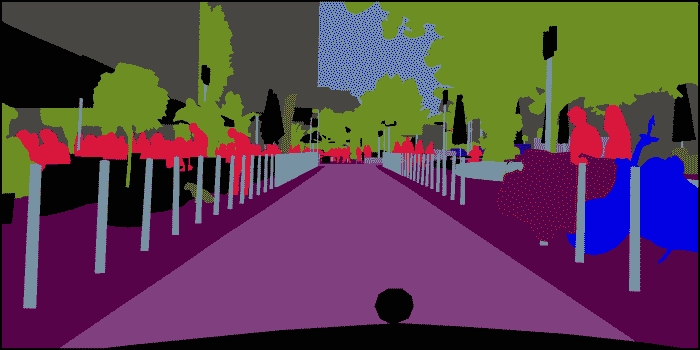
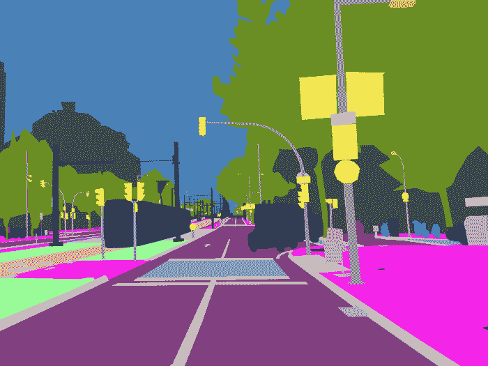

# 用于自动驾驶的语义分割数据集

> 原文：<https://medium.com/hackernoon/semantic-segmentation-datasets-for-autonomous-driving-1182ebd2aff0>

## 对城市语义分割的开放数据集的理解将有助于人们理解在训练自动驾驶汽车模型时如何进行。

> 最初发布于 [Playment.io](https://blog.playment.io/self-driving-car-datasets-semantic-segmentation/)

在过去的 10 年里，人们在语义分割任务的算法改进和数据集创建方面做了无数的努力。最近，在这个领域(视觉场景理解的子集)有了快速的进展，这主要归功于深度学习方法的贡献。但是深度[学习](https://hackernoon.com/tagged/learning)技术有一个消耗大量注释数据的致命弱点。在这里，我们回顾了一些广泛使用和开放的自动驾驶汽车应用的城市语义细分数据集。

# 什么是语义切分？

语义分割的任务是用对象类来注释图像的每个像素。这些类别可以是自动驾驶环境中的“行人、车辆、建筑物、植被、天空、空间等”。例如，语义分割有助于 SDC(自动驾驶汽车)发现图像上的可驾驶区域。

# 数据集

## 坎维德

CamVid(960px x 720px)

*   剑桥驾驶标记视频数据库是 2007 年底在自驾车领域发布的首批语义分段数据集之一。他们使用自己的[图像注释软件](http://mi.eng.cam.ac.uk/projects/cvgroup/software/index.html)从 10 分钟的视频序列中注释了 700 幅图像。摄像机安装在汽车的仪表板上，视野与驾驶员的视野相似。

## 凯蒂

KITTI Dataset(1242px x 375px)

*   KITTI(卡尔斯鲁厄技术研究院[和丰田技术研究院](https://hackernoon.com/tagged/technolopgy))数据集于 2012 年发布，但没有语义分割的图像。其他独立的小组已经为他们自己的用例标注了框架。虽然，确实存在用于[道路和车道检测](http://www.cvlibs.net/datasets/kitti/eval_road.php)的数据集和基准套件。在这个较小的数据集中，各种传感器，包括灰度和彩色摄像机、激光扫描仪和 GPS/IMU 单元，都安装在汽车顶部。

**DUS**

DUS Dataset(1024*440px)

*   戴姆勒城市分割数据集是由 5000 幅灰度图像组成的数据集，其中只有 500 幅图像进行了语义分割。与大多数数据集不同，它不包含“nature”类。这个数据集是由汽车制造商戴姆勒的研究人员发起的名为 [6D 视觉](http://www.6d-vision.com/home)的更大研究计划的一部分。
*   由于它的尺寸很小，这将作为一个很好的试验台来观察语义分割模型的推广情况。

## **城市景观**

Cityscapes Dataset(2048*1024px)

*   这是“戴姆勒城市分割”数据集的延续，其中地理和气候的范围已经扩展到捕捉各种城市场景。该数据集还包含粗糙图像，以支持利用大量弱标记数据的方法。与 DUS 类似，摄像头安装在挡风玻璃后面。
*   这 30 个类别还分为 8 个更高级别的类别。该数据集的一个独特之处在于，作者提供了 20000 多幅带有粗略分割的图像。许多深度学习技术已经使用这个额外的数据集来提高他们的 IoU 分数
*   最近的模型目前有超过 80%的 IoU(交集/并集)。此链接包含对他们的评分方法以及基准测试套件的解释

## 枫叶

Mapillary Vistas Dataset (4000+px x 3000+px)

*   mapi pile 是一个街道级的影像平台，参与者可以在此合作构建更好的地图。他们提供了一部分图像数据集，并以像素级的精度对其进行了标注。在撰写这篇博文时，它是世界上最大和最多样化的开放数据集，地理范围跨越各大洲。
*   该数据集还包括 66 个类别中 37 个类别的实例级城市语义分割。由于 mapi piles 平台上的图像是协作收集的，它们来自各种视角，正如通过[这个探索者](https://www.mapillary.com/dataset/vistas)所看到的
*   人们可以通过[在这里](https://eval-vistas.mapillary.com/)提交他们数据集上的算法。

# 最后的想法

随着研究人员寻求创建更新的基准，开放数据集的世界正在不断增长。随着每个新数据集的内容不断增加，可以根据模型对我们周围的自然世界的概括程度来评估模型。而且，如果你认为这是开放数据集发展的终结，那就去看看 SYNTHIA，一个来自虚拟城市场景的图片库！

敬请关注更多关于城市语义细分的深度学习模型。