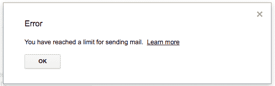

# 从 Python 发送电子邮件

> 原文：<https://medium.com/hackernoon/sending-email-from-python-ca1eea9577f>

## 我将展示如何使用你的 Gmail 账户用 Python 编程语言发送电子邮件。

# 电子邮件服务器

当你想从 GUI/CLI 应用程序或一些计算机语言(在这个例子中是 [Python](https://hackernoon.com/tagged/python) )发送[电子邮件](https://hackernoon.com/tagged/email)时，你需要访问邮件服务器。

邮件服务器是一台负责收发邮件的电脑。

通常，您可以通过用户名和密码访问邮件服务器。

Gmail 用户名是您的电子邮件地址，密码应该只有您自己知道:-)。

# 使用 yagmail

使用 Gmail 帐户从 Python 发送电子邮件，我认为最好使用 [yagmail](https://github.com/kootenpv/yagmail) packet。

你可以用 [smtplib](https://docs.python.org/3/library/smtplib.html) 库浪费时间，但是如果你用的是 Gmail 账户，就用 [yagmail](https://github.com/kootenpv/yagmail) 吧。

用
`pipenv install yagmail`安装

# 代码示例

这只是一个简单的代码示例，对于生产代码，不要将密码放在源代码中。

就我个人而言，我在每个项目中使用一个 JSON 文件(这个文件使用伪凭证提交给源代码控制)来存储我个人项目的用户名和密码。

这是一个简单的单行示例:

> 导入 yagmail
> 
> yag = yagmail。SMTP('YOUR_EMAIL@gmail.com '，' YOUR_PASSWORD ')。发送('发送到@someone.com '，'主题'，'这是正文')

yag = yagmail。SMTP('YOUR_EMAIL@gmail.com '，' YOUR_PASSWORD ')。发送('发送到@someone.com '，'主题'，'这是正文')

我通常是这样用的:

> 导入 yagmail
> 
> yag = yagmail。SMTP('您的电子邮件@gmail.com '，'您的密码')
> 
> body = '我创造的庞大身躯'
> 
> yag.send('收件人@someone.com '，'主题'，正文)

在邮件正文中添加图片，需要使用`yagmail.inline`:

> 导入 yagmail
> 
> yag = yagmail。SMTP('您的电子邮件@gmail.com '，'您的密码')
> 
> contents = ["Some Text "，YAG mail . inline(full _ path _ to _ image)]
> 
> yag.send(发送至，主题，内容)
> 
> yag = yagmail。SMTP('您的电子邮件@gmail.com '，'您的密码')
> 
> contents = ["Some Text "，YAG mail . inline(full _ path _ to _ image)]
> 
> yag.send(发送至，主题，内容)

# 我的建议和经验

Gmail 对你每天发送的邮件数量有限制。

在我写这篇文章的时候，每天有 [500 封电子邮件](https://support.google.com/mail/answer/22839?hl=en)，如果超过这个数字，你将无法在接下来的 24 小时内发送电子邮件(至少这发生在我身上，我已经连续发送了 100 封电子邮件)。

所以，我的建议是有一个单独的 Gmail 帐户，只是为了从你的代码自动发送电子邮件，你不想失去从你的个人电子邮件帐户发送电子邮件的能力(我在那里，这并不好笑)。

此外，发送电子邮件之间会有一些延迟，当我的账户被锁定 24 小时时，我只连续发送了大约 100 封电子邮件，但在我添加了`time.sleep(15)`之后，我再也没有遇到过这个问题。

我不是用 Gmail 给人发垃圾邮件，我是用它给自己发邮件报告，主要是来自网络抓取任务(每天大约 20 个)。

## 如果您遇到错误 534

> 文件“/usr/lib 64/python 3.6/smtplib . py”，第 730 行，在 login raise last_exception 文件“/usr/lib 64/python 3.6/smtplib . py”，第 721 行，在 log in initial _ response _ ok = initial _ response _ ok)文件“/usr/lib 64/python 3.6/smtplib . py”，第 642 行，在 auth raise SMTPAuthenticationError(code，resp) smtplib。SMTPAuthenticationError: (534，b ' 5 . 7 . 14<https://accounts.google.com/signin/continue?sarp=1&SCC = 1&PLT = AKgnsbvo \ n 5 . 7 . 14 advphf 123 p 0 oetqxn-eqs-JNK 6 MEO 6 qrtmz 4c 4 rpyb 9j _ qmyzfls 8 ay F3 yjj sgcn 7 melq \ n 5 . 7 . 14 5 rpqd 9 sa qwhf h6 cjnujclyw 1 qldplpwbvocaqipf 8\n5.7.14 了解更多信息，请访问\ n 5 . 7 . 14[https://support.google.com/mail/answer/78754](https://support.google.com/mail/answer/78754)204-v6sm 5976350 wmh . 25—GSM TP’)
> 
> 文件“/usr/lib 64/python 3.6/smtplib . py”，第 730 行，登录
> 
> 文件“/usr/lib 64/python 3.6/smtplib . py”，第 721 行，登录
> 
> 初始响应确定=初始响应确定)
> 
> 文件“/usr/lib 64/python 3.6/smtplib . py”，第 642 行，在 auth
> 
> 引发 SMTPAuthenticationError(代码，响应)
> 
> smtplib。SMTPAuthenticationError: (534，b ' 5 . 7 . 14<https://accounts.google.com/signin/continue?sarp=1&SCC = 1&PLT = AKgnsbvo \ n 5 . 7 . 14 advphf 123 p0oetqxn-eqs-JNK 6 MEO 6 qrtmz 4c 4 rpyb 9j _ qmyzfls 8 ay F3 yjjsgcn 7 melq \ n 5 . 7 . 14 5 rpqd 9 sa qwhf h6 cjnujclyw 1 qrldplppwbvocaqipf\n5.7.14 了解更多信息，请访问\ n 5 . 7 . 14[https://support.google.com/mail/answer/78754](https://support.google.com/mail/answer/78754)204-v6sm 5976350 wmh . 25—GSM TP’)

解决方案是

> 谷歌阻止不使用现代安全标准的应用程序的登录尝试(在其支持页面上提到)。但是，您可以通过以下链接打开/关闭此安全功能:
> 
> 进入此链接，选择打开 https://www.google.com/settings/security/lesssecureapps
> 

*出自:
[https://stackoverflow.com/a/26852782/2006674](https://stackoverflow.com/a/26852782/2006674)*

# *结论*

*使用 [yagmail](https://github.com/kootenpv/yagmail) 从 Python 发送电子邮件很容易。*

**原载于 2018 年 9 月 15 日*[*buklijas . info*](http://buklijas.info/blog/2018/09/15/sending-email-from-python/)*。**