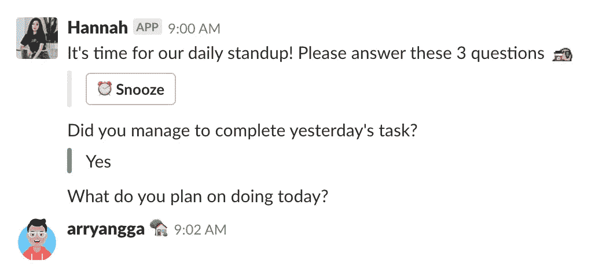

# 如何在一些应用程序上发送非打印字符

> 原文：<https://medium.com/hackernoon/sending-non-printing-character-428620ed9424>

今天早上我在想如何在 Standuply 频道( [Slack](https://hackernoon.com/tagged/slack) )发送一条空消息。幸运的是，我刚刚在 [stackexchange](https://android.stackexchange.com/questions/67755/how-to-insert-blank-character-in-whatsapp) 找到了答案，也是维基百科上一篇关于**非印刷字符的文章。**

> **非印刷** [**字符**](https://hackernoon.com/tagged/character) 是[字符集](https://en.wikipedia.org/wiki/Character_encoding)中的[码点](https://en.wikipedia.org/wiki/Code_point)(一个[号](https://en.wikipedia.org/wiki/Number))，不代表书写符号。

只是测试发送非印刷字符→“‏‏‎”,它的作品。

Non Printing character work on slack. 😂

我只是想做一些有趣的事情，它也在 telegram，whatsapp 和 instagram 上工作。😂

I’m able to fill instagram bio, name and address with non printing character.

Just sending non printing character to my friend on telegram.

Whoops, empty article on medium.

此外，我可以在介质上写非印刷字符，这里是链接[https://medium.com/@arryanggaputra/-b6fb7c7be8b](/@arryanggaputra/-b6fb7c7be8b)，如此有趣的人。今天我学到了很多，感谢上帝🙏🏻😂