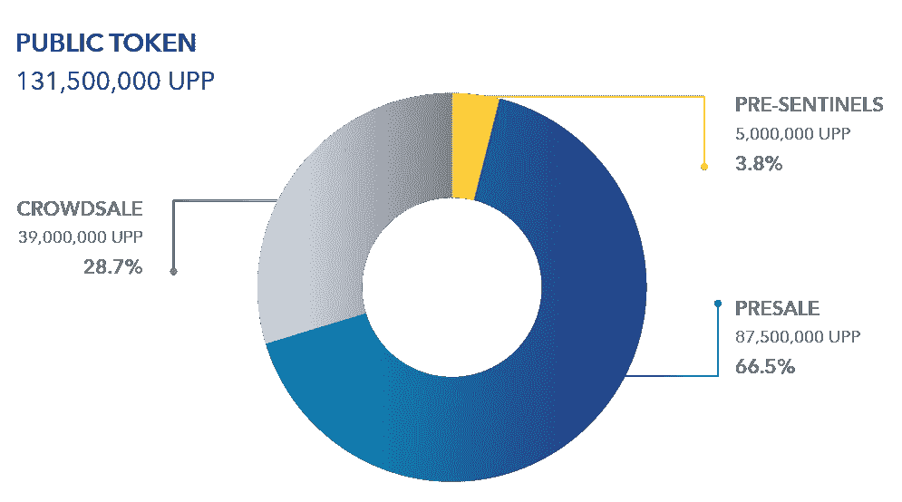

# 哨兵协议回顾——加密空间西部荒野的“机械战警”

> 原文：<https://medium.com/hackernoon/sentinel-protocol-review-the-robocop-for-the-wild-wild-west-of-the-crypto-space-5bcb652cd4d0>

*区块链的安全智能*

哨兵协议提供了迄今为止密码领域最臭名昭著的问题之一的解决方案，**它的“阴暗面”**:

*   安全性一直是所有行业关注的主要问题，区块链也不例外。
*   区块链技术在世界范围内是革命性的，然而，它被许多危险所包围。
*   这是为什么没有更广泛采用的障碍之一，也是为什么 Sentinel 协议对于加密空间是必不可少的。

在加密空间中对自己的加密资产负责是一项真正令人满意的工作，但也是一项有风险的工作。有许多威胁，如*诈骗者、网络钓鱼者和黑客*会危及你的加密货币储存。

*想象一下，当你穿过一片幽深、阴森的丛林时，你会觉得自己好像被人跟踪了……这种感觉类似于网络罪犯不断在加密世界中四处窥探，寻找下一个受害者。*

对于新的加密用户来说尤其如此。必须采取额外的预防措施，以便生态系统的新用户不会被利用或失去他们的衬衫，导致他们带着酸味离开秘密空间。

这种消极的观点很容易损害区块链技术的应用，并限制其对人类的实用性。

Sentinel 协议是解决这一难题的合理方案。

*   它使用区块链技术，并应用基于情报的威胁算法来分析加密用户的潜在危害。
*   这与加密功能相结合，通过利用网络安全专家构建的分散式集体情报系统，帮助解决加密空间的安全问题。

*Sentinel 协议旨在创建一个安全、创新的区块链生态系统，让每个人都能从中受益。(…当然除了黑客和骗子！)*

**简而言之**:密码爱好者可以用来保护他们的密码资产的协议。

**为了体验这种程度的信任和信心，高安全性协议是必不可少的，而这正是 Sentinel 协议要建立的。**

# 问题是

***密码世界需要一个英雄。***

*   加密用户在保护自己免受黑客、网络钓鱼者、勒索软件攻击和骗子攻击方面的选择有限
*   各个国家、地区和州的法规各不相同，因此很难在全球范围内保护个人
*   个人没有企业用来保护自己的预算，也可能没有专业知识来选择一种真正能保护他们的服务
*   此外，即使加密组织或交易所知道他们的安全程序，也可能存在使他们容易被黑客攻击的漏洞。

最近大规模的例子包括 Coincheck 丢失了 5 . 23 亿 NEM 硬币的黑客攻击，虽然这些硬币不能被犯罪者花掉，但受害者并没有完全康复。即使是众所周知的网络名人也不是完全安全的。最近，著名的密码艺人和投资者伊恩·巴里纳损失了大约 200 万美元的个人**。**

**

**自 2011 年以来，至少有 36 家加密货币交易所遭到黑客攻击，导致超过 980，000 个比特币丢失，按今天的汇率计算，这相当于超过 80 亿美元。**

***缺乏法律、法规、规章和监督***

*由于每个国家、地区和州的密码法律、规则和条例都不相同，这使得保护在密码领域进行交易的个人和组织成为一项极其困难和复杂的任务。*

*由于缺乏监管和区块链固有的性质，受害者几乎不可能将任何被盗代币归还给他们。*

*每个人都被留下来保护自己，因为区块链的自治性质确保了责任和安全的义务落在每个持有加密的个人的肩上。*

*更糟糕的是，对于一个密码破解者来说，有数不清的方式被黑客攻击或欺骗。这个问题在整个密码空间蔓延，因为没有法律、规则、条例，甚至没有监管机构监管这个空间。*

****

***无数的黑客、诈骗和欺诈充斥着 ICO 领域。***

*   *[**Seele 200 万美元的骗局**](https://www.kaspersky.com.au/)*
*   *[**越南 6.6 亿美元 ICO 诈骗**](https://www.coindesk.com/vietnam-investigates-ico-fraud-660-million-losses-reported/)*

*这里的问题不是支撑一切的区块链和加密，而是其他因素的变量。*

*   *真正的问题在于围绕区块链和加密生态系统的系统和应用程序，这使得用户和组织容易受到攻击。这包括攻击媒介，如安全性差的网站、应用程序和缺乏安全防范措施。*

*当然，我们不能忘记这里的共同点，那就是我们——人类！*

*   *迄今为止，绝大多数成功的黑客攻击、诈骗和欺诈都可能是由人为错误、愚蠢、无知和贪婪造成的。*

***网络安全行业的不合作性质***

**“看到坏人分享数据、技巧和方法，而好人却没有有效的方法，这真的令人抓狂。”— Anton Cuvahkin，Gartner 副总裁**

*就目前的网络安全行业而言，服务提供商*实际上*不愿意彼此分享商业秘密和知识，因为这正是他们在市场上超越竞争对手的优势。*

*迈克菲和卡巴斯基等网络安全公司宁愿看到彼此失败，也不愿让客户成为恶意软件和计算机病毒的牺牲品，这样这些客户就会选择跳槽，使用其他防病毒程序和服务。*

*不幸的是，最终用户和客户承担了网络安全行业效率低下的成本，谢天谢地，随着区块链技术的发明，现在有了更好的选择。*

# *解决方案*

*预防胜于治疗，加密当然也不例外，尤其是当涉及到欺诈性的黑客和骗局时。*

**

**【技术架构:区块链安全智能平台】**

*这就是为什么 Sentinel Protocol 提出了一个“安全智能平台区块链”来解决上述问题，它提供了:*

*   *S-Wallet 提供高级安全功能，如机器学习和分布式恶意软件沙箱*
*   *威胁信誉数据库(TRDB)*
*   *哨兵门户，这是一个鼓励协作的集体情报框架*
*   *一群值得信赖的网络安全专家被命名为“哨兵”*

*这些产品和服务的组合旨在通过减少黑客攻击、诈骗和欺诈的频率和损害，使加密生态系统更加安全。*

***1。为被盗加密货币创建法律证据***

*Sentinel Protocol 的“威胁信誉数据库”(TRDB)存储详细信息，包括所有已实施黑客攻击的报告、属于黑客的钱包地址、钓鱼网站的名称等。*

*通过将 KYC 集成到数据库中，TRDB 应该能够识别其用户的真实身份，这将允许被黑客攻击的用户提交报告，然后由安全专家验证，这样这些用户就有了关于每个事件的证据。*

***因此，将被盗货币归还给原始使用者成为一个更加实际的结果。***

*由于区块链不可改变和可追踪的性质，数据库可以跟踪被黑客攻击的资金被发送到哪里，并将这些地址列入黑名单，因为它们很可能被黑客控制。*

**

**【参与犯罪活动的钱包将被标记】**

*当加密货币交易所通过 API 与数据库集成时，只要任何黑名单上的地址将资金存入其交易所，他们就会收到警报，允许他们扣押资金并将其返还给受害者。*

***2。提供整个密码领域的监督***

*在 Sentinel 协议中，有一群可信的网络安全专家和机构，他们组成了一个名为“哨兵”(Sentinels)的团体，这些哨兵:*

1.  *验证黑客攻击的报告，并跟踪黑客的钱包地址*
2.  *分析威胁和攻击的根本原因，以更新数据库中的信息*
3.  *确保数据库准确反映最新的安全研究和分析*

***你可以把哨兵很像一个“邻里守望”组织。***

**

*此外，还有一种 S-Wallet，它本质上是一种附加了防病毒软件的钱包，由人工智能(AI)和机器学习(ML)引擎驱动。这个钱包将帮助用户避免发送交易到黑名单钱包和地址，从而防止他们丢失密码。*

***3。收集加密社区的集体智慧***

*与当前的网络安全行业不同，区块链技术可以激励安全专家之间的合作和协作，并让他们一起工作。*

*这是通过一种称为“监控点”的监控协议激励机制来实现的，该机制鼓励专家参与进来，为所有参与者的更大利益而共同努力。*

**

*有了更大的数据库和关于潜在威胁、黑客和诈骗的信息子集，就有可能防止进一步的损害或事件。*

*通过集体智慧和加密人群的智慧，哨兵协议能够有效地收集黑客的钱包地址，恶意网址，钓鱼地址，恶意软件散列等。*

*当安全智能平台区块链被密码交易所、支付系统和钱包整合时。*

*这将极大地抑制并最小化黑客可能造成的伤害，因为黑客很难将被盗的加密货币兑换成金钱，因为如果被盗的加密货币落入连接到数据库的善意用户手中，被盗的加密货币将被跟踪、追踪并有希望被追回。*

# *主要特征*

*Sentinel 门户是由安全专业人员运行的知识库。只要加入 Sentinel 协议社区，用户就可以从他们的集体知识中受益匪浅。Sentinel Protocol 将是首批基于 ICON 构建的 dApps 之一，使用的是 ICON 的授权利益证明(DPoS)引擎。*

*S-wallet 是一个人工智能驱动的钱包，它可以分析包括零日威胁在内的威胁，以保护用户免受诈骗网址、“坏演员”钱包地址和其他不良行为的影响*

*这就像在账本上有一个你自己的个人欺诈检测系统，它像一只虚拟的看门狗一样监视着你。*

**

***分布式恶意软件沙箱(D-Sandbox)** 是一种用于在远离主应用程序或机器的隔离环境中运行未经测试或验证的应用程序的技术*

*D-Sandbox 系统采用基于票证的系统，允许专家通过他们的集体知识进行分析。这种方法有两个优点:*

1.  *投资减少，因此成本效益显著提高*
2.  *更经济，因为它利用了 Sentinel 门户中机器的综合计算能力。*

**

**简化的网络和 Sentinel 协议生态系统**

*下面是一个安全流程示例，详细描述了从用户到系统的分析和编目过程。*

***威胁信誉数据库(TRDB)旨在解决两个不同的问题:***

*1)网络安全数据集中在一个物理位置的问题:*

*   *如果数据存储在一个位置，就容易受到有针对性的攻击。*
*   *Sybil 攻击:一个用户通过伪造身份假装成多个用户来破坏信誉系统的攻击将在不久的将来发生。*
*   *区块链的分散性质减轻了这种影响，因为它的不变性使得伪造数据更加困难。*

*2)安全供应商之间缺乏共享知识。*

*   *收集风险信息是防止攻击的关键点，但安全供应商没有动力分享他们的信息，因为没有动力。*
*   *TRDB 利用奖励计划，鼓励安全专家和供应商根据共识机制和参与者的反馈或授权的利益证明，为建立威胁数据库做出贡献(DPOS)。*

**

**威胁信誉数据库(TRDB)**

***威胁信誉数据库(TRDB)的主要功能***

*   *没有攻击点*
*   *数据完整性*
*   *交易可追溯性*
*   *API 免费提供*
*   *平台不可知*
*   *防盗系统*

# *路标*

***第一阶段:加密货币世界的哨兵协议***

*   *1 月 18 日*
*   *总部 R&D 中心在 APAC 开业。*
*   *总部 R&D 中心的安全研究人员整合了历史上存在的网络犯罪、诈骗信息，并将其编入区块链计划威胁信誉数据库(TRDB)。*
*   *区域 R&D 中心开发互动合作框架(ICF)界面。*
*   *2 月 18 日*
*   *SIPB 原型测试。*
*   *3 月 18 日*
*   *SIPB 测试网启动与令牌发行。*

***第二阶段:保护证明***

*   *6 月 18 日*
*   *公共 SIPB 最佳版本:由哨兵协议集体门户提供服务的哨兵协议。*
*   *7 月 18 日*
*   *Mainnet 启动(TRDB 特色的手动报告启用进入 mainnet。*

***第三阶段:自我净化***

*   *11 月 18 日*
*   *机器学习引擎测试版。*
*   *12 月 18 日*
*   *机器学习引擎功能发布(应用自动报告)测试版*
*   *分布式沙盒(D-sandbox)发布。*

***阶段 4:自我进化***

*   *2019*
*   *基于机器学习的欺诈检测系统(FDS)发布到 mainnet*

*Sentinel 协议的第一阶段侧重于用户采用和为加密货币钱包提供商 imToken 和 CoinManager 配备 Sentinel 协议的系统。*

*第二阶段的重点是在韩国、日本和东南亚地区采用 Sentinel 协议。*

*第三阶段将会看到 Sentinel 协议向外扩展，并瞄准非加密市场。*

# *象征经济学*

*哨兵协议的本地加密货币是乌普萨拉令牌。*

**(有趣的事实:乌普萨拉是瑞典一个古老的维京首都的名字，哨兵协议的联合创始人在那里第一次提出了这个项目的想法。*)*

*   *乌普萨拉象征符号:UPP*
*   *UPP 是一种公用令牌，用于支付哨兵协议提供的商品和服务*

**

*所有 UPP 收入的 30%以及由通货膨胀计划产生的 UPP 将留作对社区贡献者的奖励。UPP 遵循 3-7%的初始通胀率。*

*贡献者被激励尽早参与到生态系统中，因为早期贡献可以获得更大份额的 UPP 奖励。*

***代币奖励系统***

*Sentinel 协议也有 Sentinel Points (SP ),用于标记 Sentinel 的信誉值。这些 sp 是通过充当哨兵成员和参与保护证明(PoP)活动获得的，例如:*

*   *报告黑客的钱包地址或 IP*
*   *验证黑客攻击的报告和声明*
*   *记录钓鱼网站*
*   *解决突发事件案例*

*个人也可以通过举报黑客事件和投票支持有益的哨兵来获得奖励。这些前哨点可以转换成 UPP，作为对用户贡献的奖励。*

***众筹详情***

*   *UPP 将是一个 ERC20 令牌，直到它被移植到图标的 Mainnet*
*   *价格:1 ETH = 5，000 UPP(含 15%的售前奖金:1 ETH = 5，750 UPP)*
*   *硬性规定:2200 万美元*
*   *奖金:30%私有，15%公共预售*
*   *未售出的代币会被烧掉*
*   **私人投资者有 6 个月的锁定期【不确定这是仅与奖金相关还是与所有代币相关】**
*   *预售锁定:红利代币在发行日期后 180 天发行*

**

## *令牌分解*

*   *总代币供应量:5 亿 UPP*
*   *私募融资 1167 万美元*
*   *剩余 1033 万美元*
*   *3.8%(约 39.3 万美元)免费提供给选定的预哨兵*
*   *公开预售的 66.5%(约 687 万美元)，其中约 343 万美元的 50%将分配给战略贡献者*
*   *主要代币销售的 29.7%(约 307 万美元)*

**

# *潜在考虑因素*

***竞争:** Sentinel 协议是第一个针对密码安全的同类协议。因此，它具有先发优势，唯一可与之相比的项目是 Quantstamp，它专注于智能合同审计，因此它们不是直接的竞争对手。*

***黑客:**黑客有可能通过几种途径绕过 Sentinel Protocol 的系统:*

*   *被盗加密资产的场外交易可能会让黑客进入菲亚特。*
*   *不可追踪的隐私币可以让黑客切断与被盗加密资产的任何联系*
*   *黑客可以通过向随机钱包地址以及他们自己的钱包进行交易，将窃取的加密资产发送到他们不拥有的钱包，以迷惑哨兵*

***网络效应:** Sentinel 协议极其依赖于与各种交易所和钱包的合作，以及加密用户对其 S-Wallet 的采用。*

*如果整个加密生态系统的交易所、钱包和支付系统不采用他们的安全协议，犯罪分子可以使用非集成平台来套现任何被盗的加密货币。*

***Github 代码:**由于 Sentinel 协议正在 ICON 上构建，该团队无法透露他们的代码，因为 ICON 的代码还没有公开。一旦 ICON 的代码可用，Sentinel 协议的代码、API 和 SDK 也将公开。*

***区块链开发人员:**该团队似乎没有任何区块链或智能合同开发经验，但他们有几名在区块链领域拥有强大背景和人脉的顾问。*

# *组*

**

*[**帕特里克·金**](https://www.linkedin.com/in/%ED%98%95%EC%9A%B0-%EA%B9%80-0880b467/)——*创始人兼首席执行官**

*   *作为 Darktrace(用于网络安全的机器学习)的网络技术专家、Fortinet 的系统工程师以及 F5 Networks 和 Cisco 的专业服务顾问，在 IT 安全行业拥有超过 10 年的经验。*
*   *帕特里克·金成为以太坊 Mist 钱包[“安全问题”](/sentinelprotocol/cryptolands-security-that-lets-you-have-a-good-night-s-sleep-450752edf77)的受害者，该钱包在 2016 年导致 7，218 个 ETH 丢失，导致他创建了 Sentinel Protocol*

**

*[**Hae Min(HM)Park**](https://www.linkedin.com/in/hae-min-park-92027049/)—*联合创始人兼运营总监**

*   *作为 Darktrace、F5 Networks 和 Penta Security Systems 的客户经理、Penta Security Systems Inc .的全球客户经理和 Webcash Inc .的后端系统程序员，拥有 10 年的 IT 安全经验。*
*   *成就:*
*   *2006 年 4 月 Hae 在 F5 networks 工作期间获得了“最佳销售奖”*
*   *专利:*
*   *2012 年 5 月 2017 日[美国 20120124661 A1](https://www.google.ch/patents/US20120124661) —一种检测 Web 应用攻击的方法*
*   *Dec1，2011 KR 1020110127909 —一种 Web 应用防火墙和源代码漏洞分析工具的互操作方法*

**

*[**约翰·基尔希**](https://www.linkedin.com/in/johnkirch/)**——***首席传道者**

*   *25 年技术行业经验，建立并领导网络安全和商业智能团队*
*   *曾任 Darktrace 的区域总监、国家经理、Nominum(基于 DNS 的安全和服务的全球领导者)的日本区域总监和 Penta Security Systems(网络和数据安全公司)的副总裁。*
*   *他的日语也很流利。*

**

***Dayeol Lee**——*核心开发者**

*   *Dayeol 拥有计算机科学博士学位，在 IT 领域有 3 年的工作经验。*
*   *曾在 Penta Security Systems 担任软件/系统工程师，在 WINS 有限公司担任网络安全研究员/软件工程师。*

**

*[**迈克尔周**](https://www.linkedin.com/in/michaelzhouchong/)——*威胁情报负责人**

*   *6 年在 IT 安全行业担任各种职务的经验，最近在 Palo Alto Networks 担任支持交付经理、威胁、端点、云和虚拟化，在 Evonik 担任网络工程师*

**

*[**那荣冲**](https://www.linkedin.com/in/narong-chong-0262322/)——*安全运营负责人**

*   *他曾在多个领域深入工作过，如网络、安全、硬件、软件团队。*
*   *13 年 IT 行业经验，曾在 Palo Alto Networks 和 F5 Network 担任多种职务。*

**

***郭峰** — *核心开发者**

*   *11 年 IT (SAP)项目实施经验。*
*   *3 年以上金融市场领域商业智能和大数据分析经验*
*   *最近在星展银行担任副总裁，在 SGX(新加坡证券交易所)担任助理副总裁。*

**

*[**民宇 Ku**](https://www.linkedin.com/in/min-woo-ku-50341821/)**——*产品负责人****

*   ***8 年以上销售经验。***
*   ***曾任 Westcon-Comstor Asia 渠道销售经理和 Dimension Data 解决方案销售总监***

******

*******——*市场部负责人********

*   *******3 年以上市场营销经验。*******
*   *******曾任韩国和美国科技公司的营销经理和总监*******

# *******顾问*******

**************

*******[**西蒙·塞奥琼·金**](https://www.linkedin.com/in/simon-seojoon-kim-11b8901b/)——*首席执行官&合伙人在散列********

*   *****连续创业家和前 Knowre 首席产品官成为区块链的传道者和顾问*****
*   *****Hashed Lounge 的组织者，这是一个主要的区块链首尔 meetup 社区，也是 ICON Foundation、traceto 和 MediBloc 的顾问*****

**********

*****[**钟烨(JH)金**](https://www.linkedin.com/in/jonghyup-kim-29995228/)——*圣像基金会理事******

*   *****theloop 的首席执行官，该公司是私人区块链解决方案的领先提供商*****
*   *****在信息安全领域工作了近 20 年，在 PKI、认证和在企业环境中嵌入安全产品方面拥有丰富的经验*****

# *****伙伴*****

*   *****图标——去中心化区块链网络*****
*   *****Kyber Network —加密货币的去中心化交换( [Sentinel Protocol 在 2018 年 1 月赢得了 Kyber Network 的开发者竞赛](/sentinelprotocol/uppsala-the-co-winner-of-the-kyber-network-developer-competition-539ee663fb3f)*****
*   *****Bluzelle — [面向 dApps 的分散式数据库服务](/sentinelprotocol/sentinelandbluzelle-eng-537d37e17191)*****
*   *****Traceto — [去中心化了解你的客户(KYC)区块链解决方案](/sentinelprotocol/sentinel-protocol-and-traceto-announce-partnership-for-safer-blockchain-world-f29ba1619908)*****
*   *****im token & coin manager——中国和韩国最大的加密钱包提供商之一，总共拥有 130 万个加密钱包*****

# *****投资者*****

**********

# *******本文最初出现于** [**此处**](https://coincrunch.io/sentinel-protocol-review/) **。要获得区块链和加密货币的最佳新闻、评论和信息，请访问**[**coinccrunch . io**](https://coincrunch.io)**或查看我们的网站:**[**Youtube**](https://www.youtube.com/channel/UCXyrBCWaRJzHfOtnWaR47Qw)**|**[**Twitter**](https://twitter.com/coincrunchio)**|**[**脸书**](https://www.facebook.com/realcoincrunch/)**|**[**Reddit【Reddit】**](https://www.reddit.com/user/coincrunchio)*****