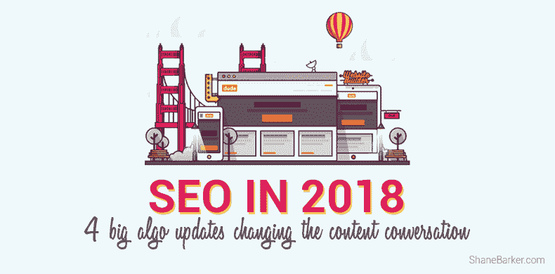

# 2018 年的 SEO:改变内容对话的 4 大算法更新

> 原文：<https://medium.com/hackernoon/seo-in-2018-4-big-algo-updates-changing-the-content-conversation-f34e1a522d8a>

> 这篇文章最初发表在谢恩·巴克的 SEO 博客上。

现在是 2018 年。

谷歌现在的年龄超过了其数百万的日常用户。

它不再是冷冰冰的 10 个蓝色链接，而是塑造我们生活的更精致、更复杂的体验——而且看起来更酷。

年复一年，[谷歌推出了近 2000 项搜索变革](https://searchengineland.com/google-launched-1600-new-changes-search-last-year-274053)，包括实时实验、搜索质量测试和算法调整。

这需要进行大量的修改，而且高质量内容的目标也在不断变化。

我们将这些变化综合成四个最深远和最值得注意的搜索引擎优化更新，你需要保持在顶部。

以下是最有可能影响每个网页(包括你的网页)的顶级算法革新！)2018 年:

# #1.RankBrain:机器学习算法越来越聪明

谷歌的主要算法 RankBrain 是由人工智能驱动的，负责设计它的工程师现在表示，它在内容排名方面比他们更好。

作为第三重要的排名信号，RankBrain 在一毫秒内计算出更多的数据来缠绕我们的人类思维，它帮助谷歌确定以什么顺序排列内容以及在 SERPs 中的哪个位置。

RankBrain 的核心是衡量:

*   **点击率**:用户点击一个结果的时间百分比。
*   **停留时间**:用户在返回搜索结果寻找可能更好的结果之前停留在网页上的时间。

例如，如果排名第四的页面比排名第一至第三的页面具有更高的停留时间，随着时间的推移，RankBrain 将解释这一事实，并可能在 SERPs 中将第四个结果推到其他结果之上。

也就是说，RankBrain 的动向和影响力并不是容易衡量的即时因素。它的影响在于它能够持续消费用户数据，并重新评估它帮助排序的结果的价值。

就内容而言，这意味着营销人员可能需要将有效的内容优化计划整合到他们的战略中，因为如果点击率和停留时间向 RankBrain 报告黯淡的信号，今天排名第一的博客可能会很容易跌至第二。

# #2 语音搜索的兴起:优化未来的搜索设备

语音搜索已经达到了某种临界点:40%的成年人每天至少使用一次语音设备。到 2020 年，预计 50%或更多的查询将来自语音搜索。

有了 Google Home 和 Amazon Echo 等独立的语音搜索设备，以及 iPhone 的 Siri 和 Apple Watch 等无处不在的语音搜索设备，营销人员必须围绕这一新范式制作内容。

实际上，这意味着在你的内容中使用自然语言短语，更深入地挖掘长尾关键词，扩大你的本地 SEO 存在，以及[构建微数据以赢得谷歌 SERP 功能](https://www.brafton.com/blog/distribution/a-content-marketers-guide-to-every-2018-google-serp-feature/)(知识面板、丰富卡片、特色片段)。

谷歌的算法现在奖励对语音搜索者有吸引力的页面，这一趋势只会变得更加突出。

# #3 移动优先索引:响应式设计现在是搜索的必备

手机友好并不新鲜。但现在，它是强制性的，因为谷歌已经转向移动优先索引。

为移动优化是保持你当前搜索存在的唯一方法，因为谷歌现在认为你网页的移动版本是“真正的”版本，这影响了它如何索引和排列内容。

同样，移动搜索主导了整个查询领域，超过了[60 %(并且还在上升！)的搜索源自移动设备](https://www.thewebmaster.com/seo/2017/may/2/60-percent-online-searches-mobile-devices/)。

要点:如果你还没有转向响应式网页设计，搜索算法会对你不利。

# #4 真实性作为排名因素:在搜索结果中区分事实和虚构

自 2015 年以来，搜索中的真实性一直是一项持续的实验，当时谷歌开始使用一种“[基于知识的信任](https://arxiv.org/pdf/1502.03519v1.pdf)方法，根据事实的准确性，而不仅仅是入站链接来评估内容。

虽然还没有证实这个系统有多广泛，或者它是否正式大规模使用，但 KBT 显然是谷歌“假新闻”算法最新发展的先驱。

谷歌现在不是向用户提供它认为是 SERPs 中最有价值的网页，而是积极地试图降级那些宣传虚假信息的网站，故意贬低内容和其他形式的“非权威”结果。

假新闻的发布者正在被去索引化，谷歌的真实性算法在区分事实和虚构方面变得越来越智能，这可以从谷歌新闻帖子中添加的新“ [Fact check](https://developers.google.com/search/docs/data-types/factcheck) ”标签中看出。

我们可以期待这种类型的事实标签系统在 2018 年更多的现场测试实验中在我们眼前发展。

随着算法更新决定了品牌生产的内容的价值、质量和格式，内容创作者和策略师在 2018 年必须比以往任何时候都更加直观和以用户为中心。

谷歌会奖励你这样做。

> 这篇文章最初发表在[谢恩·巴克](https://shanebarker.com/blog/seo-2018-algo-updates-content-conversation/)的 SEO 博客上。