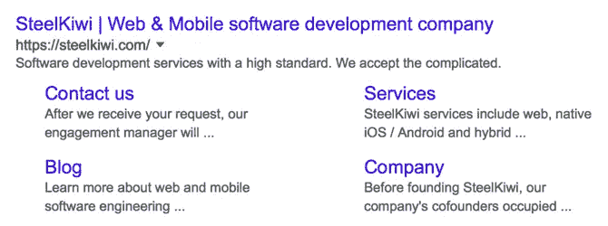
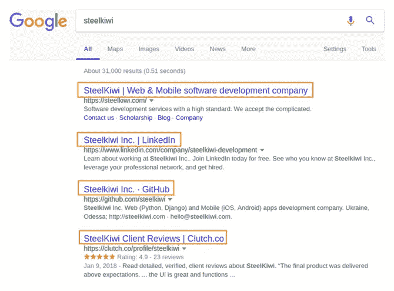
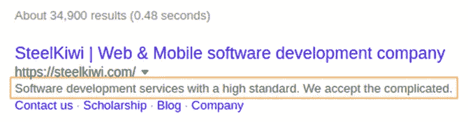
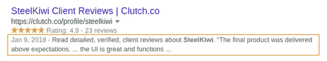
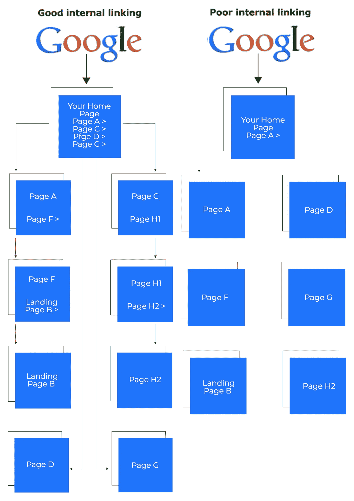

# 面向初学者的 SEO Web 开发教程

> 原文：<https://medium.com/hackernoon/seo-web-development-tutorial-for-beginners-7273308b6448>

搜索引擎优化(SEO)是多种方法的结合，使网站更容易通过谷歌和雅虎等搜索引擎找到。搜索友好的网站是那些你在搜索结果的前三页看到的网站，通过实施搜索引擎优化基础，你可以大大增加你的网站到达那里的机会。

尽管在网站生命周期的任何时候都有应用 SEO 的方法，我们建议从开发的最早阶段就考虑 SEO。否则，你可能会遇到复杂的情况，使你的网站更容易完全重建，而不是修复。如果你想知道 SEO 友好是什么意思，请继续阅读这篇文章，在这篇文章中，我们解释了如何在 web 开发的早期阶段改进搜索引擎优化。

# 页面结构和组织

让你的网站 SEO 友好，让用户满意。高页面时间和低跳出率只能通过高质量的产品来实现。高质量始于良好的结构。

# 制定内容策略

无论你是建立一个网站来为产品和服务做广告，还是仅仅需要一个信息商务平台，考虑它将展示的内容是很重要的。最流行的方法是创建一个博客，然后用独特的文章填充它，突出你的业务领域的特定方面。

在开始开发之前，概述一个可靠的内容策略。了解你希望你的网站吸引的目标受众，以及你希望如何吸引他们。然后利用这些知识来确定你要传播的内容，建立一个清晰的网站结构来高效传播。

# 创建一个搜索引擎友好的网站结构

成功的网站往往有一个简洁的逻辑结构。如果你网站上的内容很容易找到，浏览起来也很舒服，那么用户很可能会更喜欢它，花更多的时间去看它。

此外，一个结构清晰的网站更容易被搜索引擎索引和抓取，这有助于提高其搜索排名。最重要的是，一些搜索引擎提取网站结构来创建站点链接。

站点链接是指向网站上特定部分的直接链接，用户可以从搜索结果页面访问这些链接。这是帮助用户快速浏览您的网站并轻松获得他们所寻找的信息的好方法。

# 写适当的标题标签

标题标签是用户在搜索结果页面中点击的内容。它们也是网页的标题，是网页内容最重要的信息来源之一。

有几种方法可以让标题标签成为搜索引擎优化的重要杠杆。

## 保持简短和有意义

关于页面内容的所有相关信息应该在 65 到 75 个字符内，因为这是搜索结果页面上通常显示的字符数。当然，头衔可以比这更长，尤其是有充分理由的时候。不过，一般来说，标题要简短，以免重要的内容被省略掉。

## 在标题中包含关键词

在标题中包含关键词，或者更好的是，从关键词开始。关键字表明一个页面是关于什么的，并帮助搜索引擎根据用户的查询决定显示哪些页面。但是，不要包含太多的关键字是很重要的，将关键字放在尽可能靠近标题的开头也是很重要的，这样搜索引擎就不会将标题识别为垃圾邮件，用户也可以通过链接清楚地了解他们可以找到的信息。

## 运用移情

首先，标题是给读者看的，不是给搜索引擎看的。不要为了获得更高的排名而让它们成为一个不可读的关键词序列。确保读者只看标题就能理解每一页的内容。

# 善用元标签

元标签扩展了标题标签提供的信息。有不同类型的元标签，每一种都有特定的用途。

## 元描述标签

meta description 标签是页面内容的简短描述，位于 title 标签下方。

通常包括关键字，元描述通过给用户更多关于内容的洞察力来吸引用户。

元描述的长度没有特别的限制，但是搜索引擎通常显示大约 160 个字符。就像标题标签一样，你应该尽量保持在限制范围内，但如果你不这样做，这不是一个严重的问题。

对于没有自定义元描述的页面，搜索引擎通过从页面上的其他元素提取信息来创建一个元描述，如下例所示:

## 元机器人标签

使用 meta robots 标签，你可以控制搜索引擎在每个页面上的行为。

*   Index/noindex 告诉搜索引擎是否应该对页面进行爬网并对其进行索引。默认情况下，所有页面都可以被索引，但是切换到 *noindex* 会将页面从搜索引擎索引列表中排除。
*   Follow/nofollow 告诉搜索引擎是否应该抓取页面上的链接。默认情况下，所有页面都有*跟随*标签。
*   Noarchive 限制搜索引擎缓存页面。默认情况下，此标签是禁用的。
*   Nosnippet 告诉搜索引擎，它们不应该从页面内容中提取元描述。
*   Noodp/noydir 做了一件与 nosnippet 类似的事情，除了它限制搜索引擎从开放目录项目(DMOZ)或 Yahoo 目录。

# 包括适当的关键字

关键字和关键短语用于查找您的网站。当用户输入搜索查询时，搜索引擎会找到包含他们搜索过的单词的页面。关键词可以包含在标题和元数据中，但更重要的是要包含在页面的文本中。

## 具体点

关于关键词的一切都很重要，包括拼写、标点和词序。这意味着语义相似的关键短语如果以两种不同的方式书写，可能会被搜索引擎解释为完全不同。因此，非常重要的是，你使用的关键词要清晰、直截了当，并传达恰当的意思。

特定的关键词也将有助于缩小搜索结果中的竞争，提高你获得更高搜索排名的机会。

例如，如果 SteelKiwi 网站只声明了“软件开发公司”之类的内容，人们就不太可能在所有软件开发公司的汪洋大海中找到我们。通过包含像“乌克兰的网络和移动软件开发公司”这样的关键词，我们缩小了搜索结果的范围，增加了被发现的机会。

## 越多并不总是越快乐

尽管用尽可能多的关键词填充页面看起来很自然，但这样做弊大于利。我们的目标是自然地添加关键词，使它们成为用户在搜索像你这样的网站时通常会输入的内容。否则，你的页面将被认为是不可靠的，因为关键字垃圾邮件，将无法在搜索排名中获得任何位置。

# 技术方面

除了使用更高层次的搜索引擎优化技术，还有一些技术方法可以让你的网站在搜索结果中排名更高。

# 选择移动友好型设计

适当的 SEO 的主要思想是制作一个舒适和信息丰富的产品。因为大多数用户使用移动设备搜索互联网，所以您的目标是让您的网站在桌面和移动设备上都能舒适地使用。这也很重要，因为谷歌[应用了移动优先的索引](https://webmasters.googleblog.com/2018/03/rolling-out-mobile-first-indexing.html)。

# 最大化装载速度

研究表明，[移动用户倾向于在关闭一个页面之前给它三秒钟的时间，如果它还没有加载的话。因此，如果搜索引擎优化是你营销工作的一部分，你要求开发者特别注意你网站的加载速度是很重要的。](https://blog.kissmetrics.com/wp-content/uploads/2013/02/how-mobile-is-changing-business.pdf)

# 使用 HTTPS

一个网站是否使用 HTTPS 是谷歌搜索引擎优化标准之一。HTTPS 意味着来自你的网站的数据通过一个安全的渠道传输，由于谷歌的目标是提高互联网的整体安全性，所以让他们知道他们搜索链接到的网站是安全的是很重要的。

# 确保内容是可索引的

搜索引擎只能索引文本，忽略图像、视频和其他非文本内容。

但是因为所有这些非文本元素对于提供良好的用户体验都很重要，所以把它们放在你的网站上也很重要。解决这个问题的方法是为图像元素提供基于标记的文本描述，为音频和视频文件提供文本，并为其他类型的媒体提供其他类型的文本支持。

# 避免内容重复

当搜索引擎可以从几个不同的 URL 访问内容时，它们认为内容是重复的。有很多原因可以解释为什么一个以上的 URL 可能指向相同的内容，但重要的是，有一个原始的规范页面，并且其他页面被标记为备用页面。

此类问题在多语言和多区域网站中尤为突出。如果你想了解更多关于避免多语言网站内容重复的问题，请阅读我们的文章[如何开发一个优秀的多语言网站。](https://steelkiwi.com/blog/how-to-make-a-multilingual-website/)

# 用于爬行的结构链接

重要的是，你的网站与直接链接相互连接。否则，搜索引擎将无法看到一些页面，因此不会在搜索结果中显示它们。

除了没有一个清晰的结构之外，在创建一个可抓取的网站时，还有一些其他的陷阱需要避免。

## 注意表格

某些内容可能需要用户填写表单才能被访问。表单可以是从完成调查到完全登录网站的任何内容。不管用什么方法，搜索引擎都无法绕过它们。他们只是不擅长自己打字。

## 插件中嵌入的链接

正如我们已经多次提到的，搜索引擎只能理解文本。这意味着嵌入在图像、小程序和任何其他非文本元素中的链接将不会被搜索引擎抓取。

# 构建适当的 URL 结构

URL 对于 SEO 来说很重要，因为用户是通过 URL 找到网页的。重要的是，URL 是描述性的，并且具有适当的结构。

## 使用静态 URL

在其 URL 中包含页面的描述。URL 不必描述页面上的所有内容，但它应该足够具有描述性，这样就有可能知道地址的另一边是什么。

一个糟糕的网址的例子:[https://steelkiwi.com/blog/id=?133759ud_f](https://steelkiwi.com/blog/id=?133759ud_f)

一个好的网址的例子:[https://steel kiwi . com/blog/making-use-OF-virtual-reality-in-health care/](https://steelkiwi.com/blog/making-use-of-virtual-reality-in-healthcare/)

## 使用正确的标点符号

最好的方法是使用连字符来分隔链接中的单词，因为并非所有的 web 应用程序都可以正确解释其他标点符号，如加号、下划线和空格。

## 保持简短

URL 仍然应该保持相当短。这使得他们更容易通过电子邮件和社交媒体阅读和分享。

## 添加关键词，但不要过度

在 URL 中包含关键词是另一个确保你的信息一定会被读者找到的好方法。但是，如果您在一个 URL 中添加了太多的关键字，您的页面可能会被标记为垃圾邮件，尤其是当您将该 URL 作为电子邮件活动的一部分发送时。

# 与社交媒体整合

与几个社交媒体 API 集成是让你的内容获得更多用户曝光的好方法:获得喜欢、分享、提及和许多其他类型的反向链接。

# 用 SteelKiwi 开发一个 SEO 优化的网络产品

我们希望你从这篇文章中得到的想法是，搜索引擎也是产品。他们的服务质量与你的网站提供的内容质量直接相关。出于这个原因，搜索引擎竭尽全力只显示最用户友好和相关的网页，以满足他们的用户，使他们被视为一个方便和可靠的产品。

如果你想开发一个内置技术 SEO 启动包的网站，[今天就联系我们的销售代表](https://steelkiwi.com/contacts/)。如果你想看看我们已经开发的面向搜索引擎优化的产品，看看这些案例研究:

1.  Answers.how，一个为最流行的搜索查询提供答案的网站[。](https://steelkiwi.com/projects/a-website-that-provides-answers-to-popular-questions/)
2.  照片博客，一个照片博客社区的网站。