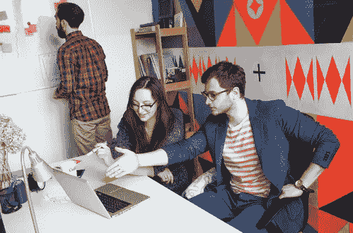
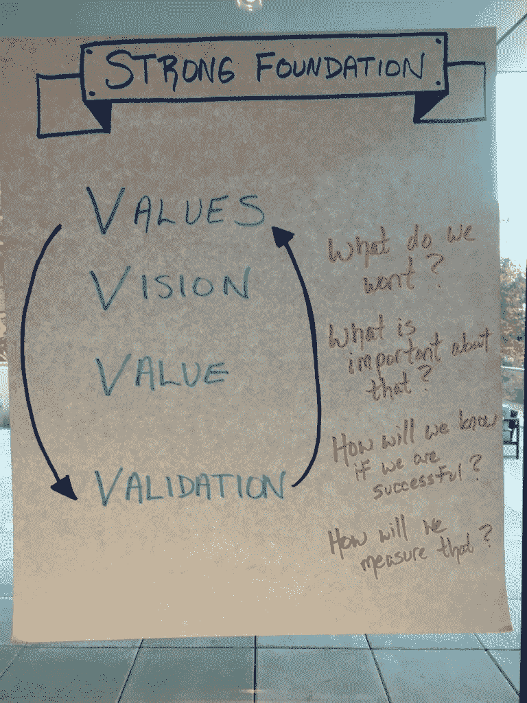

# 服务型领导 101:愿景、价值观、价值和验证

> 原文：<https://medium.com/hackernoon/servant-leadership-101-vision-values-value-validation-2046b6946170>

## 4 V 创造了坚实的基础

> 作者:斯蒂芬妮·奥克曼，发表于 Scrum.org T2

仆人型领导必须创造一个强大的基础，帮助人们感到有能力采取行动，使他们能够在不确定的情况下朝着共同的方向前进，并在充满挑战的时期感到鼓舞和足智多谋。4 V 可以帮助你建立这个坚实的基础:愿景、价值观、价值、认可。

# 视力

*“我们想要什么？”*

一个强有力的愿景帮助人们看到他们要去哪里，以及当他们到达那里时，他们想要成为什么。虽然我们可能在如何实现这一目标上存在分歧，但我们很可能会就我们想要实现的目标达成共识。

苦苦挣扎的团队或组织可能无法就如何改变他们的工作流程达成一致，甚至无法就他们试图解决的问题的正确解决方案达成一致。然而，他们很可能在一些他们想要努力的事情和他们想要的感觉上达成一致。

例如:

*   我们希望在工作中更加专注，这样我们才能完成重要的事情。
*   我们想取悦我们的顾客。
*   我们喜欢来工作，感觉我们是一个支持性社区的一部分。
*   我们想彻底改变 _____。
*   我们希望不断学习和增长我们的技能和知识。

当事情变得艰难时，愿景还能帮助人们挖掘未来状态的感觉，当分歧浮出水面时，愿景能帮助人们团结起来。它提醒我们为什么要做这项工作，并帮助人们在遇到挫折时继续前进。一个强有力的愿景是清晰的、简洁的、有情感冲击力的。

下一次，当你感觉到你的团队正朝着不同的方向前进，或者可能正在处理未解决的问题时，你可以问什么有力的问题来帮助每个人专注于创建或重新调整一个共同的愿景？

# 价值观念

*“那有什么重要的？”*

当愿景与个人、团队和组织的价值观相联系时，它会更加强大。

**作为人类，我们每个人都有价值观。** [价值观帮助我们过上最好的生活，理解他人，在团队中更有效地工作。](https://www.agilesocks.com/3-reasons-values-matter/)仆人型领导有助于将人们与他们的价值观和更大的目标联系起来，这样他们就能经历更大的成功和成长。

谈到价值观，请记住，人们往往对价值观有不同的理解。这就是为什么讨论它们是重要的。以尊重和开放的态度对待它。小心价值观的“武器化”。 [感到好奇](https://www.agilesocks.com/coaching-secret-pretend-you-are-an-alien/)似乎有断开的时候。从所有的价值观都是有效的这一信念出发来进行对话，每个人都是出于好意。

**与价值观相关的愿景会产生情感冲击。**人们会对他们为什么做这项工作产生更有意义的联系。当工作感觉良好时，成功的结果以及个人的成长和团队的合作都会带来许多好处。

下次当你感觉到人们和他们正在做的工作之间缺乏共鸣，或者尤其是不和谐时，对此感到好奇。是否有些东西与个人、团队或组织的价值观不一致？你如何创造透明度，让人们可以解决问题？

# 价值

*“我们在创造什么价值？什么结果表明我们正在取得成功？”*

世界上越来越多的工作是为复杂的问题创造有价值的解决方案。这意味着我们需要更加关注结果而不是产出。这不仅仅是关于我们能创造多少东西；这是关于东西提供的价值或好处。你需要清楚地定义价值对你、你的团队、你的组织意味着什么。

团队很容易脱离他们正在做的工作的价值，特别是如果他们提供的服务或产品没有被外部客户使用或直接支付。

**仆人型领导帮助人们清楚他们所做的工作是如何与客户价值和商业价值相联系的。**

如果你做的工作是盈利性的，那么价值最终会和金钱联系在一起。但这也与创造快乐的顾客联系在一起，因为人们会为让他们的生活变得更好、更轻松、更快乐的东西付费。

如果你所做的工作是非盈利性的，价值通常会体现在对社会的好处上。它仍然直接与钱联系在一起，因为你必须花在创造收益上的钱通常是有限的。

下一次，当感觉人们与他们工作的价值脱节时，问一些有力的问题来帮助人们将这些点与他们工作的重要性联系起来。如果没有，那么也许工作需要改变，你可以帮助带来透明度。

*(* [*)阅读更多关于产品价值概念*](https://www.agilesocks.com/scrum-mastery-4-steps-optimize-product-value/) *的内容，并思考这些概念与你的团队创造的价值类型之间的关系。)*

# 确认

*“我们如何衡量有价值的结果？我们将如何验证我们对价值的假设？”*

**在得到市场验证之前，价值只是一种假设。**为了实现更大的愿景和创造有价值的成果，你必须实际将一些东西放到这个世界上，并验证关于价值的假设是否正确。然后你可以学习如何创造更多的价值或课程-正确的。

**越早获得反馈，你就能越早适应更有价值的结果。**

记住你是在处理复杂的事情。你的假设会是错误的。你无法控制的事情会改变并影响你正在做的工作。拥抱这个现实，并经常验证。(更多信息请见拥抱变化和不可预测性。)

# 创建与 4 V 的一致性

**为了达成一致，让每个人都参与进来，打造这一坚实的基础。**即使你的组织或团队的产品/服务已经有了愿景、一套核心价值观和衡量价值的定义，也要让人们参与到关于这些东西的对话中来。

仆人型领导创造了一个包容、开放和好奇的环境。不同的观点将被分享，人们将开始更清晰地发现这些事情对他们、他们的同事和组织意味着什么。然后他们可以一起在旅程中前进。

请记住，这不是一次性的活动。您必须**不断加固并确保所有 4 V 对齐**。随着环境和目标的变化，你可能需要调整其中的一个或全部。

如果你处于管理职位，思考一下你是如何创造空间，与你的下属、你的同事以及你的上司定期就 4 V 展开合作讨论的。考虑让 4 V 对每个人来说更加有形和可见的方法。考虑什么时候鼓励他人分享和探索自己的想法比提供答案更好。

你不需要身处管理岗位，也能成为一个仆人式的领导者，并采取行动。当你注意到 4 V 可能不够清晰，或者可能与团队前进的方向不一致时，问一些有力的问题来帮助大家一起探索。以下是一些构建对话的简单方法:

*   这是一个有趣的想法。这将如何推动我们实现[愿景/目标/等]？
*   当我们实施这种新方法来帮助指导我们时，我们可以衡量哪些结果？
*   这些想法中，哪一个与我们的核心价值观和我们希望为客户创造的结果联系最紧密？
*   我的观点是 ________。你如何能帮助我改进这一点，并提供不同的观点，这样我们就可以一起朝着更好的方向前进？
*   如果我们尝试[想法/实验]X 个星期，然后评估结果和我们在这个过程中学到了什么？
*   ________ 最让你兴奋的是什么？
*   你现在最想从哪些方面学习和成长？
*   如果你可以做任何事情，并且拥有所有可能的资源，你想创造什么？

*这是关于* [*仆人式领导影响变革，激发伟大*](https://www.agilesocks.com/scrum-mastery-5-actions-effective-servant-leader/) *系列帖子的一部分。我的目标是让每个人都能更好地理解和实施仆人式领导，无论你的职位、头衔或行业如何。因为这是在我们复杂的世界中创造有意义的变化的唯一方法。我们将通过激励、授权和赋权来领导，而不是助长分裂、恐惧和丧失权能。*

*最初发表于*[*www.agilesocks.com。*](https://www.agilesocks.com/scrum-mastery-5-actions-effective-servant-leader/)