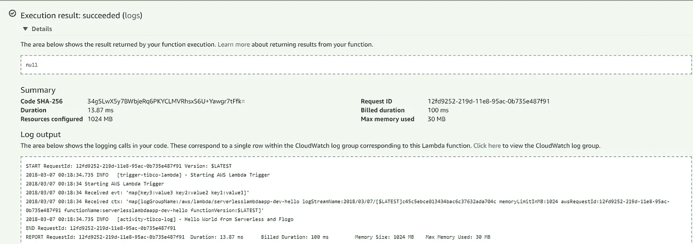

# 无服务器和 Flogo:一个完美的匹配

> 原文：<https://medium.com/hackernoon/serverless-and-flogo-a-perfect-match-aea01117f21f>


Flynn loves Lambda!

我每天都在使用[无服务器](https://hackernoon.com/tagged/serverless)微服务，这些是我自己使用的服务，也是我帮助我们的客户构建的服务，以利用无服务器带给你的[好处](https://image.slidesharecdn.com/cmp211-getting-started-with-se-7ec83976-5aaa-4bc2-8e5d-c6c623f31df1-446724172-171201041452/95/cmp211getting-started-with-serverless-architectures-4-638.jpg?cb=1512146620)。由于许多服务需要部署和持续更新，我发现自己一遍又一遍地做着同样的事情。最让我沮丧的是那个特定的任务；它并不像我想象的那样完美。

在本文中，我将向您介绍我是如何缩短开发时间并使部署像在公园散步一样容易重复的——这要归功于[无服务器框架](https://serverless.com/)和一个名为 [Project Flogo](http://www.flogo.io/) 的工具的组合。

# 弗洛戈是什么？

我猜你知道无服务器框架，但是你可能不知道什么是 Flogo。嗯，Flogo 是一个*超轻边缘微服务框架*！既然我们已经把标语说清楚了，那就让我们稍微解释一下这句话。Flogo 是用 go 编写的，现在你可以在 Lambda 上运行 Go，你可以很容易地打包你的服务并在 Lambda 上运行它。Flogo 为您提供了一个可视化的环境来设计您的服务，这个环境过于简化，意味着您将一堆活动(比如向 Amazon SNS 发送消息)放在一行中，并在事件发生时执行它们。

与无服务器框架一起，您可以配置哪些事件应该触发它，在哪里部署它，以及允许它在不进入 AWS 控制台的情况下使用哪种资源。我个人感到非常兴奋的是，配置管理是多么容易，您可以多么容易地将您的服务转移到一个新的阶段。

# 先决条件

在本教程中，我将带您创建您的应用程序，以及使用无服务器部署它。

您需要具备:

1.  [无服务器框架](https://serverless.com/framework/docs/providers/aws/guide/quick-start/)和[安装完毕](https://golang.org/doc/install)
2.  一个 [AWS 账户](https://docs.aws.amazon.com/lambda/latest/dg/welcome.html)

*如果你还没有完成，这些链接会引导你完成这些步骤。*

# 安装项目 Flogo CLI

为了构建 Flogo 应用程序，我们将使用 Flogo CLI。

像这样安装它:

```
go get -u github.com/TIBCOSoftware/flogo-cli/...
```

为了简化依赖性管理，我们使用 Go `dep`工具。(请注意，`dep`强烈建议使用在[版本](https://github.com/golang/dep/releases)页面上提供的二进制版本。)

# 创建您的应用

由于`dep`的工作方式，您需要从您的`${GOPATH}/src`目录中执行命令。

让我们创建一个名为`serverlesslambdaapp`的目录:

```
cd $GOPATH/srcmkdir serverlesslambdaapp
```

以及该目录中的一个`flogo.json`文件:

A Flogo app, ready for Lambda

完成后，您只需要一个命令就可以将它转换成一个 Flogo 应用程序，稍后您可以使用它来构建可执行文件:

```
flogo create -f flogo.json lambda
```

上面的命令将创建一个名为`lambda`的目录，找到流的所有依赖项，并下载它们。此命令可能需要几秒钟才能完成。

现在，我们可以从该项目中创建一个可执行文件。要在 AWS Lambda 中运行，我们需要在应用程序中嵌入`flogo.json`以确保没有外部文件依赖。(您仍然可以使用环境变量，但是我们将在另一个教程中介绍。)

Lambda 的触发器包含事件信息，利用 Makefile 来构建和压缩应用程序。所以让我们跑吧:

```
cd lambdaflogo build -e -shim my_lambda_trigger
```

在`flogo build`命令之后，`./src/lambda`中有两个重要文件。一个文件叫做*handler . zip*；这是一个压缩的可执行文件，你可以上传到 Lambda。另一个简称为*处理程序*，是解压后的版本。

虽然您完全可以使用 AWS 提供的命令行工具来部署您的应用程序，甚至手动上传，但自动化这一部分要容易得多——尤其是当您的应用程序变得更加复杂时。这就是为什么我喜欢❤的无服务器架构

# 使用无服务器部署应用

无服务器团队在简化部署和打包方面做得非常出色。从这里你只需要几步。

第一件事是在与您的`flogo.json`文件相同的文件夹中创建一个新的无服务器服务(如果您按照命令进行了操作，您应该还在那里:-):

```
# Let’s create a serverless service with the same name as the appserverless create -u [https://github.com/retgits/flogo-serverless](https://github.com/retgits/flogo-serverless) -p serverlesslambdaapp
```

下一步是将*处理程序*复制到新创建的无服务器文件夹中:

```
cp src/lambda/handler serverlesslambdaapp/handler
```

这将是用任何 bucket 名称、IAM 角色、环境变量或您想要配置的任何东西来更新您的`serverless.yml`文件的理想时机，因为剩下的唯一事情就是部署！

```
# To package up your function before deploying runcd serverlesslambdaappserverless package# To deploy, which also does the packaging, your function runcd serverlesslambdaappserverless deploy
```

*注意:不幸的是，这只适用于 Linux 或 macOS 系统，或者使用 Linux 的 Windows 子系统(WSL)时。这是因为 Windows 开发人员可能很难生成一个将二进制文件标记为可在 Linux 上执行的 zip 文件。查看[此处](https://github.com/aws/aws-lambda-go)了解更多信息)。

# 测试 1… 2… 3…

让我们测试这个应用程序，以确保它真正部署到 Lambda 并正确运行。

登录 AWS 并选择“Lambda”后，您将看到目前为止已经部署的所有功能。其中一个应该叫`serverlesslambdaapp-dev-hello`之类的。

点击它，你会看到你的功能概述，包括一个写着“测试”的大按钮。单击“测试”配置新的测试事件(任何输入都可以)，然后再次单击“测试”运行它。

如果一切顺利，为什么不应该呢，您的日志将显示类似于`2018–03–07 00:18:34.735 INFO [activity-tibco-log] — Hello World from Serverless and Flogo`的一行



testing…

# 想自己试试吗？

兴奋地想和[弗洛戈](http://www.flogo.io)一起尝试更多的东西？查看我们的[文档](https://tibcosoftware.github.io/flogo)或[网站](http://www.flogo.io/)