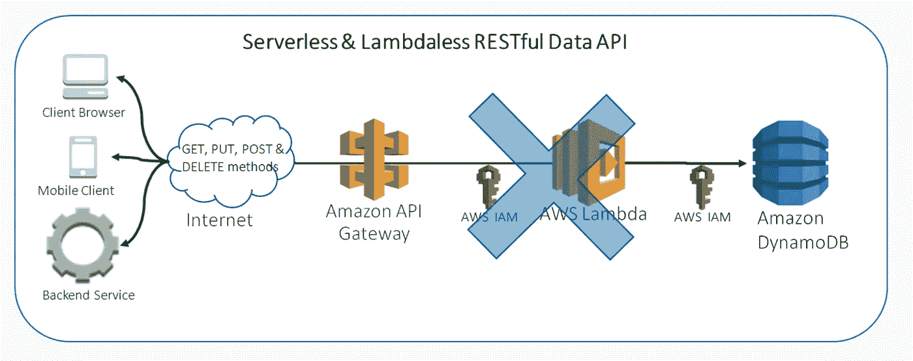
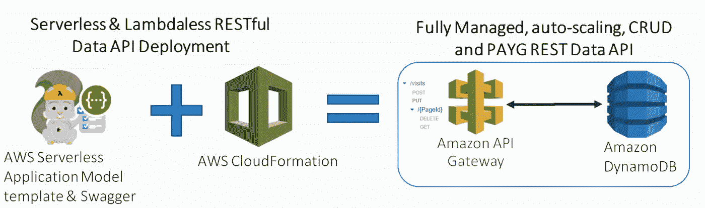
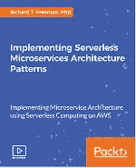

# 具有 AWS API 网关和 DynamoDB 的无服务器和无内存的可扩展 CRUD 数据 API

> 原文：<https://medium.com/hackernoon/serverless-and-lambdaless-scalable-crud-data-api-with-aws-api-gateway-and-dynamodb-626161008bb2>

在现代微服务架构中，当与其他系统(如可视化、用户界面，甚至与其他第三方集成)共享数据时，通常会创建 RESTful 数据服务应用编程接口(API)。在创建、维护和监控此类系统时，需要考虑许多架构、基础设施和开发复杂性。此外，您需要考虑成本以及 API 和数据存储的可伸缩性。

我们正在从难以扩展到微服务架构的大型复杂整体架构中脱离出来。例如，您可以拥有一个松散耦合的微服务群，每个微服务都有一个针对每个数据源的 API，并与集群化的 NoSQL 数据库(如 Cassandra)集成。采用微服务架构通常意味着您需要一个 DevOps 团队，例如，设置、监控和维护持续集成/持续部署(CI/CD)管道、 [Kubernetes](https://kubernetes.io/) 容器编排平台和监控系统。随着 AWS 宣布[亚马逊弹性容器服务用于 Kubernetes (EKS)](https://aws.amazon.com/eks/) 和 [AWS Fargate](https://aws.amazon.com/fargate/) 帮助 Kubernetes，事情看起来越来越好，但仍有许多集成需要开发者和容器配置来考虑。

早在 2014 年，AWS 就推出了 Lambda 函数，它充当服务之间的集成粘合剂，您只需编写业务逻辑代码来响应入站事件。这些事件可能是来自 API Gateway 的 GET 请求、添加到 Kinesis 流的新记录或放入 S3 的对象。使用 Lambda 非常流行，因为它们是无状态的，有内置的事件源集成，你只需为每 100 毫秒的执行时间付费。因此，你可以构建一个高度可扩展的无服务器堆栈，集成 API Gateway、Lambda 和 DynamoDB，而不是使用运行在容器上的一群微服务。有很多关于这方面的教程，包括我的第一个视频课程。



Serverless & Lambdaless RESTful Data API

在这篇博文中，我将向您展示如何完全放开 Lambda，让 API Gateway 直接调用 DynamoDB，以创建一整套创建、读取、更新和删除(CRUD)操作。我读过的其他帖子只涉及如何在 AWS 控制台中手动完成部分工作，而不是用代码使用[斯瓦格](https://swagger.io/)和[萨姆](https://github.com/awslabs/serverless-application-model)，这就是我将在这里向你展示的。使用 Swagger 和 SAM 部署基础设施和 API 实际上是您绝对想做的事情，以便将其发布到生产环境中，从而最大限度地减少人为错误、可重复性和可伸缩性。

# 概观

我假设你已经有了一个 [AWS 帐户设置](https://aws.amazon.com/free/)并且已经安装了[AWS CLI](https://docs.aws.amazon.com/cli/latest/userguide/cli-chap-welcome.html)。我使用 Ubuntu bash 和一些 shell 脚本，对于 [Windows 10 用户安装 Linux Bash Shell](https://www.howtogeek.com/249966/how-to-install-and-use-the-linux-bash-shell-on-windows-10/) 注意在 Linux 中运行脚本时需要删除的 [Windows 回车。](https://www.qualitestgroup.com/resources/knowledge-center/how-to-guide/remove-windows-carriage-returns-text-files-linux/)

我首先使用 AWS CLI 创建环境变量和带有策略的 IAM 角色。我这样做是为了即使我删除了 CloudFormation 堆栈，它们也能保留在原来的位置，并且可以被其他 API 重用。然后，我构建一个 SAM 模板来创建一个 DynamoDB 表和 POST、PUT、GET 和 DELETE API 方法，我通过 CloudFormation 部署这些方法。最后，我测试 API 方法，以确保它们按预期工作。

# 创建变量

首先，让我们创建一个包含您的环境特定细节的`common-variables.sh`。

```
#!/bin/sh
export profile="demo"
export region="eu-west-1"
export aws_account_id="000000000000"
export template="apigateway-dynamo"
```

这些将用于我稍后运行的 AWS CLI 命令。

# 安全性创建 IAM 角色和策略

为了让 API Gateway 将日志推送到 CloudWatch 并访问 DynamoDB，您需要创建一个具有两个策略的角色。您可以在 AWS 控制台或 AWS CLI 中完成此操作。我已经使用 AWS CLI 在代码中完成了它，这是我推荐的可重复性和避免错误的方法。此外，您永远不知道是否有人错误地删除了策略，然后您需要追溯您的 JSON 策略步骤，如果您有 100 多个策略，并且在实时系统的压力下，这不是您想要做的事情！

让我们调用 API 网关角色`api-gateway-dynamo-full-user-vists`，使用信任关系创建角色，然后为 cloudWatch 附加服务角色，然后创建 DynamoDB 角色并附加它。

我已经创建了一个 shell 脚本，你可以调用`./create-role.sh`，确保你运行`chmod + x`使其可执行。以下是脚本的内容

```
#!/bin/sh
. ./common-variables.sh

#Setup API Gateway Role
role_name=api-gateway-dynamo-full-user-comments
aws iam create-role --role-name ${role_name} \
    --assume-role-policy-document file://../../IAM/assume-role-api-gateway.json --profile $profile

#Add Policy for API Gateway to write to logs
role_policy_arn="arn:aws:iam::aws:policy/service-role/AmazonAPIGatewayPushToCloudWatchLogs"
aws iam attach-role-policy \
    --role-name "${role_name}" \
    --policy-arn "${role_policy_arn}"  --profile ${profile}

#Create DynamoDB Policy
policy_name="dynamo-full-user-visits-api"
aws iam create-policy --policy-name ${policy_name} --policy-document file://../../IAM/dynamo-full-user-comments.json --profile ${profile}

#Attach Policy for API Gateway to access DynamoDB
role_policy_arn="arn:aws:iam::${aws_account_id}:policy/${policy_name}"
aws iam attach-role-policy \
    --role-name "${role_name}" \
    --policy-arn "${role_policy_arn}"  --profile ${profile}
```

`assume-role-api-gateway.json`信任关系。

```
{
  "Version": "2012-10-17",
  "Statement": [
    {
      "Sid": "",
      "Effect": "Allow",
      "Principal": {
        "Service": "apigateway.amazonaws.com"
      },
      "Action": "sts:AssumeRole"
    }
  ]
}
```

`dynamo-full-user-comments.json`允许 API 网关完全 CRUD 访问 DynamoDB 表

```
{
    "Version": "2012-10-17",
    "Statement": [
        {
            "Sid": "Stmt1422032676021",
            "Effect": "Allow",
            "Action": [
                "dynamodb:DeleteItem",
                "dynamodb:DescribeTable",
                "dynamodb:GetItem",
                "dynamodb:PutItem",
                "dynamodb:Query",
                "dynamodb:Scan",
                "dynamodb:UpdateItem"
            ],
            "Resource": [               "arn:aws:dynamodb:eu-west-1:000000000000:table/user-comments-api-sam"]
        },
        {
            "Effect": "Allow",
            "Action": "dynamodb:ListTables",
            "Resource": "*",
            "Condition": {}
        }
    ]
}
```

我有一个 shell 脚本，您可以用`./create-role.sh`调用它，它运行所有这些脚本来设置 IAM 角色和策略。

# 创建参数和 DynamoDB 表

创建一个名为`apigateway-dynamo.yaml`的 YAML 模板文件，我们将添加参数、DynamoDB 配置和稍后的 API 方法。下面是一组参数:。

```
Parameters:
  Table: {Default: user-comments-api-sam, Type: String}  
  AccountId: {Default: 000000000000, Type: String}
  RoleName: {Default: api-gateway-dynamo-full-user-comments, Type: String}
```

然后让我们使用 SAM 创建一个 DynamoDB 表，并将其命名为`user-comments-api-sam`,我将在脚本中将其作为参数重用。然后，我使用服务器端加密和名为`PageId`的散列或主键创建表，并将读写吞吐量设置为 1。我这样做是为了将它保留在[空闲层](https://aws.amazon.com/free/#software)中，但是您可以根据需要轻松地进行更改。

```
Resources:
  DynamoDBTable:
    Type: AWS::DynamoDB::Table
    Properties: 
      TableName: !Ref Table
      SSESpecification: 
        SSEEnabled: True
      AttributeDefinitions: 
        - AttributeName: PageId
          AttributeType: S
      KeySchema: 
        - AttributeName: PageId
          KeyType: HASH
      ProvisionedThroughput: 
        ReadCapacityUnits: 1
        WriteCapacityUnits: 1
```

# PUT 方法

让我们从使用 API 的 PUT 方法向 DynamoDB 添加一些 JSON 数据开始。我正在使用`Type: AWS::Serverless::Api`来定义一组 Amazon API 网关资源和方法，它们可以通过 HTTPS 端点来调用。

```
MyApi:
    Type: AWS::Serverless::Api
    Properties:
        StageName: Prod
        DefinitionBody:
            swagger: 2.0
            info:
              title:
                Ref: AWS::StackName
            paths:
              "/visits":
                put:
                  consumes:
                    - "application/json"
                  produces:
                    - "application/json"
                  responses:
                    "200":
                      description: "200 response"
                      schema:
                        $ref: "#/definitions/Empty"
                  x-amazon-apigateway-integration:
                    httpMethod: POST
                    type: AWS
                    uri: { "Fn::Sub": "arn:aws:apigateway:${AWS::Region}:dynamodb:action/PutItem" }
                    credentials: { "Fn::Sub": "arn:aws:iam::${AccountId}:role/${RoleName}" }
                    requestTemplates:
                      application/json: { 'Fn::Sub': "{ \n\
                      \t\"TableName\": \"${Table}\",\n\
                      \t\"Item\": {\n\
                      \t\t\"PageId\": {\n\
                      \t\t\t\"S\": \"$input.path('$.PageId')\"\n\
                      \t\t},\n\
                      \t\t\"EventCount\": {\n\
                      \t\t\t\"N\": \"$input.path('$.EventCount')\"\n\
                      \t\t},\n\
                      \t\t\"Message\": {\n\
                      \t\t\t\"S\": \"$input.path('$.Message')\"\n\
                      \t\t}\n
                      \t}\n}" }
                    responses:
                      default:
                        statusCode: "200"
```

在这里，我为区域使用了像`${AWS::Region}`这样的内置变量，但是也使用了之前在脚本顶部指定的参数。

我遵循 PUT 约定，使它幂等，这意味着如果你多次调用它，它将导致相同的操作。这里我们将简单地用传递的 JSON 主体覆盖现有的行。我使用`PutItem`动作来做这件事，你可以在`requestTemplates`中看到我解析 JSON 并将它们映射到 DynamoDB 键和值。然后将键和值放入 DynamoDB 表`${Table}`，使用脚本`Table: {Default: user-comments-api-sam, Type: String}`顶部的参数用`user-comments-api-sam`替换。你还会注意到`\t`和`\n`已经被重新格式化，以便更容易理解。

# 获取方法

现在我有了一些数据，我想从 DynamoDB 中检索它。我使用一个 GET 方法，允许您从 DynamoDB 中获取指定的数据。与 PUT 方法不同，我使用 resourceId 而不是 JSON 主体来完成这项工作。这里我将`{PageId}`作为 URL 参数传递给 API Gateway。

```
 paths:
              "/visits/{PageId}":
                get:
                  consumes:
                    - "application/json"
                  produces:
                    - "application/json"
                  responses:
                    "200":
                      description: "200 response"
                      schema:
                        $ref: "#/definitions/Empty"
                  x-amazon-apigateway-integration:
                    httpMethod: POST
                    type: AWS
                    uri: { "Fn::Sub": "arn:aws:apigateway:${AWS::Region}:dynamodb:action/Query" }
                    credentials: { "Fn::Sub": "arn:aws:iam::${AccountId}:role/${RoleName}" }
                    requestTemplates:
                      application/json: { 'Fn::Sub': "{ \n\
                      \t\"TableName\": \"${Table}\",\n\
                      \t\"KeyConditionExpression\": \"PageId = :v1\",\n\
                      \t\"ExpressionAttributeValues\": {\n\
                      \t\t\":v1\": { \n\
                      \t\t\t\"S\": \"$input.params('PageId')\"\n\
                      \t\t}\n\
                      \t}\n}"}
                    responses:
                      default:
                        statusCode: "200"   
                        responseTemplates:
                          application/json: "#set($inputRoot = $input.path('$'))\n\
                          {\n\
                          \t\"comments\": [\n\
                          \t\t#foreach($elem in $inputRoot.Items) {\n\
                          \t\t\t\"PageId\": \"$elem.PageId.S\",\n\
                          \t\t\t\"Message\": \"$elem.Message.S\",\n\
                          \t\t\t\"EventCount\": \"$elem.EventCount.N\"\n\
                          \t\t}#if($foreach.hasNext),#end\n\
                          \t#end\n\
                          \t]\n}"
```

您将看到`requestTemplates`使用`PageId`创建一个 [DynamoDB 查询](https://docs.aws.amazon.com/amazondynamodb/latest/APIReference/API_Query.html)。如果数据与查询匹配，则返回数据并通过`responseTemplates`传递，T10 将数据从原生 DynamoDB 格式转换为更标准的 JSON 格式。

# 过帐方法

我已经展示了如何执行幂等 PUT，现在让我们来看一个更复杂的更新，它在每次被调用时将计数器递增指定的值。这对于保持排行榜分数、指标或交易非常有用。

```
 post:
                  consumes:
                    - "application/json"
                  produces:
                    - "application/json"
                  responses:
                    "200":
                      description: "200 response"
                      schema:
                        $ref: "#/definitions/Empty"
                  x-amazon-apigateway-integration:
                    httpMethod: POST
                    type: AWS
                    uri: { "Fn::Sub": "arn:aws:apigateway:${AWS::Region}:dynamodb:action/UpdateItem" }
                    credentials: { "Fn::Sub": "arn:aws:iam::${AccountId}:role/${RoleName}" }
                    requestTemplates:
                      application/json: { 'Fn::Sub': "{\n\t\"TableName\": \"${Table}\",\n\
                      \t\"Key\":{\n
                      \t\t\"PageId\": {\n
                      \t\t\t\"S\": \"$input.path('$.PageId')\"\n\
                      \t\t}\n\
                      \t},\n\
                      \t\"ExpressionAttributeValues\": {\n\
                      \t\t\":event_count\": {\n\
                      \t\t\t\"N\": \"$input.path('$.EventCount')\"},\n\
                      \t\t\":message\": {\n\
                      \t\t\t\"S\": \"$input.path('$.Message')\"}\n\
                      \t},\n\
                      \t\"UpdateExpression\": \"ADD EventCount :event_count SET Message = :message\",\n\ \t\"ReturnValues\": \"ALL_NEW\"\n}"}
                    responses:
                      default:
                        statusCode: "200"
```

我再次使用`requestTemplates`来形成一个查询，使用`$input.path()`从 JSON 主体中提取不同的值。我认为 DynamoDB 最好的特性之一是丰富的用于更新的表达式语言。这里我使用了`"UpdateExpression\": \"ADD EventCount :event_count`，它对 DynamoDB 中已经存在的`EventCount`值执行非锁定更新。美妙之处在于，读取和更新是使用 UpdateExpression 作为一个原子操作来完成的，不需要在客户端浪费时间和重试！我还想显示调用的结果，所以我使用`"ReturnValues\": \"ALL_NEW\"`返回它。

# 删除方法

最后，我希望能够在 DynamoDB 中删除特定的`PageId`记录，所以我使用了`DeleteItem`动作，其中我将`PageId`作为 URL 参数传递。

```
 delete:
                  consumes:
                  - "application/json"
                  produces:
                  - "application/json"
                  parameters:
                  - name: "PageId"
                    in: "path"
                    required: true
                    type: "string"
                  responses:
                    "200":
                      description: "200 response"
                      schema:
                        $ref: "#/definitions/Empty"
                  x-amazon-apigateway-integration:
                    credentials: { "Fn::Sub": "arn:aws:iam::${AccountId}:role/${RoleName}" }
                    uri: { "Fn::Sub": "arn:aws:apigateway:${AWS::Region}:dynamodb:action/DeleteItem" }
                    requestTemplates:
                      application/json:  { 'Fn::Sub': "{ \n\
                      \t\"TableName\": \"${Table}\",\n\
                      \t\"Key\": {\n\
                      \t\t\"PageId\": {\n
                      \t\t\t\"S\": \"$input.params('PageId')\"\n\
                      \t\t}\n\
                      \t},\n\
                      \t\"ConditionExpression\": \"attribute_not_exists(Replies)\",\n\
                      \t\"ReturnValues\": \"ALL_OLD\"\n}" }
                    responses:
                      default:
                        statusCode: "200"
                    passthroughBehavior: "when_no_match"
                    httpMethod: "POST"
                    type: "aws"

            definitions:
              Empty:
                type: "object"
                title: "Empty Schema"
```

这里我想看看删除了什么，所以我加入了`"ReturnValues\": \"ALL_OLD\"`。在脚本的末尾，我们有一个通过 YAML 文件引用的空模式。

# 部署 API

生活变得更加简单快捷，现在我甚至不需要任何 Lambda 代码，也不需要将 Lambda 和依赖项打包成 Zip 文件。我所需要做的就是使用`apigateway-dynamo.yaml`中的代码和配置来部署堆栈，就这样！



Serverless & Lambdaless RESTful Data API Deployment

```
$ aws cloudformation deploy --template-file $template.yaml --stack-name $template --capabilities CAPABILITY_IAM --region $region --profile $profile
```

这也很容易添加到任何 CI/CD 管道步骤中。

# 测试 API

现在您已经了解了如何构建 API，让我们手动测试它是否如预期的那样工作。登录 AWS 控制台> API 网关，或者您也可以使用浏览器插件，如 postman。

## 测试 PUT 方法或 Create

因为 DynamoDB 中还没有数据，所以让我们从添加一些数据开始。

1.  打开 [API 网关](https://console.aws.amazon.com/apigateway/)
2.  在导航窗格中，选择 apigateway-dynamo 和资源
3.  在资源中，单击上传
4.  在/访问-放置-方法执行下单击测试
5.  在“请求正文”中，输入以下 JSON

```
{"PageId": "444",
"EventCount": 1,
"Message": "happy"}
```

1.  向下滚动并单击测试按钮。

您将在右侧(或移动设备下方)看到状态:200，这意味着呼叫成功，并看到响应正文。您还将看到完整的 API 日志，这对测试和调试非常有用。这些也存储在 CloudWatch 日志中，如果您开始收到 4XX 或 5XX 错误，这是您需要查看的第一个地方。

## 测试 GET 方法

现在您在 DynamoDB 中有了一条记录，让我们使用 PageId = 444 查询来检索它。

1.  在资源中，单击上传
2.  在/visits/{PageId} — GET —方法执行下，单击测试
3.  在{PageId}的路径中输入 444，或者在{PageId}的查询字符串中输入 PageId=444
4.  点击测试按钮。

您应该得到一个状态:200，还可以看到下面的响应体，这正是我们所期望的

```
{
  "comments": [
    {
      "PageId": "444",
      "Message": "happy",
      "EventCount": "1"
    }
  ]
}
```

## 测试 POST 方法

使用 PUT 方法，您会看到无论调用多少次,`EventCount`值都保持不变。现在让我们测试 POST 方法，它在每次被调用时将计数器递增指定的值。

1.  在资源中，单击帖子
2.  在/访问-后-方法执行下，单击测试
3.  在“请求正文”中，输入以下 JSON

```
{"PageId": "444",
"EventCount": 1,
"Message": "happy"}
```

您应该得到一个状态:200，还可以看到下面的响应体

```
"comments": [
    {
      "PageId": "444",
      "Message": "happy",
      "EventCount": "2"
    }
  ]
}
```

运行它几次，您将看到 EventCount 递增，如果您修改请求 JSON 主体 EventCount 值，您还可以将它递增 1 以上。为什么这个 POST 方法返回当前值？这取决于配置，因为我想让你不用去 DynamoDB 控制台就能看到 POST 的效果！

## 测试删除方法

现在你有了很多数据，也许你需要删除一些记录。

1.  在资源中点击删除
2.  在/visits/{PageId} —删除—方法执行下，单击测试
3.  在{PageId}的路径中输入 444，或者在{PageId}的查询字符串中输入 PageId=444
4.  点击测试按钮。

您应该得到一个 status: 200，还可以看到被删除记录的响应主体，我使用了`"ReturnValues\": \"ALL_OLD\"`。

为了仔细检查，您可以在 AWS 控制台中查看 DynamoDB

1.  打开 [DynamoDB 控制台](https://console.aws.amazon.com/dynamodb)
2.  在导航下，单击表格
3.  在名字下点击`user-comments-api-sam`
4.  在选项卡上，单击项目

您应该看到记录不再存在，您还可以使用查询下拉菜单进行检查。

# 打扫

要删除堆栈，只需运行`./delete-stack.sh`以下是 shell 脚本的内容:

```
$ aws cloudformation delete-stack --stack-name $template --region $region --profile $profile
```

# 分析和结论

很好地完成了创建无服务器数据 API 的步骤！完整的源代码将很快在我的 [GitHub repo](https://github.com/astarwolf/) 上提供

# 后续步骤:

*   作为一个好的起点，在 AWS 控制台中创建 API，然后导出 YAML
*   尽可能使用环境变量和参数
*   从 SAM 模板中分离 IAM 角色和策略

我的无羔皮方法的缺点是:

*   如果云的形成是不可行的，那么使用 AWS CLI 会更复杂
*   CloudFormation 符号对我来说冗长而奇怪，例如`{ 'Fn::Sub': [...] }`和`if($foreach.hasNext),#end`感觉不友好或不直观！
*   复杂的分页和异常处理由于 CloudFormation 符号而变得更加复杂，比如 Node.js 或 Python
*   如何在 yaml 中对 API 集成请求和响应进行单元测试？

我的无 Lambdaless 方法的优点:

*   没有 Lambda 冷启动，比中间有 Lambda 更快
*   更简单、代码更少——不需要 Python 或 Node.js Zip 包，所有配置都在一个 YAML 文件中！
*   Swagger 和 SAM —非常快速且易于部署，易于在 CI/CD 中使用
*   在 CloudWatch 中进行 API 网关日志记录和监控

最后，不是所有的事情都可以用这种无服务器方法来完成，但是无服务器计算可以用在大多数情况下。如果你想了解更多关于无服务器微服务和更复杂的用例，请看看我的视频课程，并支持我写更多的博客帖子。

*   对于初学者和中间用户，[完整的无服务器数据 API 代码](https://www.packtpub.com/application-development/building-scalable-serverless-microservice-rest-data-api-video)，配置和详细的演练
*   对于中级或高级用户，我涵盖了 [15+无服务器微服务模式](https://www.packtpub.com/application-development/implementing-serverless-microservices-architecture-patterns-video)的实施，超过 7 小时的原始内容，代码，配置和详细的演练，使其成为最完整的无服务器微服务视频课程之一！

[](https://www.packtpub.com/application-development/implementing-serverless-microservices-architecture-patterns-video)

请随时在 [LinkedIn](https://www.linkedin.com/in/drfreeman/) 上与我联系，或者给我发消息征求意见。