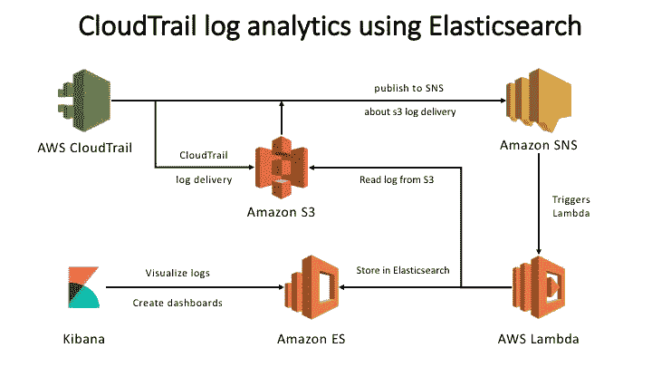

# 无服务器应用:使用亚马逊 Elasticsearch 服务的 AWS CloudTrail 日志分析

> 原文：<https://medium.com/hackernoon/serverless-app-aws-cloudtrail-log-analytics-using-amazon-elasticsearch-service-76ed8dfa064a>


在本文中，我将讨论如何使用 [AWS 无服务器应用程序模型](https://github.com/awslabs/serverless-application-model) (SAM)构建一个[无服务器应用程序，以使用](https://hackernoon.com/tagged/serverless)[亚马逊弹性搜索服务](https://aws.amazon.com/elasticsearch-service/)对 AWS [CloudTrail](https://aws.amazon.com/cloudtrail/) 数据执行日志分析。 [AWS](https://hackernoon.com/tagged/aws) 无服务器应用程序将使用 Amazon Elasticsearch 服务帮助您分析 [AWS](https://hackernoon.com/tagged/aws) CloudTrail 日志。应用程序创建 CloudTrail trail，将日志交付设置到它创建的 s3 bucket，并在 CloudTrail 日志文件写入 s3 时配置 SNS 交付。该应用程序还
创建了一个亚马逊 Elasticsearch 域，并创建了一个亚马逊 Lambda 函数，该函数由 SNS 消息触发，获取 s3 文件位置，从 s3 文件中读取内容，并将数据写入 Elasticsearch 进行分析。

先来了解一下什么是 AWS CloudTrail，Elasticsearch，亚马逊 Elasticsearch 服务，AWS Lambda，AWS SAM。

## 什么是 AWS CloudTrail？

A WS CloudTrail 是一项服务，可对您的 AWS 帐户进行治理、合规、运营审计和风险审计。使用 CloudTrail，您可以记录、持续监控和保留与整个 AWS 基础架构中的操作相关的帐户活动。CloudTrail 提供了您的 AWS 帐户活动的事件历史，包括通过 AWS 管理控制台、AWS SDKs、命令行[工具](https://hackernoon.com/tagged/tools)和其他 AWS 服务采取的操作。此事件历史简化了安全分析、资源更改跟踪和故障排除。

[](https://aws.amazon.com/cloudtrail/) [## AWS 云迹

### AWS CloudTrail 允许您跟踪并自动响应威胁您的 AWS 安全的帐户活动…

aws.amazon.com](https://aws.amazon.com/cloudtrail/) 

## 什么是 Elasticsearch？

Elasticsearch 是一个分布式 RESTful 搜索和分析引擎，能够解决越来越多的用例。作为弹性堆栈的核心，它集中存储您的数据，因此您可以发现预期的数据，发现意外的数据。

[](https://www.elastic.co/products/elasticsearch) [## Elasticsearch: RESTful 分布式搜索和分析

### 分布式开源搜索和分析引擎，旨在实现横向可扩展性、可靠性和易用性…

www.elastic.co](https://www.elastic.co/products/elasticsearch) 

## 什么是亚马逊 Elasticsearch 服务？

mazon Elasticsearch 服务使部署、保护、操作和扩展 elastic search 变得容易，可用于日志分析、全文搜索、应用程序监控等。Amazon Elasticsearch 服务是一项完全托管的服务，提供 Elasticsearch 易于使用的 API 和实时分析功能，以及生产工作负载所需的可用性、可扩展性和安全性。

[](https://aws.amazon.com/elasticsearch-service/) [## 亚马逊弹性搜索服务—亚马逊网络服务(AWS)

### 使用亚马逊 Elasticsearch 服务在 AWS 上轻松部署、操作和扩展 Elasticsearch。启动您的亚马逊…

aws.amazon.com](https://aws.amazon.com/elasticsearch-service/) 

## 什么是 AWS Lambda？

一个 WS Lambda 让你无需提供或管理服务器就能运行代码。您只需为您消耗的计算时间付费，当您的代码不运行时，则不收费。有了 Lambda，你可以为几乎任何类型的应用程序或后端服务运行代码——所有这些都无需管理。只需上传你的代码，Lambda 就会为你的代码提供高可用性的运行和扩展。您可以将代码设置为从其他 AWS 服务自动触发，或者直接从任何 web 或移动应用程序调用它。

[](https://aws.amazon.com/lambda/) [## AWS Lambda —无服务器计算—亚马逊网络服务

### AWS Lambda 允许您在不提供或管理服务器的情况下运行代码。您只需为消耗的计算时间付费。

aws.amazon.com](https://aws.amazon.com/lambda/) 

## 什么是 AWS 无服务器应用模型？

AWS 无服务器应用程序模型(AWS SAM)规定了在 AWS 上表达无服务器应用程序的规则。AWS SAM 的目标是为无服务器应用程序定义一个标准应用程序模型。

[](https://github.com/awslabs/serverless-application-model) [## awb lass/无服务器应用模型

### 无服务器应用程序模型— AWS 无服务器应用程序模型(AWS SAM)规定了表达无服务器…

github.com](https://github.com/awslabs/serverless-application-model) 

现在让我们看看如何使用 Amazon Elasticsearch 服务构建一个无服务器应用程序来对 AWS CloudTrail 数据执行日志分析。

这是 CloudTrail 日志分析无服务器应用程序的架构:



Architecture for Serverless Application: CloudTrail Log Analytics using Elasticsearch

AWS 无服务器应用模型是一个 AWS [Cloudformation](https://aws.amazon.com/cloudformation/) 模板。在我们查看 SAM 模板的代码之前，让我们先打包我们的 AWS Lambda。

在您的工作站上，创建一个用于构建无服务器应用程序的工作文件夹。

## 为 AWS Lambda 创建名为 index.py 的文件:

```
""" This module reads the SNS message to get the S3 file location for cloudtrail
 log and stores into Elasticsearch. """from __future__ import print_function
import json
import boto3
import logging
import datetime
import gzip
import urllib
import os
import tracebackfrom StringIO import StringIO
from exceptions import *# from awses.connection import AWSConnection
from elasticsearch import Elasticsearch, RequestsHttpConnection
from requests_aws4auth import AWS4Auth

logger = logging.getLogger()
logger.setLevel(logging.INFO)s3 = boto3.client('s3', region_name=os.environ['AWS_REGION'])awsauth = AWS4Auth(os.environ['AWS_ACCESS_KEY_ID'], os.environ['AWS_SECRET_ACCESS_KEY'], os.environ['AWS_REGION'], 'es', session_token=os.environ['AWS_SESSION_TOKEN'])
es = Elasticsearch(
    hosts=[{'host': os.environ['es_host'], 'port': 443}],
    http_auth=awsauth,
    use_ssl=True,
    verify_certs=True,
    connection_class=RequestsHttpConnection
)

def handler(event, context):
    logger.info('Event: ' + json.dumps(event, indent=2)) s3Bucket = json.loads(event['Records'][0]['Sns']['Message'])['s3Bucket'].encode('utf8')
    s3ObjectKey = urllib.unquote_plus(json.loads(event['Records'][0]['Sns']['Message'])['s3ObjectKey'][0].encode('utf8')) logger.info('S3 Bucket: ' + s3Bucket)
    logger.info('S3 Object Key: ' + s3ObjectKey) try:
        response = s3.get_object(Bucket=s3Bucket, Key=s3ObjectKey)
        content = gzip.GzipFile(fileobj=StringIO(response['Body'].read())).read() for record in json.loads(content)['Records']:
            recordJson = json.dumps(record)
            logger.info(recordJson)
            indexName = 'ct-' + datetime.datetime.now().strftime("%Y-%m-%d")
            res = es.index(index=indexName, doc_type='record', id=record['eventID'], body=recordJson)
            logger.info(res)
        return True
    except Exception as e:
        logger.error('Something went wrong: ' + str(e))
        traceback.print_exc()
        return False
```

## 创建一个名为所需 python 包要求的文件:

```
elasticsearch>=5.0.0,<6.0.0
requests-aws4auth
```

在您的工作区中创建了上述需求文件后，运行下面的命令来安装所需的包:

```
python -m pip install -r requirements.txt -t ./
```

创建一个名为 template.yaml 的文件，用于存储 AWS SAM 的代码:

```
AWSTemplateFormatVersion: '2010-09-09'
Transform: 'AWS::Serverless-2016-10-31'
Description: > This SAM example creates the following resources: S3 Bucket: S3 Bucket to hold the CloudTrail Logs
      CloudTrail: Create CloudTrail trail for all regions and configures it to delivery logs to the above S3 Bucket
      SNS Topic: Configure SNS topic to receive notifications when the CloudTrail log file is created in s3
      Elasticsearch Domain: Create Elasticsearch Domain to hold the CloudTrail logs for advanced analytics
      IAM Role: Create IAM Role for Lambda Execution and assigns Read Only S3 permission
      Lambda Function:  Create Function which get's triggered when SNS receives notification, reads the contents from s3 and stores them in Elasticsearch Domain
Outputs: S3Bucket:
      Description: "S3 Bucket Name where CloudTrail Logs are delivered"
      Value: !Ref S3Bucket
    LambdaFunction:
      Description: "Lambda Function that reads CloudTrail logs and stores them into Elasticsearch Domain"
      Value: !GetAtt Function.Arn
    ElasticsearchUrl:
      Description: "Elasticsearch Domain Endpoint that you can use to access the CloudTrail logs and analyze them"
      Value: !GetAtt ElasticsearchDomain.DomainEndpoint
Resources:
  SNSTopic:
    Type: AWS::SNS::Topic
  SNSTopicPolicy: 
    Type: "AWS::SNS::TopicPolicy"
    Properties: 
      Topics: 
        - Ref: "SNSTopic"
      PolicyDocument: 
        Version: "2008-10-17"
        Statement: 
          - 
            Sid: "AWSCloudTrailSNSPolicy"
            Effect: "Allow"
            Principal: 
              Service: "cloudtrail.amazonaws.com"
            Resource: "*"
            Action: "SNS:Publish"
  S3Bucket:
    Type: AWS::S3::Bucket
  S3BucketPolicy: 
    Type: "AWS::S3::BucketPolicy"
    Properties: 
      Bucket: 
        Ref: S3Bucket
      PolicyDocument: 
        Version: "2012-10-17"
        Statement: 
          - 
            Sid: "AWSCloudTrailAclCheck"
            Effect: "Allow"
            Principal: 
              Service: "cloudtrail.amazonaws.com"
            Action: "s3:GetBucketAcl"
            Resource: 
              !Sub |-
                arn:aws:s3:::${S3Bucket}
          - 
            Sid: "AWSCloudTrailWrite"
            Effect: "Allow"
            Principal: 
              Service: "cloudtrail.amazonaws.com"
            Action: "s3:PutObject"
            Resource:
              !Sub |-
                arn:aws:s3:::${S3Bucket}/AWSLogs/${AWS::AccountId}/*
            Condition: 
              StringEquals:
                s3:x-amz-acl: "bucket-owner-full-control"
  CloudTrail:
    Type: AWS::CloudTrail::Trail
    DependsOn:
      - SNSTopicPolicy
      - S3BucketPolicy
    Properties: 
        S3BucketName: 
          Ref: S3Bucket
        SnsTopicName: 
          Fn::GetAtt: 
            - SNSTopic
            - TopicName
        IsLogging: true
        EnableLogFileValidation: true
        IncludeGlobalServiceEvents: true
        IsMultiRegionTrail: true
  FunctionIAMRole:
    Type: "AWS::IAM::Role"
    Properties:
        Path: "/"
        ManagedPolicyArns:
            - "arn:aws:iam::aws:policy/service-role/AWSLambdaBasicExecutionRole"
            - "arn:aws:iam::aws:policy/AmazonS3ReadOnlyAccess"
        AssumeRolePolicyDocument:
          Version: "2012-10-17"
          Statement:
            -
              Sid: "AllowLambdaServiceToAssumeRole"
              Effect: "Allow"
              Action: 
                - "sts:AssumeRole"
              Principal:
                Service: 
                  - "lambda.amazonaws.com"
  ElasticsearchDomain: 
    Type: AWS::Elasticsearch::Domain
    DependsOn:
      - FunctionIAMRole
    Properties:
      DomainName: "cloudtrail-log-analytics"
      ElasticsearchClusterConfig: 
        InstanceCount: "2"
      EBSOptions: 
        EBSEnabled: true
        Iops: 0
        VolumeSize: 20
        VolumeType: "gp2"
      AccessPolicies: 
        Version: "2012-10-17"
        Statement: 
          - 
            Sid: "AllowFunctionIAMRoleESHTTPFullAccess"
            Effect: "Allow"
            Principal: 
              AWS: !GetAtt FunctionIAMRole.Arn
            Action: "es:ESHttp*"
            Resource:
              !Sub |-
                arn:aws:es:${AWS::Region}:${AWS::AccountId}:domain/cloudtrail-log-analytics/*
          - 
            Sid: "AllowFullAccesstoKibanaForEveryone"
            Effect: "Allow"
            Principal: 
              AWS: "*"
            Action: "es:*"
            Resource:
              !Sub |-
                arn:aws:es:${AWS::Region}:${AWS::AccountId}:domain/cloudtrail-log-analytics/_plugin/kibana
      ElasticsearchVersion: "5.5"
  Function:
    Type: 'AWS::Serverless::Function'
    DependsOn:
      - ElasticsearchDomain
      - FunctionIAMRole
    Properties:
      Handler: index.handler
      Runtime: python2.7
      CodeUri: ./
      Role: !GetAtt FunctionIAMRole.Arn
      Events:
        SNSEvent:
          Type: SNS
          Properties:
            Topic: !Ref SNSTopic
      Environment:
        Variables:
          es_host:
            Fn::GetAtt: 
              - ElasticsearchDomain
              - DomainEndpoint
```

## 打包工件并将它们上传到 s3:

运行下面的命令将您的工件上传到 S3，并输出一个打包的模板，该模板可以很容易地部署到 CloudFormation。

```
aws cloudformation package \
    --template-file template.yaml \
    --s3-bucket bucket-name \
    --output-template-file serverless-output.yaml
```

## 将此 AWS SAM 部署到 AWS CloudFormation:

您可以使用`aws cloudformation deploy` CLI 命令来部署 SAM 模板。在幕后，它创建并执行变更集，并等待部署完成。当部署失败时，它还会打印调试提示。运行以下命令，将打包的模板部署到名为`cloudtrail-log-analytics`的堆栈中:

```
aws cloudformation deploy \
    --template-file serverless-output.yaml \
    --stack-name cloudtrail-log-analytics \
    --capabilities CAPABILITY_IAM
```

更多细节参见[文件](http://docs.aws.amazon.com/cli/latest/reference/cloudformation/deploy/index.html)。

> 我建议使用[文档](http://docs.aws.amazon.com/elasticsearch-service/latest/developerguide/es-createupdatedomains.html#es-createdomain-configure-access-policies)阅读关于 Elasticsearch 服务访问策略的内容，并修改 Elasticsearch 域的访问策略，以进一步微调访问策略。

一旦在您的 AWS 帐户中部署了无服务器应用程序，一旦日志被发送到 s3，它就会自动将 AWS CloudTrail 数据存储到 Amazon Elasticsearch 服务中。有了 Elasticsearch 中的数据，您可以使用 Kibana 来可视化 Elasticsearch 中的数据，并在 AWS CloudTrail 数据上创建您需要的仪表板。

上述无服务器应用模型应用可从以下 Github repo 获得:

[](https://github.com/ExpediaDotCom/cloudtrail-log-analytics) [## ExpediaDotCom/cloud trail-log-analytics

### cloudtrail-log-analytics —使用 Amazon Elasticsearch 服务的 cloudtrail 日志分析— AWS 无服务器应用程序

github.com](https://github.com/ExpediaDotCom/cloudtrail-log-analytics)