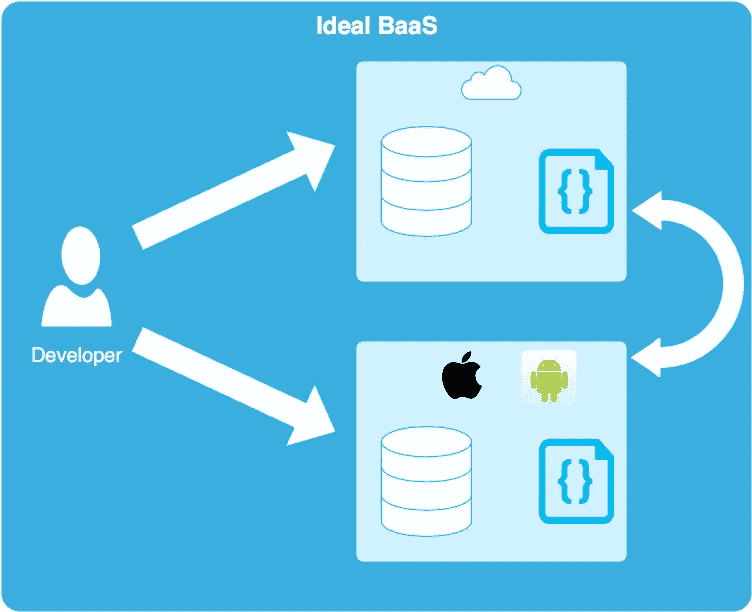
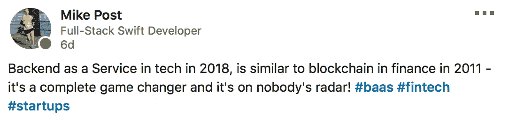

# 无服务器后端还不够吸引人

> 原文：<https://medium.com/hackernoon/serverless-backends-arent-compelling-enough-yet-b10e9731444b>

我原本以为我会从相反的角度写博客。

在 Highline BETA 开始我的角色让我从 2010 年末开始主要在 iOS 独占的堆栈中出来透透气。说实话，苹果的开发工具和框架是一种乐趣。对于一个标准极高的社区来说，任何对他们的偶尔抱怨都是正常的。

尽管我觉得我在 Swift 和 iOS 框架中仍有一些地方需要修改和赶上(SceneKit，我还没说完呢…还有你好，CreateML)，但我需要拓宽我的总体范围。这包括了解 React Native、Android Studio 中的 Kotlin 及其作为跨平台语言的潜力，是的，甚至可能会研究服务器端后端。

移动开发人员对服务器端后端的任何探索通常都是以无服务器后端的形式出现的。

无服务器后端已经在 mobile 中存在了一段时间，我的第一次体验是使用出色但现已不存在的 Parse。从那以后，我涉足了一些 Firebase，但是直到最近，我还没有广泛地研究过解析后后端即服务(BaaS 或 MBaaS，因为它们主要用于移动开发环境)的现有功能。

## 鲜为人知的事实——后端存在于移动设备上

首先，让我们回顾一下后端的移动视角到底是什么。

这对非移动开发人员来说可能是一个冲击，但是大多数移动开发人员都熟悉这些原理，并且已经掌握了通常所说的*后端*的技能。描述非常以 web 为中心的开发的常用术语——全栈开发人员、前端开发人员和后端开发人员——并没有真正展示出对移动开发中实际涉及的内容的任何认识(提示:它也可以包含全栈、前端和/或后端)。

在移动之外，还有一个不太为人所知的“T2”移动后端(T3)。可能是因为我们中没有足够的人来保证这项工作的 LinkedIn 头衔。就我个人而言，我试着称之为后端，作为**服务器后端**，以区别于**移动后端**。

Nothing unusual here, I’m just a regular mobile backend developer going to work. This is not a made up job title.

*移动后端的* *第一部分*，是搜索查询、数据库模式、ER 模型、关系、级联规则、外键等。尤其是如果这是我们在大学学到的先验知识，那么它会被在移动领域工作了几年的任何人持续应用。

虽然直接构造 SQL 调用不太常见(如果您发现一个移动开发人员编写了一个 20 行的 join 查询，这更多的是一种虚荣的选择，而不是对平台的最佳选择)。例如，在 iOS 中，数据存储被包装在 ORM(核心数据)中。使用“谓词”语法进行搜索是最佳的，如果关系正常化，插入是最佳的…使用这些方法，您可以利用 Apple 已经在查询级别进行的优化，而不是重新发明它。

也是因为这个原因，设备上的大量计算逻辑并不是什么大问题(显然，对于跨平台来说就不那么重要了，尽管跨平台应该是一个低重点，直到达到高增长 PMF)。在 WWDC 会谈中，苹果强调了这样一个事实:我们口袋里有一台非常强大的电脑——用它吧！这是浏览器所不具备的优势(尽管自从 10 年前我开始接触编程以来，那些分不清**潜力**和**现实***的人不断试图论证浏览器同样强大)。*

*手机后端的* *第二部分*，就是联网。当然，在 web 用户界面中有 API 集成的元素，但是在移动中涉及到更多的工作。单个窗口有多个线程需要管理…不要让我开始了解同步到移动数据存储所涉及的内容(根据我的经验，移动应用程序 50%以上的时间是使用本地数据存储创建的)。在 web 中，服务器后端*是 web 数据存储库*。

举个例子，使用 Foursquare 或 Yelp API 创建一个移动应用程序，为你寻找午餐地点。显然 Foursquare 是它自己的公司，我们无法控制他们如何构建他们的 API。我们仍然必须定义我们的模式和对象模型，围绕访问最适合应用程序用例的数据，而不是 API。

还有非 ORM/ER 数据存储替代方案，如 Realm 或 Firebase，我稍后将对此进行介绍。

无论如何，我之所以涉足这个领域，是因为在移动领域，很多后端工作已经完成了。**这就是 BaaS 对移动开发者特别有吸引力的原因** —我们不想重复工作，特别是考虑到许多计算逻辑在设备上进行很有意义(出于上面提到的关于谓词搜索、速度等原因)。

## 寻找梦想的过程

因此，理想的场景是在核心数据中定义一个模式和模型对象(或者在 Android 中，Room Persistence ),并简单地将其部署到服务器，让它根据已经完成的模式和优化自动生成一个 API。或者反之亦然，如果数据建模工具在 BaaS GUI 中也一样好的话。

那不是很酷吗？这只是一个梦，还不存在。嗯，使用 [CloudKit Web 服务](https://developer.apple.com/library/archive/documentation/DataManagement/Conceptual/CloudKitWebServicesReference/index.html#//apple_ref/doc/uid/TP40015240-CH41-SW1)，它*确实存在*。但这对 Android 应用程序没有好处——这很遗憾，因为苹果的核心数据& CloudKit 堆栈无疑是我使用过的处理持久数据的最佳工具集。

*更新:以上关于 Android 上的 CloudKit，自*[*cloud kit JS*](https://www.netguru.co/codestories/cloudkit-mbaas)*将其扩展为跨平台使用* [*以外的苹果设备*](/@guilhermerambo/synchronizing-data-with-cloudkit-94c6246a3fda) *。然而，除了一个有局限性的* [*开源倡议*](https://github.com/paulw11/Seam3) *之外，CloudKit 和核心数据仍然没有无缝集成在一起。*

The developer can either choose to define the DB schema & computational logic in the cloud, or on the device, and whichever the defined platform will deploy to the other one.

但是，试图找出是否有达到 CloudKit 水平的 BaaS 解决方案，或者至少允许我定义模式或处理迁移的解决方案，是推动我走上这条最新研究道路的原因。

CloudKit 之外的主要玩家，倾向于 [Firebase](https://firebase.google.com/docs/) 、 [Azure](https://azure.microsoft.com/) 、 [Backendless](https://backendless.com/platform/backend-as-a-service/) 。关于这些服务的功能，有大量的参考资料，所以我只对每一个做一个主要的总结。

## 重火力点

Firebase 可能是最著名的 BaaS 解决方案，归 Google 所有。值得称赞的是，Firebase 现在已经发展成为一个相当强大的平台，因为它不仅仅是一个后端。除了他们的后端产品，Firebase 还是他们进行分析、A/B 测试甚至机器学习框架的主要仪表板。

在数据库方面，他们有两种产品，可以总结为新旧两种，但他们称之为实时数据库和云 Firestore。后者应该是对原始版本的改进，可以编写自定义查询，至少可以让您定义每个字段的类型。但是界面还是很像 JSON。这两个数据库都建立在 NoSQL 上，所以它们没有为寻找更结构化的东西的开发人员提供替代方案，这看起来有点像是一个失败(唉)。

## 蔚蓝的

Azure 是微软对 BaaS 的解决方案。我没有像 Firebase 或 Backendless 那样尝试过，但它对我来说似乎没有那么有吸引力。它给人的印象是，它更适合企业，而不是精益 MVP(企业没有错，这不是我的重点)。

虽然他们确实提供 SQL，但是你甚至不能在不添加你的信用卡信息的情况下尝试它…所以企业喜欢。虽然用户界面看起来不太好，如果我要交出我的支付信息，加上我正在寻找一个*无代码*后端的事实，我需要 5 星用户界面。

## 无尽的

Backendless 不属于任何一家大公司，所以它立刻就有了那种独立创业的诱惑力。他们的用户界面也很棒，而且他们实际上可以让你建立一个合适的模式，所以我得到了所有温暖和模糊的倒叙来解析。

他们的 REST CMS 界面看起来也非常直观。如果你正在创建一个数据库和一个 API，没有代码，这正是你所期望的。我不知道他们的数据库在技术上是否真的使用了 SQL，但是他们的文档声称他们的数据库提供了关系数据库和 NoSQL 数据库的“两种特性”。由于这些原因，Backendless 对我来说似乎是最有吸引力的解决方案。他们没有提供那么多的语言来编写定制的业务逻辑，只有 JS 和 Java，但至少涵盖了 1 个强类型和 1 个动态类型。

既然 Backendless 是一个合理的解决方案，Firebase 也是一个不错的选择，为什么无服务器仍然没有达到它需要的水平呢？

在很大程度上，[这篇博文](https://crisp.chat/blog/why-you-should-never-use-firebase-realtime-database/amp/)很好地抓住了这一点。有些可能是人为的，我认为他们真的想达到 10。但是对迁移、关系(或缺乏关系)、查询和创建 API 的关注，看起来像是交易破坏者。

Oops, maybe it’s not a gamechanger just yet. Only conceptually.

我最初认为的交易障碍已经解决。

> “明天有一个与你今天的想法相矛盾的想法是完全健康的，甚至是被鼓励的。”杰森·弗里德，大本营

使用核心数据(或类似的东西)的上述梦想场景的所有能力。在 BaaS 达到那个梦想场景的水平之前，它似乎还不够令人信服。

由于我的技能组合主要是 Swift，使用 [Vapor](https://docs.vapor.codes/3.0/) 的服务器端 Swift (SSS)似乎是一个更好的解决方案……最重要的是，也是现实的。Vapor 在这里，Vapor 3 是利用 Swift 4 可编码协议的一个重大更新，他们创建了 [Vapor 云](https://vapor.cloud)以支持“零配置”使用 AWS。我将在今年秋天检查它，并将很快在博客上(希望是积极的)用 Vapor 创建一个自定义后端。

*为了更深入地探究 BaaS 的利弊，马丁·福勒的博客* [*有一篇长文*](https://martinfowler.com/articles/serverless.html) *，就在今年 5 月(虽然它主要涉及 FaaS，文章中解释了其中的区别)。*