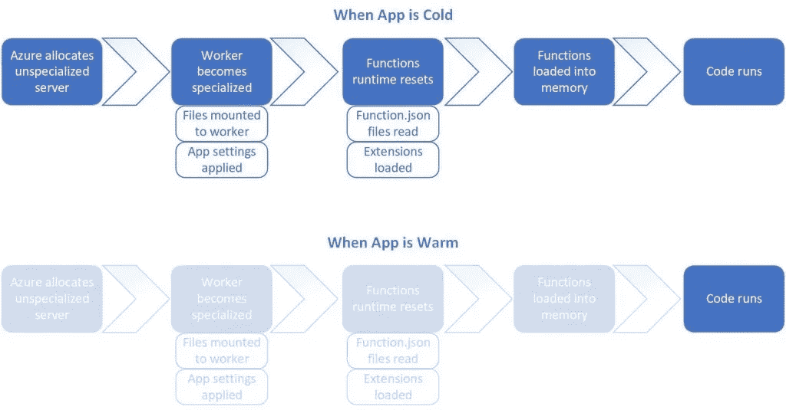
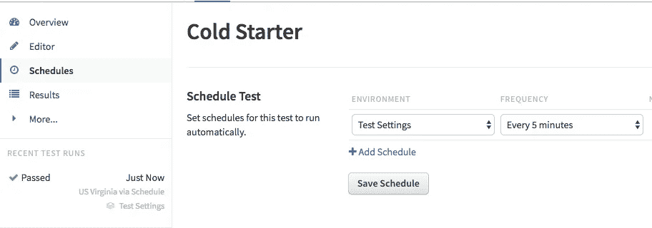
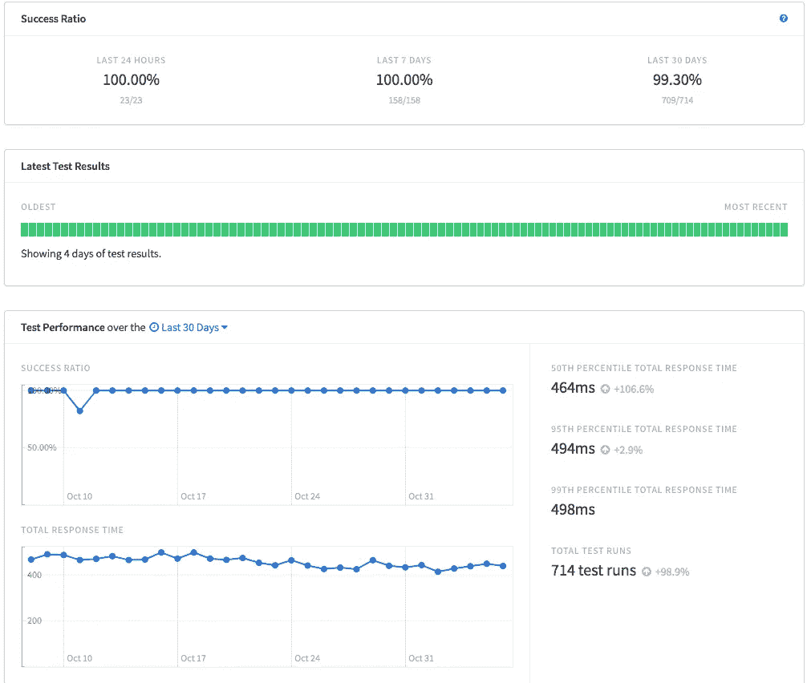

# 用先进的工具解决无服务器冷启动

> 原文：<https://medium.com/hackernoon/serverless-cold-starts-using-them-to-your-advantage-3dfdf9a0bc66>

## 抓住无服务器的最大缺点之一，让它为您服务。

Photo by [Jonathan Percy](https://unsplash.com/photos/WUNToVtzhik?utm_source=unsplash&utm_medium=referral&utm_content=creditCopyText) on [Unsplash](https://unsplash.com/search/photos/ice?utm_source=unsplash&utm_medium=referral&utm_content=creditCopyText)

# 什么是冷启动？

如果你花大量时间构建无服务器功能，你可能会开始认为它们好得不真实。代码更易于管理和维护。Azure 的持久功能为您提供了开箱即用的复杂管道，为您的成功做好了准备。此外，它们便宜得离谱。

我内心的怀疑者一直在想，这其中有什么猫腻？有些东西必须放弃。毫无疑问，无服务器不是一个完美的世界，当然也有不好的一面。最大的缺点之一是冷启动。

> 冷启动是一个术语，用来描述一段时间没有使用的应用程序需要更长时间才能启动的现象。( [MSDN](https://blogs.msdn.microsoft.com/appserviceteam/2018/02/07/understanding-serverless-cold-start/)

上述 MSDN 的文章很好地解释了什么是冷启动，它们是如何工作的，以及为什么它们是必要的。为了帮助保持低成本，闲置一段时间的无服务器应用程序会被取消分配。这意味着当函数加载时，用户第一次调用被释放的函数可能会有延迟。

在每个无服务器环境(Azure、AWS、Google Cloud)中，冷启动工作略有不同。但是概念是一样的。 [Mikhail Skilkov](https://mikhail.io/) 有一系列关于冷启动的文章。这个[比较每个平台的冷启动行为。](https://mikhail.io/2018/08/serverless-cold-start-war/)

What Happens During a Cold Start (From [MSDN](https://blogs.msdn.microsoft.com/appserviceteam/2018/02/07/understanding-serverless-cold-start/))

面对现实吧，对于大多数应用来说，冷启动问题更多的是一个小麻烦。对于大多数应用程序来说，偶尔出现几秒钟的延迟并不算什么。但是对于一些用例来说，这可能是一个绝对的交易破坏者。那么我们能做什么呢？

# 解决方法

普遍的共识是，为了减少冷启动，你首先要确保你的应用程序永远不会“冷”。这通常是通过创建一个单独的函数来完成的，该函数每隔 X 分钟向你的应用发出一次请求。我将提出一个非常相似的模式，但是可以提供一些额外的商业价值。

## 一个定时器功能应用程序

屡试不爽的方法是创建一个独立的定时器功能应用程序。你设置了定时器，让它在你知道你的应用程序不会冷的时间间隔运行。例如，Azure 函数“在大约 20 分钟不活动后释放资源 [*](https://blogs.msdn.microsoft.com/appserviceteam/2018/02/07/understanding-serverless-cold-start/) ”。

Azure Function Cold Starter

因此，最好将计时器设置为每 15 分钟运行一次，以确保应用程序永远不会变冷。或者更频繁地出现！我将再次连线米哈伊尔·斯基尔科夫。他还有一篇很棒的文章展示了这种方法的有效性。它并不完美，但它是一个很好的选择，可以代替掷骰子，希望你的用户不会受到冷启动的影响。

## 第三方监视器

如果冷启动是一个真正的问题，那么这是一个非常关键的任务应用。对于这些应用程序，你需要得到所有你能得到的保证，你的应用程序不仅运行良好，而且在第一时间运行良好。

无服务器功能有相当高的正常运行时间。如果 Azure 的功能运行时间低于 99.95%的 T2，它会给你一些积分。但这并不是说它们永远不会下降，或者慢下来。对于任务关键型应用程序来说，短暂的停机时间会造成巨大的损失。获得警报，即使只是停机几分钟，也是一大胜利。

这就是像 [RunScope](https://www.runscope.com/) 和[assertable](https://assertible.com/)这样的 API 监控工具发挥作用的地方。这些服务允许您设置时间表，在某个时间间隔运行 API。他们可以对结果进行测试，如果有任何异常，他们会提醒你。这是一个完美的冷启动！

RunScope Scheduler

这与你自己的功能应用程序是相同的概念，但有更多的好处。首先，关注点是分离的。如果你的功能应用关闭了，冷启动功能(也关闭了)也帮不了你什么。这给了你一个公正的第三方，确保一切工作正常。

您还可以了解您的功能随着时间的推移表现如何。既然你如此频繁地测试你的应用，你将开始看到一些模式。app 是不是变慢了？新特性是否增加了加载时间？我们能确定生产中没有冷启动问题吗？

RunScope’s Test Dashboard

我没有从属关系，但我一直是 [RunScope](https://www.runscope.com/) 的忠实粉丝。我强烈建议不要只是冷启动你的函数应用，而是所有的 API 监控。上面的概述非常好。此外，基于 RunScope 警报而不是愤怒的用户来响应下降(如图中 10 月 10 日)是无价的。

也就是说，如果你只是冷启动，最便宜的计划每月 79 美元可能有点多。可主张的是另一个不错的选择，甚至有一个免费的计划。使用免费层，您可以每 30 分钟发出一次请求。这还不足以消除冷启动，但它可能会降低用户体验冷启动的频率。另外，你还能得到其他所有的好处。如果你发现你的用户仍然有问题，你可以升级到一个更合理的计划。每月 25 美元的计划可以让你每五分钟跑一次或者更快。非常适合保温那些功能应用。

# 包裹

无论您选择做什么，很明显，当您使用无服务器时，冷启动问题值得考虑。毫无疑问，Azure 正在努力提高冷启动性能。曾经有一段时间是每五分钟一次，现在我们达到了 20 次。但是在问题解决之前，帮你自己(和你的用户)一个忙，让应用程序保持温暖。在这个过程中，你甚至会从中受益。