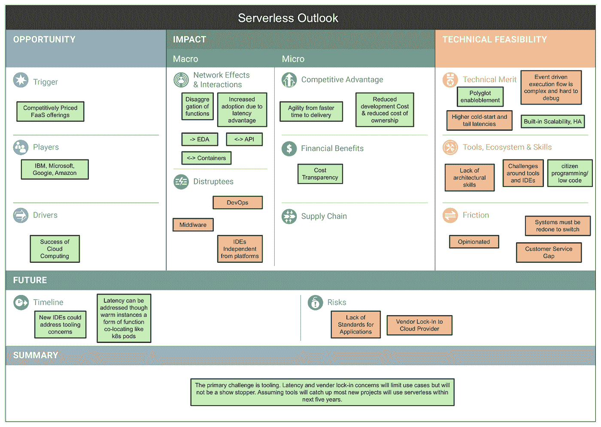
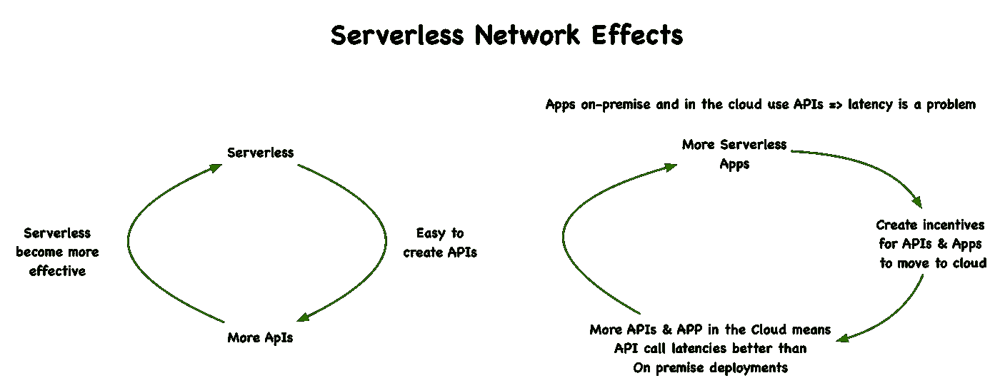

# 让我们来看看无服务器的未来

> 原文：<https://medium.com/hackernoon/serverless-future-dbb2e8b38ad3>

> 让我们从一个价值百万美元的问题开始:无服务器能否不负众望？

这个答案决定并影响着许多组织的战略。

这篇文章使用“[新兴技术分析画布(ETAC)](https://github.com/wso2/ETAC/blob/master/ETAC.md) ”来回答这个问题，这是一个用来分析新兴技术的框架。什么是 ETAC？这是一组围绕逻辑叙述的**问题**，探究技术。它在一个页面上直观地展示了技术的不同方面。视觉表现简洁、紧凑，一目了然。

# 无服务器分析画布

下面的画布描绘了无服务器分析。画布从左到右、从上到下阅读。

> F 关于画布的详细讨论请参考[无服务器技术展望](https://github.com/wso2/ETAC/blob/master/outlooks/serverless_outlook.md)。

# 画布概述

下面是一幅 10，000 英尺长的画布轮廓。

在最左上方的单元格中，机遇试图了解情况。亚马逊λ提供 FaaS 作为一个非常有竞争力的价格触发无服务器。很快其他人也跟上了。主要参与者是 IBM。微软，谷歌，亚马逊。它建立在云计算的成功之上。

在宏观层面上，无服务器产生了两种网络效应。下面的图片展示了这些网络效应。

Serverless Network Effects

此外，由于无服务器抽象并隐藏了现实世界系统的复杂性，使用无服务器的组织获得了灵活性、降低的成本和成本透明性。

如最右上角的单元格所示，无服务器存在问题和挑战。然而，尽管有这些挑战，许多用例仍然是可行的。它很容易学习，有很多开发人员可以用它来编程。

此外，缺乏标准和供应商锁定是风险所在。然而，云还是赢了。同样的情况也可能发生在无服务器上。

考虑到所有这些因素，无服务器的未来看起来很有希望。我们认为在 3-5 年内，大多数新应用程序将使用无服务器。

# 更多信息

您可以从[无服务器技术展望](https://github.com/wso2/ETAC/blob/master/outlooks/serverless_outlook.md)文档中找到对无服务器画布的详细分析。

另外，你可以从 [ETAC 规范@Github](https://github.com/wso2/ETAC/blob/master/ETAC.md) 找到更多关于 ETAC 的信息。请考虑通过 srinath@wso2.com 或 GitHub issue 分享您的想法和反馈，帮助我们改进 ETAC 和无服务器 outlook。

要获得 ETAC 和 ETAC 新兴技术分析的更新，请订阅我们的[全球技术展望更新简讯](https://wso2.com/subscribe/global-technology-outlook-update)。