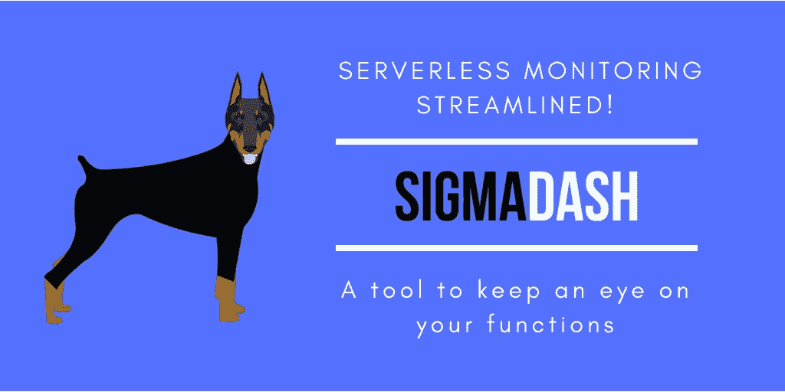

# 简化的无服务器监控！

> 原文：<https://medium.com/hackernoon/serverless-monitoring-streamlined-56c7b6140b8a>

## 介绍 SigmaDash，一个监视您功能的工具

> **适马**是希腊字母表中的第 18 个字母，相当于英文字母“S”。在数学中，大写的 sigma 用于求和符号。

根据这个定义， [SLAppForge](http://slappforge.com) 创造了世界上第一个无服务器开发工具 [**【适马】**](https://sigma.slappforge.com) ，它是多个应用组件的总和，涵盖了无服务器开发生命周期的大部分方面，包括:编码、测试、调试、管理资源和**监控。**

 [## 适马，第一个真正的无服务器开发包！

### 向无缝的无服务器体验问好—资源、触发器、操作等等！

medium.com](/think-serverless/sigma-the-first-truly-serverless-devkit-9459255b9d78) 

SigmaDash 是 SLAppForge 无服务器工具栈的最新成员，它让你能够**监控**你的功能和项目。

# 为什么要监控？

1.  防止资源过度分配和分配不足

在估计我们编写的函数的资源(内存、cpu、超时)需求方面，没有人是完美的。在无服务器中，你每月的账单是内存、CPU 和运行时间的等式。因此，资源的**过度分配** & **和**分配不足都可能会耗费你的金钱(分配不足可能会增加运行时间)。监控有助于您找到这些参数的最佳位置，用于承载非常具体的应用程序逻辑的特定函数。

2.识别趋势

监控和分析各种函数的状态有助于您识别趋势，这为您提供了进行持续改进的必要信息。

3.识别错误和缺陷

很难写出 100%没有错误的代码，也很难处理业务逻辑的所有边缘情况。因此，最好密切关注您的函数，以便在它们无法处理某些请求时进行识别和修补。

 [## Lambda 编程错误可能会让你每天损失数千美元！

### 这是一个真实的故事。一个仍在发展的过程..一周之内，由于一个…

medium.com](/@asankha/lambda-programming-errors-that-could-cost-you-thousands-of-dollars-a-day-265dfac354f) 

如果我们当时有了 **SigmaDash** 的话，我们可以很容易地识别和预防这种情况。😕

4.识别攻击和安全漏洞。

利用图形工具和日志来监控和识别安全攻击，以免系统崩溃。

# SigmaDash，监视您功能的工具！

SigmaDash 是 [SLAppForge](http://slappforge.com) 无服务器堆栈的最新组件，以最小的努力实现上述所有目标。

SigmaDash 有两种类型的可监控组件。

## **功能**

函数是 SigmaDash 中 AWS Lambda 函数的精确表示。SigmaDash 函数和 AWS Lambda 函数之间存在一对一的映射。

## **项目**

项目是函数的集合。有了项目，您就能够对功能进行逻辑分组，并监控汇总的统计数据。SigmaDash 项目和 AWS Lambda 函数之间存在一对多的映射。

# SigmaDash 主屏幕

SigmDash home screen

SigmaDash 主屏幕有两个部分，固定项目和固定功能。您可以将最关心的功能和项目钉在主屏幕上，并更方便地在它们之间快速跳转。

Pin Button

# SigmaDash 度量

对于每个功能或项目，SigmaDash 为以下指标生成图形表示。

## **召唤术**

Invocations Graph

作为事件或[直接调用 api 调用](https://docs.aws.amazon.com/AWSJavaScriptSDK/latest/AWS/Lambda.html#invoke-property)的结果，一个函数或一组函数被调用的次数。该图表统计了所有调用，而不考虑各自的调用是成功还是失败。这个图表在确定趋势时很有用。

## **内存使用量**

Memory Usage Graph

每次调用时函数容器的内存使用情况。此图表有助于确定资源的过度分配或分配不足。

## **调用持续时间**

Invocation Duration Graph

每次调用该函数所花费的时间。该图与内存图相结合，可用于确定资源分配的最佳点，以最小化成本。

## **油门**

Throttles Graph

每个 AWS 帐户都有 AWS 强加的某些并发限制，以防止滥用其资源。即。默认情况下，AWS Lambda 将给定区域内所有函数的总并发执行数限制为 1000。该图显示了由于超出这些限制而被抑制的调用的数量。基于这个图表，我们可以调整我们的源代码/应用程序逻辑来限制函数调用的数量，或者请求 AWS 取消帐户限制。

## **错误**

Errors Graph

失败的调用次数，

*   已处理的异常(例如，context.fail(error))
*   导致代码退出的未处理异常
*   内存不足异常
*   超时设定
*   权限错误

## **成本**

Cost Graph

SigmaDash 利用下面的等式和 [AWS Lambda 定价](https://aws.amazon.com/lambda/pricing/)生成此图。

*成本=分配的内存*调用时间四舍五入到最近的 100 毫秒*

除了这些指标， **SigmaDash** 还内置了适马的日志监控组件 **SigmaTrail** 。

## SigmaDash 度量控制器

SigmaDash Metrics controllers

**自动刷新**

SigmaDash 默认情况下，以 1 分钟的间隔更新功能或项目的指标。但是，您可以关闭自动刷新或配置更新间隔。

**时间范围**

您可以配置时间范围，以便在生成度量时只考虑目标时间段的函数调用。这个范围我们一般不做限制。但是如果在所选范围内频繁调用，建议不要选择更大的范围。

## SigmaDash 图形控制器

SigmaDash Graph Controllers

SigmaDash 允许您使用两种图表来分析指标；折线图，条形图。此外，您可以放大/缩小图表，以获得更好的微调视图。

# 使用 SigmaTrail 进行日志监控

SigmaTrail 是**附带适马 IDE 和 SigmaDash 的日志监控组件。**

Sigma Trail

在 sigma 中，我们将日志分为两种类型。

**1。测试日志【测试】**

测试日志是这样一种类型，当您在 IDE 中执行测试用例时，它会实时生成。这些日志将包括测试执行的结果/响应以及生成的日志。

**2。生产日志[生产]**

Prod 日志是这样一种类型，当您通过一个事件源调用 lambda 函数时，就会生成这种日志。(即:Api 网关、S3 事件等。)这些日志不包括执行的结果/响应。

## 日志请求

我们将日志请求称为在 lambda 函数的一个执行周期中生成的一组日志行。

LogRequest components

**1。日志请求标题**

日志请求标题让您快速了解日志请求。标题的格式如下。

[日期][时间][请求 Id][日志行数][测试/生产]

您可以单击日志请求标题来展开或折叠日志行。

**2。测试执行结果**

本节仅适用于测试日志。如果结果可以被解析成 JSON，适马将在一个可扩展的 JSON 树中显示响应。

SigmaTrail execution results

**3。日志行**

日志行是 lambda 代码生成的控制台日志的单行

**4。堆栈跟踪**

堆栈跟踪是抛出错误时活动堆栈帧的报告。这在调试应用程序时很有用。

**5。资源利用率**

本节说明执行功能逻辑所花费的时间以及用于处理相应请求的内存。

## 适马拖车控制器

SigmaTrail controllers

适马跟踪标题有以下控制微调您的日志视图。

**1。λ选择器**

适马踪迹在一个屏幕内仅显示与一个特定功能相关的踪迹。如果你想切换 sigma 轨迹以显示不同函数的轨迹，点击此按钮以获得可用 lambda 函数的列表。

除了这个选择器之外，在编辑器选项卡之间切换会自动切换适马轨迹来显示聚焦函数的日志。

**2。下载线索**

适马允许你下载以下两种格式的日志。

*   文本
*   JSON

**3。清除日志**

如果您对可见日志不感兴趣，您可以通过此按钮隐藏可见日志。

**4。自动滚动**

适马会自动为你滚动轨迹。每当追加新的日志请求时，trail 将自动滚动并扩展新的日志请求。您可以通过切换此按钮来打开/关闭此功能。

**5。搜索日志**

您可以使用 [Cloudwatch 过滤模式和语法](https://docs.aws.amazon.com/AmazonCloudWatch/latest/logs/FilterAndPatternSyntax.html)来过滤适马踪迹。

这将给你一个类似于用 grep 尾随的效果。

**6。关闭**

关闭 sigma trail 面板。

## 调整日志视图的大小

如果你想为你的代码腾出更多的空间，你可以通过按住并拖动头部来调整 sigma trail 的大小，如下所示。

Resizing SigmaTrail

## 浏览旧的日志请求

默认情况下，适马只显示最新的 15 个日志请求。

要查看旧日志，您可以使用下列控制器。

**查看旧日志**

这将加载 15 个以上的旧日志到 sigma trail。

**隐藏旧日志**

此按钮将带您回到 15 个最新日志模式。

## 控制适马的日志获取行为

默认情况下，适马会不断从 Cloudwatch 轮询新日志。如果您希望控制这种行为，您可以使用以下一组按钮。

**打开/关闭实时日志**

关闭实时日志将阻止适马自动轮询新日志。

**查看旧日志**

在非实时模式下，使用此按钮请求更新的日志请求。

> 其中一些组件和特性只在适马 IDE 中可用&不适用于 SigmaDash。

# 在 SigmaDash 中创建项目

SigmaDash 中的项目是函数的集合。您可以通过点击 SigmaDash 项目页面的创建项目按钮来创建项目。

Create Project button

SigmaDash 提供了两种创建项目的方法。

1.  从头开始创建一个空项目。

在这种模式下，您只需从项目的名称和描述开始。

2.从造云项目开始。

在这种模式下，您可以从现有的 CloudFormation 项目开始您的项目。SigmaDash 会自动将指定 CloudFormation 项目中定义的所有函数导入到您的 SigmaDash 项目中。

## 将功能附加到项目

无论您是如何启动项目的，您都可以通过导航到项目主屏幕将新功能附加到您的项目。一旦您附加了一个函数，项目指标将会自动更新。

所以，这就是我们在 [SLAppForge](http://slappforge.com) 如何开始精简**无服务器监控**。这只是开始，还有更多的内容，包括代码级逐行调试、警报、代码级出站连接跟踪等。敬请期待！！

希望你喜欢！快乐编码[无服务器](https://en.wikipedia.org/wiki/Serverless_computing)带[适马](https://sigma.slappforge.com)。

 [## SLAppForge(@ SLAppForge)| Twitter

### SLAppForge 的最新推文(@SLAppForge)。SLAppForge 提供强大的下一代#无服务器应用程序…

twitter.com](https://twitter.com/slappforge?lang=en)  [## 我们如何简化无服务器测试

### 如果这不是你第一次听说无服务器和 AWS Lambda，你可能已经看过橙色测试…

hackernoon.com](https://hackernoon.com/how-we-streamlined-serverless-testing-8f5e0bbdc7e5) 

# 行动呼吁

*   **拍手。**欣赏并让别人发现这篇文章。
*   **评论。**分享你对这篇文章的看法。
*   跟我来。[chat hura wid anage](/@cwidanage)**接收类似文章的更新。**
*   ****保持联系。** [LinkedIn](https://www.linkedin.com/in/cwidanage/) ， [Twitter](https://twitter.com/cwidanage)**