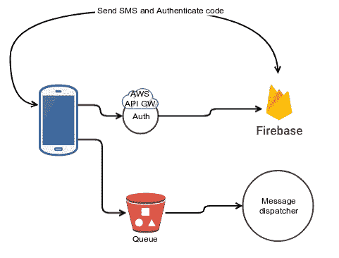
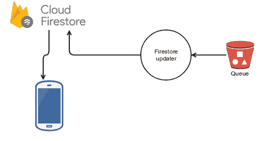
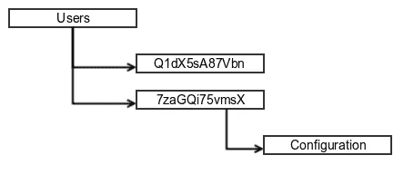

# 没有战壕

> 原文：<https://medium.com/hackernoon/serverless-multi-cloud-from-the-trenches-50a615ba234c>

# **无服务器多云**

“photo of two orange flying biplanes” by [Andrew Palmer](https://unsplash.com/@ampalmer?utm_source=medium&utm_medium=referral) on [Unsplash](https://unsplash.com?utm_source=medium&utm_medium=referral)

# 来自战壕系列

*   [战壕中的无服务器测试](https://hackernoon.com/serverless-testing-from-the-trenches-790e77301c74)
*   来自战壕的无服务器云计算
*   [战壕中无服务器环境下的开发流程](https://hackernoon.com/development-flow-in-serverless-environment-from-the-trenches-d42021b7aef0)

# 正确的决定

我在想我是否做了一个好的选择。创建一个[无服务器](https://hackernoon.com/tagged/serverless) [架构](https://hackernoon.com/tagged/architecture)结合两个云提供商看起来很疯狂。我最担心的是两个平台之间的集成。然而，令人惊讶的是，我发现集成是容易的部分；以自动化的方式供应它们要困难得多，最终成为棘手的部分。

根据最新的[无服务器框架调查，](https://serverless.com/blog/2018-serverless-community-survey-huge-growth-usage/)超过四分之一的受访者使用两家或更多的云提供商。当我考虑使用多云环境的结果和旅程时，使用两个或更多的云提供商是有意义的。每个云提供商都有自己的优势。例如，谷歌以其人工智能和移动支持而闻名，那么为什么不使用这些功能呢？

> 无服务器，就其最纯粹的形式而言，意味着将任何与您的核心业务无关的事情外包给外部方，如 VCS、CI、计算引擎、ML 等。专注于你最擅长的事情。

# 我们的使用案例

我们的系统由两个主要部分组成:收集数据并上传到摘要的移动客户端和摘要数据、更新移动数据库并发送推送通知的后端。

对于移动部分，我们选择 Firebase 作为我们的“工具”它提供崩溃报告(令人惊讶的 Crashlytics)、分析和推送通知，我们以前有过很好的经验。因此，对我们来说，这是显而易见的。两个主要组件仍然开放，我们不知道选择什么—身份验证还是移动数据库。

本来我们选的是 [Auth0](https://auth0.com/) 。我们喜欢它天真地与[谷歌](https://hackernoon.com/tagged/google)云和 [AWS](https://hackernoon.com/tagged/aws) 对话，但移动设备上的认证 UI 不如 [Firebase 提供的那个](https://github.com/firebase/FirebaseUI-Android/blob/master/auth/README.md)，特别是通过短信登录而不需要任何短信许可的能力。对我们来说，这个选择是一个巨大的胜利。最后，我们更喜欢同一个包中的组件。此外，Firebase 已经集成到我们的系统中，所以我们简单地添加了身份验证和 Firestore。

## 证明

Using Lambda for authentication

1.  一切从注册开始，我们使用基于 SMS 的注册。
2.  如果注册成功，令牌将保存在设备的内部存储器中。
3.  身份验证 Lambda 接收令牌作为有效负载的一部分，并对 Firebase 进行 API 调用以验证令牌。
4.  如果令牌验证成功，一个[预签名的 POST URL](https://docs.aws.amazon.com/AmazonS3/latest/dev/PresignedUrlUploadObject.html) 将返回给客户端。
5.  使用该 URL，客户端能够上传收集的数据。

下面的要点演示了一个装饰器，您可以将它放在任何 API 调用中，以验证该令牌是有效的 Firebase 令牌。

想了解更多关于 S3 的酷用法，请继续阅读

 [## S3 两个世界中最好的

### S3 不仅仅可以用来存储数据。查看扩展其功能的新方法。

hackernoon.com](https://hackernoon.com/s3-the-best-of-2-worlds-92576f23c000) 

我会在这里等你。

## **更新移动数据库**

以前，mobile DB(简称 MD)被认为是任何值得尊敬的 BaaS(后端即服务)平台的主干，它允许任何移动设备将信息保存在云中，通常是 NoSql 数据库。当移动到无服务器时，一个主要的模式转变是移动到更丰富的客户端，例如，客户端在他们那边做更多的事情，而不是简单的表示层。我们的 MD Firestore 保存了后端执行的数据消化和每个设备配置的摘要。

在我们的例子中，S3 充当一个队列。您只需在 bucket 中放入一条消息，其中包含相关的设备 ID、您希望作为 json 文档写入的数据片段以及 Firestore 中的路径。Lambda 函数获取消息，然后写入或更新 Firestore 中的相关字段。

对于不熟悉 Firestore 的人来说，Firestore 可能包含一个文档或文档集合，每个文档可能包含另一个文档集合。这种结构允许您构建复杂的层次结构。在我们的例子中，在 Firestore 的根目录下，我们保存了一个名为`users`的集合，每个用户都由一个惟一的 ID 标识，这个 ID 又暗示了文档名。

Firestore hierarchy

该过程的一个关键部分是访问权限。您不希望系统中的所有设备都访问彼此的内容。我们使用一个共享的设备标识符，它是在设备第一次成功注册时创建的；请注意，设备标识符不是用于身份验证的令牌。允许每个设备访问其设备标识符下的任何文档或集合。Firestore 将该标识符作为其权限规则的一部分公开，因此您可以使用类似下面的要点来允许每设备读取。

# 部署

This Is Tough by [Robert Baker](https://unsplash.com/@vegasphotog?utm_source=medium&utm_medium=referral) on [Unsplash](https://unsplash.com?utm_source=medium&utm_medium=referral)

众所周知，当从一个简单的单一云功能转移到多个云功能时，无服务器的世界非常困难。现在，再加入一家云提供商，事情就变得非常棘手了。我们的要求非常简单:允许每个开发人员在真正的云环境中部署完整的产品。

 [## 战壕中的无服务器测试

### 无服务器测试范例快速概述

hackernoon.com](https://hackernoon.com/serverless-testing-from-the-trenches-790e77301c74) 

我们的流程分为四个部分:

*   为 AWS 和 Firebase 中的每个开发人员创建帐户。
*   在 AWS 和 Firebase 上提供资源。
*   推送代码更改。
*   更新 Firestore 规则。

我将跳过任何与 AWS 相关的内容，专注于 Firebase。

目前，Firebase 的最大问题是无法自动创建和供应资源。未来情况可能会有所变化，但现在，这一过程是手动的:

*   转到[https://firebase.google.com/](https://firebase.google.com/`)并点击登录。
*   添加新项目。
*   点击[小齿轮](https://user-images.githubusercontent.com/33550454/37566168-d4ceb7b4-2abd-11e8-8cad-38dc09e40c45.png)并选择`project settings`然后选择`SERVICE ACCOUNTS`
*   选择`Firebase Admin SDK`并下载私钥。后端将使用该密钥对 Firebase 进行身份验证。
*   接下来是数据库配置。进入左边面板的数据库，选择`Create database`。选择`Start in lock mode`，我们稍后会更新规则。

完成后，安装 [Firebase CLI](https://firebase.google.com/docs/cli/) 和**确保登录**

## 更新 Firestore 规则

对于那些已经忘记的人来说，规则是用来限制访问的。移动设备只能访问属于自己的文档。更新规则脚本以两种模式运行。第一个使每个开发人员能够手动更新他们自己的环境。他们只需提供应用程序名称。第二个由 CI 环境使用，其中提供了一个特殊的身份验证令牌来完成完全相同的任务。

# 鳍状物

作为一名开发人员，多个云提供商为您提供了最好的一切，让您能够选择最适合您工作的无服务器解决方案。现在，整个过程中的致命弱点是以无缝方式创建开发环境的能力。这是一个工具的问题，我相信随着时间的推移会有所改善。

让我们听一听您在多云计算环境中的更多体验。与我们分享。