# 无服务器可观测性给当前实践带来了新的挑战

> 原文：<https://medium.com/hackernoon/serverless-observability-part-1-new-challenges-to-old-practices-95de1b94d379>

这是伴随我在[巴黎](http://paris.serverlessconf.io/)和[伦敦](https://qconlondon.com/)QCon 上的“**无服务器可观测性**的现在和未来”演讲的迷你系列的第一篇。

第 1 部分:对可观察性的新挑战

第 2 部分:AWS 的第一方可观察性工具

第 3 部分:第三方观察工具

第 4 部分:无服务器可观测性的未来

毫无疑问，2017 年是可观察性概念成为主流的一年，以至于我们现在在 QCon 这样的大型行业活动中有一个完整的*可观察性*赛道。

毫无疑问，这要归功于一些非常聪明的人的出色写作和演讲，比如辛迪·斯里达哈兰(Cindy Sridharan)和乔蒂·梅杰斯(Chairty Majors):

*   [Cindy Sridharan 的监测和可观察性](/@copyconstruct/monitoring-and-observability-8417d1952e1c)
*   Baron Schwartz[监控不是可观察性](https://www.vividcortex.com/blog/monitoring-isnt-observability)
*   [新兴基础设施的可观察性:让你在这里的东西不会让你在那里](https://www.youtube.com/watch?v=1wjovFSCGhE)慈善专业人士

正如 Cindy 在她的帖子中提到的，第一次关于*可观测性*的杂音来自于 2013 年 Twitter 上的一篇[帖子](https://blog.twitter.com/engineering/en_us/a/2013/observability-at-twitter.html)，在那里他们讨论了他们在调试复杂的分布式系统时面临的许多挑战。

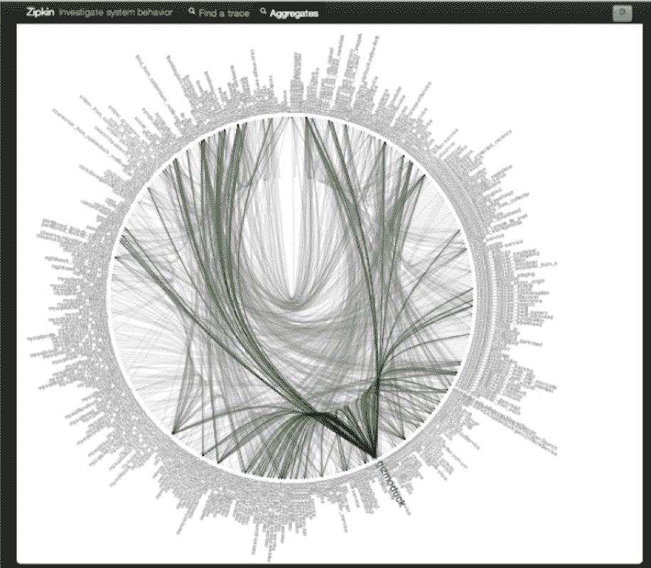

Twitter’s microservices deathstar, circa 2013

几年后，网飞开始[写关于](/netflix-techblog/flux-a-new-approach-to-system-intuition-cf428b7316ec)的*直觉工程*的相关想法，围绕着我们如何设计能够给我们复杂系统整体理解的工具——也就是说，我们如何设计我们的工具，以便它们在**正确的时间**呈现给我们关于我们系统的**最相关的**信息，并且**最小化**我们需要投入的时间和认知能量来建立一个**正确的**心理模型

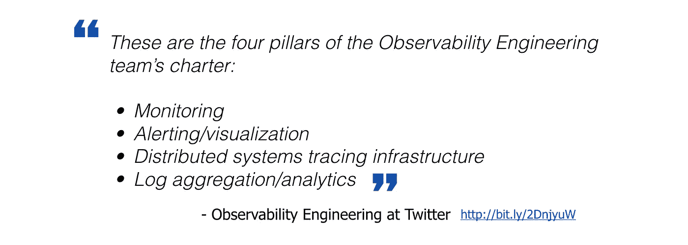

# 无服务器可观测性的挑战

有了 AWS Lambda 这样的无服务器技术，我们面临着实践和工具的许多新挑战，随着我们学习如何获得虚拟机和容器内运行的服务的可观察性，我们已经慢慢掌握了这些实践和工具。

首先，我们无法访问运行代码的底层基础设施。执行环境被锁定，我们没有地方安装代理&守护进程来收集、批处理和发布数据到我们的可观测性系统。

这些代理和守护进程过去常常在后台安静地工作，远离代码的关键路径。例如，如果您正在为 REST API 收集度量和日志，那么您将在请求处理代码之外收集和发布这些可观察性数据，在请求处理代码中，一个用户正在网络的另一端等待响应。

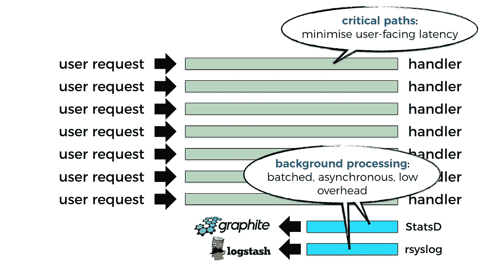

但是在 Lambda 中，你所做的一切都必须在函数调用中完成，这意味着你失去了执行后台处理的能力。除了平台为你做的事情，比如:

*   从 stdout 收集日志并将其发送到 CloudWatch 日志
*   收集跟踪数据并将其发送到 X 射线

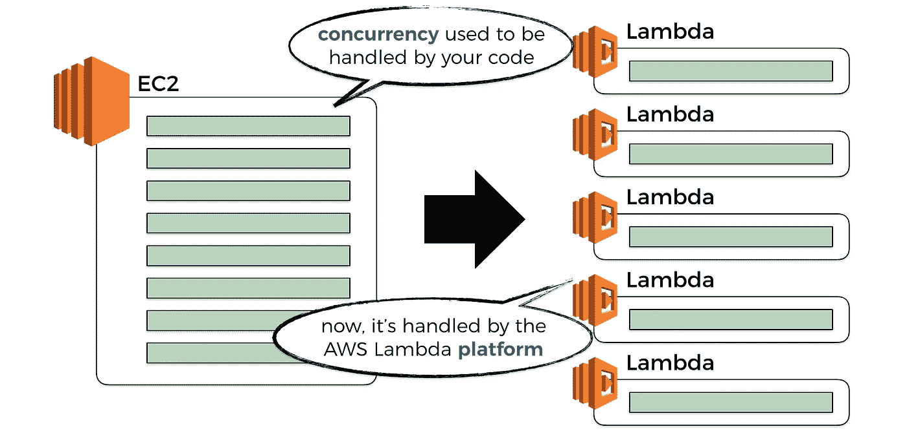

另一个变化很大的方面是如何控制我们系统的并发性。

而以前，我们用 web 框架编写 REST API，我们将它作为 EC2 服务器或容器中的应用程序运行，这个应用程序将处理许多并发请求。事实上，我们[用](https://www.techempower.com/benchmarks/)比较不同 web 框架的一点是它们处理大量并发请求的能力。

现在，我们不再需要 web 框架来创建可扩展的 REST API，API Gateway 和 Lambda 为我们处理了所有的困难工作。**并发现在由平台**管理，这是个好消息！

然而，这也意味着任何批量处理可观测性数据的尝试都变得不那么有效(稍后将详细介绍)，并且对于相同的传入流量，您将向您的可观测性系统施加更大的流量。这反过来会对大规模的性能和成本产生重大影响。

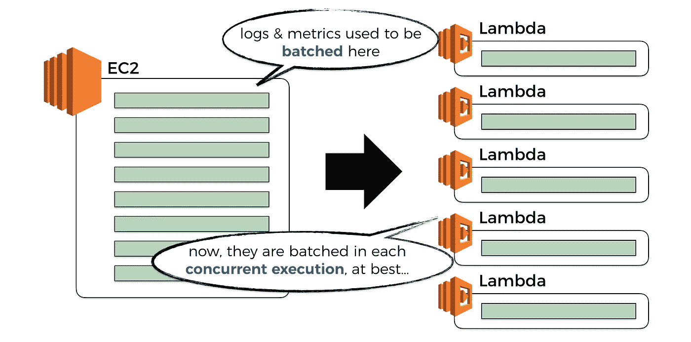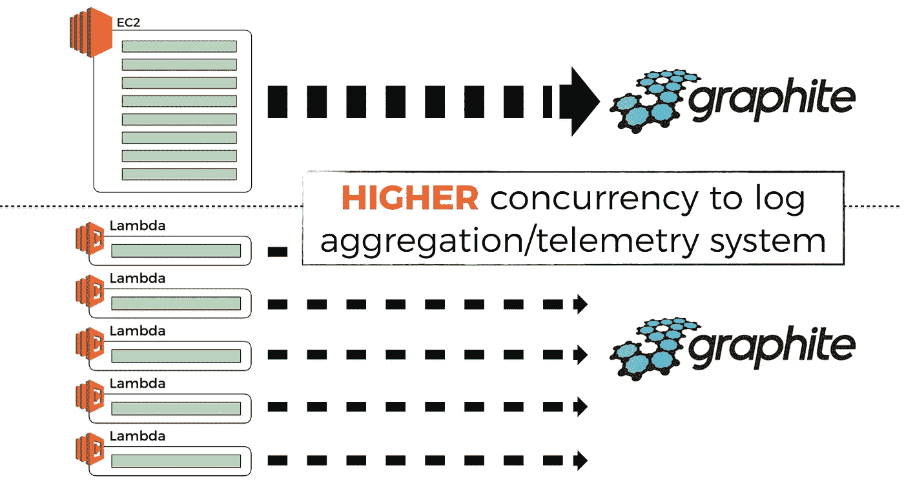

你可能会说，“好吧，在这种情况下，我会对这些可观察性数据使用更大的批量，并减少发布它们的频率，这样我就不会淹没可观察性系统”。

除了，它不是那么简单，进入，AWS Lambda 函数的生命周期。

Lambda 的一个好处是，不用就不用付费。为了实现这一点，Lambda 服务将对一段时间没有收到请求的容器(或者函数的并发执行)进行垃圾收集。我做了一些实验，看看空闲时间有多长，你可以在[这篇文章](https://read.acloud.guru/how-long-does-aws-lambda-keep-your-idle-functions-around-before-a-cold-start-bf715d3b810)中读到。

如果您有尚未发布的可观察性数据，那么当容器被 GC'd 时，您将丢失这些数据。

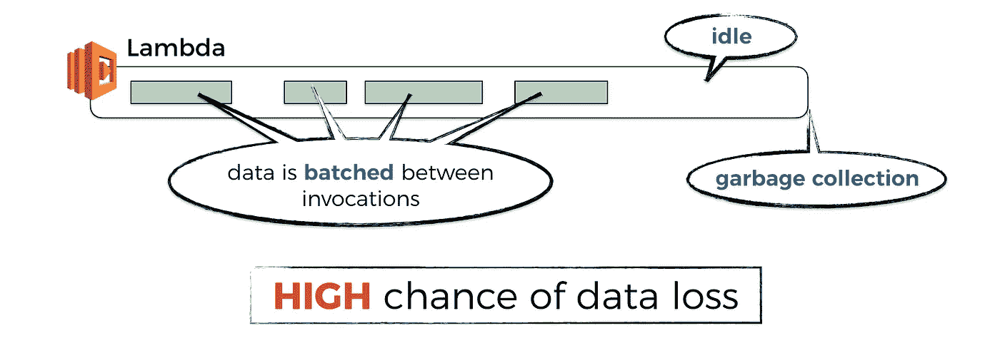

即使容器不断地接收请求，也许在类似于*无服务器*框架的[预热插件](https://github.com/FidelLimited/serverless-plugin-warmup)的帮助下，Lambda 服务仍然会在容器活动几个小时后对其进行垃圾收集，并用一个新的容器替换它。

同样，这是一件好事，因为它消除了长时间运行代码的常见问题，比如内存碎片等等。但这也意味着，当它发生时，你仍然可能丢失未发表的可观测性数据。

此外，正如我在[上一篇关于冷启动](https://theburningmonk.com/2018/01/im-afraid-youre-thinking-about-aws-lambda-cold-starts-all-wrong/)的帖子中解释的那样，当系统负载适中时，那些保持容器温暖的尝试就不再有效了。

所以，你又开始急切地发送可观测性数据了。也许这一次，你会建立一个可以处理这个额外负载的可观测系统，也许你会用 Lambda 来建立它！

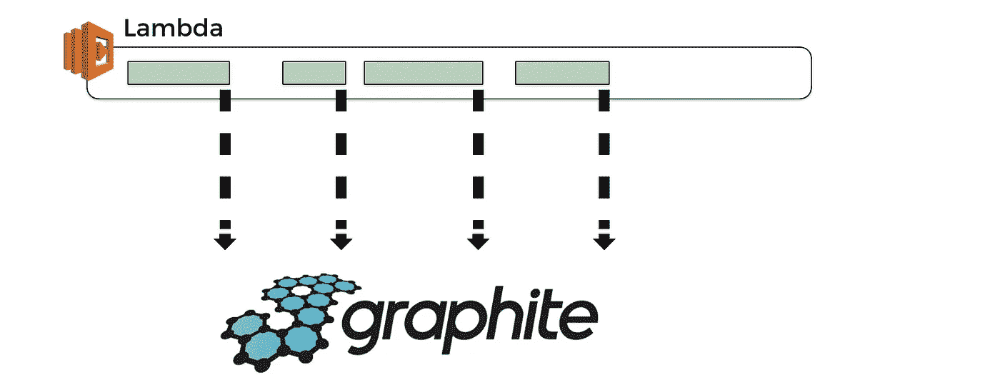

但是等等，记住，你已经没有后台处理时间了…

因此，如果您急切地发送可观察性数据作为函数调用的一部分，那么这意味着您正在损害面向用户的延迟，我们知道[延迟会直接影响业务收入](https://blog.gigaspaces.com/amazon-found-every-100ms-of-latency-cost-them-1-in-sales/)(至少在任何合理竞争的市场中，客户可以很容易地转向另一个提供商)。

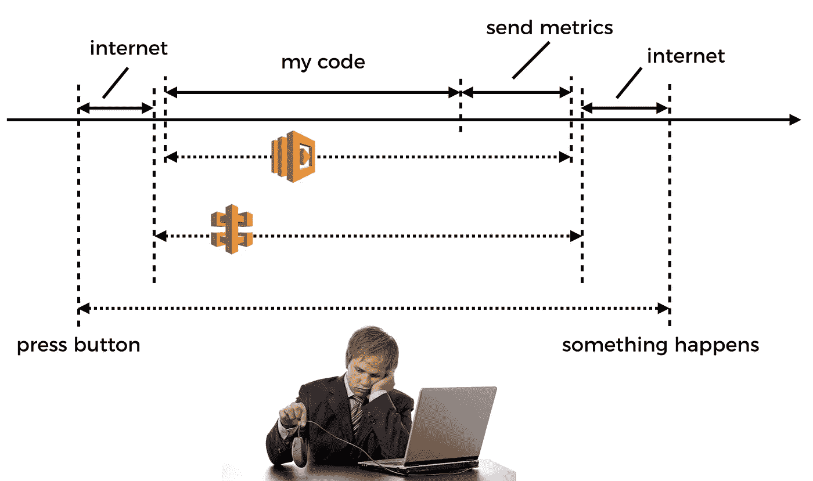

谈论被夹在岩石和坚硬的地方之间…

最后，我在无服务器领域看到的一个趋势——也是我在将一个社交网络架构迁移到 AWS Lambda 时亲身经历的一个趋势——是构建一个事件驱动的架构是多么强大和简单。Randy Shoup 似乎也这么认为。

 [## 作为一等公民的事件

### 我们都听说过事件和事件驱动编程，但以我的经验，事件在我们的应用中用得还远远不够

hackernoon.com](https://hackernoon.com/events-as-first-class-citizens-8633e8479493) 

在这个事件驱动、无服务器的世界中，函数调用通常通过一些异步事件源链接在一起，如 Kinesis 流、SNS、S3、IoT、DynamoDB 流等等。

事实上，在 AWS Lambda 支持的所有事件源[中，只有少数被归类为同步的，所以在设计上，这里的卡片是向异步堆叠的。](https://docs.aws.amazon.com/lambda/latest/dg/invoking-lambda-function.html)

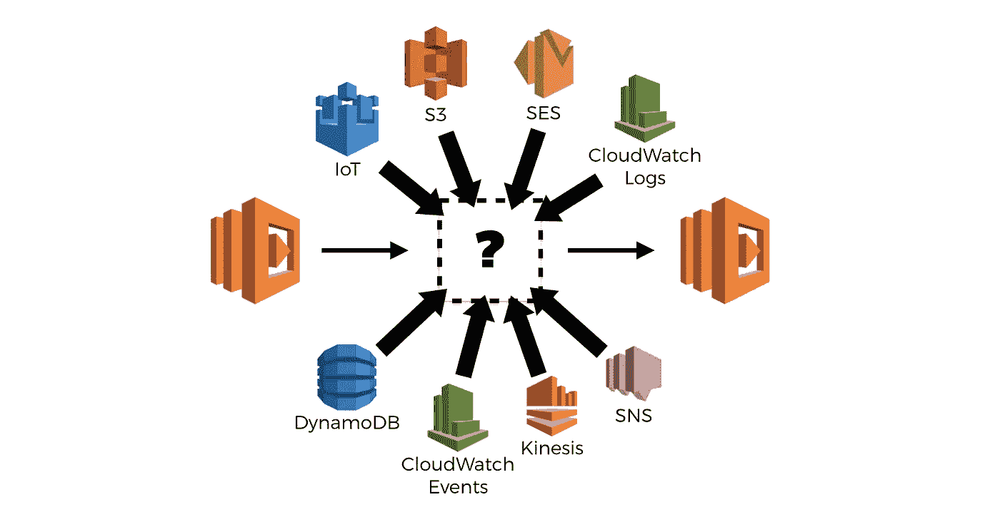

您猜怎么着，跟踪异步调用很难。

为了收集和转发分布式跟踪的关联 id，我写了一篇[帖子](https://hackernoon.com/capture-and-forward-correlation-ids-through-different-lambda-event-sources-220c227c65f5)介绍如何自己完成这项工作。但是，即使使用我概述的方法，也不容易(或者在某些情况下，不可能)跟踪每种类型的事件源。

x 射线在这里也帮不了你，尽管听起来[他们至少在寻找对 Kinesis](https://twitter.com/abhik5ingh/status/958496026419179521) 的支持。在撰写本文时， [X-Ray 也没有跟踪 API 网关](https://read.acloud.guru/im-here-to-tell-you-the-truth-the-good-the-bad-and-the-ugly-of-aws-x-ray-and-lambda-f212b5f332e9)，但这也在他们的列表中。

# 直到下一次…

所以，我希望我已经清楚地描绘了工具供应商在这个领域面临的挑战，所以你真的应该尊重像 [IOPipe](https://www.iopipe.com/) 、 [Dashbird](https://www.dashbird.io/) 和[桑德拉](https://www.thundra.io/)这样的人所做的工作。

话虽如此，也有很多事情你得自己*考虑*。

例如，考虑到缺乏后台处理，当您构建一个面向用户的 API 时，延迟很重要，您可能希望避免使用不提供异步发送可观察性数据选项的可观察性工具(例如，通过[利用 CloudWatch 日志](https://theburningmonk.com/2017/09/tips-and-tricks-for-logging-and-monitoring-aws-lambda-functions/))，或者您需要使用相当*严格的*采样率。

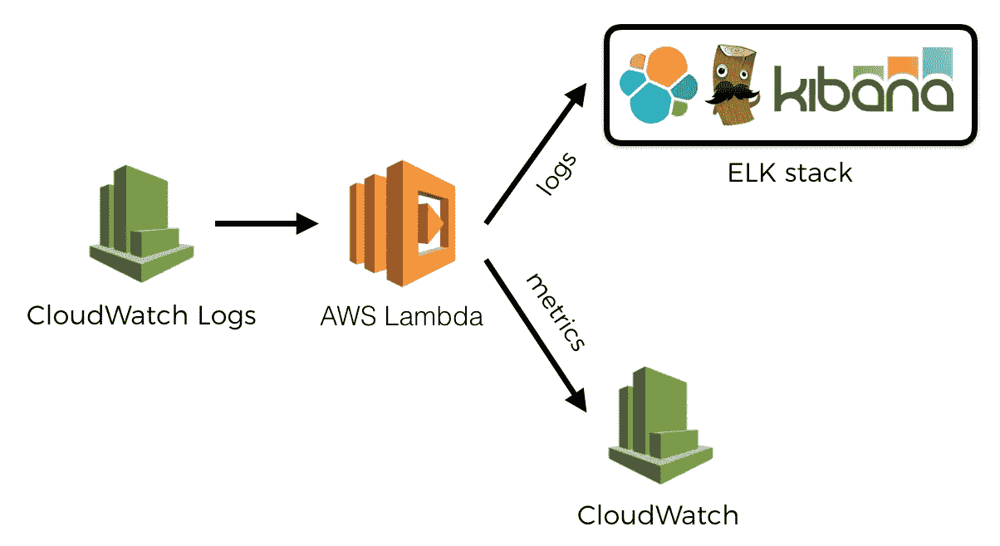

同时，当您异步处理事件时，您不必太担心调用时间。但是您可能会关心将如此多的数据写入 CloudWatch 日志以及后续的 Lambda 调用来处理它们的成本。或者，您可能担心低优先级的函数(处理您通过 CloudWatch 日志发送的可观察性数据)正在**吞噬您的并发执行配额**，并且会抑制高优先级的函数(比如那些服务于面向用户的 REST APIs 的函数！).在这种情况下，您可以选择在每次调用结束时急切地发布可观测性数据。

在第 2 部分中，我们将看看从 AWS 获得的第一方工具。

在第 3 部分中，我们将看看其他为无服务器设计的第三方工具，如 IOPipe、Dashbird、桑德拉和 Epsagon。我们将看到这些工具如何受到上述挑战的影响，以及它们如何影响我们评估这些第三方工具的方式。

喜欢您正在阅读的内容，但需要更多帮助？我很乐意作为一名**独立顾问**提供服务，帮助您完成无服务器项目——架构审查、代码审查、构建概念验证，或者提供关于领先实践和工具的建议。

我在**伦敦，英国**，目前唯一在英国的 [**AWS 无服务器英雄**](https://aws.amazon.com/developer/community/heroes/yan-cui/) 。我有近 **10 年**的[经验](https://www.linkedin.com/in/theburningmonk/)在 AWS 中大规模运行生产工作负载。我主要在英国开展业务，但我愿意出差一周以上。要了解我们如何合作，请在这里告诉我更多关于您试图解决的问题的信息。

我还可以举办一个内部研讨会，帮助您的无服务器架构进入生产准备阶段。您可以在这里找到关于为期两天的研讨会[的更多信息，该研讨会将带您从 AWS Lambda 的基础知识一直到日志聚合、分发跟踪和安全最佳实践的通用操作模式。](https://theburningmonk.com/workshops/)

如果你喜欢按照自己的进度学习，那么你也可以找到与我为曼宁制作的 [**视频课程**](https://bit.ly/production-ready-serverless) 相同的研讨会内容。我们将讨论的主题包括:

*   认证 *&* 授权与 API 网关 *&* 认知
*   本地测试 *&* 运行功能
*   CI/CD
*   日志聚合
*   监控最佳实践
*   X 射线分布式跟踪
*   跟踪相关 id
*   性能 *&* 成本优化
*   错误处理
*   配置管理
*   金丝雀部署
*   VPC
*   安全
*   Lambda、Kinesis 和 API 网关的最佳实践

代码 **ytcui** 也可以获得**票面价格 6 折优惠**。不过，这个数字只有在我们参加曼宁的早期访问计划(MEAP)时才有效。