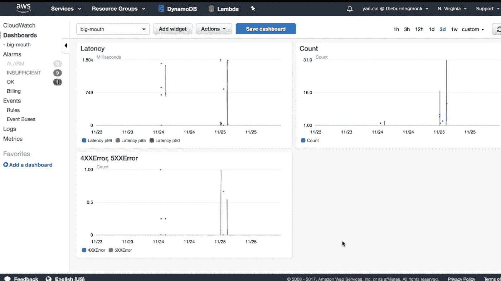

# 无服务器可观察性，您可以使用什么开箱即用？

> 原文：<https://medium.com/hackernoon/serverless-observability-what-can-you-use-out-of-the-box-85475b5bf04a>

第一部分:可观测性的新挑战

**第二部分:AWS 的第一方观察工具【本文】**

第 3 部分:第三方观察工具

第 4 部分:无服务器可观测性的未来

在第 1 部分中，我们讨论了无服务器带来的挑战。在本帖中，我们来看看 AWS 的第一方工具

开箱后，我们获得了 AWS 自己提供的一系列工具:

*   用于监控、警报和可视化的云监控
*   日志的云监控日志
*   分散跟踪用 x 射线
*   Ama zon 对数聚集的弹性搜索

# CloudWatch 日志

当 ev 尤尔写入 *std out* 时，这些输出被 Lamb da 服务捕获并作为日志发送到云观察日志。这是你得到的少数后台处理之一，因为它是由平台提供的。

给定函数的所有日志消息(技术术语称为*事件*)将出现在单个*日志组*下的云监控日志中。

作为*日志组*的一部分，您有许多*日志流*。每个都包含来自您的函数的一个当前执行(或*容器*)的日志，因此存在一对一的映射。

这很好，但是在云监控日志中搜索日志消息并不容易。目前**没有办法让** **一次搜索多个函数的日志**。虽然 AWS 一直在改进服务，但与市场上的其他同类产品相比，它仍然相形见绌。

刚开始时，它可能会让你感到满足，但很快你就会发现自己更需要一些东西。

对于 tu nate ly 来说，ward 直接从云观察日志中获取您的日志。

你可以将它们传输到亚马逊的主机搜索服务。但是，不要指望这是一个与你的自宿主麋鹿栈相同的体验。莉兹·本·奈特写了一篇详细的文章，讲述了他们在大规模使用 Ama zon Elas tic search 时遇到的一些问题。如果你正在考虑采用 Ama zon Elas tic search，请阅读一下。

或者，您可以将日志流式传输到一个 Lamb 函数，并将它们发送到您选择的日志聚合服务。我不会在这里赘述，因为我之前已经写了很长时间了，去看看这篇文章吧。

You can stream logs from CloudWatch Logs to just about any log aggregation service, via Lambda.

# 云观察指标

有了 Cloud Watch，你就可以获得一些现成的基本 met rics。调用计数、错误计数、调用持续时间等。所有关于功能健康的基本测试。

但云观察遗漏了一些有价值的数据点，比如:

*   *预计成本*
*   *当前执行*:云观察仅针对保留当前的功能报告此信息
*   *冷启动*
*   *计费持续时间* : Lamb da 在每次通话结束时，在云监控日志中报告这一情况。因为 Lamb da 发票是以 100 毫秒为单位计费的，所以 102 毫秒的发票将按 200 毫秒计费。这将是一种有用的方法，可以同时看到*涉及的持续时间*以确定成本优化
*   *内存使用情况* : Lamb da 也在云观察日志中报告了这一点，但是没有记录在云观察中

You get 6 basic metrics about the health of a function.

有很多方法可以记录和追踪你自己的这些记录，见[这篇文章](https://theburningmonk.com/2017/09/tips-and-tricks-for-logging-and-monitoring-aws-lambda-functions/)如何去做。像 IOPipe 这样的其他提供商(在下一篇文章中会详细介绍)也会报告这些现成的数据点。

您可以在 Cloud Watch 中针对任何这些度量设置警报，以下是一些有用的数据:

*   *声控介入*
*   *区域当前限制执行*:根据当前区域限制的百分比设置阈值
*   尾部(95%或 99%的百分比)延迟相对于一些可接受的阈值
*   *API 闸门通道上的 4xx 和 5xx 错误*

你也可以在 Cloud Watch 中设置基本仪表板，每个仪表板每月 3 美元(前 3 个是免费的)。

# x 射线

对于分布式跟踪，你有 x 光。为了充分利用跟踪，您应该指示您的代码获得更好的可视性。

像云监视日志一样，**收集踪迹不会给函数的调用增加额外的时间**。这是平台为你提供的一个后台流程。

从跟踪数据来看，X 射线也可以向你展示这样的服务图。

x 射线能让您深入了解某项功能的运行时间性能。然而，它的焦点并不仅仅集中在一个功能上，它所讨论的方面是非常不成熟的。就目前情况而言， **X 射线目前无法追踪 API Gate way 或 SNS 或 Kine sis** 等异步感染。

这有助于解决特定功能的性能问题。但是它提供了一点帮助你了解你的系统作为一个整体是如何运作的。为此，我需要远离一个函数内部的 hap pens，并且能够查看整个*调用链*。

毕竟，当 Twit ter 的工程师们谈论对*观察能力*的需求时，与其说是帮助他们调试单个端点的性能问题，不如说是帮助他们理解他们系统的行为和性能。一个系统本质上是一个大的、复杂的和高度连接的服务图。

有了 Lamb da，这个图将变得更加复杂、稀疏和连通，因为:

*   现在您有 5 种功能，而不是一种有 5 个端点的服务
*   各种功能通过各种各样的媒介联系在一起——社交网络、Kine sis、API Gate way、物联网等等
*   事件驱动的架构已经成为规范

我们的追踪工具需要帮助我们理解这个图表。他们需要帮助我们可视化我们功能之间的联系。当数据作为用户请求进入我们的系统时，他们需要帮助我们跟踪数据，并通过同步和异步事件到达该图的更远处。

当然，X 射线不能跨越非 AWS 服务，如 Auth0、Google Big Query 或 Azure func tions。

但是，我们这些深藏在无服务器思维定势中的人通过 SaaS 色彩的眼镜看世界。我们希望使用最能满足我们需求的服务，并将它们与 Lamb da 结合在一起。

在 Yubl，我们[使用了许多 Lamb da](https://theburningmonk.com/2016/12/yubls-road-to-serverless-architecture-part-1/) 的非 AWS 服务。Auth0、Google Big Query、GrapheneDB、Mon go Lab 和 Twillio 等等。这很好，我们不必受 AWS 提供的服务的束缚。

我的好朋友 Raj 也在 NDC 做了一个很好的演讲，讲述了他如何在他的葡萄酒创业中使用 AWS 和 Azure 的服务。你可以在这里观看他的演讲。

最后，我认为我们的系统就像一个大脑。像大脑一样，我们的系统由以下部分组成:

*   **神经**(功能)
*   **突触**(功能之间的连接)
*   以及流经它们电子信号 T21(数据)

就像大脑一样，我们的系统是有生命的，它不断地变化和进化，不断地工作！然而，当我看着我的仪表板和我的 x 光痕迹时，我看到的却不是这样。相反，我看到一个更新的列表，它没有反映数据的移动和活动的区域。它不能帮助我建立对我系统中发生的事情的直观理解。

一个聪明的人不会接受这个作为信息的主要来源。他们怎么可能用它来建立一个他们需要切开并进行手术的大脑的人体模型呢？

我应该补充一点，这并不是对 X 射线的批判，它的构建方式与大多数观测工具的构建方式相同。

但是也许我们的工具需要超越人类的计算机界面(HCI ),它不会在一个剪切板上显得格格不入(物理的那种，如果你足够大，已经看过了！).这实际上让我想起了 Bret Victor 的一个最终演讲，*停止画死鱼*。

Net flix 在这个有 Vizcer al 的直播仪表板的想法上取得了很大的进步。他们也很好的开源了这些软件。

# 结论

AWS 为我们提供了一些现成的工具。虽然他们每个人都有自己的短评，但他们已经足够好，可以开始了。

作为第三方工具，它们也比第三方工具具有主场优势。例如，Lamb 可以收集日志和跟踪，而不会增加您的操作时间。由于我们不能再访问服务器，第三方工具不能进行任何后台处理。相反，他们不得不求助于变通办法，或者被迫同步收集数据。

然而，随着我们的无服务器应用变得越来越复杂，这些工具要么需要与我们一起发展，要么需要在我们的堆栈中被取代。例如，云监控日志不能跨多个功能进行搜索。一旦你有了十几个功能，它通常是第一个需要更换的部件。

在下一篇文章中，我们将看看一些第三方工具，如 *IOPipe* 、 *Dash bird* 和 *Thun dra* 。我们将讨论他们的增值比例以及他们的短评。

喜欢您正在阅读的内容，但需要更多帮助？我很乐意作为一名独立顾问提供服务，帮助您完成无服务器项目——架构审查、代码审查、构建概念验证，或者提供关于领先实践和工具的建议。

我在**伦敦，英国**，目前唯一在英国的 [**AWS 无服务器英雄**](https://aws.amazon.com/developer/community/heroes/yan-cui/) 。我有近 **10 年**的[经验](https://www.linkedin.com/in/theburningmonk/)在 AWS 中大规模运行生产工作负载。我主要在英国开展业务，但我愿意出差一周以上。要了解我们如何合作，请在这里告诉我更多关于您试图解决的问题的信息。

我还可以举办一个内部研讨会，帮助您的无服务器架构进入生产准备阶段。您可以在这里找到关于为期两天的研讨会[的更多信息，该研讨会将带您从 AWS Lambda 的基础知识一直到日志聚合、分发跟踪和安全最佳实践的通用操作模式。](https://theburningmonk.com/workshops/)

如果你喜欢按照自己的进度学习，那么你也可以找到与我为曼宁制作的**视频课程相同的研讨会内容。我们将讨论的主题包括:**

*   **认证 *&* 授权与 API 网关 *&* 认知**
*   **本地测试 *&* 运行功能**
*   **CI/CD**
*   **日志聚合**
*   **监控最佳实践**
*   **X 射线分布式跟踪**
*   **跟踪相关 id**
*   **性能 *&* 成本优化**
*   **错误处理**
*   **配置管理**
*   **金丝雀部署**
*   **VPC**
*   **安全**
*   **Lambda、Kinesis 和 API 网关的最佳实践**

**代码 **ytcui** 也可以获得**票面价格 6 折优惠**。不过，这个数字只有在我们参加曼宁的早期访问计划(MEAP)时才有效。**